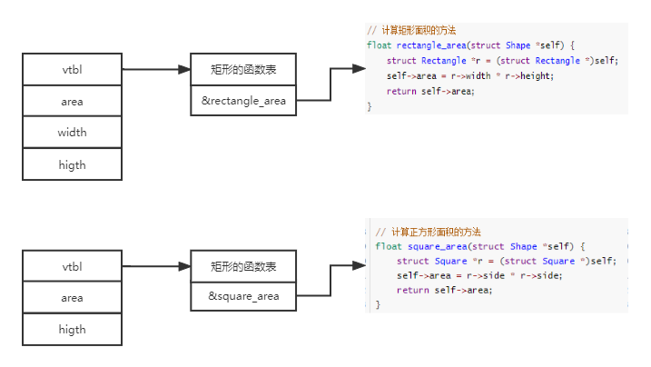

我们知道封装、继承、多态是面向对象的三大特性，我们也知道C语言是面向过程的语言，那么可不可以在面向过程的语言中用面向对象的思想编程呢。呐，我们一起看看用C语言如何实现封装、继承、多态。

## 封装

所谓封装就是把实现的细节隐藏起来，外部只能通过相关的函数对一个类进行操作，一呢是方便代码的复用，二也可以有效的保证代码的安全性。那么我们看看Redis源码中对于双向链表的一个设计和实现，是不是就是传说中的封装呢？

```c
typedef struct listNode {
	struct listNode* prev;
	struct listNode* next;
	void* value;
} listNode;

list* listCreate() {
	struct list* list;
	list = malloc(sizeof(struct list));
	if (list == NULL) return NULL;

	list->head = list->tail = NULL;
	list->len = 0;
	return list;
}
```

## 继承

继承也是为了代码的重用设计的，比如多个子类都有一些共同的属性和方法，那么就可以将这些共同点抽象成一个父类，让子类去继承他，子类也就拥有了父类的特性，更好的实现了代码的重用性。但是继承也有很多缺点，比如：

1. java中不能多继承
2. 如果继承了一个类，那么就继承了这个类的所有public的属性和方法，即使你不想继承
3. 如果有一天父类的逻辑做了修改，那么子类的逻辑也被迫做了修改

基于这些原因呢，很多时候是不建议使用继承的，而是优先用组合的方式来达到代码的复用。在Go语言中也没有**extends**关键字，也是通过组合实现代码的复用。那么在C语言中，虽然没有继承，但是我们可以组合啊，实现的效果是大同小异的。例如：

```c
struct Shape {
    int area;
    Shape* crateShape();
};

struct Rectangle {
    struct Shape shape;
    int width;
    int height;
};

struct Square {
    struct Shape shape;
    int side;
};
```

## 多态

### 函数的指针

这里要回顾一下C语言基础语法了，先来看看C语言中关于函数的指针。如果我们在C语言中定义了一个函数，那么在编译的时候会把函数的源代码编译成可执行的的指令，然后分配一块内存去存放。这段空间的的地址就是函数的入口地址，每次调用的时候会从该地址入口开始执行，函数名就代表了这个地址，**因此函数名就是函数的指针**。

那么我们就可以定义一个用来指向函数的指针变量，用来存放某一函数的入口地址。例如：`int (* add) (int, int)`。这行代码中第一个`int`表示的是返回值类型；`(* add)`表示`add`是一个指针变量，括号不能省略；后面的`(int, int)`表示参数类型是两个int类型，括号不能省略，括号表示指针变量不是指向其他类型的，而是函数类型的。之前对函数的调用都是通过函数名，那么现在有了指针变量，我们也可以通过指针变量来对函数进行调用。

```c
int main() {
    // 通过函数名调用
    max(9, 2);
    
    // 通过函数的指针变量调用
    int (*p)(int, int);
	// 将函数max的入口地址赋值给指针变量p
    p = max();
    (*p)(a, b)
}

int add(int x, int y) {
    return x + y;
}
```

### 通过函数的指针实现多态

我们看下面代码，`ShapeVtbl`这个结构体中定义了一个计算面积的函数，没有实现，我们叫做虚函数表。`Shape`这个结构体中定义了两个属性，一个`vtbl`，一个`area`。

```c
struct Shape {
    struct ShapeVtbl *vtbl;
    int area;
};

struct ShapeVtbl {
    float (*area)(struct Shape* self);
};

struct Rectangle {
    struct Shape shape;
    int width;
    int height;
};

struct Square {
    struct Shape shape;
    int side;
};
```

这里我们分别定义了计算矩形面积的方法`rectangle_area`和计算正方形面积的方法`square_area`。也初始化了两个`ShapeVtbl`，让他们的函数指针分别指向不同的函数入口。那么在实际运行的时候代码就会根据我们的选择调用不同的函数，呈现出多态的效果。

```c
// 计算矩形面积的方法
float rectangle_area(struct Shape *self) {
    struct Rectangle *r = (struct Rectangle *)self;
    self->area = r->width * r->height;
    return self->area;
}

// 计算正方形面积的方法
float square_area(struct Shape *self) {
    struct Square *r = (struct Square *)self;
    self->area = r->side * r->side;
    return self->area;
}

// 初始化了两个ShapeVtbl，让area函数分别指向了rectangle_area、square_area
struct ShapeVtbl vtbl1 = {
    rectangle_area,
};

struct ShapeVtbl vtbl2 = {
    square_area,
};

// 计算面积的方法，这里的area函数的逻辑是在运行时期动态绑定的，也就是有self中函数指针指向的实际函数决定的
float shape_area(struct Shape *self) {
    struct ShapeVtbl *v = self->vtbl;
    return v->area(self);
}

struct Square* createSquare() {
    struct Square *s = malloc(sizeof(struct Square));
    s->side = 5;
    s->shape.vtbl = &vtbl2;
}

int main() {
    struct Square* s = createSquare();
    printf("area => %f\n", shape_area((struct Shape *)s));
}
```

更多可以参考图例：



这样的设计在redis源码中有很多应用，比如redis中的字典，`dict`结构体定义了字典的基本属性以及属于`dict`的一些特定函数，代码在dict.h中。

```c
/*
 * 字典类型特定函数，定义了计算哈希值、复制键、比较键等函数
 */
typedef struct dictType {
    unsigned int (*hashFunction)(const void *key);
    void *(*keyDup)(void *privdata, const void *key);
    void *(*valDup)(void *privdata, const void *obj);
    int (*keyCompare)(void *privdata, const void *key1, const void *key2);
    void (*keyDestructor)(void *privdata, void *key);
    void (*valDestructor)(void *privdata, void *obj);

} dictType;

/*
 * 字典
 */
typedef struct dict {

    // 类型特定函数
    dictType *type;

    void *privdata;

    dictht ht[2];

    int rehashidx;

    int iterators;

} dict;
```

而在redis中，`dict`的应用比较多，键的类型也可能有`sds`、`redisObject`等多种类型，他们的键比较函数，hash函数等都是不同的，因此有了下面的代码，分别定义了适应于各种键的对比、hash等函数，并封装在了不同的`dictType`，代码在redis.c中。那么在实际应用中，只需要为不同的类型选择不同的`dictType`即可。

```c
dictType clusterNodesBlackListDictType = {
    dictSdsCaseHash,            /* hash function */
    NULL,                       /* key dup */
    NULL,                       /* val dup */
    dictSdsKeyCaseCompare,      /* key compare */
    dictSdsDestructor,          /* key destructor */
    NULL                        /* val destructor */
};

/* Migrate cache dict type. */
dictType migrateCacheDictType = {
    dictSdsHash,                /* hash function */
    NULL,                       /* key dup */
    NULL,                       /* val dup */
    dictSdsKeyCompare,          /* key compare */
    dictSdsDestructor,          /* key destructor */
    NULL                        /* val destructor */
};

/* Replication cached script dict (server.repl_scriptcache_dict).
 * Keys are sds SHA1 strings, while values are not used at all in the current
 * implementation. */
dictType replScriptCacheDictType = {
    dictSdsCaseHash,            /* hash function */
    NULL,                       /* key dup */
    NULL,                       /* val dup */
    dictSdsKeyCaseCompare,      /* key compare */
    dictSdsDestructor,          /* key destructor */
    NULL                        /* val destructor */
};

int dictSdsKeyCompare(void *privdata, const void *key1,
        const void *key2)
{
    int l1,l2;
    DICT_NOTUSED(privdata);

    l1 = sdslen((sds)key1);
    l2 = sdslen((sds)key2);
    if (l1 != l2) return 0;
    return memcmp(key1, key2, l1) == 0;
}
```