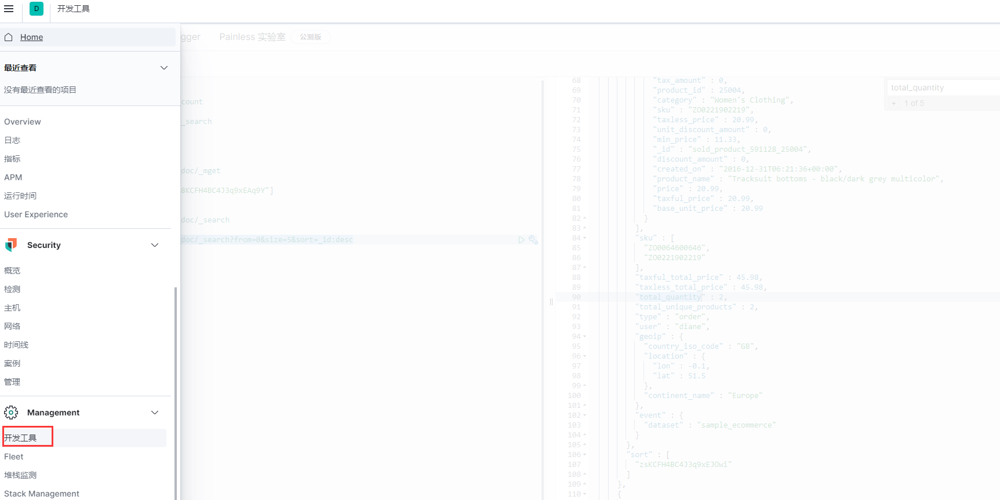

# ES的数据管理

ES环境搭建成功后，可以继续安装图形化客户端**Kibana**，安装完成后可以通过默认的9200端口去访问，在开发工具中，通过RestFul接口去对ES中的数据进行管理。



## 索引的基本操作

索引的操作相对来说比较简单

- create：`PUT /索引名称`
- delete：`DELETE /索引名称`
- get：`GET /索引名称`

## 文档的基本操作

### 创建文档

创建文档有两种方式：**create**和**index**

- create方式`(PUT 索引名称/_doc/op_type=create)`：如果id已经存在，那么会创建失败

  ```json
  # 创建文档，自动生成id  或者也可以写成POST users/_doc/
  POST users/_doc/
  {
    "user" : "lmm",
    "post_date" : "2019-05-04",
    "message" : "I love you"
  }
  
  # 创建文档，指定id=1
  PUT users/_doc/1?op_type=create
  {
    "user" : "lmm",
    "post_date" : "2019-05-04",
    "message" : "I love you"
  }
  ```

- index方式`(PUT 索引名称/_doc/op_type=index)`：如果id已经存在，会先删除现有的文档，在创建新的文档，版本号会增加

  ```json
  PUT users/_doc/2?op_type=index
  {
    "message":"my girl friend"
  }
  ```

### 更新文档

更新操作要求指定ID的文档必须存在，否则会报错

```json
# 修改文档，在原来的文档上增加字段
POST users/_update/1
{
  "doc": {
    "name":"hxy",
    "age":13
  }
}

# 更新前的文档
{
  "_index" : "users",
  "_type" : "_doc",
  "_id" : "2",
  "_version" : 3,
  "_seq_no" : 9,
  "_primary_term" : 1,
  "found" : true,
  "_source" : {
    "message" : "my girl friend"
  }
}

# 更新后的文档
{
  "_index" : "users",
  "_type" : "_doc",
  "_id" : "2",
  "_version" : 4,
  "_seq_no" : 10,
  "_primary_term" : 1,
  "found" : true,
  "_source" : {
    "message" : "my girl friend",
    "name" : "hxy",
    "age" : 13
  }
}

```

### 删除文档

```json
DELETE users/_doc/1
```

### 查询文档

#### URI Search

- 查询当前索引中所有文档

  ```json
  GET /索引名称/类型/_search
  GET kibana_sample_data_ecommerce/_doc/_search
  ```

- 条件查询

  ```json
  GET /索引名称/类型/_search?q=*:***
  # 如果currency字段中包含EUR则返回
  GET kibana_sample_data_ecommerce/_doc/_search?q=currency:EUR
  # 也可以等价写成下面这样
  GET kibana_sample_data_ecommerce/_doc/_search?q=EUR&df=currency
  
  # 上面两条中查询条件没有用引号，在查询的时候会被分词查询，如果用了引号，则不会分词，
  # 下面的查询表示只有customer_full_name出现Eddie Underwood这个完整的单词才能返回，顺序也不能变
  GET /kibana_sample_data_ecommerce/_search?q=customer_full_name:"Eddie Underwood"
  
  # 如果文档中任何一个字段有包含EUR的则返回
  GET kibana_sample_data_ecommerce/_doc/_search?q=EUR
  ```

- 布尔查询

  ```json
  # 如果customer_full_name出现Eddie或者Underwood则返回这条数据，这里OR可以省去
  GET /kibana_sample_data_ecommerce/_search?q=customer_full_name:(Eddie OR Underwood)
  
  # 如果customer_full_name出现Eddie并且出现Underwood则返回这条数据
  GET /kibana_sample_data_ecommerce/_search?q=customer_full_name:(Eddie AND Underwood)
  
  # 如果customer_full_name出现Eddie，但是不能出现Underwood则返回这条数据
  GET /kibana_sample_data_ecommerce/_search?q=customer_full_name:(Eddie NOT Underwood)
  
  # 这里的AND、NOT不能小写
  ```

- 范围查询

  ```json
  GET /索引名称/类型/_search?q=*:[* TO *]
  GET kibana_sample_data_ecommerce/_doc/_search?q=total_quantity[0 TO 2]  # 查询total_quantity介于0到2之间的
  GET kibana_sample_data_ecommerce/_doc/_search?q=total_quantity:<2  # 查询total_quantity小于2的
  ```

- 通配符查询

  ```json
  # 通配符查询，customer_full_name字段中有以E开头的单词都可以
  GET kibana_sample_data_ecommerce/_search?q=customer_full_name:E*
  
  # 这里用到了*，表示匹配0到多个字符，还可以用?表示一个字符
  ```

- 近似查询

  ```json
  # 模糊匹配，有时候用户可能输入一个错误的单词，比如本来想查询Stokes，实际输入了Stokea，通过下面的语句其实也可以查询到
  GET kibana_sample_data_ecommerce/_search?q=customer_full_name:Stokea~1
  ```

- 正则查询

  ```json
  # 正则查询，可以支持基本的正则表达式匹配
  GET kibana_sample_data_ecommerce/_search?q=customer_full_name:[St]ok
  ```

- 批量查询

  ```json
  GET /索引名称/类型/_mget
  GET kibana_sample_data_ecommerce/_doc/_mget
  {
    "ids":["lsKCFH4BC4J3q9xEAq9Y","l8KCFH4BC4J3q9xEAq9Y"]
  }
  ```

- 分页查询

  ```json
  GET /索引名称/类型/_search?from=0&size=1
  GET kibana_sample_data_ecommerce/_doc/_search?q=total_quantity:<10&from=0&size=1 
  # 类似于select * from kibana_sample_data_ecommerce where total_quantity < 10 limit 0,1
  ```

- 只输出查询结果的特定字段

  ```json
  GET /索引名称/类型/_search?_source=*,*
  GET kibana_sample_data_ecommerce/_doc/_search?_source=_id,_score,currency&from=0&size=5
  ```

- 对搜索结果进行排序

  ```json
  GET /索引名称/类型/_search?sort=*desc/acs
  GET kibana_sample_data_ecommerce/_doc/_search?from=0&size=5&sort=_id:desc
  ```

- 在多个索引查询

  ```json
  # 在kibana_sample_data_ecommerce中进行检索
  GET index1/_doc/_search
  
  # 在index1和index2中检索
  GET index1,index2/_doc/_search
  
  # 在以index开头的索引中检索
  GET index*/_doc/_search
  
  # 在所有的索引中进行检索
  GET /_search
  ```
