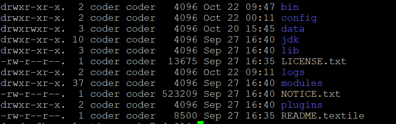
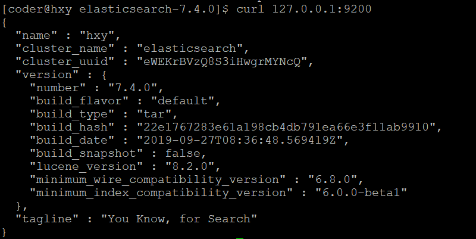
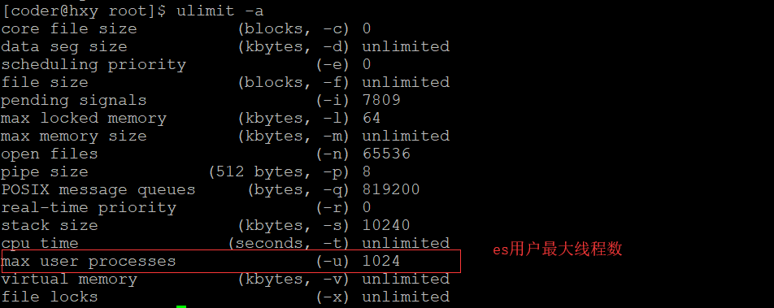

# ElasticSearch
## 简介
关于什么是ElasticSearch的问题，不赘述。
## 安装 
环境：centos6.5
### 下载解压安装包
下载需要的安装包，上传到服务器解压。因为es是国外的公司，通过浏览器下载超级慢，这里我们推荐迅雷这款软件，每秒可以达到3兆左右的速度。
```
# 解压
tar -zxvf elasticsearch-7.4.0-linux-x86_64.tar.gz
```
es中文社区：https://elasticsearch.cn
es官网：https://www.elastic.co

### 解压后的文件目录

+ bin/ 存放一些脚本文件，比如启动文件、安装插件的脚本等
+ config/ 配置文件目录，重要的配置文件我们接下来总结一下
+ data/ 数据文件
+ jdk/ java运行环境
+ lib/ java类库
+ logs/ 日志
+ modules/ 
+ plugins/ 包含所有安装的插件
### 启动
```
./bin/elasticsearch
```
### 启动可能的报错
```
future versions of Elasticsearch will require Java 11; your Java version from [/opt/jdk1.8.0_211/jre] does not meet this 。
```
原因：说明这个版本对应的jdk应该是java11。我们环境中的jdk是java8。其实新版的es是自带了jdk的。但是和我们环境变量的冲突了。
解决方案：修改启动文件,添加如下修改
```
vi bin/elasticsearch
```
```
# 指定jdk11
export JAVA_HOME=/opt/software/jdk/jdk-11.0.1
export PATH=$JAVA_HOME/bin:$PATH


# 添加jdk判断
if [ -x "$JAVA_HOME/bin/java" ]; then
        JAVA="/opt/software/jdk/jdk-11.0.1/bin/java"
else
        JAVA=`which java`
fi
```
修改后的配置文件全文如下：
```
#!/bin/bash

# CONTROLLING STARTUP:
#
# This script relies on a few environment variables to determine startup
# behavior, those variables are:
#
#   ES_PATH_CONF -- Path to config directory
#   ES_JAVA_OPTS -- External Java Opts on top of the defaults set
#
# Optionally, exact memory values can be set using the `ES_JAVA_OPTS`. Note that
# the Xms and Xmx lines in the JVM options file must be commented out. Example
# values are "512m", and "10g".
#
#   ES_JAVA_OPTS="-Xms8g -Xmx8g" ./bin/elasticsearch

# 指定jdk11
export JAVA_HOME=/opt/software/jdk/jdk-11.0.1
export PATH=$JAVA_HOME/bin:$PATH

source "`dirname "$0"`"/elasticsearch-env

if [ -z "$ES_TMPDIR" ]; then
  ES_TMPDIR=`"$JAVA" -cp "$ES_CLASSPATH" org.elasticsearch.tools.launchers.TempDirectory`
fi

ES_JVM_OPTIONS="$ES_PATH_CONF"/jvm.options
JVM_OPTIONS=`"$JAVA" -cp "$ES_CLASSPATH" org.elasticsearch.tools.launchers.JvmOptionsParser "$ES_JVM_OPTIONS"`
ES_JAVA_OPTS="${JVM_OPTIONS//\$\{ES_TMPDIR\}/$ES_TMPDIR}"

# 添加jdk判断
if [ -x "$JAVA_HOME/bin/java" ]; then
        JAVA="/opt/software/jdk/jdk-11.0.1/bin/java"
else
        JAVA=`which java`
fi

# manual parsing to find out, if process should be detached
if ! echo $* | grep -E '(^-d |-d$| -d |--daemonize$|--daemonize )' > /dev/null; then
  exec \
    "$JAVA" \
    $ES_JAVA_OPTS \
    -Des.path.home="$ES_HOME" \
    -Des.path.conf="$ES_PATH_CONF" \
    -Des.distribution.flavor="$ES_DISTRIBUTION_FLAVOR" \
    -Des.distribution.type="$ES_DISTRIBUTION_TYPE" \
    -Des.bundled_jdk="$ES_BUNDLED_JDK" \
    -cp "$ES_CLASSPATH" \
    org.elasticsearch.bootstrap.Elasticsearch \
    "$@"
else
  exec \
    "$JAVA" \
    $ES_JAVA_OPTS \
    -Des.path.home="$ES_HOME" \
    -Des.path.conf="$ES_PATH_CONF" \
    -Des.distribution.flavor="$ES_DISTRIBUTION_FLAVOR" \
    -Des.distribution.type="$ES_DISTRIBUTION_TYPE" \
    -Des.bundled_jdk="$ES_BUNDLED_JDK" \
    -cp "$ES_CLASSPATH" \
    org.elasticsearch.bootstrap.Elasticsearch \
    "$@" \
    <&- &
  retval=$?
  pid=$!
  [ $retval -eq 0 ] || exit $retval
  if [ ! -z "$ES_STARTUP_SLEEP_TIME" ]; then
    sleep $ES_STARTUP_SLEEP_TIME
  fi
  if ! ps -p $pid > /dev/null ; then
    exit 1
  fi
  exit 0
fi

exit $?

```
启动成功后访问9200这个端口号，就可以获取响应结果。成功的响应如下如所示：


## 插件安装
es经过多年的发展，社区也有很多插件，提供了很多丰富的扩展功能，es安装插件的方法如下所示：
```
./bin/elasticsearch-plugin list
```
执行上述命令没有任何返回，说明你没有安装插件，安装插件的命令如下，这里以安装一个中文分词的插件为例
```
./bin/elasticsearch-plugin install analysis-icu
```
安装后在执行查询的命令，就会列出所有你已经安装的插件

## 常见问题汇总
### 1. windows上通过虚拟机启动后，在虚拟机可以访问，但是windows无法访问 
解决方案：修改network.host = 0.0.0.0
```
vi elasticsearch.yml
```
```
network.host: 0.0.0.0
```

### 2. max number of threads [1024] for user [coder] is too low, increase to at least [4096]
原因：这个报错是说当前启动es的用户拥有的线程数量太小，我们至少需要设置为4096

解决方案：修改limits.conf，添加如下配置，然后重启服务器
```
vi /etc/security/limits.conf
```
```
* soft nproc 65536
* hard nproc 65536
* soft nofile 65536
* hard nofile 65536
```
修改/etc/security/limits.d/90-nproc.conf
```
vi /etc/security/limits.d/90-nproc.conf
```
```
# Default limit for number of user's processes to prevent
# accidental fork bombs.
# See rhbz #432903 for reasoning.

*          soft    nproc     4096
root       soft    nproc     unlimited
soft nproc 2048
```

### 3. max virtual memory areas vm.max_map_count [65530] is too low, increase to at least [262144]
解决方案：修改sysctl.conf，添加如下内容
```
vi /etc/sysctl.conf
```
```
vm.max_map_count=655360
```
```
修改后执行如下命令 sysctl -p
```
### 4. system call filters failed to install; check the logs and fix your configuration or disable system call filters at your own risk
原因：这是在因为Centos6不支持SecComp，而ES5.2.0默认bootstrap.system_call_filter为true进行检测，所以导致检测失败，失败后直接导致ES不能启动。

解决方案：修改elasticsearch.yml
```
bootstrap.memory_lock: false
bootstrap.system_call_filter: false
```

