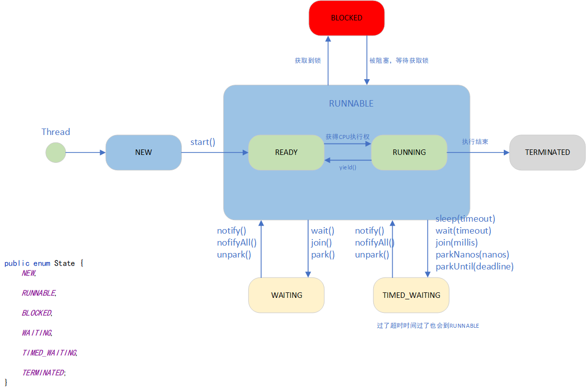

# 多线程

## 创建线程的方式

### 继承Thread

```java
public class MyThread extends Thread{//继承Thread类
    public void run(){

        //重写run方法

    }
}
```

### 实现Runnable

```java
public class MyThread implements Runnable {/
    public void run(){

    	//重写run方法

    }
}
```
### 实现Callable，可以带回来返回值

```java
FutureTask task = new FutureTask(new Callable() {
    @Override
    public Object call() throws Exception {
        // 业务
        return "***";
    }
});

new Thread(task).start();
System.out.println(task.get());

输出：***
    
```

### 其他写法

```java
// 匿名内部类
new Thread(){
    @Override
    public void run() {
        //
    }
}.start();

new Thread(new Runnable() {
    @Override
    public void run() {
        System.out.println("-----");
    }
}).start();

// JDK1.8以后可以用lambda写
new Thread(() -> {
    //
}).start();
```


## 几个API

`join`表示当前线程等待调用`join`方法的线程执行完成之后，才能继续操作

`yeild`设置线程优先级

`sleep`表示让调用`sleep`方法的线程休息指定时间，休息的这段时间线程是**不会让出CPU执行权**

`interrupt`打断执行的线程，

`setDaemon(boolean on)`设置守护线程，

```java
Thread t = new Thread(new Runnable() {
    @Override
    public void run() {
        try {
            Thread.sleep(10_000);
        } catch (InterruptedException e) {
            e.printStackTrace();
        }
        System.out.println("------");
    }
});
t.start();
t.join();
System.out.println("main");

输出：main线程会等线程t执行完才执行
------
main
    
输出：如果注释掉t.join();
main
------
```


## 线程生命周期




## 守护线程

默认创建的线程都是`非守护线程`。创建守护线程时，需要将 Thread 的 daemon 属性设置成 true，当 JVM 退出时，会关心非守护线程是否结束，但不关心守护线程的。适合用来做一些监控的工作。

```java
Thread t = new Thread(new Runnable() {
    @Override
    public void run() {
        System.out.println("------");
    }
});
// 设置为守护线程
t.setDaemon(true);
```


## 多线程中的设计模式

### 策略模式

通过一个需求来看策略模式，假设我们要做一个简单的计算器，那怎么实现呢，我们先看版本一

```java
public static void main(String[] args) {
    System.out.println(calculation(2, 3, '*'));
}

private static int calculation(int num1, int num2, char operate) {
    int result = 0;
    switch (operate){
        case '+':
            result = num1 + num2;
            break;
        case '*':
            result = num1 * num2;
            break;
        case '-':
            result = num1 - num2;
            break;
        case '/':
            result = num1 / num2;
            break;
        default:
            break;
    }
    return result;
}
```

这样固然能实现我们的需求，可是如果有一天我们的计算方法又要改变，比如加了阶乘、求平方、开根号这些，怎么办，加条件呗。再加一个case或者if。那么如果我们实际业务中，逻辑非常复杂，这样老改来改去，难免会出问题，而且条件一多，代码变得冗长复杂，可读性差，并且代码耦合性高，没有做到面向对象。所以我们的改进啊，接下来看看策略模式的实现方式：

```java
// 1. 抽象出一个接口，定义计算的方法
@FunctionalInterface
public interface CalculatorStrategy {
    int calculate(int num1, int num2);
}

//2. 得有一个处理类，负责把我们的接口和实现类连接起来，这里可以定义好一些共同的流程啊之类的
public class CalculatorProcess {

    private final int num1;
    private final int num2;
    private final CalculatorStrategy calculatorStrategy;

    public CalculatorProcess(int num1, int num2, CalculatorStrategy calculatorStrategy) {
        this.num1 = num1;
        this.num2 = num2;
        this.calculatorStrategy = calculatorStrategy;
    }

    protected double calculation() {
        return calculatorStrategy.calculate(num1, num2);
    }

    public double getNum1() {
        return num1;
    }

    public double getNum2() {
        return num2;
    }

    public CalculatorStrategy getCalculatorStrategy() {
        return calculatorStrategy;
    }
}

public static void main(String[] args) {
    // 具体的实现交给某一个策略类，这里逻辑简单，我们用了lambada表达式，业务逻辑复杂的话，
    // 可以直接写个子类实现我们定义的接口，可读写好一点
    CalculatorProcess calaculator1 = new CalculatorProcess(100, 200, (s, b) -> s + b);
    System.out.println(calaculator1.calculation());

    CalculatorProcess calaculator2 = new CalculatorProcess(100, 200, (s, b) -> s * b);
    System.out.println(calaculator2.calculation());
}
```

策略模式和我们多线程有什么关系呢，我们再看一个例子吧。多线程的`Runnable`接口定义了线程的基本方法`run()`方法，Thread实现了这个接口，并且对线程的一些共同逻辑进行了实现，我们启用多线程的时候直接在run方法传入我们的实现就行了。这个思想就是`策略模式`。

```java
public static void main(String[] args) {
    new Thread("read-thread") {
        @Override
        public void run() {
            System.out.println("-------");
        }
    }.start();

    new Thread("write-thread") {
        @Override
        public void run() {
            System.out.println("*******");
        }
    }.start();
}
```


### 模板方法模式

我们通过一个场景看一下，比如我们平时的软件研发流程，可能基本经过几个步骤：设计、编码、测试。其中有一些方法可能是共同的，比如安装环境、装电脑等。那我们可以用一个基本的抽象类实现整体的流程。设计好整体算法，但是其中一些不同的方法，比如设计等可能每个软件的实现方式不一样，我们可以新建子类，复写特性化方法实现。这种设计模式可以`把不变的东西封装起来，实现代码重用`、`父类控制行为，子类负责实现`

```java
// 定义软件研发的抽象类
public abstract class SoftwareDevelopment {

    // 这两个方法是每个软件研发都一样的部分
    private final void begin() {
        System.out.println("----------begin()----------");
    }
    private final void end() {
        System.out.println("----------end()----------");
    }

    // 设计、编码、测试是每个软件研发都经过的，但是每个软件的具体实现是不一样的，
    // 定义成protected, 只能子类重写
    protected abstract void design();
    protected abstract void coding();
    protected abstract void test();

    // 算法基本流程可能不怎么变化，在这里直接定义成final的，防止子类重写
    public final void development() {
        begin();
        design();
        coding();
        test();
        end();
    }
}

// 定义IDEA类，负责IDEA开发的实现
public class Idea extends SoftwareDevelopment{

    // 重写设计、编码、测试方法
    @Override
    protected void design() {
        System.out.println("-----design IDEA-----");
    }

    @Override
    protected void coding() {
        System.out.println("-----coding IDEA-----");
    }

    @Override
    protected void test() {
        System.out.println("-----test IDEA-----");
    }
}

public static void main(String[] args) {
        SoftwareDevelopment idea = new Idea();
        idea.development();
}

输出：
----------begin()----------
-----design IDEA-----
-----coding IDEA-----
-----test IDEA-----
----------end()----------
```

模板方法在AQS的代码中有这经典的应用，参考`acquire()`方法，其中获取锁的方法`tryAcquire(arg)`交给子类实现，排队和阻塞的方法交给AQS实现，这部分是不变的。

```java
public final void acquire(int arg) {
    if (!tryAcquire(arg) &&
        acquireQueued(addWaiter(Node.EXCLUSIVE), arg))
        selfInterrupt();
}
```

在我们的线程类中也有这样的设计，我们开启一个线程要重写`run()`方法，我们在这个方法我们中实现这个线程的具体逻辑，这是变化的。但是其他流程是不变的，整体的算法逻辑是在`start()`方法实现的。包括`run()`方法也是在`start()`方法中调用的。这部分我们可以看`start()`方法的源码。

```java
public synchronized void start() {
    /**
      * This method is not invoked for the main method thread or "system"
      * group threads created/set up by the VM. Any new functionality added
      * to this method in the future may have to also be added to the VM.
      *
      * A zero status value corresponds to state "NEW".
      */
    if (threadStatus != 0)
        throw new IllegalThreadStateException();

    /* Notify the group that this thread is about to be started
     * so that it can be added to the group's list of threads
     * and the group's unstarted count can be decremented. */
    group.add(this);

    boolean started = false;
    try {
        // 这是一个native方法，是JVM实现的，据说run()是在这里调用的，我还没有求证
        start0();
        started = true;
    } finally {
        try {
            if (!started) {
                group.threadStartFailed(this);
            }
        } catch (Throwable ignore) {
            /* do nothing. If start0 threw a Throwable then
               it will be passed up the call stack */
        }
    }
}

private native void start0();
```


### 适配器模式

多线程中实现任务有两种方式，实现`Runnable的run()`方法或者实现`Callable的call()`方法，前一种没有返回值，后一种支持返回值。所以`Callable`的功能是比`Runnable`更丰富的。那`Future()`就提供了将`Runnable`适配成`Callable`的能力。

```java
// FutureTask.java

// FutureTask中定义了callable属性
private Callable<V> callable;

// Future实现了Runnable接口
public FutureTask(Runnable runnable, V result) {
    // 构造器里看着我们传入了Runnable接口，在这一步适配成Callable接口
    this.callable = Executors.callable(runnable, result);
    this.state = NEW;       // ensure visibility of callable
}
```

```java
// Executors.java

// 实现了Callable接口
static final class RunnableAdapter<T> implements Callable<T> {
    final Runnable task;
    final T result;
    RunnableAdapter(Runnable task, T result) {
        this.task = task;
        this.result = result;
    }
    // 实现了Callable接口的call()方法，在call()中调用的其实是Runnable的run()方法
    public T call() {
        task.run();
        return result;
    }
}
```

总结他的主要思想：把`Runnable`适配成 `Callable`，首先让`RunnableAdapter` 实现`Callable`，然后在`Callable`的` call`方法里面调用被适配对象`Runnable`的方法。