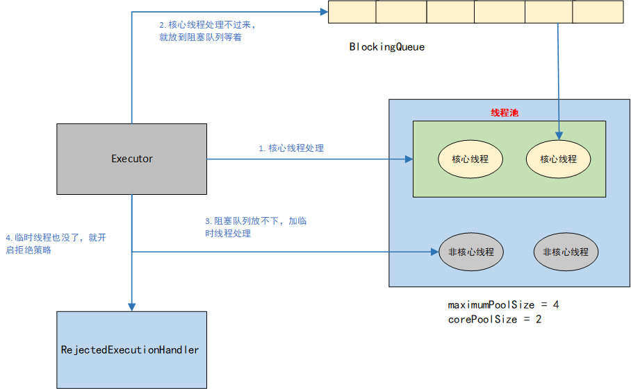
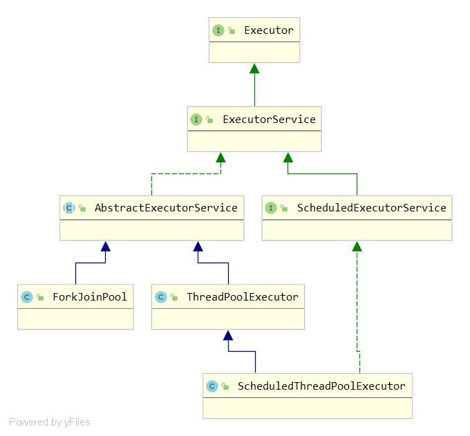
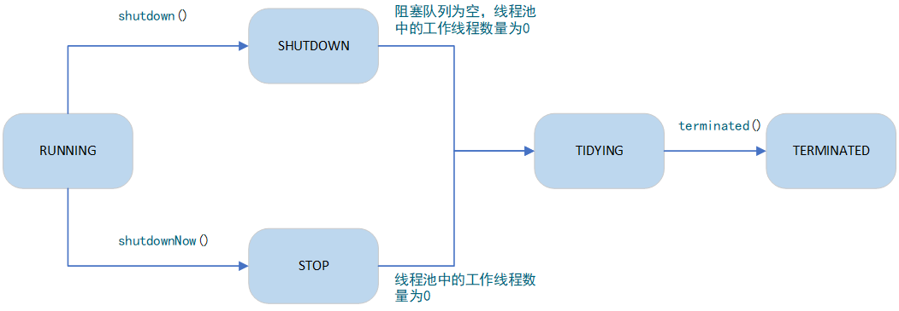
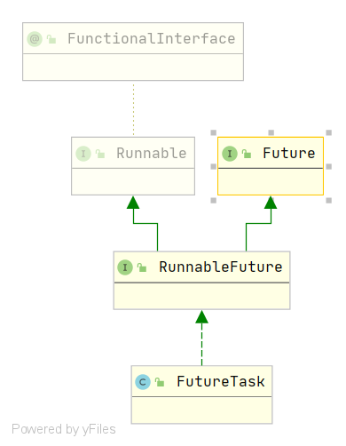

# 线程池-ThreadPoolExecutor

## 关于线程池

**什么是线程池**：线程池可以理解为一些线程的集合，并且具有管理线程的功能。

**为什么要有线程池**：因为我们java中创建每一个线程，都对应这一个内核线程，他的创建和销毁是耗费资源的。所以如果频繁创建销毁线程比较耗性能。

**什么时候用线程池**：

1.  单个任务处理时间短
2.  有大量的任务需要处理

**线程池能给我们带来什么好处**：

 1.  重用存在的线程，减少线程创建，消亡的性能开销，控制并发数
  2.  实现了基于阻塞队列的缓存机制和拒绝策略
  3.  多环境的隔离，比如可能一台服务器部署两个服务，但是两个服务的并发量不一样，可以配置不同参数的线程池隔离线程环境

## 线程池怎么用

### 线程池的构造方法

要使用线程池，首先我们需要创建一个线程池，那就需要用到`ThreadPoolExecutor`的构造方法，我们来看一下他的构造方法。

```java
public ThreadPoolExecutor(int corePoolSize,
                          int maximumPoolSize,
                          long keepAliveTime,
                          TimeUnit unit,
                          BlockingQueue<Runnable> workQueue,
                          ThreadFactory threadFactory,
                          RejectedExecutionHandler handler) {
    if (corePoolSize < 0 ||
        maximumPoolSize <= 0 ||
        maximumPoolSize < corePoolSize ||
        keepAliveTime < 0)
        throw new IllegalArgumentException();
    if (workQueue == null || threadFactory == null || handler == null)
        throw new NullPointerException();
    this.corePoolSize = corePoolSize;
    this.maximumPoolSize = maximumPoolSize;
    this.workQueue = workQueue;
    this.keepAliveTime = unit.toNanos(keepAliveTime);
    this.threadFactory = threadFactory;
    this.handler = handler;
}
```

我们看到他的这个构造方法有一堆参数，分别代表什么意思呢，我们一一说明

- `corePoolSize`：核心线程数，当有任务提交到线程池的时候，会首先根据核心线程数创建**核心线程**，任务执行完毕后，核心线程会留在线程池中。
- `workQueue`：阻塞队列，如果任务太多，核心线程已经处理不过来的时候，需要将任务放到这个阻塞队列中去做一个缓冲。
- `maximumPoolSize`：最大线程数，如果并发量过大，阻塞队列已经被放满，线程池会根据这个参数创**建临时线程**。临时线程后面会被销毁。
- `keepAliveTime`：临时线程维持生命力的时间，当临时线程过了经历了这个**空闲时间点**，就会被销毁。线程池中始终只保持`corePoolSize`个线程，但是如果设置`allowCoreThreadTimeOut`的话，核心线程也会被销毁。
- `unit`：上一个参数的时间单位。
- `threadFactory`：线程工厂，用来创建线程。
- `handler`拒绝策略：上面我们说阻塞队列已经放满的情况会创建临时线程，但是我们如果临时线程不是说可以无限制的创建，最多只能创建`maximumPoolSize - corePoolSize`个，那如果线程池中已经创建到了最大线程依然处理不过来，却又如何是好呢？答案就是拒绝。所以这个参数就是拒绝策略。线程池默认提供四种拒绝策略
  - `AbortPolicy`：丢弃任务抛出异常
  - `DiscardOldestPolicy`：将队列中等待最久的抛弃，将当前任务加入队列等待
  - `DiscardPolicy`：丢弃任务，也不抛异常
  - `CallerRunsPolicy`：调用任务的`run()`方法绕过线程池单独执行

### 线程池的基本原理

基于以上的讨论，我们在通过一张图来对线程池的工作原理做一个总结。一般线程池的工作可以分为四步：

1. 通过`execute(Runnable command)`或者`submit(Callable<T> task)`等方法提交任务到线程池。
2. 线程池根据`corePoolSize`创建核心线程处理提交的任务
3. 如果处理不过来，会将任务放到阻塞队列等待。等核心线程空闲下来的时候去这个队列里面取任务进行处理。
4. 如果阻塞队列放满，会根绝`maximumPoolSize `创建临时线程来处理
5. 如果依然处理不过来，就会通过拒绝策略处理。



### 定义一个我们的线程池

**定义线程工厂**

```java
public class MyThreadFactory implements ThreadFactory {
    private final AtomicInteger threadId = new AtomicInteger(1);
    private final String threadNamePrefix;

    // 一般情况我们不应该用默认的线程工厂，而应该自定义有意义的线程分组名和编号。便于发生问题时候排查问题
    public MyThreadFactory(String threadGroup) {
        this.threadNamePrefix = threadGroup + "-Thread-";
    }

    @Override
    public Thread newThread(Runnable r) {
        Thread thread = new Thread(r, threadNamePrefix + threadId.getAndIncrement());
        return thread;
    }
}
```

**定义拒绝策略**

```java
public class MyRejectHandler implements RejectedExecutionHandler {

    @Override
    public void rejectedExecution(Runnable r, ThreadPoolExecutor executor) {
        // 记录日志
        // 重定向到提示界面
        // 保存到DB，等空闲时候执行
    }
}
```

**定义我们的线程池**

```java
BlockingQueue queue = new ArrayBlockingQueue(1000);
MyThreadFactory exchangeFactory = new MyThreadFactory("交易系统");
MyRejectHandler handler = new MyRejectHandler();

ThreadPoolExecutor exchangePool = new ThreadPoolExecutor(20, 50, 10L, TimeUnit.SECONDS, queue, exchangeFactory, handler);
```

**向线程池提交任务**

向线程池提交任务一般可以用下面这几个方法，`execute()`方法传入的参数是一个Runnable的实现，他不能带回来返回值。`submit()`会带回来线程执行的结果。

```java
public void execute(Runnable command)

public Future<?> submit(Runnable task)
public <T> Future<T> submit(Callable<T> task)
public <T> Future<T> submit(Runnable task, T result)
```

### 用`Executors`工具类来定义线程池

```java
/**
 * 创建一个可缓存的线程池，keepAliveTime = 60秒，会自动回收空闲线程，maximumPoolSize = Integer.MAX_VALUE
 * 如果线程无限增长，会无限制创建线程，导致OOM
 */      
Executors.newCachedThreadPool();
```

```java
/**
 * 和newCachedThreadPool差不多，他支持周期性定时执行任务，和newCachedThreadPool样maximumPoolSize = Integer.MAX_VALUE
 * 所以同样存在OOM的风险
 */
Executors.newScheduledThreadPool(1);
```

```java
/**
 * 创建固定大小的线程池。每次提交一个任务就创建一个线程，直到线程达到线程池的最大大小。
 * 阻塞队列用了一个没有边界的LinkedBlockingQueue<Runnable>()，这样的话，如果任务太多，
 * 线程池处理不过来，会将大量任务堆积到阻塞队列，导致OOM
 */
Executors.newFixedThreadPool(9);
```

```java
/**
 * 介绍：创建一个单线程的线程池。这个线程池只有一个线程在工作，也就是相当于单线程串行执行所有任务。如果这个唯一的线程因为异常结束，
 * 那么会有一个新的线程来替代它。此线程池保证所有任务的执行顺序按照任务，和上面一样，他也用了一个无界的阻塞队列，同样存在OOM的风险
 */
Executors.newSingleThreadExecutor();
```


## 线程池的源码

关于`ThreadPoolExecutor`的学习，我们先看一下他的类图。然后从这个类图一点点分析。



**Executor**

`Executor`是一个顶级接口，他只提供了下面一个方法。

```java
// Executor.java
public interface Executor {
    // 英语太差，凑合翻译一下，大概说这个方法就是想在接下来某个时间执行我们给定的任务，
    // 这个任务可以在一个新的线程中执行，也可以在线程池或者调用他的线程中执行

    /**
     * Executes the given command at some time in the future.  The command
     * may execute in a new thread, in a pooled thread, or in the calling
     * thread, at the discretion of the {@code Executor} implementation.
     *
     * @param command the runnable task
     * @throws RejectedExecutionException if this task cannot be
     * accepted for execution
     * @throws NullPointerException if command is null
     */
    void execute(Runnable command);
}
```
**ExecutorService**

`ExecutorService`在`Executor`的基础上进行了扩展，定义了下面 这些方法

```java
public interface ExecutorService extends Executor {
    
    // 启动有序关闭，以前提交的任务会执行，但是不接受新的任务
    void shutdown();
    
    // 尝试停止所有主动执行的任务，停止等待任务的处理，并返回正在等待执行的任务列表。
    List<Runnable> shutdownNow();
    
    // 判断是否关闭
    boolean isShutdown();
    
    // 判断任务是否都已经终止
    boolean isTerminated();
    
    // 在给定的时间内，等待任务终止
    boolean awaitTermination(long timeout, TimeUnit unit)
        throws InterruptedException;
    
    // 提交有返回值的任务，调用get方法可以在任务完成后得到返回值
    <T> Future<T> submit(Callable<T> task);
    
    // 也是提交任务，这个传入的参数是Runnable接口，调用get方法可以获得给定的结果
    <T> Future<T> submit(Runnable task, T result);
    
    // 也是提交任务，这个返回值为空
    Future<?> submit(Runnable task);
    
    // 执行给定的任务，等他们都执行完成后，返回持有他们的状态和结果的结果列表
    <T> List<Future<T>> invokeAll(Collection<? extends Callable<T>> tasks)
        throws InterruptedException;
    
    // 执行给定的任务，等所有任务任务都完成或者过了超时时间后，返回持有他们的状态和结果的结果列表
    <T> List<Future<T>> invokeAll(Collection<? extends Callable<T>> tasks,
                                  long timeout, TimeUnit unit)
        throws InterruptedException;
    
    // 执行给定的任务，有一个完成就返回结果，如果抛了异常，其他任务就取消
    <T> T invokeAny(Collection<? extends Callable<T>> tasks)
        throws InterruptedException, ExecutionException;
    
    // 基于上面的功能，加了一个超时时间
    <T> T invokeAny(Collection<? extends Callable<T>> tasks,
                    long timeout, TimeUnit unit)
        throws InterruptedException, ExecutionException, TimeoutException;
}
```

**AbstractExecutorService**

`AbstractExecutorService`实现了`ExecutorService`这个接口。

```java
// 抽象类，实现了ExecutorService接口中一些基本方法
public abstract class AbstractExecutorService implements ExecutorService {
    
    // 这两个方法根据传入的参数Runnable和Callable初始化FutureTask对象，
    // FuturTask是干啥的，后面有
    protected <T> RunnableFuture<T> newTaskFor(Runnable runnable, T value) {
        return new FutureTask<T>(runnable, value);
    }

    protected <T> RunnableFuture<T> newTaskFor(Callable<T> callable) {
        return new FutureTask<T>(callable);
    }
    
    // 将提交的任务包装成FuturTask去执行
    public Future<?> submit(Runnable task) {
        if (task == null) throw new NullPointerException();
        RunnableFuture<Void> ftask = newTaskFor(task, null);
        execute(ftask);
        return ftask;
    }
    
    ...
}
```

**ThreadPoolExecutor**

接下来就到了我们的主角了，那我们直接从`ThreadPoolExecutor`的核心方法`execute()`方法点进去看看，他是怎么实现的。

```java
public void execute(Runnable command) {
    // 判断空
    if (command == null)
        throw new NullPointerException();
    
    // 这里点进去看一下，后面分析
    int c = ctl.get();
    if (workerCountOf(c) < corePoolSize) {
        // 工作的线程小于核心线程，就创建新线程
        if (addWorker(command, true))
            return;
        c = ctl.get();
    }
    if (isRunning(c) && workQueue.offer(command)) {
        // 走到这，是说线程池状态正常，但是核心线程都在忙，那就放到阻塞队列，也放成功了  
        int recheck = ctl.get();
        // 入队以后，可能线程池状态有变化，所以在check一下，如果线程池状态异常，在出队，拒绝
        if (! isRunning(recheck) && remove(command))
            reject(command);
        // 还是检查一下线程池的最新状态，看是不是有可用线程，没有的话就得创建
        else if (workerCountOf(recheck) == 0)
            addWorker(null, false);
    }
    // 走到这，就是说入队失败了，那就说阻塞队列也满了，咋整，根据maximumPoolSize创建非核心线程
    else if (!addWorker(command, false))
        // 走到这就是说创建临时线程也无法创建了，就拒绝了吧
        reject(command);
}

// 这部分代码就充分说明了线程池的基本原理，和我们前面说的是一样的
```

接上面代码第7行`int c = ctl.get();`看看`ctl`是什么东西

```java
// ctl是一个int类型的变量，存储了两个信息
// 	  1. workerCount, 工作线程的数量, 存储在低29位
//    2. runState,    运行状态, 存储在高三位，记录了线程池的5中状态
private final AtomicInteger ctl = new AtomicInteger(ctlOf(RUNNING, 0));
private static final int COUNT_BITS = Integer.SIZE - 3;  // 位移位数 29
// 00011111111111111111111111111111
private static final int CAPACITY   = (1 << COUNT_BITS) - 1;  
// 11100000000000000000000000000000
// 运行状态，能正常处理任务
private static final int RUNNING    = -1 << COUNT_BITS;
// 00000000000000000000000000000000
// 关闭状态，可以把已经添加的任务处理掉，但是不会在接受新的任务
private static final int SHUTDOWN   =  0 << COUNT_BITS;
// 00100000000000000000000000000000
// 停止状态，彻底停止，正在执行的任务都要停下
private static final int STOP       =  1 << COUNT_BITS;
// 01000000000000000000000000000000
// 所有任务都已经结束
private static final int TIDYING    =  2 << COUNT_BITS;
// 01100000000000000000000000000000
// 线程池彻底终止
private static final int TERMINATED =  3 << COUNT_BITS;
   
// 拿到运行状态
// ~CAPACITY --->   11100000000000000000000000000000
// c & ~CAPACITY  --->正好保留了高三位的值，(1 & 任何数 ---> 任何数  0 & 任何数 ---> 0)
private static int runStateOf(int c)     { return c & ~CAPACITY; }
// c & CAPACITY   --->得到了低29位的值
private static int workerCountOf(int c)  { return c & CAPACITY; }
private static int ctlOf(int rs, int wc) { return rs | wc; }
```


基于以上的代码我们在总结一下线程池几种状态的转化路径




接着看`execute()`方法，看里面的`addWorker(Runnable firstTask, boolean core)`怎么实现的。

```java
private boolean addWorker(Runnable firstTask, boolean core) {
    // 这部分主要是一些校验的工作
    retry:
    for (;;) {
        int c = ctl.get();
        int rs = runStateOf(c);

        // 如果状态大于等于SHUTDOWN，说明状态不正常，但是等于SHUTDOWN这种还得看一下
        // 因为SHUTDOWN的情况下，虽然不接受新任务，但是要把已经有的任务处理掉
        // 所以在看有没有核心线程且阻塞队列里有没有任务，如果有任务，但是没核心线程，状态还是
        // SHUTDOWN，还是得创建核心线程
        if (rs >= SHUTDOWN &&
            ! (rs == SHUTDOWN &&
               firstTask == null &&
               ! workQueue.isEmpty()))
            return false;

        for (;;) {
            int wc = workerCountOf(c);
            // 如果工作线程大于等于最大容量或者大于等于核心线程或者临时线程的最大值，也不创建
            if (wc >= CAPACITY ||
                wc >= (core ? corePoolSize : maximumPoolSize))
                return false;
            // 到这说明可以创建，所以CAS操作加一
            if (compareAndIncrementWorkerCount(c))
                break retry;
            // 如果CAS失败，会走这里吗，重新判断一下状态?
            c = ctl.get();  // Re-read ctl
            if (runStateOf(c) != rs)
                continue retry;
            // else CAS failed due to workerCount change; retry inner loop
        }
    }

    boolean workerStarted = false;
    boolean workerAdded = false;
    Worker w = null;
    try {
        // 创建工人
        w = new Worker(firstTask);
        final Thread t = w.thread;
        if (t != null) {
            final ReentrantLock mainLock = this.mainLock;
            mainLock.lock();
            try {
                // Recheck while holding lock.
                // Back out on ThreadFactory failure or if
                // shut down before lock acquired.
                int rs = runStateOf(ctl.get());

                if (rs < SHUTDOWN ||
                    (rs == SHUTDOWN && firstTask == null)) {
                    if (t.isAlive()) // precheck that t is startable
                        throw new IllegalThreadStateException();
                    // workers是一个hashSet，登记所有的worker
                    workers.add(w);
                    int s = workers.size();
                    if (s > largestPoolSize)
                        largestPoolSize = s;
                    workerAdded = true;
                }
            } finally {
                mainLock.unlock();
            }
            if (workerAdded) {
                // 在这一步开启了start()方法
                // this.thread = getThreadFactory().newThread(this);
                // 所以start方法调用到了Worker.run()
                t.start();
                workerStarted = true;
            }
        }
    } finally {
        if (! workerStarted)
            addWorkerFailed(w);
    }
    return workerStarted;
}
```


```java
// 继承了AQS类，实现了Runnable接口，说明他具有锁的基本功能，执行任务不会存在线程安全问题
// 并且也实现了run()方法
private final class Worker
        extends AbstractQueuedSynchronizer
        implements Runnable
{
   
    private static final long serialVersionUID = 6138294804551838833L;

    final Thread thread;

    Runnable firstTask;

    volatile long completedTasks;


    Worker(Runnable firstTask) {
        setState(-1); // inhibit interrupts until runWorker
        this.firstTask = firstTask;
        // 这里初始化线程的时候把自己的作为参数传了进去
        this.thread = getThreadFactory().newThread(this);
    }

    /** Delegates main run loop to outer runWorker  */
    public void run() {
        // 最终执行我们的任务是走到了这里
        runWorker(this);
    }

    protected boolean isHeldExclusively() {
        return getState() != 0;
    }

    protected boolean tryAcquire(int unused) {
        if (compareAndSetState(0, 1)) {
            setExclusiveOwnerThread(Thread.currentThread());
            return true;
        }
        return false;
    }

    protected boolean tryRelease(int unused) {
        setExclusiveOwnerThread(null);
        setState(0);
        return true;
    }

    public void lock()        { acquire(1); }
    public boolean tryLock()  { return tryAcquire(1); }
    public void unlock()      { release(1); }
    public boolean isLocked() { return isHeldExclusively(); }

    void interruptIfStarted() {
        Thread t;
        if (getState() >= 0 && (t = thread) != null && !t.isInterrupted()) {
            try {
                t.interrupt();
            } catch (SecurityException ignore) {
            }
        }
    }
}
```


```java
final void runWorker(Worker w) {
    Thread wt = Thread.currentThread();
    Runnable task = w.firstTask;
    w.firstTask = null;
    w.unlock(); // allow interrupts
    boolean completedAbruptly = true;
    try {
        // 这里这个循环第一次判断有任务就往下走，没任务就调用getTask()从阻塞队列取任务
        // 如果没有任务，就一直阻塞到这了
        while (task != null || (task = getTask()) != null) {
            w.lock();
            // If pool is stopping, ensure thread is interrupted;
            // if not, ensure thread is not interrupted.  This
            // requires a recheck in second case to deal with
            // shutdownNow race while clearing interrupt
            if ((runStateAtLeast(ctl.get(), STOP) ||
                 (Thread.interrupted() &&
                  runStateAtLeast(ctl.get(), STOP))) &&
                !wt.isInterrupted())
                wt.interrupt();
            try {
                beforeExecute(wt, task);
                Throwable thrown = null;
                try {
                    // 到这里才是真的去执行任务了
                    task.run();
                } catch (RuntimeException x) {
                    thrown = x; throw x;
                } catch (Error x) {
                    thrown = x; throw x;
                } catch (Throwable x) {
                    thrown = x; throw new Error(x);
                } finally {
                    afterExecute(task, thrown);
                }
            } finally {
                task = null;
                w.completedTasks++;
                w.unlock();
            }
        }
        completedAbruptly = false;
    } finally {
        processWorkerExit(w, completedAbruptly);
    }
}
```


## FutureTask源码



上面看到`FuturTask`，那看来还得了解一下这个类啊，上面是他的类图

```java
// Runnable.java

// Runnable提供了run()方法，提供给多线程去实现
@FunctionalInterface
public interface Runnable {
    /**
     * When an object implementing interface <code>Runnable</code> is used
     * to create a thread, starting the thread causes the object's
     * <code>run</code> method to be called in that separately executing
     * thread.
     * <p>
     * The general contract of the method <code>run</code> is that it may
     * take any action whatsoever.
     *
     * @see     java.lang.Thread#run()
     */
    public abstract void run();
}
```

```java
// Future.java
    
// 提供一下几种方法的一个异步接口，主要支持拿到线程的执行结果
public interface Future<V> {

    // 取消线程
    boolean cancel(boolean mayInterruptIfRunning);

    // 判断线程是否已经被取消
    boolean isCancelled();

    // 判断线程是否运行结束
    boolean isDone();
	
    // 等到线程执行完，获取线程执行的结果，
    V get() throws InterruptedException, ExecutionException;

    // 等到线程执行完，获取线程执行的结果，但是不会永远永远等下去，会有一个超时时间
    V get(long timeout, TimeUnit unit)
        throws InterruptedException, ExecutionException, TimeoutException;
}

```

```java
// RunnableFuture.java

// 继承了Runnable、Future  将这两者组合起来
public interface RunnableFuture<V> extends Runnable, Future<V> {
    /**
     * Sets this Future to the result of its computation
     * unless it has been cancelled.
     */
    void run();
}
```

那么`FutureTask`作为`RunnableFuture`接口的实现类，他自然拥有`Runnable`和`Future`的全部功能。那么接下来我们在看`FutureTask`的是怎么实现的。

```java
public class FutureTask<V> implements RunnableFuture<V> {  
    // 这里定义了任务的几种状态
    // 状态的几种转化走向
    // NEW -> COMPLETING -> NORMAL
    // NEW -> COMPLETING -> EXCEPTIONAL
    // NEW -> CANCELLED
    // NEW -> INTERRUPTING -> INTERRUPTED
	private volatile int state;
    private static final int NEW          = 0;  // 新建
    private static final int COMPLETING   = 1;  // 执行中 
    private static final int NORMAL       = 2;  // 正常结束
    private static final int EXCEPTIONAL  = 3;  // 异常结束
    private static final int CANCELLED    = 4;  // 被取消
    private static final int INTERRUPTING = 5;  // 被打断中
    private static final int INTERRUPTED  = 6;  // 被打断
    
    // 引入了callable接口,callable见下文
    private Callable<V> callable;
    // 线程的返回结果
    private Object outcome;
    // 当前任务对应的线程
    private volatile Thread runner;
    // get()方法会阻塞，阻塞时等待的线程，看下文，是一个单链表结构
    private volatile WaitNode waiters;
    
    static final class WaitNode {
        volatile Thread thread;
        volatile WaitNode next;
        WaitNode() { 
            thread = Thread.currentThread(); 
        }
    }
    
    // 构造方法1 参数是Callable接口，
    public FutureTask(Callable<V> callable) {
        if (callable == null)
            throw new NullPointerException();
        this.callable = callable;
        this.state = NEW; 
    }

	// 构造方法2 参数是Runnable接口，但是初始化后把Runnable包装成了Callable接口，
    // 利用了适配器模式
    public FutureTask(Runnable runnable, V result) {
        this.callable = Executors.callable(runnable, result);
        this.state = NEW;
    }

}
```

从代码里我们看引入了`Callable`接口，那么它是干啥的呢？

```java
// Callable.java

@FunctionalInterface
public interface Callable<V> {
   	// 这里定义一个call方法，他有一个返回值，其实我觉得他是Runnable接口的升级版，
    // 支持run方法有返回结果
    V call() throws Exception;
}
```

看到这里，总结一下`FutureTask`的功能吧，实现将线程包装成一个任务，并提供对这个任务的一些管理的API，关键是支持拿到线程的执行结果。对外开放两个构造函数，支持传入`Runnable`和`Callable`接口的参数，并统一适配成`Callable`接口，因为`Callable`功能更强大，支持拿到线程执行的返回结果。那么我们在看探索下他的一些核心API的实现。

```java
public V get() throws InterruptedException, ExecutionException {
    int s = state;
    // 如果任务在执行中，等他执行完，拿到结果
    if (s <= COMPLETING)
        s = awaitDone(false, 0L);
    return report(s);
}

private int awaitDone(boolean timed, long nanos)
    throws InterruptedException {
    final long deadline = timed ? System.nanoTime() + nanos : 0L;
    WaitNode q = null;
    boolean queued = false;
    for (;;) {
        // 判断是否被打断，如果打断了，就抛异常，将等待节点从waiters中移出去
        if (Thread.interrupted()) {
            removeWaiter(q);
            throw new InterruptedException();
        }

        int s = state;
        if (s > COMPLETING) {
            // 正常的话，第三次循环走到这里，说明执行完了，把等待节点的q置空，返回结果
            if (q != null)
                q.thread = null;
            return s;
        }
        else if (s == COMPLETING) // 如果正在执行，为啥就要放弃执行权呢？
            Thread.yield();
        else if (q == null)
            // 第一次调用会走到这里，就是说没有执行完，在等嘛，所以应该包装成一个等待节点
            q = new WaitNode();
        else if (!queued)
            // 第二次循环走这，把q加入到waiters的第一个节点
            queued = UNSAFE.compareAndSwapObject(this, waitersOffset,
                                                 q.next = waiters, q);
        else if (timed) {
            // 这是要等到固定时间，不见结果不在等的情况
            // 先看看还得等多久
            nanos = deadline - System.nanoTime();
            // 如果等的时间都过了，那就把q移除掉，返回结果
            if (nanos <= 0L) {
                removeWaiter(q);
                return state;
            }
            // 阻塞nanos的时间
            LockSupport.parkNanos(this, nanos);
        }
        else
            // 阻塞
            LockSupport.park(this);
    }
}
```

```java
public void run() {
    // 第一个条件如果任务状态不是NEW，说明已经执行过了，就直接返回，第二个是怎么理解呢
    // 将当前线程设置到runner是为啥呢
    if (state != NEW ||
        !UNSAFE.compareAndSwapObject(this, runnerOffset,
                                     null, Thread.currentThread()))
        return;
    try {
        Callable<V> c = callable;
        if (c != null && state == NEW) {
            V result;
            boolean ran;
            try {
                // 执行任务
                result = c.call();
                ran = true;
            } catch (Throwable ex) {
                result = null;
                ran = false;
                setException(ex);
            }
            // 设置结果
            if (ran)
                set(result);
        }
    } finally {
        // runner must be non-null until state is settled to
        // prevent concurrent calls to run()
        runner = null;
        // state must be re-read after nulling runner to prevent
        // leaked interrupts
        int s = state;
        if (s >= INTERRUPTING)
            handlePossibleCancellationInterrupt(s);
    }
}
```

