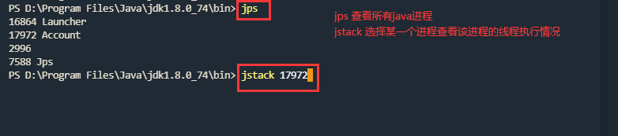

# 死锁问题如何排查以及解决

## 死锁示例

下面这段代码模拟了一个银行账户，有两个字段，用户名和余额，提供了三个方法，存款的方法`deposit(int amount)`、取款的方法`withdrawals(int amount)`和转账的方法`transfer(Account to, int amount)`。如果要从A账户往B账户转账，那么首先要锁定A账户，防止在转账成功之前，A账户的钱被其他线程转走，导致A实际上已经没有钱可转。锁定A账户后，要锁定B账户，防止多个线程对B账户的余额做操作，导致线程安全问题。因为每个账户余额为100，向另一个账户转账50，理论上应该是可以转成功的，但是实际上发现30行的日志并没有打印，而且程序被挂起，一直没有结束。这究竟是什么原因导致的呢？

```java
public class Account {

    private String user;

    private int balance;

    public Account(String user, int balance) {
        this.user = user;
        this.balance = balance;
    }

    public void deposit(int amount) {
        balance = balance + amount;
    }

    public void withdrawals(int amount) {
        if (balance >= amount) {
            balance = balance - amount;
        }
    }

    public void transfer(Account to, int amount) {
        synchronized (this) {
            try {
                System.out.printf("账户：%s被锁住，防止扣减From账户余额的时候被其他线程提前扣款\n", this.user);
                Thread.sleep(1000);
                synchronized (to) {
                    this.withdrawals(amount);
                    to.deposit(amount);
                    System.out.printf("从账户：%s 往账户：%s 成功转账 %d元\n", this.user, to.user, amount);
                }
            } catch (InterruptedException e) {
                e.printStackTrace();
            }
        }
    }

    public static void main(String[] args) {
        Account account1 = new Account("账户A", 100);
        Account account2 = new Account("账户B", 100);

        new Thread(() -> account1.transfer(account2, 50)).start();
        new Thread(() -> account2.transfer(account1, 50)).start();
    }
}

// 运行结果
账户：账户A被锁住，防止扣减From账户余额的时候被其他线程提前扣款
账户：账户B被锁住，防止扣减From账户余额的时候被其他线程提前扣款
```

我们一起分析下上述代码执行的过程：

1. 线程1执行从账户A往账户B转账的操作，获取到了账户A的锁，休息1秒
2. 线程2执行从账户B往账户A转账的操作，获取到了账户B的锁，休息1秒
3. 一秒之后线程1重新被CPU调度，走到27行，要获取账户B的锁失败，因为账户B的锁已经在第二步被线程2持有了
4. 紧接着线程2也重新被CPU调度，走到27行，要获取账户A的锁失败，因为账户A的锁已经在第一步被线程1持有了
5. 从此，两个线程处于一个僵持的状态，都在等对方释放锁，但是都不愿意先放手。我们把这种状态叫做**死锁**


## 如何排查死锁

如果发生死锁，就会导致锁资源无法释放，线程一直被阻塞，请求无法响应，甚至严重会导致后续的线程都会被阻塞，系统崩溃。上面的代码很简单，我们一眼就分析出了发生死锁的原因，那么在实际生产中，可能业务逻辑很复杂，如果发生线程阻塞，原因也可能是多种多样的，我们应该如何确认是不是因为死锁现象导致的线程阻塞呢？

如果把一段代码看做一个人，那么一段不能正常运行的代码就是一个病人，我们程序员就是医生。面对病人，医生要望闻问切，要通过听诊器、CT等手段去诊断病情，然后开药或给出治疗方案。那么我们面对一段生病的代码，也要学会望闻问切，学会诊断病因，开出药方，甚至给一段代码做一场手术。因此，这第一步就是诊断病因，那么我们一起看下如何诊断上述代码是不是发生了死锁。

### jstack查看死锁

jstack是JDK提供的一个工具，位于JAVA安装目录的**bin**子目录下，通过这个命令我们可以看到一个java进程中有哪些线程、每一个线程的堆栈，生成线程dump等。针对上述问题，我们的诊断步骤为：

1. 通过`jps`命令查看当前机器上运行的java进程有哪些，它会打印出来每个进程的进程ID
2. 通过`jstack 进程ID`可以查看某一个选定的进程的线程。详细如下图所示，我们可以看到打印出来的日志显示发现了一个死锁，并且给出了死锁线程的堆栈。





### jconsole查看死锁

`jstack`命令是一个最基础的命令，能做的事是有限的。`jconsole`命令就比较厉害了，他也位于java安装目录的bin目录下，他不仅可以监控到一个java进程的所有线程，还可以监控到java进程中堆内存的使用情况、有哪些类、java虚拟机的参数等更多的信息，并且可以生成可视化的报表，更加方便我们去排查问题，下面我们就利用`jconsole`命令去一起看下是否有死锁。

1. 定位到java安装目录的bin目录下，通过在cmd窗口执行`.\jconsole.exe`或者双击这个可执行文件启动jconsole，选择一个java进程进行监控
2. 在线程这个菜单下，我们可以看到所有线程，点击一个线程，可以看对应线程的状态、堆栈。点击检查死锁可以看到是否有死锁以及死锁线程的堆栈等


### VisualVm查看死锁

VisualVm这个工具就更强大了，不仅可以监控java进程中的线程状态，还可以监控CPU使用率，堆内存使用情况，还可以做性能分析，查看垃圾回收情况，查看堆区新生代、老年代等区域的内存占用情况，甚至还可以手动触发垃圾回收，也提供了漂亮的图形化界面让我们可以参考。使用方式很简单：

1. 定位到java安装目录的bin目录下，通过`.\jvisualvm.exe`或者双击这个可执行文件启动jvisualvm，选择一个java进程进行监控
2. 在线程这个菜单下可以查看线程状态，检查死锁，生成线程dump文件，具体见下图


### arthas查看死锁

上述的三种工具都是JDK自带的，后来阿里巴巴根据这些基础的工具和命令，封装了一款叫做arthas的软件，将上面的功能做了集成，并且提供了更加简单易用的操作方式。我们也可以通过他来检查死锁状态或者完成更多jvm相关问题的排查。关于arthas的更多用法参考：[arthas](https://arthas.gitee.io/install-detail.html)。下图展示了我们是如何通过他来完成死锁问题的排查。

1. 通过`java -jar .\arthas-boot.jar`命令启动arthas软件
2. 通过`thread -b`命令来查看状态是阻塞状态的线程，就会打印出来阻塞线程的堆栈以及阻塞原因、是否有死锁
3. 通过`thread`命令可以查看所有线程，通过`thread 线程ID`可以查看具体某一个线程的堆栈


## 发生死锁的原因以及预防

### 死锁的原因

诊断出病请后，我们要治疗，还差哪一步呢，那自然是要知道病理。因此知道程序阻塞是因为死锁后，我们要想彻底的理解和解决这个问题，还需要理解死锁为什么发生，在什么条件下会发生死锁。如果学过操作系统的课程，我们就会知道死锁发生的条件有以下四个：

**互斥访问：**

互斥的意思是保证一个共享资源在同一时刻只能有一个线程访问，在这个条件下，才可能出现线程等待的情况，比如我们实例代码中线程1和线程2对账户A的锁的访问就是互斥的。只有互斥，线程1获取到账户A的锁后，线程2才会因为获取不到而等待。

**持有并等待：**

这个意思是线程持有一些资源，并且等待一些资源。比如我们上面的代码中，就是线程1和线程2分别持有一把锁，并且等待另一把锁。

**资源不可抢占：**

这个意思是说一旦一个资源被某一个线程持有，那么除非他主动释放，否则别的线程是没有办法抢占该资源的。比如线程1获取到账户A的锁之后，除非他主动释放，否则线程2不可能通过抢占的手段强行获取账户A的锁。

**循环等待：**

循环等待是指存在多个线程，线程1等待线程2，而线程2又在等待线程1。

### 死锁的预防

理解了死锁的原因，我们就可以从这几个原因入手，来预防死锁了

**避免互斥访问：**

互斥访问是用来保护共享资源的一种手段，如果要避免互斥访问，就需要有其他方案来确保共享资源的安全。比如设计一个代理线程，专门对共享数据做处理，其他线程要处理共享数据需要给代理线程访问发送请求，并等待代理线程的处理结果。但是这种方案需要每个共享资源有一个代理线程，这对系统的开销是比较大的，一般不会推荐。

**不允许持有等待：**

为了满足这个条件，那么就要求线程在操作共享资源之前，一次性申请到所有的锁资源，比如上面的示例代码中，如果线程1要转账，那么就需要一次性申请到账户A的锁以及账户B的锁，如果只申请到了账户A的锁，而没有申请到B的锁，那么就让他释放A的锁，让别的线程去申请。这种方案的问题在于如果并发量大的话，可能一次申请到所有锁资源是比较困难的，就会导致很多线程处于一个申请-释放的循环中，造成资源浪费。

**资源可以被抢占：**

这种方案就是允许一个线程抢占其他线程已经占有的锁资源，比如线程2获取到了账户B的锁，需要获取账户A的锁，但是账户A的锁已经被线程1占有了，那么我们允许他去从线程1手中抢回账户A的锁去执行之后的逻辑。这个问题的难点在于，当线程2抢占了线程1的锁之后，那么线程1就需要回滚到之前的状态，等线程2执行完之后，在恢复线程1的逻辑。这个实现起来时比较复杂的。

**避免循环等待：**

解决这个问题的方案就是，要求线程按照一定的顺序来获取锁资源，比如之前的代码中，我们创建两把锁，取款的锁：**withdrawals**和存款的锁：**depositLock**。每个线程获取锁的顺序是**先获取withdrawals**，**在获取depositLock**。这样一来假设线程1先获取到锁withdrawals之后如果没有释放，那么其他线程是获取不到withdrawals这把锁的，更没有机会获取到第二把锁depositLock。这样就保证了线程安全。按照这个思路我们对上述代码做一个修改：

```java
public class Account {

    final Object depositLock = new Object();
    final Object withdrawals = new Object();

    private String user;

    private int balance;

    public Account(String user, int balance) {
        this.user = user;
        this.balance = balance;
    }

    public void deposit(int amount) {
        balance = balance + amount;
    }

    public void withdrawals(int amount) {
        if (balance >= amount) {
            balance = balance - amount;
        }
    }

    public void transfer(Account to, int amount) {
        // 每个线程都必须先获取锁withdrawals，在获取depositLock
        // 如果线程1获取了withdrawals,线程2就被阻塞在同步代码快之外，那么那也不会有机会获取到锁：depositLock
        synchronized (withdrawals) {
            try {
                System.out.printf("账户：%s被锁住，防止扣减From账户余额的时候被其他线程提前扣款\n", this.user);
                Thread.sleep(1000);
                synchronized (depositLock) {
                    this.withdrawals(amount);
                    to.deposit(amount);
                    System.out.printf("从账户：%s 往账户：%s 成功转账 %d元\n", this.user, to.user, amount);
                }
            } catch (InterruptedException e) {
                e.printStackTrace();
            }
        }
    }

    public static void main(String[] args) {
        Account account1 = new Account("账户A", 100);
        Account account2 = new Account("账户B", 200);

        new Thread(() -> account1.transfer(account2, 50)).start();
        new Thread(() -> account2.transfer(account1, 50)).start();
    }
}
```


**※ 注**：最近提到的线程、死锁这些概念其实在操作系统这门课中都有讲解，因此像操作系统、计算机组成原理、数据结构和算法、C语言、网络这些计算机专业的必修课，我们应该学好他们。之前大学的时候，很多同学可能和我一样认为这些理论课程没有用处，感觉能写出一个h5页面真的很酷，知道一个框架真的很棒。后来才发现，曾经的jsp、strusts、jquery、jboss等很多框架技术你方唱罢我登场，慢慢的已经退出了历史舞台，只有这些基础课程永远的屹立不倒。如果我们学过了操作系统，知道了什么叫线程、什么叫锁、什么叫信号量、那么后面在学任何一门语言，都只是对这些基础理论知识的重复而已。如果学好了数据结构，我们知道了什么叫链表、什么叫哈希表，那么之后在学习java中的hashmap、list或者python中的列表、字典，go语言中的切片，字典其实都是这些基础数据结构的封装而已。理解了计算机组成原理，知道了内存、磁盘、缓存、中断、寄存器这些概念，那么日后自然知道为什么redis快，为什么kafka快，数据库的索引是怎么回事，java内存机制如何来的。也许有一天会有新的语言淘汰java，有新的框架替换spring，但是数据结构和计算机基本模型应该一时半刻不会被替换掉。路漫漫其修远兮，吾将上下而求索，共勉。