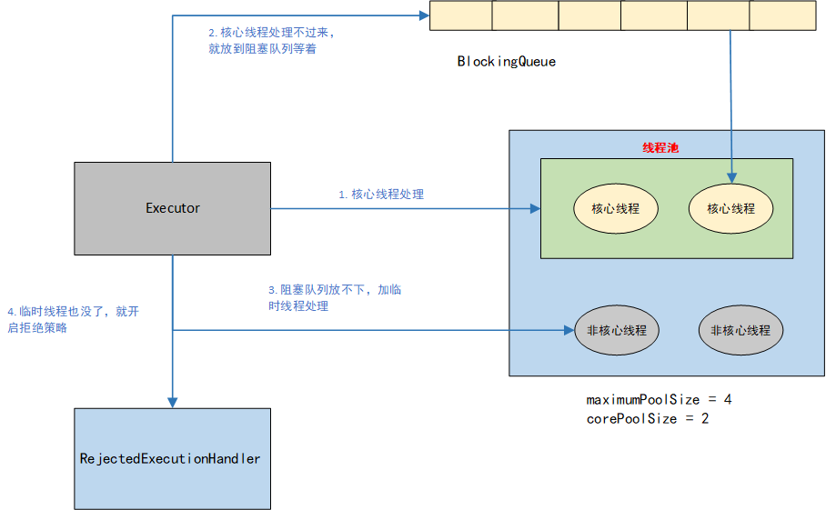

# 多线程

## 创建线程的方式

### 继承Thread类

```java
public static void main(String[] args) {
    SellTicket sellTicket = new SellTicket();
    sellTicket.start();
}

static class SellTicket extends Thread {

    @Override
    public void run(){
        System.out.println("西安 -> 兰州的车票开始买了");
    }
}
```

当然如果`SellTicket`这个类只用一次，我们可以不用显示的创建，通过匿名内部类的方式去简写

```java
Thread thread = new Thread() {
    @Override
    public void run() {
        System.out.println("西安 -> 兰州的车票开始买了");
    }
};
thread.start();
```

如果是用java8的话，我们还可以通过lambda表达式去进一步简化：

```java
new Thread(() -> {
    System.out.println("西安 -> 兰州的车票开始买了");
}).start();
```

### 实现Runnable接口

```java
public static void main(String[] args) {
    // Thread的有参构造函数，支持将实现了Runnable的接口实现类传入
    Thread thread = new Thread(new SellTicket());
    thread.start();
}

static class SellTicket implements Runnable {

    @Override
    public void run(){
        System.out.println("西安 -> 兰州的车票开始买了");
    }
}
```
和前面类似的做法是，如果SellTicket只用一次，不不需要显示创建的话，我们也可以用匿名内部类的方式去简写：

```java
new Thread(new Runnable() {
    @Override
    public void run() {
        System.out.println("西安 -> 兰州的车票开始买了");
    }
}).start();
```

### 实现Callable接口

前面说的两种方式，都可以用来创建和使用线程，但是遗憾的是，他们都没有办法带回来返回值。有些场景，我们是需要返回值的，比如：我们交给线程异步的去做一个数学计算，去做一个耗时的查询，那么我们是需要知道计算的结果或者查询到的数据的。这样的场景，我们就需要用到实现**Callable接口**这种方式了。参考代码：

这里需要注意的几点是：

1. `Callable`接口只有一个方法：`call()`，用来执行我们需要异步执行的业务逻辑，比如这里让线程异步去执行了一个加法计算
2. `Callable`的实现类不能作为参数去构造Thread类，Thread只能接受实现了`Runnable`接口的实现类，下面的代码中`FutureTask`是实现了`Runnable`接口的，因此我们用`FutureTask`将`Callable`接口进行了包装，这里有**适配器模式**的应用，不展开分析
3. `FutureTask`是做什么用的，一言以蔽之：用来获取异步计算的执行结果。如何获取的，这里不展开分析。感兴趣，可参考我的另一篇博客：[线程池源码学习]([ThreadPoolExecutor使用以及原理探索_半夏(•̤̀ᵕ•̤́๑)ᵒᵏᵎᵎᵎᵎ的博客-CSDN博客_threadpoolexecutor使用](https://blog.csdn.net/weixin_40149557/article/details/108433176))
4. 异步执行的结果如何获取，通过`FutureTask`的`get()`方法获取。

```java
public static void main(String[] args) throws ExecutionException, InterruptedException {
    int a = 4, b = 5;
    FutureTask<Integer> task = new FutureTask<>(new Callable<Integer>() {
        @Override
        public Integer call() {
            return a + b;
        }
    });
    new Thread(task).start();
    System.out.println(task.get());
}

// 输出结果：9

// 上面3-8行代码可以用lambda的方式简写为下面这样：
FutureTask<Integer> task = new FutureTask<>(() -> a + b);
```

通过上面的方式，我们已经可以获取到线程的执行结果了，那么再看这样一段代码：我们在第5行休息了5秒钟，用来模拟调用远程接口耗时或者执行业务逻辑复杂的过程。执行的结果是，第8行会一直阻塞等待结果，直到5秒结束，拿到返回结果。

```java
public static void main(String[] args) throws ExecutionException, InterruptedException {
    int a = 4, b = 5;
    FutureTask<Integer> task = new FutureTask<>(() -> {
        Thread.sleep(5000);
        return a + b;
    });
    new Thread(task).start();
    System.out.println(task.get());
}
```

这样的场景可能并不是理想的，5秒我们可以等，如果是10秒呢？1个小时呢？我们等不等，答案是否定的。古语有云，时光匆匆，如白驹过隙，我们不能把大量的时间用在等待上，那么唯一的结果就是我们变老了。我们也不能让一个线程耗在这里，什么都做不了，这也是对资源的一种浪费。因此我们有了下面的代码：我们可以通过`public V get(long timeout, TimeUnit unit)`方法设置一个超时时间。如果超过设定的时间，就不在等待，学会放弃。错过一朵玫瑰，身后也许还有一片花园。我们这里设定的是等待1秒。1秒钟之后，如果没有结果，会抛出一个异常：`TimeoutException`。

```java
// 实际代码中不要出现1这样的魔法数字，这里为了紧凑，没有定义静态常量
Integer result = task.get(1, TimeUnit.SECONDS);
```

### 通过线程池的方式创建和使用线程

创建一个线程，我们知道需要有线程的上下文，用来在CPU通过**时间片轮转**的线程调度方式调度线程的时候保存线程的一些中间数据，我们还知道在JAVA中，每一个线程会在JVM的栈区分配一个独立的线程栈，用来保存线程的局部变量、程序计数器等等。那么如果在Linux操作系统中，我们创建的线程叫做**用户线程**，他还需要和**内核线程**进行一对一或者一对多的绑定（这个根据操作系统决定），因此创建一个线程的代码很简单，但底层需要做的事情还是很多的，这些都是需要消耗资源，消耗时间成本的。那么有没有办法能创建一个线程，反复利用呢？这就是线程池的事情了。

假如你是一个老板，开了一家制作口罩的工厂。前面几种方式，就相当于有一笔订单，你就招聘一个工人，然后带她熟悉设备，教他如何制作口罩，等他熟悉了，然后做完这笔订单之后，你就开除他了。如果下次还来一个订单，你就需要又重新招聘一个工人，继续培训他，等他完成。。。这样的老板，生活中也许并不多见。

我们常见的老板是什么样的呢？你有一个生产口罩的想法，于是注册了一家公司，开个工厂，工人还没招聘，因为可能一开始没有生意嘛，招太多人可能用不上，也发不起工资。所以先去跑订单，好不容易来了一笔订单，你就招了一个工人去做。由于你干的不错，又来一个订单，那么你就又招了一个工人，就这样，有一天你的公司已经扩大到了10个人工人的规模。突然有一天，疫情爆发了，社会上需要大量的口罩，你接到了大笔的订单，但是你的10个工人都忙的晕头转向的，怎么办呢？先将这些订单按照来的顺序找个地方放着吧，你准备等工人闲下来就去做。但是情况不容乐观，疫情越来越严重了，作为一个爱国商人，你准备回报社会，抓紧生产口罩，将他们捐献到需要的地方。因此你招了很多临时工，做了简单的培训后，让他们也参与到制作口罩的队伍中。但是由于疫情太严重了，还是有源源不断的订单过来，临时工和老员工都在加班干，桌子上的订单都放满了，你也毕竟只是个普通人。该做的你已经做了，那就只能拒绝了。最后在全国人民的齐心协力下，我们战胜了病毒，人们再也不用戴口罩了。口罩的订单降下来了，你没有那么忙了，临时工也闲了，是时候让他们回家了。剩下的工作，几个老员工完全能应付过来。

这个故事就是线程池设计的思想，线程池就是那个老板，他有**创建线程、管理线程的能力**；老员工我们把它们叫做**核心线程**，这些线程被创建之后一直在线程中，随时准备处理业务逻辑；订单处理不了，暂时存放的地方，我们叫**阻塞队列**，和队列的区别体现在一个**阻塞**上，第一点：往队列中放元素的时候如果队列满，不会放弃，会阻塞等待队列有空间在尝试往进放。第二点：从队列中取元素的时候，如果队列为空，不会放弃，会阻塞等待有其他线程往队列中放入了元素，在取；临时工，我们叫**临时线程**，临时线程在线程池空闲下来的时候会进行释放；拒绝别人的方式有很多，直接说我不干，是一种，很容易得罪人，委婉的说明原因，客客气气的也是一种，因此关于如何拒绝的方法，线程池中我们叫做**拒绝策略**。

详细步骤，参考下图：




代码参考：

```java
public class Main {

    private static final ThreadPoolExecutor THREAD_POOL;

    /**
     * 核心线程数
     */
    private static final int CORE_POOL_SIZE = 10;

    /**
     * 最大线程数，减去核心线程数为临时线程数
     */
    private static final int MAX_POOL_SIZE = 15;

    /**
     * 临时线程空闲多少时间会被释放
     */
    private static final long KEEP_ALIVE_TIME = 0L;

    /**
     * 阻塞队列长度，如果不设置，那么有可能队列变得无限大，导致内存溢出
     */
    private static final int QUEUE_SIZE = 50;

    /**
     * 静态代码块会在类加载的时候就加载，在这里初始化线程池
     */
    static {
        ThreadFactory threadFactory = new ThreadFactory() {

            private final ThreadFactory defaultFactory = Executors.defaultThreadFactory();
            // AtomicInteger是原子类，保证了线程安全
            private final AtomicInteger threadNumber = new AtomicInteger(1);

            // 这里重写ThreadFactory创建线程的方法，给线程设置一个和业务相关的名字，便于排查问题
            @Override
            public Thread newThread(Runnable r) {
                Thread thread = defaultFactory.newThread(r);
                thread.setName("MyThreadName-" + threadNumber.getAndIncrement());
                return thread;
            }
        };
		
        // 最后一个参数是拒绝策略，我们用了默认的抛弃任务策略
        THREAD_POOL = new ThreadPoolExecutor(CORE_POOL_SIZE, MAX_POOL_SIZE, KEEP_ALIVE_TIME, TimeUnit.MILLISECONDS, new ArrayBlockingQueue<>(QUEUE_SIZE),
                threadFactory, new ThreadPoolExecutor.DiscardPolicy());
    }

    public static void main(String[] args) throws ExecutionException, InterruptedException, TimeoutException {
        THREAD_POOL.execute(() -> {
            System.out.println("线程池安排线程 ："+ Thread.currentThread().getName() + " 执行了A任务");
        });
		
        // 这里的Future参考上面的FutureTask，是他的顶级接口，定义了get()方法
        Future<String> task = THREAD_POOL.submit(() -> {
            System.out.println("线程池安排线程 ："+ Thread.currentThread().getName() + " 执行了B任务，并且返回了一个结果");
            return "我可以带回执行结果";
        });
        System.out.println(task.get());
    }
}
```

## 线程生命周期

线程的生命周期：

1. 通过`new Thread()`创建了一个线程，这个时候线程不会执行
2. 调用了`start()`方法，线程进入**就绪状态（READE）**,等待被CPU时间片的调度
3. 线程获得了CPU使用权，开始干活，干完活之后进入**终止状态（TERMINATED）**
4. 如果在第三步，线程干了一版，被调用了`yield()`方法，则会让出CPU执行权，重新进入**就绪状态（READE）**
5. 如果线程被调用了`wait()`等方法，会被放到一个等待池中，进入**等待状态（WAITING）**，等待其他线程执行`notify()、notifyAll()`方法唤醒，重新进入**就绪状态（READE）**
6. 如果线程被调用了`wait(timeout)`方法，也会被放入到一个等待池中，进入**等待状态（TIMED_WAITING）**,这个状态可以通过其他线程执行`notify()、notifyAll()`方法唤醒，也可以在设置的时候到达后重新进入**就绪状态（READE）**
7. 如果线程执行需要获取锁，那么会进入**阻塞状态（BLOCKED）**,等待获取锁。。。


## 守护线程

默认创建的线程都是`非守护线程`。创建守护线程时，需要将 Thread 的 daemon 属性设置成 true，当 JVM 退出时，会关心非守护线程是否结束，但不关心守护线程的。适合用来做一些监控的工作。

```java
Thread t = new Thread(new Runnable() {
    @Override
    public void run() {
        System.out.println("------");
    }
});
// 设置为守护线程
t.setDaemon(true);
```

## 多线程中的设计模式

### 策略模式

通过一个需求来看策略模式，假设我们要做一个简单的计算器，那怎么实现呢，我们先看版本一

```java
public static void main(String[] args) {
    System.out.println(calculation(2, 3, '*'));
}

private static int calculation(int num1, int num2, char operate) {
    int result = 0;
    switch (operate){
        case '+':
            result = num1 + num2;
            break;
        case '*':
            result = num1 * num2;
            break;
        case '-':
            result = num1 - num2;
            break;
        case '/':
            result = num1 / num2;
            break;
        default:
            break;
    }
    return result;
}
```

这样固然能实现我们的需求，可是如果有一天我们的计算方法又要改变，比如加了阶乘、求平方、开根号这些，怎么办，加条件呗。再加一个case或者if。那么如果我们实际业务中，逻辑非常复杂，这样老改来改去，难免会出问题，而且条件一多，代码变得冗长复杂，可读性差，并且代码耦合性高，没有做到面向对象。所以我们的改进啊，接下来看看策略模式的实现方式：

```java
// 1. 抽象出一个接口，定义计算的方法
@FunctionalInterface
public interface CalculatorStrategy {
    int calculate(int num1, int num2);
}

//2. 得有一个处理类，负责把我们的接口和实现类连接起来，这里可以定义好一些共同的流程啊之类的
public class CalculatorProcess {

    private final int num1;
    private final int num2;
    private final CalculatorStrategy calculatorStrategy;

    public CalculatorProcess(int num1, int num2, CalculatorStrategy calculatorStrategy) {
        this.num1 = num1;
        this.num2 = num2;
        this.calculatorStrategy = calculatorStrategy;
    }

    protected double calculation() {
        return calculatorStrategy.calculate(num1, num2);
    }

    public double getNum1() {
        return num1;
    }

    public double getNum2() {
        return num2;
    }

    public CalculatorStrategy getCalculatorStrategy() {
        return calculatorStrategy;
    }
}

public static void main(String[] args) {
    // 具体的实现交给某一个策略类，这里逻辑简单，我们用了lambada表达式，业务逻辑复杂的话，
    // 可以直接写个子类实现我们定义的接口，可读写好一点
    CalculatorProcess calaculator1 = new CalculatorProcess(100, 200, (s, b) -> s + b);
    System.out.println(calaculator1.calculation());

    CalculatorProcess calaculator2 = new CalculatorProcess(100, 200, (s, b) -> s * b);
    System.out.println(calaculator2.calculation());
}
```

策略模式和我们多线程有什么关系呢，我们再看一个例子吧。多线程的`Runnable`接口定义了线程的基本方法`run()`方法，Thread实现了这个接口，并且对线程的一些共同逻辑进行了实现，我们启用多线程的时候直接在run方法传入我们的实现就行了。这个思想就是`策略模式`。

```java
public static void main(String[] args) {
    new Thread("read-thread") {
        @Override
        public void run() {
            System.out.println("-------");
        }
    }.start();

    new Thread("write-thread") {
        @Override
        public void run() {
            System.out.println("*******");
        }
    }.start();
}
```


### 模板方法模式

我们通过一个场景看一下，比如我们平时的软件研发流程，可能基本经过几个步骤：设计、编码、测试。其中有一些方法可能是共同的，比如安装环境、装电脑等。那我们可以用一个基本的抽象类实现整体的流程。设计好整体算法，但是其中一些不同的方法，比如设计等可能每个软件的实现方式不一样，我们可以新建子类，复写特性化方法实现。这种设计模式可以`把不变的东西封装起来，实现代码重用`、`父类控制行为，子类负责实现`

```java
// 定义软件研发的抽象类
public abstract class SoftwareDevelopment {

    // 这两个方法是每个软件研发都一样的部分
    private final void begin() {
        System.out.println("----------begin()----------");
    }
    private final void end() {
        System.out.println("----------end()----------");
    }

    // 设计、编码、测试是每个软件研发都经过的，但是每个软件的具体实现是不一样的，
    // 定义成protected, 只能子类重写
    protected abstract void design();
    protected abstract void coding();
    protected abstract void test();

    // 算法基本流程可能不怎么变化，在这里直接定义成final的，防止子类重写
    public final void development() {
        begin();
        design();
        coding();
        test();
        end();
    }
}

// 定义IDEA类，负责IDEA开发的实现
public class Idea extends SoftwareDevelopment{

    // 重写设计、编码、测试方法
    @Override
    protected void design() {
        System.out.println("-----design IDEA-----");
    }

    @Override
    protected void coding() {
        System.out.println("-----coding IDEA-----");
    }

    @Override
    protected void test() {
        System.out.println("-----test IDEA-----");
    }
}

public static void main(String[] args) {
        SoftwareDevelopment idea = new Idea();
        idea.development();
}

输出：
----------begin()----------
-----design IDEA-----
-----coding IDEA-----
-----test IDEA-----
----------end()----------
```

模板方法在AQS的代码中有这经典的应用，参考`acquire()`方法，其中获取锁的方法`tryAcquire(arg)`交给子类实现，排队和阻塞的方法交给AQS实现，这部分是不变的。

```java
public final void acquire(int arg) {
    if (!tryAcquire(arg) &&
        acquireQueued(addWaiter(Node.EXCLUSIVE), arg))
        selfInterrupt();
}
```

在我们的线程类中也有这样的设计，我们开启一个线程要重写`run()`方法，我们在这个方法我们中实现这个线程的具体逻辑，这是变化的。但是其他流程是不变的，整体的算法逻辑是在`start()`方法实现的。包括`run()`方法也是在`start()`方法中调用的。这部分我们可以看`start()`方法的源码。

```java
public synchronized void start() {
    /**
      * This method is not invoked for the main method thread or "system"
      * group threads created/set up by the VM. Any new functionality added
      * to this method in the future may have to also be added to the VM.
      *
      * A zero status value corresponds to state "NEW".
      */
    if (threadStatus != 0)
        throw new IllegalThreadStateException();

    /* Notify the group that this thread is about to be started
     * so that it can be added to the group's list of threads
     * and the group's unstarted count can be decremented. */
    group.add(this);

    boolean started = false;
    try {
        // 这是一个native方法，是JVM实现的，据说run()是在这里调用的，我还没有求证
        start0();
        started = true;
    } finally {
        try {
            if (!started) {
                group.threadStartFailed(this);
            }
        } catch (Throwable ignore) {
            /* do nothing. If start0 threw a Throwable then
               it will be passed up the call stack */
        }
    }
}

private native void start0();
```

### 适配器模式

多线程中实现任务有两种方式，实现`Runnable的run()`方法或者实现`Callable的call()`方法，前一种没有返回值，后一种支持返回值。所以`Callable`的功能是比`Runnable`更丰富的。那`Future()`就提供了将`Runnable`适配成`Callable`的能力。

```java
// FutureTask.java

// FutureTask中定义了callable属性
private Callable<V> callable;

// Future实现了Runnable接口
public FutureTask(Runnable runnable, V result) {
    // 构造器里看着我们传入了Runnable接口，在这一步适配成Callable接口
    this.callable = Executors.callable(runnable, result);
    this.state = NEW;       // ensure visibility of callable
}
```

```java
// Executors.java

// 实现了Callable接口
static final class RunnableAdapter<T> implements Callable<T> {
    final Runnable task;
    final T result;
    RunnableAdapter(Runnable task, T result) {
        this.task = task;
        this.result = result;
    }
    // 实现了Callable接口的call()方法，在call()中调用的其实是Runnable的run()方法
    public T call() {
        task.run();
        return result;
    }
}
```

总结他的主要思想：把`Runnable`适配成 `Callable`，首先让`RunnableAdapter` 实现`Callable`，然后在`Callable`的` call`方法里面调用被适配对象`Runnable`的方法。