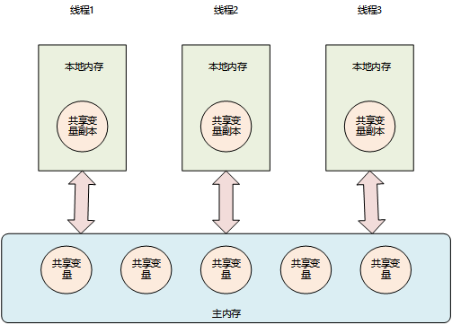

# 从图灵机和冯诺依曼到计算机内存模型和JMM模型分析线程不安全的原因

## 图灵机

也许你听过这个名字：**图灵**。小时候的他性格孤僻，沉默寡言，常常受到校园暴力。可就是这样一个小孩，他却发明了图灵机，为计算机科学的发展奠定了理论基础，并且在二战的时候，破坏了纳粹德国的密码系统，为二战的胜利做出了不可磨灭的贡献。但是最后却被当地警察以同性恋的名义进行定罪，并进行了药物治疗，在注射了长达一年的雌性激素后，他的身体开始有了女性的特征，精神和压力受到双重打击。于是在一个天气晴朗的下午，他咬了一口童话里的毒苹果，结束了自己的生命，那一年，他只有41岁。后来为了纪念他，乔布斯用那口咬了一半的毒苹果做了Apple公司的商标。

今天我们不谈这位天才的过往，只想从图灵机开始，回顾一下计算机基础，看看计算机的工作模型。下面这张图是从网上找的，我们通过计算1+1来简单讨论下图灵机的基本组成以及工作原理

- 图灵机有一条长长的纸带，被分割成一个个连续的小格子，每个格子可以写入字符，比如三个格子依次写着1 1 +   （计算机采用后缀表达式的方式做运算）
- 中间是一个读写头（可以由存储、控制、运算单元组成），读写头可以读取纸带上的符号和数据，也可以将数据写入到纸带上。当依次读入1、1后，控制单元判断是数字，则将他记录在存储单元。接着读入读到+，控制单元判断要进行加法计算，于是通知运算单元，把存储单元的1、1获取到，然后做加法运算，将计算结果2写到纸带上（都是用二进制表示的）。以此完成了一个加法运算。


## 冯诺依曼模型

后来在图灵机的基础上，另一位伟大的科学家冯诺依曼提出了现代计算机的模型，约定用二进制来存储数据，提出了计算机的五大基本硬件结构：

1. 输入设备：负责将人能识别的语言、文字、声音转化成计算机能识别的二进制数据
2. 运算器：负责算数和逻辑的运算，数据输入到运算器后会存储到存储器，如果需要进行运算会将存储器中的数据在取出来进行运算，然后将结果保存回存储器
3. 存储器：负责存储数据和指令
4. 控制器：负责指挥程序的运行，比如要进行一条指令的运算，控制器会将指令从存储器取出来，指挥运算器进行运算，运算结束后，指挥运算器将结果写回到存储器
5. 输出设备：将计算机的二进制数据转化成文字、声音、图像输出


在这个过程中，我们发现其实运算器的压力是很大的，接受到输入后，要将其保存到存储器，还要负责运算，运算的时候还要从存储器读数据，并将结果回写到存储器，还可能要负责将结果转化成人能识别的信息给到输出设备。因此我们要为她减负，直接将输入设备输入的数据写到内存，输出设备取数据也直接从内存取，运算器只负责在控制器的指挥下进行运算。

输入设备、输出设备我们也统一叫做I/O设备；运算器，控制器合起来构成了我们熟知的CPU；存储器这里说的是指内存。硬盘、光盘等我们往往也算做I/O设备。因此我们可以对上图做一个简单版本的归纳。


## 计算机内存模型

### 缓存的由来

今天们不详细展开CPU、IO设备、内存他们是如何工作的，什么原理。我们只关心CPU如何从内存中读取数据，如何将计算的结果写回到内存。前面说了我们的程序和数据是先加载到内存中，然后CPU从内存中取到数据，进行运算和处理，然后将处理完的结果写到内存的。但是在科技发展的过程中，CPU技术飞速发展，从之前的奔腾CPU、Inter I3、Inter I5、到Inter I7，从单核到多核，他的运算速度越来越快，可是内存的发展却遇到了瓶颈，远远跟不上CPU的速度。如果把CPU的运算速度比作飞机，那么内存加载数据的速度就像是开了一辆汽车。这就导致CPU大多数时候会被闲置，都要等待内存，造成了资源的浪费。

这个场景就像我们去图书馆上自习。马上要期末考试了，你带上书本去图书馆占了一个座位，**脑子（CPU）**里飞速的进行这知识点的思考，理解。理解的过程中，遇到了一个难点，你去附近的**书架上（内存）**找一本资料参考，回到了座位开始查找资料，解决了问题。过了几分钟，你又被难住了，又要去附近的书架上找资料。你有点烦了，因为书架太远了，找资料太费时间了，你不愿意一趟趟折腾，那怎么办呢？你可以一次把相关的资料都找上，带回来放到你的**桌子上（缓存）**，这样是不是就离你近了很多，下次找起来是不是桌子上翻一下就找到了，但是你桌子的空间是有限的，能放的书毕竟很少，所以缓存容量很小（这里举个例子，实实际上缓存容量小，与他的制作技术、成本等有关）。这就是缓存技术的由来。

我的Windows电脑上有三级缓存，L1 ：256K、L2：1.0MB、L3：6.0MB。查看方式在任务管理器里面：


我的Linux机器上有三级缓存，L1 ：32K、L2：256K、L3：35840K。查看方式参考命令：


### 三级缓存构成的内存模型

**L1 Cache**

每个CPU核心都有自己的一块L1 Cache，L1的速度是最快的，但是容量是最小的，在L1中数据放在**数据缓存**，指令放在**指令缓存**。如果CPU需要数据，会首先访问L1，如果能命名，则直接从L1返回，如果没有命中，则会访问L2。

**L2 Cache**

L2 Cache也是每个CPU核心都有，但是他距离CPU的距离则比L1要远一些，因此访问的速度则更慢一些，但是他的容量会更大一点。如果CPU在L1中没有命中需要的数据，则会访问L2，如果在L2命中了，则直接返回，如果L2还没有命中，则会访问L3。

**L3 Cache**

L3 Cache缓存是多个CPU核共享的，他距离CPU的距离比L2还远一些，因此访问的速度更慢了，但是他的容量会比L2更大一点。如果CPU在L2没有命中需要的数据，这访问L3，如果在L3命中，则直接返回，如果L3还没有命中，则会访问内存。内存的容量就更大了，通常会有好几个G，但是他的速度是远低于缓存的。

这就是计算机的内存模型，这里通过一张图总结一下。这种内存模型，也带来了一个新的问题，那就是假如core1和core2都操作了内存中同一个数据，那么以谁的结果为准呢？对此操作系统提出了缓存一致性协议去解决这个问题，我们这里不讨论。


## JAVA内存模型 JMM

计算机内存模型是在硬件层面来讲的，不同的操作系统对于他的控制和利用可能有不同的实现，那么这就给Java的一次编译，到处运行带来了挑战。因此Java在这个基础上又定义了自己的内存模型（**JMM: Java Memory Model**），目的就是通过虚拟机屏蔽掉底层的细节，向上提供一个统一的机制，保证一次编译，多次运行。

JMM将所有的共享变量放到了**主内存（我理解堆、方法区都可以算作主内存）**中，每个线程都有自己的**工作内存（每个线程会加载一个自己的线程栈，工作内存在这里）**，每个线程会将自己要用到的共享变量拷贝一个副本，放到自己的工作内存中，每个线程的工作内存是**独立属于线程的，是私有的**。




因此多线程操作共享数据的流程**可能**是这样的（写可能是因为多线程并发，哪个线程被调度到是随机的），我们以下面的代码为例一起看下，

1. 线程1被CPU调度到，在Java虚拟机栈中加载一个属于线程1的线程栈，在里面开辟了自己的工作内存，将主内存的共享变量`totalTicket = 1`拷贝到自己的工作内存，然后线程1的运行时间到了，结束了运行
2. 线程1的运行时间到了，线程2被CPU调度，重复上面的步骤
3. 线程1重新被CPU调度，执行了`totalTicket--`，得到结果0，将0写回到主内存，此时主内存的`totalTicket = 0`，线程1运行结束，线程1的线程栈被释放
4. 线程2重新被CPU调度，此时线程2并不知道`totalTicket`已经被线程1改成了0，他的工作内存中，`totalTicket`还是1，因此执行了`totalTicket--`，`totalTicket = 0`，然后将结果0写回到主内存，此时主内存的`totalTicket = 0`，线程1运行结束
5. 事实上，`totalTicket `被减了两次，应该为-1，但是实际上确实0，这就是线程不安全的原因了

```java
private static int totalTicket = 1;

public static void main(String[] args) {
    new Thread(() -> {
        totalTicket--;
    }).start();

    new Thread(() -> {
        totalTicket--;
    }).start();
}
```

那么我们应该如何解决这个问题呢？医生看病，肯定是对症下药，症在哪里呢？症就是线程1改了主内存中的值，而线程却2浑然不知，最终导致了惨剧发生。那么如果我们能让线程1改完主内存中的值后，通知到线程2，让线程2**看得见**这个值的变化，然后让线程2重新去主内存加载这个值，是不是就没有问题了？我们管这种现象叫**可见性**；或者如果有两个线程：线程1和线程2同时对主内存中的一个共享变量做操作，那么我们不让他们并行执行，我们给他排个队，让线程1先去加载主内存到自己的工作空间，做运算，然后将结果写回到主内存，等他执行结束后，在让排队中的线程2去开始工作，那么是不是也可以解决问题？这种现象我们叫做**原子性**。

因此我们总结一下线程不安全的原因：其实就是JMM模型中，**多线程并发访问的时候不能保证可见性和原子性**，所以为了线程安全，我们要做的就是提出保证原子性和可见性的行之有效的方案。这个Java已经给我们提供了，我们简单总结一下，在对应的部分详细展开讨论这些方案如何用以及他的原理。

- 保证原子性的方案：synchroized关键字、Lock锁、CAS算法
- 保证可见性的方案：volatile关键字、synchronized关键字、Lock关键字、final关键字


**※**：线程不安全的原因还有一个**指令重排序**，由于他和我们的主题内存模型没有关系，我们后续单独讨论，今天不展开。