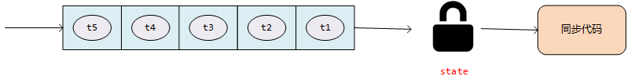

# 线程安全解决方案之ReentrantLock锁

## Lock接口介绍

Lock是J.U.C包下面提供的一个接口，也是用来实现线程同步的一种解决方案，他提供了一个规范，定义了关于一个锁应该具备的能力，定义了加锁、解锁等基本的方法。实现类有`ReentrantLock`、`ReadLock`（在`ReentrantReadWriteLock`中做读锁）、`WriteLock`（在`ReentrantReadWriteLock`中做写锁）、`Segment`（在`ConcurrentHashMap`）中做分段锁。当然我们也可以通过实现这个接口去自定义我们的锁。因此，我们在来理解一下接口的意义，其实就是定义规范，定义如果你要实现一个锁，则必须按照我的规范来。

我们一起看下Lock接口定义了那些方法要我们去实现：

```java
public interface Lock {
    
    /**
     * 线程阻塞的一种加锁方案，调用该方法用来获取锁，如果获取不到，线程会进入休眠状态，直到获取到锁为止
     */
    void lock();
    
    /**
     * 在上面方法的基础上加了中断机制
     */
    void lockInterruptibly() throws InterruptedException;
    
    /**
     * 尝试获取锁，如果锁可以用，立即获取锁，返回true，如果锁不可用，返回false
     */
    boolean tryLock();
    
    /**
     * 在上面方法的基础上加了超时机制，就是说如果不能立即获取到锁，允许多尝试几次，
     * 如果在指定的时间内获取到锁就返回true，如果时间到了还没获取到，在返回false
     */
    boolean tryLock(long time, TimeUnit unit) throws InterruptedException;
    
    /**
     * 解锁，释放锁资源
     */
    void unlock();
       
    /**
     * 为锁绑定一个条件，这个可以用来实现wait/notify类似的线程通信的效果，后续展开
     */
    Condition newCondition();
}
```

## ReentrantLock如何使用

`ReentrantLock`是我们最常用的`Lock`接口的一种实现，**Reentrant**是可重入的概念（后面展开）。他和`synchroized`关键字都是悲观锁。我们一起看下如何使用：

**lock()  and unlock()**

```java
Lock lock = new ReentrantLock();

public void sellTicket() {
    try {
        lock.lock();
        if (totalTicket > 0) {
            System.out.println("totalTicket :" + totalTicket + " 被线程： " + Thread.currentThread().getName() + " 减1");
            Thread.sleep(1000);
            totalTicket--;
        }
    } catch (Exception e) {
        e.printStackTrace();
    } finally {
        // 切记切记，这里一定要记得在finally里释放锁，否则会导致锁资源被占用，其他线程无法始终无法获取锁，永远被阻塞
        lock.unlock();
    }

}
```

错误写法1：如果代码在第2行到第6行之间报了错，抛出异常，会导致无法走到第8行，锁无法释放

```java
lock.lock();
if (totalTicket > 0) {
    System.out.println("totalTicket :" + totalTicket + " 被线程： " + Thread.currentThread().getName() + " 减1");
    Thread.sleep(1000);
    totalTicket--;
}
lock.unlock();
```

错误写法2：多个线程会加载自己私有的线程栈，lock作为局部变量是每个线程栈内部私有的，不共享，会导致有多少个线程访问，就有多少锁，没办法起到互斥的作用，如果不理解那些是线程私有的，可以参考：[并发编程02-什么是线程安全以及Java虚拟机中哪些数据是线程共享的，那些是线程私有的](https://blog.csdn.net/weixin_40149557/article/details/124463990)

```java
public void sellTicket() {
    Lock lock = new ReentrantLock();
    try {
        lock.lock();
        if (totalTicket > 0) {
            System.out.println("totalTicket :" + totalTicket + " 被线程： " + Thread.currentThread().getName() + " 减1");
            Thread.sleep(1000);
            totalTicket--;
        }
        lock.unlock();
    } catch (Exception e) {
        e.printStackTrace();
    }
}
```

**tryLock()**

`tryLock()`尝试获取锁，如果获取不到，线程就不进行处理。之前做一个定时任务的需求，由于项目中没有分布式任务调度框架，故用了spring自带的定时任务。这就导致如果你的应用部署在多个节点上，那么到了设定的时间，三个节点会同时触发定时任务，实际上只需要触发一次即可。当时用数据库做分布式锁实现了Lock接口，当定时任务触发的时候，先调用`tryLock()`方法获取锁，获取到则触发定时任务，否则什么都不做。

```java
public void sellTicket() {
    if (lock.tryLock()) {
        try {
            // 获取到锁的分支
        } finally {
            lock.unlock();
        }
    } else {
        // 获取不到锁的分支
    }
}
```

错误写法：如果有多个线程访问这个方法，同一时刻只有线程1获取到了锁，线程2没有获取到锁，那么线程2会走到第5行，尝试释放锁，而实际线程2并没有获取到锁，导致代码报错。

```java
public void sellTicket() {
    if (lock.tryLock()) {
        // 执行获取到锁的业务逻辑
    }
    lock.unlock();
}
```

## 简单说明ReentrantLock如何实现加锁/解锁

`Lock`是一个接口，定义了锁的规范，提供了加锁/解锁的基本方法。而具体的核心逻辑是在J.U.C包下面有一个抽象类`AbstractQueuedSynchronizer`（**AQS**），在这个抽象类里面结合模板方法设计模式实现了`lock`、`unlock()`等基础功能，其他锁实现只需要继承这个抽象类，在做一些自定义的实现即可。通过这个设计可以进一步理解接口和抽象类的区别：接口定义规范（can-do），抽象类提取子类的公共逻辑进行实现，减少冗余代码（is-a）。关于`AbstractQueuedSynchronizer`的细节可以参考：[通过ReentrantLock和Semaphore看AQS独占锁和共享锁的源码](https://blog.csdn.net/weixin_40149557/article/details/107968108)。这里我们在简单提一下基本加锁流程：

1. AQS中定义了一个全局变量：state，初始化为0，如果有线程获取锁资源，则通过CAS的原子操作对state加一，表示**加锁**成功
2. 当线程释放锁资源的时候，将state重新设置为0，表示**释放锁**成功
3. 如果同时有多个线程争抢锁资源，同时只有一个线程获取到了锁，其他的线程怎么办？AQS提供了一个用**双向链表实现的同步队列**，让其他线程去这个队列里面排队，当锁被释放后，从队列里面取出一个线程获取锁
4. 假设线程2来获取锁资源，此时线程1刚好释放了锁，他则直接加锁成功，而没有去上面说的队列中排队等待，那么这种锁我们叫做**非公平锁**，通过`new ReentrantLock(false)`定义非公平锁，默认非公平
5. 假如线程2来获取锁资源没有插队，而是乖乖去队列里面排队等候，那么这种锁我们叫做**公平锁**，通过`new ReentrantLock(true)`定义公平锁




## 如何理解Reentrant的概念

**Reentrant**，应为是可重入的概念，`ReentrantLock`即可重入锁，`synchroized`也是可重入锁。什么是可重入锁呢，以下面的代码为例，如果某一个线程在调用method1的时候获取到了锁，那么在调用method2的时候也会自动获取锁，这种就叫做可重入锁。假设不会自动获取，也就是不可重入，那么下面这两段代码就会这样运行：线程1执行method方法获取了锁，接着调用method2，又需要获取锁，那么此时锁被谁占用呢？线程1，因此他会等线程1释放锁，而线程1能释放锁嘛，不能，因为他还没有执行完，他在method2中等待获取锁。这就卡住了一个bug，导致了**死锁**。因此我认为**可重入锁在一定程度上解决了死锁问题。**

```java
Lock lock = new ReentrantLock(true);

public void method1() {

    try {
        lock.lock();
        method2();
    } finally {
        lock.unlock();
    }

}

public void method2() {
    try {
        lock.lock();
        // 方法2的逻辑
    } finally {
        lock.unlock();
    }
}
```

```java
public synchronized void method1() {
    method2();
}

public synchronized void method2() {

}
```

## Lock锁和synchroized锁的区别

相同点：

1. 他们都可以实现线程同步，都是悲观锁
2. 都是可重入锁

不同点：

1. `synchroized`是JVM层面实现的，`lock`是基于AQS框架实现的
2. `lock`支持公平锁和非公平锁两种，`synchroized`是非公平的
3. `synchroized`加锁解决是自动的，`lock`需要手动去做，因为手动，则更加灵活，你可以在任意地方加锁解锁，但是一定要注意合理正确的释放锁，否则会造成死锁
4. `lock`提供了`tryLock()`方法，这个是`synchroized`做不到的
5. `synchroized`可以结合**wait/notify**机制实现线程通信，而`lock`锁可以用`Condition`实现线程通信
6. `lock`接口下有读锁、写锁的实现类，用来为读写锁实现高性能的读写分离的锁，`synchroized`是做不到的
