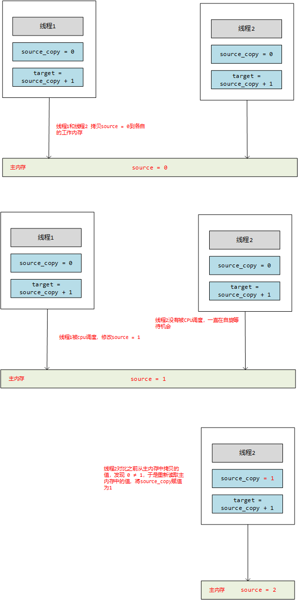

## CAS算法

java的锁机制中，我们知道有很多种锁，那可能最常听到的就是乐观锁和悲观锁。什么是悲观锁呢，就是假设一定会发生线程冲突，就像`synchronized`，JDK.6之前他是一个重量级锁，每次线程进来，都会加锁，如果有其他线程进来，就阻塞，等待当前线程释放锁资源。还有一种就是乐观锁，它总是假设不会发生线程冲突，如果真的发生线程冲突，他就开始**自旋**模式，进行重试，直到当前线程运行结束。

## CAS算法的主要原理

CAS是Compare And Swap的缩写，意思是比较和交换。他是一种无锁的线程同步方案，如果有两个线程要同时修改主内存中的值，比如下图线程1和线程2要同时修改主内存中的共享变量`source = 0`，对其进行加法运算，则执行过程如下：

1. 线程1和线程2同时将主内存中的source的值拷贝一个副本到线程私有的工作空间，我们记作：source_copy = 0
2. 线程1被CPU调度，则线程1比较source_copy和主内存中的值source，发现是相等的，则进行加法运算，将结果1写回到主内存
3. 在这个过程中，线程2没有被CPU调度，但是他也没有被阻塞，而是一直在自旋等待机会，准备厚积薄发
4. 线程1结束运行，私有的线程栈被销毁，线程2被CPU调度到
5. 线程2不会着急运算，会比较之前自己长主内存拷贝的source的副本source_copy是否还和source相等，发现不相等了
6. 线程2重新从主内存拷贝source的值到自己的工作内存，于是source_copy = 1
7. 然后基于最新的值进行加法运算，将结果2会写到主内存




## java中的CAS算法

java的Concurrent包下很多类都用到了CAS算法，例如`AtomicInteger`、`AtomicBoolean`等原子类，我们以`AtomicInteger`为例来看他的CAS算法实现：

```java
public final int getAndAdd(int delta) {
    return unsafe.getAndAddInt(this, valueOffset, delta);
}

public final int getAndAddInt(Object var1, long var2, int var4) {
    int var5;
    do {
        // 这里相当于一直循环尝试获取主内存中的V值
        var5 = this.getIntVolatile(var1, var2);
    } while(!this.compareAndSwapInt(var1, var2, var5, var5 + var4));

    return var5;
}
```

## CAS算法的问题

### ABA问题

我们看这样一个场景，线程1、线程2、线程3都要修改主内存中的共享变量source，于是他们按照一下流程进行工作：

1. 三个线程同时从主内存中加载了source的初始值A
2. 线程1要将source修改为B，他首先被CPU调度到，成功修改了source = B
3. 线程2要将source修改为A，运行的时候发现自己之前拷贝的source的副本是A，可是主内存是B，不一致，于是重新从主内存读取source的最新值B，然后将其修改为了A
4. 线程3要将source修改为C，运行的时候发现自己之前拷贝的source的副本A和主内存是一致的，因此直接修改source的值为C

那么在这个流程中，source的值经历了A-B-A-C的过程，线程3在修改的时候没有发现source已经被线程2修改过了一次，这个状态他没有感知到。那么我们可能会说，这看起来没什么影响啊。确实在有些场景，这没有什么影响，可是如果是一个公司的财务呢？账户本来有1000元，中间被某经理挪用了去炒股，然后过了一段时间他炒股赚了，将1000放了回去。那么有没有影响，钱确实还是那么多钱，但是这样的经理，可能会给公司后来的发展造成重大损失。

解决这个问题的方法也很简单，是每次更新主内存中的值时，在加一个版本号记录每次的修改记录即可。

### 循环时间长

如果竞争特别激烈，线程一直通过自旋的方式获取V值，也是对性能的一个考验。
