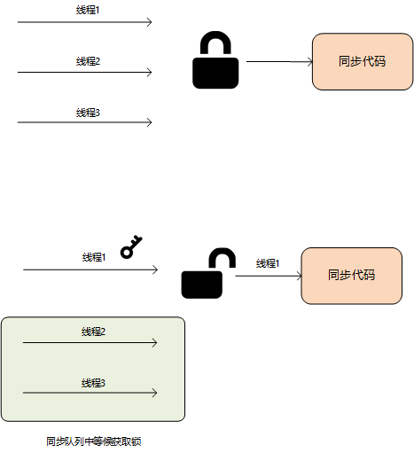
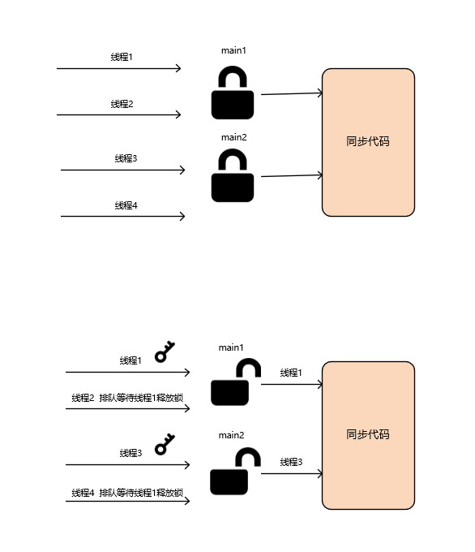

# 正确使用synchroized关键字

**synchroized**是Java用来解决线程安全问题的一个关键字，在最开始的时候，我对他的理解就是一个锁，用来锁住一个方法或者一个代码块，其实这种想法是完全错误的，如果站在这个角度理解他，是不能写出线程安全的代码的。synchroized在英文中做动词用的意思是：使同步；做形容词用的意思是：同步的。因此他的作用是使一个方法或者一个代码块成为同步的，也就是同一时间只能有一个线程访问。那么如何实现呢？他的思路是**找一把锁**，把需要同步的代码锁起来。

如下图所示，我们找了一把锁将同步代码块锁了起来，当有三个线程同时访问同步代码块时，他们首先需要找到钥匙打开锁，线程1很找到了这把唯一的钥匙，打开锁，进入同步代码块运行，线程2和线程3只能眼巴巴看这，排队等候。当线程1执行完之后，他会将钥匙物归原主，那么线程2和线程3开始有机会去找到钥匙，打开锁。



因此，使用synchroized关键字的核心是什么呢？是**找一把唯一的锁**将同步代码块锁起来。好的，那让我们一起来看看如何找这样一把锁。

> **※**：理解这篇笔记必须先理解：01-什么是线程安全以及共享变量.md，02-从计算机内存模型和JMM分析线程不安全的原因.md 可以参考

## synchroized用在代码块上

我们看这样一个例子吧。在`sellTicket`方法中，对成员变量`totalTicket`做减一操作，我们创建了5个线程去执行这个方法，我们希望的是当有一个线程将`totalTicket`减为0后，其他线程就不能再做减法操作，实际上呢，五个线程都成功对`totalTicket`做了减法。为什么呢？前面我们说过成员变量是放在方法区、所有线程共享的，因此这里存在一个线程安全的问题。

```java
public class Main {

    private static int totalTicket = 1;

    public static void main(String[] args) {
        Main main = new Main();
        for (int i = 0; i < 20; i++) {
            new Thread(main::sellTicket).start();
        }

    }

    public void sellTicket() {
        if (totalTicket > 0) {
            System.out.println("totalTicket :" + totalTicket + " 被线程： " + Thread.currentThread().getName() + " 减1");
            try {
                Thread.sleep(1000);
            } catch (InterruptedException e) {
                e.printStackTrace();
            }
            totalTicket--;
        }
    }
}

// 执行结果：
totalTicket :1 被线程： Thread-0 减1
totalTicket :1 被线程： Thread-2 减1
totalTicket :1 被线程： Thread-1 减1
totalTicket :1 被线程： Thread-3 减1
totalTicket :1 被线程： Thread-4 减1
```

如何解决呢？我们可以用上面说的**synchroized**关键字，给他**找一把锁**，让他把将会出现线程安全的代码锁起来，变成**同步代码快**。这里我们找的锁是：**this**，this什么意思，当前对象的引用。执行一下这段代码，我们发现是可以解决线程安全问题的。

```java
public class Main {

    private static int totalTicket = 1;

    public static void main(String[] args) {
        Main main = new Main();
        for (int i = 0; i < 5; i++) {
            new Thread(main::sellTicket).start();
        }

    }

    public void sellTicket() {
        synchronized (this) {
            if (totalTicket > 0) {
                System.out.println("totalTicket :" + totalTicket + " 被线程： " + Thread.currentThread().getName() + " 减1");
                try {
                    Thread.sleep(1000);
                } catch (InterruptedException e) {
                    e.printStackTrace();
                }
                totalTicket--;
            }
        }
    }
}

// 执行结果
totalTicket :1 被线程： Thread-0 减1
```

那么我们在看下面这段代码：我们将main方法稍作改动，在执行发现，`totalTicket`又被两个线程做了减法操作，实际上当他被一个线程减到0之后，就不应该在执行。那么问题出在了哪里？我们已经加了synchronized关键字做了同步。。

```java
public class Main {

    private static int totalTicket = 1;

    public static void main(String[] args) {
        Main main1 = new Main();
        for (int i = 0; i < 5; i++) {
            new Thread(main1::sellTicket).start();
        }

        Main main2 = new Main();
        for (int i = 0; i < 5; i++) {
            new Thread(main2::sellTicket).start();
        }

    }

    public void sellTicket() {
        synchronized (this) {
            if (totalTicket > 0) {
                System.out.println("totalTicket :" + totalTicket + " 被线程： " + Thread.currentThread().getName() + " 减1");
                try {
                    Thread.sleep(1000);
                } catch (InterruptedException e) {
                    e.printStackTrace();
                }
                totalTicket--;
            }
        }
    }
}

// 执行结果
totalTicket :1 被线程： Thread-0 减1
totalTicket :1 被线程： Thread-5 减1
```

我么分析一下，this是什么？当前对象的引用，我们在main方法里new了几个对象呢？两个：main1和main2。因此当从第8行调用到`sellTicket`的时候，当前对象是谁？是main1，**this就是指向main1这个对象的一个引用**。当从第13行调用到`sellTicket`的时候，当前对象是谁？是main2，**那么this就是指向main2这个对象的一个引用**。所以说，在这个代码中，我们一共找了**两把锁**，同时可以放两个线程进来，那么自然是线程不安全的。



知道了问题的所在，我们如何解决呢？这里看下正确的代码吧（限于篇幅，省去部分代码）：

这个代码中，我们创建了一个**static**修饰的常量对象，用它去做锁，那我们知道static修饰的变量、方法等是和类的实例无关的，是属于类的，不管你创建多少个实例，static修饰的都只有一个，因此用它去做锁是可以的。

```java
public class Main {

    private static final Object object = new Object();
    
    public void sellTicket() {
        synchronized (object) {
            if (totalTicket > 0) {
                System.out.println("totalTicket :" + totalTicket + " 被线程： " + Thread.currentThread().getName() + " 减1");
                try {
                    Thread.sleep(1000);
                } catch (InterruptedException e) {
                    e.printStackTrace();
                }
                totalTicket--;
            }
        }
    }
}
```

当然我们也可以用**Main.class**去做锁，他当然也是唯一的。

```java
public class Main {

    public void sellTicket() {
        synchronized (Main.class) {
            if (totalTicket > 0) {
                System.out.println("totalTicket :" + totalTicket + " 被线程： " + Thread.currentThread().getName() + " 减1");
                try {
                    Thread.sleep(1000);
                } catch (InterruptedException e) {
                    e.printStackTrace();
                }
                totalTicket--;
            }
        }
    }
}
```

## synchroized用在普通方法上

synchroized关键字也可以用在方法上，当他用在一个普通的方法上时候，相当于是我们前面说的`synchroized (this)`这种情况，因此当只有一个对象的时候，就像下面这段代码，他是线程安全的，可是如果在有一个Main的实例main2，那么这段代码同样是线程不安全的，为什么，可以参考上面的解释。

```java
public class Main {

    private static int totalTicket = 1;

    public static void main(String[] args) {
        Main main1 = new Main();
        for (int i = 0; i < 5; i++) {
            new Thread(main1::sellTicket).start();
        }
    }

    public synchronized void sellTicket() {
        if (totalTicket > 0) {
            System.out.println("totalTicket :" + totalTicket + " 被线程： " + Thread.currentThread().getName() + " 减1");
            try {
                Thread.sleep(1000);
            } catch (InterruptedException e) {
                e.printStackTrace();
            }
            totalTicket--;
        }
    }
}
```

## synchroized用在静态方法上

前面说了**static**修饰的方法和变量都是属于类的，所有类的实例共享的，因此当synchrozide用在**static**修饰的方法上的时候，他的锁就是当前类，类似于`synchroized (Main.class)`的效果。

```java
public class Main {

    private static int totalTicket = 1;

    public static void main(String[] args) {
        for (int i = 0; i < 5; i++) {
            new Thread(Main::sellTicket).start();
        }
    }

    public synchronized static void sellTicket() {
        if (totalTicket > 0) {
            System.out.println("totalTicket :" + totalTicket + " 被线程： " + Thread.currentThread().getName() + " 减1");
            try {
                Thread.sleep(1000);
            } catch (InterruptedException e) {
                e.printStackTrace();
            }
            totalTicket--;
        }
    }
}
```

>  **※**：当在方法上加锁的时候要注意，我们是不是真的需要同步整个方法，如果这个方法有50行，只有两行涉及到共享变量的修改，那么我们应该做的是将这两行用同步代码块包起来，尽量减小锁的粒度。而不是蛮横的将整个方法都锁起来。