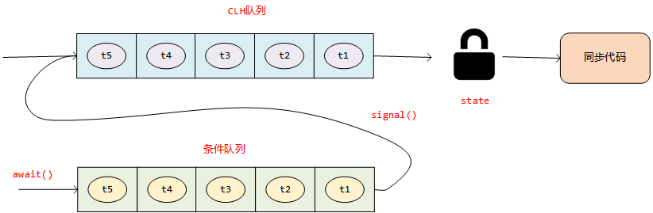

# Lock锁结合Condition实现线程通信

## Condition接口

在之前我们说过了基于`synchroized`关键字的线程通信机制，那就是每个锁对象通过`wait()`方法让持有该锁的线程进入等待状态，通过`notify()`或者`notifyAll()`方法让处于等待状态的线程被唤醒，重新有机会被CPU进行调度。详细参考：[并发编程05-线程通信之wait&notify](https://blog.csdn.net/weixin_40149557/article/details/124601030)

那么我们如果用Lock锁的话，相对应的也提供了`Condition`这种方式。`Condition`是条件的意思，因为他实现线程等待的方法是通过一个队列实现的，因此我们也可以称之为**条件队列**。每当我们创建一个Lock锁之后，就可以通过`lock.newCondition()`去创建一个条件队列，然后通过调用`await()`方法让当前线程去条件队列中等待，通过`signal()`或者`signalAll()`方法让处于条件队列中的线程被唤醒，有机会重新等待被CPU调度。

```java
public interface Condition {
    
    /*
     * 调用该方法会让当前线程进入等待状态，然后自动释放对应的锁资源，CPU也不会在调度他，直到被唤醒或者中断
     */
    void await() throws InterruptedException;
        
    /*
     * 调用这个方法之前如果线程是中断状态或者在等待过程中被中断，那么他会继续等待，直到被唤醒，被唤醒后，他的中断状态会继续保持
     */
    void awaitUninterruptibly();
    
    /*
     * 在await()方法的基础上加一个超时机制，到了指定的时间也会被唤醒，就算没有调用signal()方法
     */
    long awaitNanos(long nanosTimeout) throws InterruptedException;
    
    /*
     * 和上面的方法类似，加了一个时间单位
     */
    boolean await(long time, TimeUnit unit) throws InterruptedException;
    
    /*
     * 和上面的方法类似，指定了deadline
     */
    boolean awaitUntil(Date deadline) throws InterruptedException;
    
    /*
     * 选择一个在该条件下等待的线程唤醒，类似于notify()
     */
    void signal();
    
    /*
     * 唤醒所有在该条件下等待的线程，类似于notifyAll()
     */
    void signalAll();
}
```

## Condition如何使用

我们通过`Lock`结合`Condition`对之前用`synchroized`结合`wait/notify`机制实现的代码进行了改造，实现了同样的效果。

```java

public class Main {

    private final List<String> syncList;

    private final Lock lock = new ReentrantLock();
	
    // 为lock锁创建了一个条件队列
    private final Condition emptyCondition  = lock.newCondition();

    public Main() {
        syncList = new LinkedList<>();
    }

    public void removeElement() {
        lock.lock();
        try {
            // 如果条件满足，让当前线程进行等待，这里要写成while，原因同wait()方法的使用
            while (syncList.isEmpty()) {
                System.out.println("List is empty, wait add element...");
                emptyCondition.await();
            }
            String remove = syncList.remove(0);
            if (null != remove) {
                System.out.println("Thread " + Thread.currentThread().getName() + " remove element " + remove + " success...");
            }
        } catch (InterruptedException e) {
            e.printStackTrace();
        } finally {
            lock.unlock();
        }
    }

    public void addElement(String element) {
        lock.lock();
        try {
            syncList.add(element);
            System.out.println("Add Element: " + element + " success...");
			
            // 其他线程往队列中放入元素后，唤醒之前从队列中移除数据时候因为队列为空而等待的线程
            emptyCondition.signalAll();
            System.out.println("notifyAll called!");
        } finally {
            lock.unlock();
        }
    }

    public static void main(String[] args) {
        Main main = new Main();

        new Thread(main::removeElement).start();
        new Thread(main::removeElement).start();
        new Thread(main::removeElement).start();

        new Thread(() -> main.addElement("element1")).start();
        new Thread(() -> main.addElement("element2")).start();

    }

}
```

**※ 注**：`await()`和`signal()`操作都要先获取到锁资源才可以操作，就是说要放在`lock.lock()`和`lock.unlock()`之间。原因和`wait/notify`一节说过的雷同。

## AQS对Condition接口的实现

回顾一下之前对Lock锁的介绍，我们说过Lock锁的核心逻辑比如加锁、解锁的方法其实是在AQS这个基础的框架中实现的，在AQS中有一个**双向链表实现的同步队列**，用来存放没有获取锁资源的线程。但是我们没有提到的是，其实`await()`方法和`signal()`方法也是在AQS中实现的。AQS中除了有一个同步队列，当我们执行这行代码`lock.newCondition();`的时候还会在AQS中创建一个**基于单向链表实现的条件队列**。当有线程持有锁资源，正准备一展宏图的时候，如果此时发现触发了需要等待的条件，那么就会通过`condition`调用`await()`方法将该线程放入到对应的条件队列中去等待，同时收回该线程持有的锁资源，直到某一时刻，其他线程做了某种操作导致之前的条件不满足了，在通过`condition`调用`signal()`或者`signalAll()`方法唤醒条件队列中的线程，唤醒的方式就是将条件队列中的线程**转移**到同步队列中，让他们有机会去被CPU调度。

**※ 注：**图中只画了通过`signal()`方法转移到同步队列的动作，实际转移到同步队列的触发条件还有可能是调用了`signAll()`或者等待的时候调用得是`awaitNanos(long nanosTimeout)`等带了超时机制的等待方法，然后时间到了也是有可能的。




可参考源码理解（注意第一次看任何框架源码的时候，不要钻牛角尖去理解每一行代码，如果你不是大神，那么这种方式会让你走进绝望，要通过方法名等大概推测出核心流程，先去把握核心流程，有余力在看细节）：

**await()**

```java
public final void await() throws InterruptedException {
    if (Thread.interrupted())
        throw new InterruptedException();
    Node node = addConditionWaiter();  // 见到node，第一时间想到链表、树等数据结构，通过方法名猜测出可能是要添加一个等待条件
    int savedState = fullyRelease(node);  // 释放锁资源，工作中不要写行尾注释
    int interruptMode = 0;
    while (!isOnSyncQueue(node)) {
        LockSupport.park(this);
        if ((interruptMode = checkInterruptWhileWaiting(node)) != 0)
            break;
    }
    if (acquireQueued(node, savedState) && interruptMode != THROW_IE)
        interruptMode = REINTERRUPT;
    if (node.nextWaiter != null) // clean up if cancelled
        unlinkCancelledWaiters();
    if (interruptMode != 0)
        reportInterruptAfterWait(interruptMode);
}

private Node addConditionWaiter() {
    Node t = lastWaiter;
    // If lastWaiter is cancelled, clean out.
    if (t != null && t.waitStatus != Node.CONDITION) {
        unlinkCancelledWaiters();
        t = lastWaiter;
    }
    // 链表的基本操作，new一个节点，插入到单链表中
    Node node = new Node(Thread.currentThread(), Node.CONDITION);
    if (t == null)
        firstWaiter = node;
    else
        t.nextWaiter = node;
    lastWaiter = node;
    return node;
}
```

**signal()**

```java
public final void signal() {
    if (!isHeldExclusively())
        throw new IllegalMonitorStateException();
    Node first = firstWaiter;
    if (first != null)
        doSignal(first);   // 其他代码都不重要，第一次看不用关注，只看这一行，找到重点
}

private void doSignal(Node first) {
    do {
        if ( (firstWaiter = first.nextWaiter) == null)
            lastWaiter = null;
        first.nextWaiter = null;
    } while (!transferForSignal(first) &&   // 转移到同步队列中，这一行是主流程
             (first = firstWaiter) != null);
}

final boolean transferForSignal(Node node) {

    if (!compareAndSetWaitStatus(node, Node.CONDITION, 0))   // cas的操作
        return false;

    Node p = enq(node);    // 核心逻辑
    int ws = p.waitStatus;
    if (ws > 0 || !compareAndSetWaitStatus(p, ws, Node.SIGNAL))
        LockSupport.unpark(node.thread);
    return true;
}

private Node enq(final Node node) {  // 单向链表实现的队列中插入节点
    for (;;) {
        Node t = tail;
        if (t == null) { // Must initialize
            if (compareAndSetHead(new Node()))
                tail = head;
        } else {
            node.prev = t;
            if (compareAndSetTail(t, node)) {
                t.next = node;
                return t;
            }
        }
    }
}
```

## BlockingQueue中对Condition的应用

阻塞队列的概念，我们在线程一节提到过，参考：[并发编程01-Java创建和使用线程的四种方式](https://blog.csdn.net/weixin_40149557/article/details/124440655)，这里不再赘述，JDK默认提供的阻塞队列有很多，我们以`LinkedBlockingDeque`为例看看如何实现阻塞效果的。

```java
// 创建了两个全局的条件队列，一个用来阻塞take操作，一个阻塞put操作

/** Condition for waiting takes */
private final Condition notEmpty = lock.newCondition();

/** Condition for waiting puts */
private final Condition notFull = lock.newCondition();
```

**put()**

```java
public void putLast(E e) throws InterruptedException {
    if (e == null) throw new NullPointerException();
    Node<E> node = new Node<E>(e);
    final ReentrantLock lock = this.lock;
    lock.lock();
    try {
        // 往链表尾插入新节点，如果插入失败，就是队列满了，那么当前线程放到notFull这个条件队列中等待
        while (!linkLast(node))
            notFull.await();
    } finally {
        lock.unlock();
    }
}

private boolean linkLast(Node<E> node) {
    if (count >= capacity)
        return false;
    
    // 接下来是链表插入节点的基本操作
    Node<E> l = last;
    node.prev = l;
    last = node;
    if (first == null)
        first = node;
    else
        l.next = node;
    ++count;
    
    // 插入一个节点后，队列中就有数据了，就可以唤醒一个因为当时队列空出队失败而进入notEmpty这个等待队列的线程了
    notEmpty.signal();
    return true;
}
```

**take()**

```java
public E take() throws InterruptedException {
    return takeFirst();
}

public E takeFirst() throws InterruptedException {
    final ReentrantLock lock = this.lock;
    lock.lock();
    try {
        E x;
        // 从链表头删除节点，结合put是往链表尾插入，这样来实现队列先进先出的特性，
        // 如果删除节点失败，那么说明队列空了，当前线程放到notEmpty这个条件队列中等待
        while ( (x = unlinkFirst()) == null)
            notEmpty.await();
        return x;
    } finally {
        lock.unlock();
    }
}

private E unlinkFirst() {
   
    Node<E> f = first;
    if (f == null)
        return null;
    
    // 从链表中删除头结点的逻辑
    Node<E> n = f.next;
    E item = f.item;
    f.item = null;
    f.next = f; // help GC  通过让item = null，方便可达性分析算法能快速回收垃圾对象，f.next = f这一行还真不是很理解，但是这个和出队的核心逻辑无关
    first = n;
    if (n == null)
        last = null;
    else
        n.prev = null;
    --count;
    notFull.signal();  // 出队后，就可以唤醒一个当时因为队列满入队失败而进入notFull这个等待队列态的线程了
    return item;
}
```

**※ 注**：这里阻塞队列的效果用`wait/notify`机制是实现不了的，因为阻塞队列需要两个等待的条件：队列满的时候阻塞生产者，队列空的时候阻塞消费者，而`wait/notify`只能阻塞一个条件。这也是`wait/notify`机制和`condition`机制的最大区别