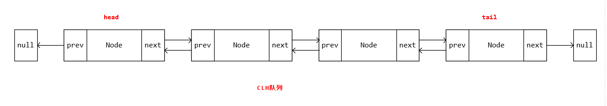
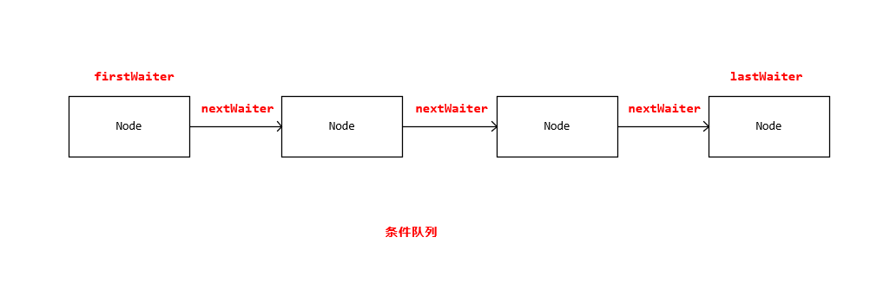
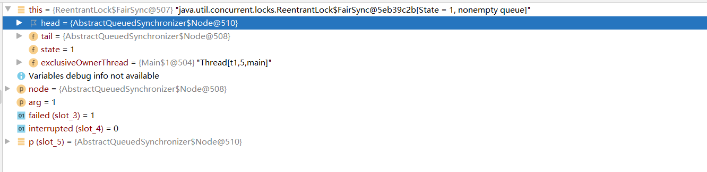
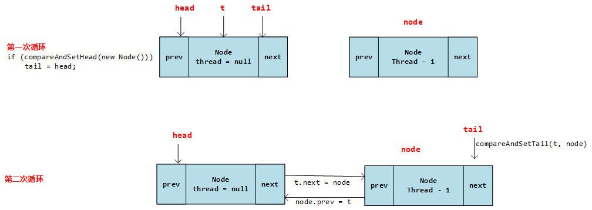
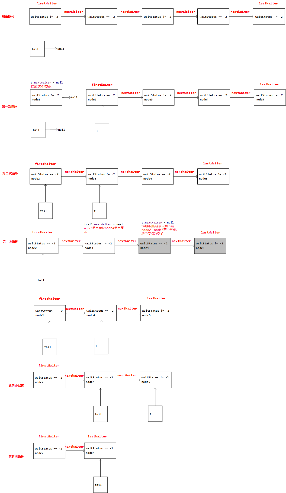

# J.U.C AQS的加锁解锁

## AQS简介

`AbstractQueuedSynchronizer`简称`AQS`，翻译过来叫`抽象队列同步器`。是`java.util.concurrent`包下面各种各样锁的基础框架，提供了`独占模式`和`共享模式`两种锁模式，比如`ReentrantLock`就是一种基于AQS的独占锁。而`Semaphore`、`CountDownLatch`就是基于AQS实现的共享锁。结合他的名称我们可以基本得到以下几个关键点：

1.  抽象：他是一个抽象类，定义了一些方法，也实现了一些公共功能，比如加锁解锁的模板和线程如果获取不到锁就去排队阻塞的方法。
2.  队列：发生多线程竞争的时候，没有抢到锁的线程回去队列中排队，涉及两种队列：`同步队列`和`条件队列`
3.  同步器：实现了同步的功能

下面分别从这三个方面说AQS。

## 队列

### 同步队列



当有多个线程同时竞争锁资源的时候，同一时刻CPU只能处理一个线程，那么剩下的线程怎么办呢，我们让他到这个`同步队列`中去排队并阻塞，等到有线程释放锁资源后，再从`同步队列`中取出一个线程去竞争锁。这就是同步队列的作用。他的数据结构是一个双向链表维护的`CLH队列`，队列有一个头指针，一个尾指针。队列中每个节点的结构见下文`Node的结构`

### 条件队列

条件队列也是用来管理没有获取到锁资源的一种队列，他主要负责和锁配合使用，满足一定条件就让条件队列中的线程做一些事。比如下面这段代码，代码来自`ArrayBlockingQueue.java`。

```java
public ArrayBlockingQueue(int capacity, boolean fair) {
    if (capacity <= 0)
        throw new IllegalArgumentException();
    this.items = new Object[capacity];
    lock = new ReentrantLock(fair);
    // 定义条件队列的方式
    notEmpty = lock.newCondition();
    notFull =  lock.newCondition();
}

public void put(E e) throws InterruptedException {
    checkNotNull(e);
    final ReentrantLock lock = this.lock;
    lock.lockInterruptibly();
    try {
        while (count == items.length)
            // 如果满足上面的条件，就让notFull这个条件队列中的线程都等待。。。
            notFull.await();
        enqueue(e);
    } finally {
        lock.unlock();
    }
}
```

条件队列的数据结构是一个单向链表，第一个节点叫`firstWaiter`，最后一个节点叫`lastWaiter`，每个节点有一个指针`nextWaiter`指向下一个节点。条件队列实现了`Condition`接口，	



```java
public class ConditionObject implements Condition, java.io.Serializable {
    /** 条件队列的第一个节点 */
    private transient Node firstWaiter;
    /** 条件队列的第最后一个节点 */
    private transient Node lastWaiter;
}
```

### Node的结构

Node是实现`同步队列`和`条件队列`的核心结构，以上所说两种队列的每个节点就是`Node`类的一个实例。

```java
static final class Node {
    
 	// 这两个表示Node的类型，SHARED: 共享模式 ESCLUSIVE: 独占模式
    static final Node SHARED = new Node();
    static final Node EXCLUSIVE = null;

	// Node的几种状态枚举值
    // CANCELLED: 被取消 循环会从队尾扫描到队头，剔除掉这种线程
    // SIGNAL: 等待被唤醒
    // CONDITION: 条件队列中的节点
    // PROPAGATE: 无条件传播，什么意思呢，在共享锁的部分会介绍到
    static final int CANCELLED =  1;
    static final int SIGNAL    = -1;
    static final int CONDITION = -2;
    static final int PROPAGATE = -3;
	
    // 当前节点的状态，一共有以上几种值，AQS类中还有一个全局变量state，指的是锁的状态
    volatile int waitStatus;

    // 双向链表中Node的两个指针，prev: 指向前一个节点, next: 指向后一个节点
    volatile Node prev;
    volatile Node next;

    // 线程，既然要来队列中排队，肯定在node里得记录这个线程
    volatile Thread thread;
	
    // 在条件队列中，表示下一个节点元素
    // 在同步队列中，表示是共享还是独占模式
    Node nextWaiter;

    final boolean isShared() {
        return nextWaiter == SHARED;
    }
}
```
## 抽象

我们上面说AQS第一个关键点就是抽象，为我们提供了加锁解锁的模板方法和一些公共代码的实现，那么我们下面看一下他为我们提供的几个重要属性和方法

### AQS几个重要属性



- tail：指向上面说的`同步队列`队尾的指针
- head：指向上面说的`同步队列`对头的指针
- state：同步状态，整个AQS的加锁解锁基本都是围绕这个属性做操作。
- exclusiveOwnerThread：当前锁的持有线程，这个属性是从父类`AbstractOwnableSynchronizer`继承来的

### 几个核心方法

#### 独占锁的加锁释放锁

1. `acquire(int arg)`获取同步状态，获取到加锁成功，否则去同步队列排队
2. `acquireInterruptibly(int arg)`和上一个方法一样，只不过支持了中断信号的响应，如果线程被中断，会抛出异常
3. `tryAcquireNanos(int arg, long nanosTimeout)`在上一个方法的基础上多了超时机制，如果超过时间还没有拿到同步状态，就会返回false
4. `release(int arg)`释放同步状态

#### 共享锁的加锁释放锁

1. `acquireShared(int arg)`获取同步状态，和`acquire(int arg)`的差别体现在共享模式可以有多个线程同时获取到同步状态
2. `acquireSharedInterruptibly(int arg)`和上一个方法一样，就是支持了对中断信号的响应
3. `tryAcquireSharedNanos(int arg, long nanosTimeout)`和上一个方法一样，就是加了超时机制
4. `releaseShared(int arg)`释放同步状态

#### 队列的操作

前面我们说到了队列，队列是在多线程竞争获取同步状态的时候，如果有的线程没有获取到同步状态怎么办呢，就是去同步队列中等待。这个入队的方法不管是共享锁还是独占锁都是一样的，所以在AQS这个基本框架中，把这一部分代码进行了实现。源码会在下节进行分析

## 同步器

### 独占锁

这里我们通过`ReentrantLock`做为一个切入点，一起来看下独占锁加锁解锁的具体实现。

#### 加锁

通过`acquire(int arg)`方法看独占锁加锁的过程，大体分为三步：

1.   调用`tryAcquire()`方法获取同步状态，获得直接返回，否则走到第二步
2.   调用`addWaiter()`方法将当前线程加入到同步队列队列尾，排队
3.   调用`acquireQueued()`方法自旋**两**次，尝试获取锁，如果没有获取到，将同步队列中当前节点的前置节点状态设置为 signal ，然后阻塞自己

**1. 尝试获取锁**

```java
public final void acquire(int arg) {
    if (!tryAcquire(arg) &&
        acquireQueued(addWaiter(Node.EXCLUSIVE), arg))
        selfInterrupt();
}

// tryAcquire()方法在AbstractQueuedSynchronizer类中只做了定义，具体的实现是抛出了一个异常:
// UnsupportedOperationException。具体的实现在继承他的子类中。比如ReentrantLock中的静态内部
// 类：FairSync、NonfairSync、Sync中。然后又在AbstractQueuedSynchronizer中的acquire方法进行
// 调用。这是对模板方法设计模式的经典应用。所谓模板方法就是将通用的逻辑代码提出来在父类实现，减少代码重复，
// 并且在父类中定义好整体流程和算法，然后那些定制化的方法让子类去实现
// 这里以ReentrantLock为例，ReentrantLock中公平锁走这，获取锁
protected final boolean tryAcquire(int acquires) {
    final Thread current = Thread.currentThread();
    // 拿到上锁的次数
    int c = getState();
    // c == 0说明锁没有被某一个线程持有
    if (c == 0) {
        // 判断同步队列中是否有线程，比当前线程等的时间更长，这就体现了公平
        if (!hasQueuedPredecessors() &&
            compareAndSetState(0, acquires)) {  // 如果没有，那就CAS操作去更新state的值
            setExclusiveOwnerThread(current);   // 并且设置锁的持有线程为当前线程
            return true;
        }
    }
    // 如果进了这个条件，那就是重入锁了，state + 1，
    else if (current == getExclusiveOwnerThread()) {
        int nextc = c + acquires;
        if (nextc < 0)
            throw new Error("Maximum lock count exceeded");
        setState(nextc);
        return true;
    }
    // 以上两个条件都没走，那就没拿到锁呗，返回false
    return false;
}

// 非公平锁走这，
final boolean nonfairTryAcquire(int acquires) {
    final Thread current = Thread.currentThread();
    int c = getState();
    if (c == 0) {
        // 非公平锁没有这一行--> !hasQueuedPredecessors(),
        // 这一行就是用来判断队列中没有线程排队，才获取锁，没了这一行就不管有没有人排队了，直接插队，这就是不公平
        if (compareAndSetState(0, acquires)) {
            setExclusiveOwnerThread(current);
            return true;
        }
    }
    else if (current == getExclusiveOwnerThread()) {
        int nextc = c + acquires;
        if (nextc < 0) // overflow
            throw new Error("Maximum lock count exceeded");
        setState(nextc);
        return true;
    }
    return false;
}


// 这个是AQS中的方法，这些共同的方法都抽取到了父类中
public final boolean hasQueuedPredecessors() {
    Node t = tail;
    Node h = head;
    Node s;
    // case1: h != t得到false(h == t == null), 队列还没有初始化,也不需要排队, 程序结束
    // case2: h != t得到true(队列中可能有排队的线程), 
    //        case2.1: (s = h.next) == null得到false  
    //                 这种就走最后一个条件, 判断当前持有锁的线程是不是我们队列中的第一个排队线程，不是就排队吧，是的话就不排队
    //                 就像去银行办业务，一看有人排队，第一个排队的人就是你自己，你就不用排队了，世界办业务，第一人不是你，你就排到后面
    //        case2.2: (s = h.next) == null得到true
    //                 这种可能就是线程在占用CPU，你没有拿到锁，然后来排队了，本来队列中还有一个线程，所以队列不空，但是就在这瞬间，
    //                 当前使用CPU的线程执行完了，第一个排队的线程被释放了，那你就是第一个排队的了，是不是可以抢一下锁呢
    //                  
    // 
    //        
    // 
    return h != t &&
        ((s = h.next) == null || s.thread != Thread.currentThread());
}
```

**2. 获取不到锁入队**

```java
// 如果没有获取到锁，就添加到同步队列，让他去排队
// mode: 模式，独占锁还是共享锁
private Node addWaiter(Node mode) {
    // 把排队线程包装成队列里的Node
    Node node = new Node(Thread.currentThread(), mode);
    Node pred = tail;
    // 先尝试入队，不行走enq()方法，如果能走到这个条件里面，说明队列已经初始化过了
    if (pred != null) {
        node.prev = pred;
        if (compareAndSetTail(pred, node)) {
            pred.next = node;
            return node;
        }
    }
    enq(node);
    return node;
}

// 执行过程参考图解
private Node enq(final Node node) {
    // 死循环尝试，这里一定要保证入队成功，否则我一个线程来，没拿到锁，结果对也没排上，那不是一个业务就被丢弃了吗？
    for (;;) {
        Node t = tail;
        if (t == null) { 
            // 走到这里说明队列为空，先初始化一个新节点，此时，head、tail、t都指向这个node
            if (compareAndSetHead(new Node()))
                tail = head;
        } else {
            // 走完上一个条件，到第二个循环是t == null返回false，走到这里
            node.prev = t;
            // cas设置尾结点指向我们传进来的node
            if (compareAndSetTail(t, node)) {
                // 走完这一步，入队OK
                t.next = node;
                return t;
            }
        }
    }
}
```




**3. 自旋尝试获取锁，阻塞**

```java
final boolean acquireQueued(final Node node, int arg) {
    boolean failed = true;
    try {
        boolean interrupted = false;
        // 死循环
        for (;;) {
            final Node p = node.predecessor();
            // 链表头结点中没有线程，所以链表中第二个节点才是真正第一个排队的，头结点只作为一个虚拟的哑结点，用来为链表的操作提供便利
            // 因此如果他是第二个节点，可以让他去尝试获得一下锁，看当前执行的线程有没有干完活，
            // 说不定在他入队的那段时间，当前拿着锁的线程已经干完活，把锁释放了
            // 那我们这个线程正好说不定就能获得锁，那如果p == head为false，也就没必要自旋了，
            // 因为他如果是第三个节点甚至更后面的节点，根本没资格自旋，因为第二个都还排队呢，你着什么急
            if (p == head && tryAcquire(arg)) {
                // 自旋成功了的话，就把这个节点从同步队列中释放了
                setHead(node);
                p.next = null; // 让GC去回收
                failed = false;
                return interrupted;
            }
            // 走到这里说明没获取到锁，那么在自旋一下，然后阻塞自己
            if (shouldParkAfterFailedAcquire(p, node) &&
                // 阻塞当前线程
                parkAndCheckInterrupt())
                // parkAndCheckInterrupt()中把interrupted可能由true---false，
                // 这里又改成了true，为什么多此一举，是为了代码复用，
                // doAcquireInterruptibly() 898行
                interrupted = true;
        }
    } finally {
        if (failed)
            cancelAcquire(node);
    }
}

// 尝试获取锁失败后应该阻塞
private static boolean shouldParkAfterFailedAcquire(Node pred, Node node) {
    // 初始状态为0，所以上面入队第一次走到标记A，将waitStates原子的设置为SIGNAL
    int ws = pred.waitStatus;
    if (ws == Node.SIGNAL)
        // 经过标记A将ws改为了SIGNAL，所以上面那个方法第二次循环进来走到这
        return true;
    // 如果ws > 0, 说明状态是CANCELLED，就从当前节点开始向前遍历，把状态是CANCELLED的节点都移除掉
    // 然后说不定自己就是对头了，就像你去银行办业务排队，虽然你是第十个，但你一看前九个都在玩手机，
    // 也没人管，占着茅坑不拉屎, 那必须把它们从队伍中踢出去，让我到对头去办业务
    if (ws > 0) {
        do {
            node.prev = pred = pred.prev;
        } while (pred.waitStatus > 0);
        pred.next = node;
    } else {
        // 为什么当前线程进来修改的是上一个线程的状态，为什么不自己改自己的状态   标记A
        // 线程第一次进来这个方法，waitStatus肯定是0，为什么不直接修改，就是为了走到这，
        // 然后返回false,然后在调用他的方法里就又会在那个死循环在走一遍，相当于一次自旋获取锁
        compareAndSetWaitStatus(pred, ws, Node.SIGNAL);
    }
    return false;
}

private final boolean parkAndCheckInterrupt() {
    // 这是阻塞的代码，到时候代码会阻塞在这
    // 解答标记A的问题
    // 原因1：假设让自己阻塞自己，那么如果到了这里，这行代码抛出了异常怎么办，
    // 实际没有阻塞，状态却在前面被改成了阻塞
    LockSupport.park(this);
    // 这里会改变用户设置的状态
    return Thread.interrupted();
}
```

#### 释放锁

锁的释放分为两步：

1.  `tryRelease(args)`方法释放当前线程取到的锁
2.  如果队列中有排队的线程，调用`unparkSuccessor(Node node)`方法唤醒队列中排队的线程

```java
public final boolean release(int arg) {
    // tryRelease由子类负责实现，同样还是模板方法模式的应用
    if (tryRelease(arg)) {
        Node h = head;
        if (h != null && h.waitStatus != 0)
            // 唤醒头节点的后一个节点
            unparkSuccessor(h);
        return true;
    }
    return false;
}

// 我们看看ReentrantLock中的实现方式
protected final boolean tryRelease(int releases) {
   	// 同步器状态减去释放参数
    int c = getState() - releases;
    // 保证释放锁的线程和当前锁的持有线程是一个线程
    if (Thread.currentThread() != getExclusiveOwnerThread())
        throw new IllegalMonitorStateException();
    boolean free = false;
    if (c == 0) {
        free = true;
        // 更新AQS当前独占线程为null
        setExclusiveOwnerThread(null);
    }
    // 更新AQS状态
    setState(c);
    return free;
}

private void unparkSuccessor(Node node) {
    int ws = node.waitStatus;
    if (ws < 0)
        compareAndSetWaitStatus(node, ws, 0);

	// 如果取到的线程为null或者取到线程的状态为CANCELLED
    Node s = node.next;
    if (s == null || s.waitStatus > 0) {
        s = null;
        // 从队列往前找到一个状态不为CANCELLED的线程，唤醒他，为什么从后往前，
        for (Node t = tail; t != null && t != node; t = t.prev)
            if (t.waitStatus <= 0)
                s = t;
    }
    if (s != null)
        LockSupport.unpark(s.thread);
}
```

### 共享锁

`Semaphore`作为一种基于共享锁实现的同步工具，它的英文是信号量的意思，他的应用场景可以类比到生活中比如去看电影，放映厅就是一个共享资源，他可以允许同一时间被多个观众使用，但是这观众的数量有限，比如十个座位，那就必须限制同一时间只能进去十个人，那怎么控制只能进去十个人呢，是不是得有个买票的。我们就发十张票，发完为止，再来人没票了，你就进不去，但是如果这中间有人觉得不好看走了，那么外面等着的人，就又可以拿到走了的人释放的票和座位享受电影放映厅这个共享资源。`Semaphore`在这个场景中就充当了买票人的角色，他控制了电影票。下面的代码我们也是基于这个业务场景去探讨的。

`Semaphore`提供了两个构造器：

```java
// 构造方法，传入一个int类型的permits，然后创建一个非公平同步器，并把这个permits传过去
// 最终会走到第7行
public Semaphore(int permits) {
    sync = new NonfairSync(permits);
}

// Sync是Semaphore中的一个内部类，继承了AQS
Sync(int permits) {
    // 这一行代码就是设置同步状态，假设还是拿看电影举例子，这里permits=10就是说有10张电影票了，后面我们还会说
    setState(permits);
}

// 这个构造方法就是多一个boolean的参数fair，用来设置公平锁
public Semaphore(int permits, boolean fair) {
    sync = fair ? new FairSync(permits) : new NonfairSync(permits);
}
```

#### 加锁

这里获取同步状态的过程我们从`Semaphore`的`acquire()`方法看起。

```java
// 获取同步状态，这里就是调用了AQS的acquireSharedInterruptibly(args)方法，前面说AQS的几个重要方法时候提到过。
public void acquire() throws InterruptedException {
    sync.acquireSharedInterruptibly(1);
}

// AQS中的方法
public final void acquireSharedInterruptibly(int arg)
    throws InterruptedException {
    if (Thread.interrupted())
        throw new InterruptedException();
    // 获取同步状态（这里和上面独占锁那块一样，也是一个模板方法，具体的实现是要看子类的实现的），如果成功获取到，程序顺序执行，
    if (tryAcquireShared(arg) < 0) 
        // 否则，就到这一步，去排队，阻塞，还是那个套路
        doAcquireSharedInterruptibly(arg);
}

// 从上面12行我们跳到Semaphore的非公平实现类里面
protected int tryAcquireShared(int acquires) {
    return nonfairTryAcquireShared(acquires);
}

final int nonfairTryAcquireShared(int acquires) {
    for (;;) {
        // 获取到同步状态，结合上面说的就是拿到电影票的数量
        int available = getState(); 
        // 总的票数减去本次要拿到的票数得到剩余的票数
        int remaining = available - acquires; 
        // 如果剩余的票数小于0，说明没票了，你不能看到电影了，如果大于0，说明你买到了票，需要CAS的将总票数改为剩余的票数
        if (remaining < 0 ||
            compareAndSetState(available, remaining))
            return remaining;
    }
}

private void doAcquireSharedInterruptibly(int arg)
    throws InterruptedException {
    // 排队，这里上面已经说过，就不说了
    final Node node = addWaiter(Node.SHARED);
    
    // 下面这部分也和我们上面研究的acquireQueued()方法基本一样，不多说，差别在48行
    boolean failed = true;
    try {
        for (;;) {
            final Node p = node.predecessor();
            if (p == head) {
                int r = tryAcquireShared(arg);
                if (r >= 0) {
                    setHeadAndPropagate(node, r);  // 这是和独占模式不一样的一行代码，我们单独拎出来看一下
                    p.next = null; // help GC
                    failed = false;
                    return;
                }
            }
            if (shouldParkAfterFailedAcquire(p, node) &&
                parkAndCheckInterrupt())
                throw new InterruptedException();
        }
    } finally {
        if (failed)
            cancelAcquire(node);
    }
}

// 这个方法的意思是说设置头节点和Propagate，设置头结点我们已经说过，那Propagate是什么呢？
// Propagate是tryAcquireShared(arg)的放回值，tryAcquireShared(arg)我们分析过了，他的返回值有三种结果，那么Propagate就有三种结果
// 1. Propagate > 0，结合看电影说明这个观众买到电影票了，并且还剩下电影票，
//    那这种情况，我们是不是要通知那些在边上坐着排队的观众说，你们快来买票，这里有票了
// 2. Propagate = 0，说明这个观众买到了最后一张票，在没票了，还通知吗，不通知了
// 3. Propagate < 0，说明这个观众没有买到票
private void setHeadAndPropagate(Node node, int propagate) {
    Node h = head; // Record old head for check below
    setHead(node);
    if (propagate > 0 || h == null || h.waitStatus < 0 ||
        (h = head) == null || h.waitStatus < 0) {
        // 能走到这里，说明就符合了还有很多电影票，需要通知排队的观众来买，s.isShared()判断是不是共享节点，只有共享节点可以
        Node s = node.next;
        if (s == null || s.isShared())
            // 这里就是通知的逻辑了
            doReleaseShared();
    }
}
```

#### 释放锁

```java
// 释放同步状态，是从Semaphore的release()看起
public void release() {
    // 一样的套路，调用AQS的releaseShared(args)方法
    sync.releaseShared(1);
}

// 释放同步资源
public final boolean releaseShared(int arg) {
    // 这里还是两步，1. 释放同步资源，也就是我们说的中途离开电影院，归还电影票  
    // 2. 通知其他排队的节点来获取同步资源
    if (tryReleaseShared(arg)) {
        doReleaseShared();
        return true;
    }
    return false;
}

// 从9行跳到Semaphore的实现，不看电影了，尝试归还电影票，这里逻辑很简单
protected final boolean tryReleaseShared(int releases) {
    for (;;) {
        int current = getState();
        int next = current + releases;
        if (next < current) // overflow
            throw new Error("Maximum permit count exceeded");
        if (compareAndSetState(current, next))
            return true;
    }
}

private void doReleaseShared() {
    for (;;) {
        Node h = head;
        if (h != null && h != tail) {
            int ws = h.waitStatus;
            // 如果节点状态是可以唤醒的，就设置状态为初始状态，并且唤醒头结点的下一个节点
            if (ws == Node.SIGNAL) {
                if (!compareAndSetWaitStatus(h, Node.SIGNAL, 0))
                    continue;            // loop to recheck cases
                unparkSuccessor(h);
            }
            else if (ws == 0 &&
                     !compareAndSetWaitStatus(h, 0, Node.PROPAGATE))
                continue;                // loop on failed CAS
        }
        if (h == head)                   // loop if head changed
            break;
    }
}
```


## 条件队列操作

### 入队等待

```java
public final void await() throws InterruptedException {
    if (Thread.interrupted())
        throw new InterruptedException();
    Node node = addConditionWaiter();
    // 释放资源，因为node节点的线程要被放到条件队列中去，如果不释放资源，别的线程无法获得锁
    // 比如你去银行办业务，到你了，但是你发现办业务忘了带身份证，那你喊你朋友来给你送，
    // 你就到旁边等着去吧，你等着去了，那你得把办业务的窗口让开啊，让后面的人办啊
    int savedState = fullyRelease(node);
    int interruptMode = 0;
    // 确认不在同步队列上，就阻塞在条件队列
    while (!isOnSyncQueue(node)) {
        LockSupport.park(this);
        if ((interruptMode = checkInterruptWhileWaiting(node)) != 0)
            break;
    }
    if (acquireQueued(node, savedState) && interruptMode != THROW_IE)
        interruptMode = REINTERRUPT;
    if (node.nextWaiter != null) // clean up if cancelled
        unlinkCancelledWaiters();
    if (interruptMode != 0)
        reportInterruptAfterWait(interruptMode);
}

private Node addConditionWaiter() {
    Node t = lastWaiter;
    // 如果尾结不是CONDITION，就清除他们
    if (t != null && t.waitStatus != Node.CONDITION) {
        unlinkCancelledWaiters();
        t = lastWaiter;
    }
    // 将Thread包装成条件队列的节点加到条件队列中
    Node node = new Node(Thread.currentThread(), Node.CONDITION);
    if (t == null)
        firstWaiter = node;
    else
        t.nextWaiter = node;
    lastWaiter = node;
    return node;
}

// 删除条件队列中那些状态不为CONDITION的节点，可以调试一下，感受一下大佬写的代码，
// 具体看参考下面这个图
private void unlinkCancelledWaiters() {
    Node t = firstWaiter;
    Node trail = null;
    while (t != null) {
        Node next = t.nextWaiter;
        // 判断t满足释放的条件，将t从队列中释放
        if (t.waitStatus != Node.CONDITION) {
            // 释放t, 这一步后会将firstWaiter中t指向的下一个节点置空，
            // 通过trail.nextWaiter = next重新连上
            t.nextWaiter = null;
            // 从头到当前节点的状态都不是CONDITION，firstWaiter前进一步
            if (trail == null)，
                firstWaiter = next;
            // 说明有节点是CONDITION的，配合t.nextWaiter = null;将后面的节点挂上去，
            // 否则在t.nextWaiter = null一步导致后面的节点都没了
            else
                trail.nextWaiter = next;
            if (next == null)
                lastWaiter = trail;
        }
        else
            // 保存着指向waitStatus == Node.CONDITION的节点
            trail = t;
        t = next;
    }
}
```



### 条件队列唤醒

```java
public final void signal() {
    if (!isHeldExclusively())
        throw new IllegalMonitorStateException();
    Node first = firstWaiter;
    if (first != null)
        doSignal(first);
}

private void doSignal(Node first) {
    do {
        if ( (firstWaiter = first.nextWaiter) == null)
            lastWaiter = null;
        first.nextWaiter = null;
    } while (!transferForSignal(first) &&
             (first = firstWaiter) != null);
}

// 将Node从条件队列转移到同步队列
final boolean transferForSignal(Node node) 
    // 如果节点已经被取消，就不转移了
    if (!compareAndSetWaitStatus(node, Node.CONDITION, 0))
        return false;
    
    Node p = enq(node);
    int ws = p.waitStatus;
    // ws > 0 说明前继节点状态为CANCELLED
    // !compareAndSetWaitStatus(p, ws, Node.SIGNAL) 前置节点设置SIGNAL失败
    // 将node中的线程唤醒
    if (ws > 0 || !compareAndSetWaitStatus(p, ws, Node.SIGNAL))
        LockSupport.unpark(node.thread);
    return true;
}
```

