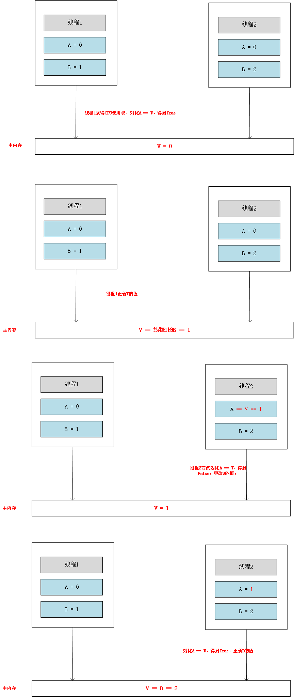

## CAS算法

java的锁机制中，我们知道有很多种锁，那可能最常听到的就是乐观锁和悲观锁。什么是悲观锁呢，就是假设一定会发生线程冲突，就像`synchronized`，rJDK.6之前他是一个重量级锁，每次线程进来，都会加锁，如果有其他线程进来，就阻塞，等待当前线程释放锁资源。还有一种就是乐观锁，它总是假设不会发生线程冲突，如果真的发生线程冲突，他就开始`自旋`模式，进行重试，直到当前线程运行结束。


## CAS算法的主要原理



上图中A：主内存中V值的副本、B：更改的目标值、V：内存中的值

当线程1和线程2同步更新主内存的时候，假设线程1得到了CPU使用权，首先他会读取V的值和A作比较，发现`A = V`，那么线程1就可以将B的值更新到主内存中，此时，`V = B = 1`，然后线程1运行完毕。在这个过程中，线程2是没有阻塞的，他是在一个死循环中进行自旋，一直等着线程1释放CPU，一旦线程1释放CPU，他立马获取到CPU使用权，然后会拿他的A去和V作比较，发现`A != V`，证明V已经被更改过了，那么线程2就会重新读取V的值，刷新给A，然后在重复上一步，发现此时`A = V`，那么就可以更新`V = 2`


## java中的CAS算法

java的Concurrent包下很多类都用到了CAS算法，例如`AtomicInteger`、`AtomicBoolean`等原子类，我们以`AtomicInteger`为例来看他的CAS算法实现：

```java
public final int getAndAdd(int delta) {
    return unsafe.getAndAddInt(this, valueOffset, delta);
}

public final int getAndAddInt(Object var1, long var2, int var4) {
    int var5;
    do {
        // 这里相当于一直循环尝试获取主内存中的V值
        var5 = this.getIntVolatile(var1, var2);
    } while(!this.compareAndSwapInt(var1, var2, var5, var5 + var4));

    return var5;
}
```


## CAS算法的问题

### ABA问题


以上图为例，线程1修改了V的值为1，但是线程3又把他改回去了，导致线程2读到V的值，看着没有改变，实际已经经过了线程3改变了。解决这个问题的方法是每次更新V的值时，在加一个版本号记录每次的修改。

### 循环时间长

如果竞争特别激烈，线程一直通过自旋的方式获取V值，也是对性能的一个考验。

