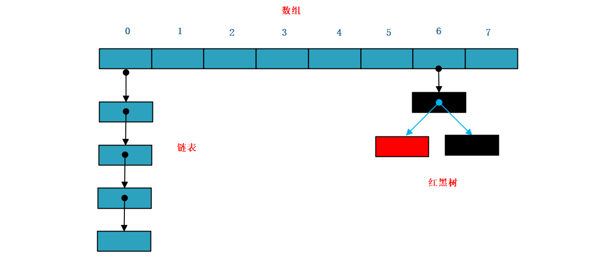
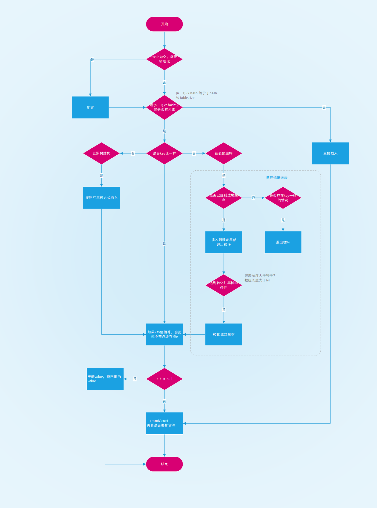
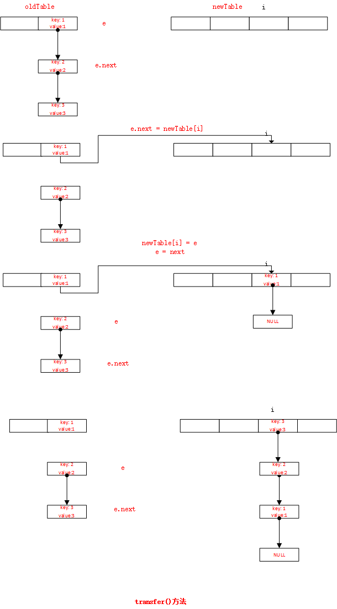
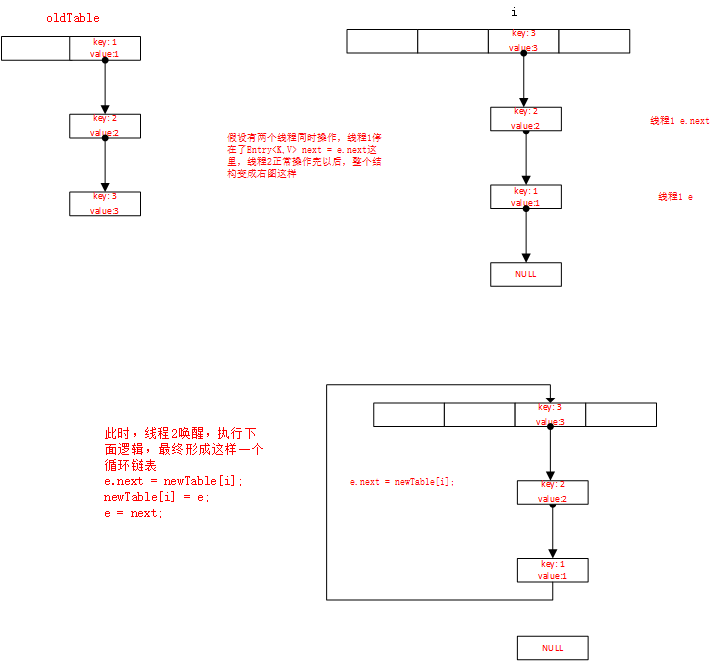

# HashMap源码解读

## 底层数据结构（JDK1.8）



HashMap是java对哈希表的一种实现，他保持了哈希表存储key-value键值对的特点，可以通过key快速获取value。他的插入过程大概分为以下几个步骤：

1. 开辟一个数组空间，当插入一个元素时，首先通过hashCode(key)这个方法获取一个hash值，假如是0，那么这个元素就被插入到上面图例中的0这个位置。

2. 假设再进来一个元素key1-value1，通过我们设计的hashCode(key1)求得的hash值和hashCode(key)相等`（哈希冲突）`，这个时候0这个位置已经有元素了，怎么办呢，那就在0这个位置加一个`链表`，将新来的第二个元素存入这个链表`（链地址法）`。

3. 当这个链表数据越来越多，多到一定程度时候，链表这种数据结构的缺点就暴露出来了，由于向链表的查询效率是`O(N)`，会导致HashMap的性能出现问题。所以JDK1.8之后，引入了`红黑树`。红黑树是一种高度平衡的二叉查找树，他的查找和插入的时间复杂度都是`O(logN)`，可以很好的解决性能问题。那么为什么不一开始就用红黑树，而是当数据到达一定程度时候再用红黑树呢？原因一是红黑树虽然时间复杂度优于链表，但是结构复杂，需要的空间比链表多；原因二是红黑树虽然时间复杂度很低，但是为了达到红黑树的平衡，经常需要进行一系列的`左旋`、`右旋`，也会花费时间。所以其实数据不多的时候用链表是比较好的。

   

## 基本属性定义

```java
 // 初始容量为 16，
 static final int DEFAULT_INITIAL_CAPACITY = 1 << 4;

 // 最大容量
 static final int MAXIMUM_CAPACITY = 1 << 30;

 // 扩容系数
 static final float DEFAULT_LOAD_FACTOR = 0.75f;
 
 // 链表转化成红黑树的边界值
 static final int TREEIFY_THRESHOLD = 8;

 // 当数组容量大于 64 时，链表才会转化成红黑树
 static final int MIN_TREEIFY_CAPACITY = 64;

 // 记录迭代过程中 HashMap 结构是否发生变化，如果有变化，迭代时会 fail-fast
 transient int modCount;

 // HashMap的实际大小
 transient int size;

 // 存放数据的数组
 transient Node<K,V>[] table;

 // 扩容的阈值，有两种情况
 // 如果初始化时，给定数组大小的话，通过 tableSizeFor 方法计算，数组大小永远接近于 2 的幂次方，比如你给定初始化大小 19，实际上初始化大小为 32，为 2 的 5 次方。
 // 如果是通过 resize 方法进行扩容，大小 = 数组容量 * 0.75
 int threshold;
```


## put()方法

```java
final V putVal(int hash, K key, V value, boolean onlyIfAbsent,
               boolean evict) {
    Node<K,V>[] tab; Node<K,V> p; int n, i;
    // 如果为空，则进行扩容
    if ((tab = table) == null || (n = tab.length) == 0)
        n = (tab = resize()).length;
    
    // 通过hash % table.size的方法取得元素保存的位置i，判断i位置是否有元素，
    // 没有则直接插入，有则说明发生了哈希冲突，到else分支
    if ((p = tab[i = (n - 1) & hash]) == null)
        tab[i] = newNode(hash, key, value, null);
    else {
        Node<K,V> e; K k;
        // 如果新传入的key已经存在，先用临时变量将当前节点缓存起来
        if (p.hash == hash &&
            ((k = p.key) == key || (key != null && key.equals(k))))
            e = p;
        
        // 如果是红黑树，按照红黑树的方式插入
        else if (p instanceof TreeNode)
            e = ((TreeNode<K,V>)p).putTreeVal(this, tab, hash, key, value);
        
        // 如果是链表
        else {
            for (int binCount = 0; ; ++binCount) {
                // 看是否已经到了链表的尾节点，是的话插入到尾节点
                if ((e = p.next) == null) {
                    p.next = newNode(hash, key, value, null);
                    // 达到转化成红黑树的阈值，则进行转化，到这一步，插入完成，结束循环
                    if (binCount >= TREEIFY_THRESHOLD - 1) // -1 for 1st
                        treeifyBin(tab, hash);
                    break;
                }
                // 遍历的时候还要看key是否一样，是的话也退出当前循环，把节点用e缓存起来
                if (e.hash == hash &&
                    ((k = e.key) == key || (key != null && key.equals(k))))
                    break;
                // 更新p节点，指向下一个节点，用来遍历
                p = e;
            }
        }
        
        // 满足这个条件说明找到了插入的位置，但是该位置有数据，就判断是否覆盖
        if (e != null) { // existing mapping for key
            V oldValue = e.value;
            if (!onlyIfAbsent || oldValue == null)
                e.value = value;
            afterNodeAccess(e);
            return oldValue;
        }
    }
    // 记录hashMap被修改了一次
    ++modCount;
    // 如果size > 扩容阈值，就扩容
    if (++size > threshold)
        resize();
    afterNodeInsertion(evict);
    return null;
}
```

整个流程大致如下



put方法的几点说明

1. 为什么用`(n - 1) & hash`来计算索引位置。三个原因

   1. 减少哈希冲突

      ```
      假设n = 16, n - 1 = 15 --> 0000 1111和下面两个数进行&操作得到的结果如下
      0000 1111 &
      0000 0001 --- 0000 0001
      0011 0000 --- 0000 0000
      
      假设n = 15, n - 1 = 14 --> 0000 1110和下面两个数进行&操作得到的结果如下
      0000 1110 &
      0000 0001 --- 0000 0000
      0011 0000 --- 0000 0000
      
      明显当n为2的倍数时候，(n - 1) & hash相当于hash / n, 能大大减少hash冲突的概率
      ```

      

   2. 提高运算速度，计算机最快的运算是位移操作

   3. 减少内存碎片，计算机中都是以2的倍数为单位的，所以定义成2的次方这种书有助于充分利用内存

2. 链表什么时候会转换成红黑树，两个条件

   ```java
   // 红黑树和链表转化的边界值，为什么是8, 是根据泊松分布算出来的
   static final int TREEIFY_THRESHOLD = 8;
   
   // 条件1 达到边界值
   if (binCount >= TREEIFY_THRESHOLD - 1)
       treeifyBin(tab, hash);
   
   // 条件2 数组的长度大于64，否则只扩容
   if (tab == null || (n = tab.length) < MIN_TREEIFY_CAPACITY)
       resize();
   ```


## resize()方法

```java
final Node<K,V>[] resize() {
    Node<K,V>[] oldTab = table;
    int oldCap = (oldTab == null) ? 0 : oldTab.length;
    int oldThr = threshold;
    int newCap, newThr = 0;
    
    // if (++size > threshold)
    //     resize();
    // 从这里调用过来的
    if (oldCap > 0) {
        // 容量超过最大值，不扩容了
        if (oldCap >= MAXIMUM_CAPACITY) {
            threshold = Integer.MAX_VALUE;
            return oldTab;
        }
        // 否则扩容两倍
        else if ((newCap = oldCap << 1) < MAXIMUM_CAPACITY &&
                 oldCap >= DEFAULT_INITIAL_CAPACITY)
            newThr = oldThr << 1; // double threshold
    }
    // if ((tab = table) == null || (n = tab.length) == 0)
    //     n = (tab = resize()).length;
    // 这里调用过来，说明是第一次添加元素初始化来的，如果指定了threshold，采用用户指定的，如果没有，走else，采用默认的
    else if (oldThr > 0) // initial capacity was placed in threshold
        newCap = oldThr;
    else {               // zero initial threshold signifies using defaults
        newCap = DEFAULT_INITIAL_CAPACITY;
        newThr = (int)(DEFAULT_LOAD_FACTOR * DEFAULT_INITIAL_CAPACITY);
    }
    
    if (newThr == 0) {
        float ft = (float)newCap * loadFactor;
        newThr = (newCap < MAXIMUM_CAPACITY && ft < (float)MAXIMUM_CAPACITY ?
                  (int)ft : Integer.MAX_VALUE);
    }
    threshold = newThr;
    @SuppressWarnings({"rawtypes","unchecked"})
    Node<K,V>[] newTab = (Node<K,V>[])new Node[newCap];
    table = newTab;
    // 将oldTable的数组转移到newTable
    if (oldTab != null) {
        for (int j = 0; j < oldCap; ++j) {
            Node<K,V> e;
            if ((e = oldTab[j]) != null) {
                oldTab[j] = null;
                // 单纯的数组
                if (e.next == null)
                    newTab[e.hash & (newCap - 1)] = e;
                // 红黑树的结构
                else if (e instanceof TreeNode)
                    ((TreeNode<K,V>)e).split(this, newTab, j, oldCap);
                // 链表的结构
                else { // preserve order
                    Node<K,V> loHead = null, loTail = null;
                    Node<K,V> hiHead = null, hiTail = null;
                    Node<K,V> next;
                    do {
                        next = e.next;
                        if ((e.hash & oldCap) == 0) {
                            if (loTail == null)
                                loHead = e;
                            else
                                loTail.next = e;
                            loTail = e;
                        }
                        else {
                            if (hiTail == null)
                                hiHead = e;
                            else
                                hiTail.next = e;
                            hiTail = e;
                        }
                    } while ((e = next) != null);
                    if (loTail != null) {
                        loTail.next = null;
                        newTab[j] = loHead;
                    }
                    if (hiTail != null) {
                        hiTail.next = null;
                        newTab[j + oldCap] = hiHead;
                    }
                }
            }
        }
    }
    return newTab;
}
```


## get()方法

```java
final Node<K,V> getNode(int hash, Object key) {
    Node<K,V>[] tab; Node<K,V> first, e; int n; K k;
    if ((tab = table) != null && (n = tab.length) > 0 &&
        (first = tab[(n - 1) & hash]) != null) {
        // 首先检查数组第一个元素是否要寻找的元素
        if (first.hash == hash && // always check first node
            ((k = first.key) == key || (key != null && key.equals(k))))
            return first;
        if ((e = first.next) != null) {
            // 从红黑树中查找
            if (first instanceof TreeNode)
                return ((TreeNode<K,V>)first).getTreeNode(hash, key);
            // 遍历链表
            do {
                // hash 冲突时，需要通过 equals 方法来比较 key 是否相等
                if (e.hash == hash &&
                    ((k = e.key) == key || (key != null && key.equals(k))))
                    return e;
            } while ((e = e.next) != null);
        }
    }
    return null;
}
```


## HashMap  JDK1.7和JDK1.8的区别

JDK1.7中采用数组加单链表的方式实现，且链表的插入方法是头插法，每个节点用一个key-value的Entry的内部类维护，所以JDK1.7中HashMap实际就是一个存储着`Entry`的数组加多个存储`Entry`的单链表

JDK1.8采用数组+链表+红黑树的数据结构，插入方法用的是尾插法，每个节点用一个`Node`结构维护

```java
// Entry的结构
static class Entry<K,V> implements Map.Entry<K,V> {
    final K key;  // 键
    V value;  // 值
    Entry<K,V> next; // 指向下一个节点
    int hash;  // hash值
}
```

```java
// Node的结构
static class Node<K,V> implements Map.Entry<K,V> {
    final int hash;
    final K key;
    V value;
    Node<K,V> next;
}
```


## JDK1.7 HashMap中头插法的循环链表的bug

JDK1.7中扩容的核心代码如下，主要实现将oldTable中的数据迁移到newTable。代码如下：

```java
void transfer(Entry[] newTable, boolean rehash) {
    int newCapacity = newTable.length;
    for (Entry<K,V> e : table) {
        while(null != e) {
        	//1， 获取旧表的下一个元素
            Entry<K,V> next = e.next;
            if (rehash) {
                e.hash = null == e.key ? 0 : hash(e.key);
            }
            int i = indexFor(e.hash, newCapacity);
            e.next = newTable[i];
            newTable[i] = e;
            e = next;
        }
    }
}
```

执行流程如下：



在单线程情况下，这段代码是可以正常运行的，这没什么问题，但是如果有两个线程同时执行这段代码，假设有线程1和线程2同时进来，线程1停在了Entry<K,V> next = e.next这里，那么e指向key:1这个节点，next指向key:2这个节点。然后线程2正常执行，实现了我么上面讨论的预期效果。此时线程1被唤醒，执行e.next = newTable[i]，最终形成了我们下面所说的一个循环链表。



##  HashMap 和 HashTable 的区别

HashMap 是 JDK1.2 才出现的；HashTable 是 JDK1.0 就出现的

1. HashMap 是线程不安全的，HashTable 中所有方法都加了 synchronized 关键字所以是线程安全的

2. HashMap 的键需要重新计算对象的 hash 值，而 HashTable 直接使用对象的 hashCode。

3. HashMap 的值和键都可以为 null，HashTable 的值和键都不能为 null。

4. HashMap 的数组的默认初始化大小为 16，HashTable 为 11；HashMap 扩容时会扩大两倍，HashTable 扩大两倍 + 1；