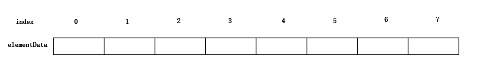
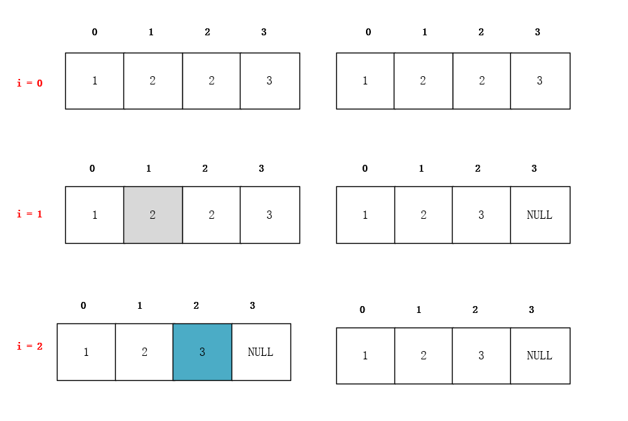

# ArrayList源码解读

## 底层数据结构



ArrayList是在底层维护了一个elementData数组，添加了自动扩容等功能，最终形成了一个动态数组。


## 基本属性

```java
// 初始化大小
private static final int DEFAULT_CAPACITY = 10;

// 初始化一个空数组
private static final Object[] DEFAULTCAPACITY_EMPTY_ELEMENTDATA = {};

// 底层存放数据的数组
transient Object[] elementData;

// list的实际大小
private int size;
```


## 初始化

```java
/**
  * 指定大小初始化
  */
public ArrayList(int initialCapacity) {
    if (initialCapacity > 0) {
        this.elementData = new Object[initialCapacity];
    } else if (initialCapacity == 0) {
        this.elementData = EMPTY_ELEMENTDATA;
    } else {
        throw new IllegalArgumentException("Illegal Capacity: "+
                                           initialCapacity);
    }
}

/**
  * 无参数初始化，直接初始化一个空的数组
  */
public ArrayList() {
    this.elementData = DEFAULTCAPACITY_EMPTY_ELEMENTDATA;
}

/**
  * 指定数据初始化
  */
public ArrayList(Collection<? extends E> c) {
    // 转化成数组
    elementData = c.toArray();
    // 如果有数据，
    if ((size = elementData.length) != 0) {
        // 如果集合元素类型不是 Object 类型，我们会转成 Object
        if (elementData.getClass() != Object[].class)
            elementData = Arrays.copyOf(elementData, size, Object[].class);
    } else {
        // 如果没有数据，初始化为空数组
        this.elementData = EMPTY_ELEMENTDATA;
    }
}
```


## add()方法

```java
public boolean add(E e) {
    // 判断是否需要扩容
    ensureCapacityInternal(size + 1);  // Increments modCount!!
    // 赋值操作
    elementData[size++] = e;
    return true;
}

private void ensureCapacityInternal(int minCapacity) {
    if (elementData == DEFAULTCAPACITY_EMPTY_ELEMENTDATA) {
        minCapacity = Math.max(DEFAULT_CAPACITY, minCapacity);
    }

    ensureExplicitCapacity(minCapacity);
}

private void ensureExplicitCapacity(int minCapacity) {
    // 记录数组被修改
    modCount++;

    // 如果需要的容量大于当前数组的容量，说明要扩容
    if (minCapacity - elementData.length > 0)
        grow(minCapacity);
}

private void grow(int minCapacity) {
    int oldCapacity = elementData.length;
    // 1.5倍扩容
    int newCapacity = oldCapacity + (oldCapacity >> 1);
    // 1.5倍算出来的数还是不够，就用我们期望值minCapacity
    if (newCapacity - minCapacity < 0)
        newCapacity = minCapacity;
    // 如果新容量大于jvm能分配的最大值，就去Interger的最大值
    if (newCapacity - MAX_ARRAY_SIZE > 0)
        newCapacity = hugeCapacity(minCapacity);
    // 复制数组的方式扩容
    elementData = Arrays.copyOf(elementData, newCapacity);
}

private static int hugeCapacity(int minCapacity) {
    if (minCapacity < 0) // overflow
        throw new OutOfMemoryError();
    return (minCapacity > MAX_ARRAY_SIZE) ?
        Integer.MAX_VALUE :
    MAX_ARRAY_SIZE;
}
```


## remove()

```java
// 根据值删除
public boolean remove(Object o) {
    // 如果为null，删除第一个为null的元素
    if (o == null) {
        for (int index = 0; index < size; index++)
            if (elementData[index] == null) {
                fastRemove(index);
                return true;
            }
    } else {
        // 如果不为null，遍历数组，删除找到的第一个元素
        for (int index = 0; index < size; index++)
            if (o.equals(elementData[index])) {
                fastRemove(index);
                return true;
            }
    }
    return false;
}

private void fastRemove(int index) {
    // 记录list发生一次改变
    modCount++;
    // 删除index位置的元素，要从后面移动到前面的元素数量
    int numMoved = size - index - 1;
    if (numMoved > 0)
        // 将index+1开始往后的元素拷贝到index位置开始
        System.arraycopy(elementData, index+1, elementData, index,
                         numMoved);
    elementData[--size] = null; // clear to let GC do its work
}
```


## 遍历集合时候错误的删除方法

###  for循环遍历删除

```java
public static void main(String[] args) {
    List array = new ArrayList();
    array.add("1");
    array.add("2");
    array.add("2");
    array.add("3");

    for (int i = 0; i < array.size(); i++) {
        if ("2".equals(array.get(i))) {
            array.remove("2");
        }
    }

    for (int i = 0; i < array.size(); i++) {
        System.out.print(array.get(i) + "---");
    }
}

// 输出：1---2---3---
```



这种格式不能正常删除，原因如图所示：在`i = 2`的时候，本来位于2位置的元素是2，但现在已经移动到了1的位置，所以删不掉


### 增强for循环遍历删除

```java
public static void main(String[] args) {
    List<String> array = new ArrayList<>();
    array.add("1");
    array.add("2");
    array.add("2");
    array.add("3");

    for (String s: array) {
        if ("2".equals(s)) {
            array.remove("2");
        }
    }

    for (int i = 0; i < array.size(); i++) {
        System.out.print(array.get(i) + "---");
    }
}

------输出
Exception in thread "main" java.util.ConcurrentModificationException
	at java.util.ArrayList$Itr.checkForComodification(ArrayList.java:901)
	at java.util.ArrayList$Itr.next(ArrayList.java:851)
	at Main.main(Main.java:15)
```

增强for循环底层是通过Iterator实现的，当foreach通过next取下一个元素时候，首先检查`        checkForComodification(); `，发现是相等的，那么执行删除，结果在删除的时候会修改`modCount`，导致下一次在进来到`modCount != expectedModCount`这一行的时候发现不相等了，所以抛出异常`throw new ConcurrentModificationException();`，这种机制叫`fail-fast`。

```java
// ArrayList对迭代器的实现，我们这里只粘了一部分相关的代码
private class Itr implements Iterator<E> {
    int expectedModCount = modCount; // expectedModCount的值
    
    @SuppressWarnings("unchecked")
    public E next() {
        checkForComodification(); // 检查modCount != expectedModCount
        int i = cursor;
        if (i >= size)
            throw new NoSuchElementException();
        Object[] elementData = ArrayList.this.elementData;
        if (i >= elementData.length)
            throw new ConcurrentModificationException();
        cursor = i + 1;
        return (E) elementData[lastRet = i];
    }

    public void remove() {
        if (lastRet < 0)
            throw new IllegalStateException();
        checkForComodification();

        try {
            ArrayList.this.remove(lastRet);
            cursor = lastRet;
            lastRet = -1;
            expectedModCount = modCount;
        } catch (IndexOutOfBoundsException ex) {
            throw new ConcurrentModificationException();
        }
    }

    final void checkForComodification() {
        if (modCount != expectedModCount)
            throw new ConcurrentModificationException();
    }
}
```

### 正确的删除方法

```java
public static void main(String[] args) {
    List<String> array = new ArrayList<>();
    array.add("1");
    array.add("2");
    array.add("2");
    array.add("3");

    Iterator<String> iterator = array.iterator();
    while (iterator.hasNext()) {
        String next = iterator.next();
        if ("2".equals(next)) {
            iterator.remove();
        }
    }

    for (int i = 0; i < array.size(); i++) {
        System.out.print(array.get(i) + "---");
    }
}
```

通过迭代器的remove()方法删除，看上面迭代器的代码，其中删除方法中有这样一行代码`expectedModCount = modCount;`，对`expectedModCount `重新进行赋值，避免了`fail-fast`。

