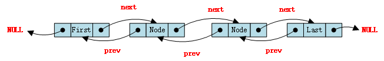
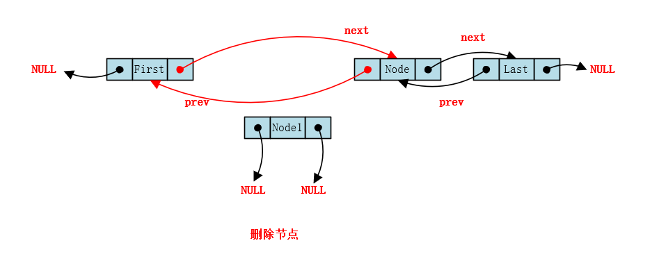

# LinkedList源码解读

## 底层数据结构



LinkedList底层维护了一个双向链表，每个节点包括一个前驱指针和后继指针

```java
private static class Node<E> {
    E item; // 实际数据
    Node<E> next;  // 前驱节点
    Node<E> prev;  // 后继节点

    Node(Node<E> prev, E element, Node<E> next) {
        this.item = element;
        this.next = next;
        this.prev = prev;
    }
}
```


## 构造方法

```java
// 无参构造器
public LinkedList() {
}

// 给定数据初始化
public LinkedList(Collection<? extends E> c) {
    this();
    addAll(c);
}

public boolean addAll(int index, Collection<? extends E> c) {
    checkPositionIndex(index);

    Object[] a = c.toArray();
    int numNew = a.length;
    if (numNew == 0)
        return false;
	
    // index位置的前置节点、后继节点
    Node<E> pred, succ;
    if (index == size) {
        succ = null; // 后继节点为null 
        pred = last; // 前置节点应该是当前链表中最后一个节点
    } else {
        succ = node(index); // index位置的节点作为后继节点
        pred = succ.prev;   // index位置的的前一个节点作为前置节点
    }

    // 循环遍历数组
    for (Object o : a) {
        @SuppressWarnings("unchecked") E e = (E) o;
        Node<E> newNode = new Node<>(pred, e, null);
        if (pred == null)
            first = newNode;
        else
            pred.next = newNode;
        pred = newNode; // 定位到下一个节点，步进
    }

    // 后置节点如果是null。说明是在链表尾插入的，则设置尾节点
    if (succ == null) {
        last = pred;
    // 否则更新前置节点和后继节点
    } else {
        pred.next = succ;
        succ.prev = pred;
    }

    size += numNew;
    modCount++;
    return true;
}
```


## add()

```java
// 从头部添加的核心代码
private void linkFirst(E e) {
    final Node<E> f = first;
    final Node<E> newNode = new Node<>(null, e, f);
    first = newNode;
    if (f == null)
        last = newNode;
    else
        f.prev = newNode;
    size++;
    modCount++;
}

// 从尾部添加的核心代码
void linkLast(E e) {
    final Node<E> l = last;
    final Node<E> newNode = new Node<>(l, e, null);
    last = newNode;
    if (l == null)
        first = newNode;
    else
        l.next = newNode;
    size++;
    modCount++;
}

// 指定位置添加节点
public void add(int index, E element) {
    checkPositionIndex(index);

    if (index == size)
        linkLast(element);
    else
        linkBefore(element, node(index));
}

// 找到index位置的节点
Node<E> node(int index) {
    // assert isElementIndex(index);

    // 如果index < size / 2，从前往后找，否则从后往前找	
    if (index < (size >> 1)) {
        Node<E> x = first;
        for (int i = 0; i < index; i++)
            x = x.next;
        return x;
    } else {
        Node<E> x = last;
        for (int i = size - 1; i > index; i--)
            x = x.prev;
        return x;
    }
}

void linkBefore(E e, Node<E> succ) {
    // assert succ != null;
    final Node<E> pred = succ.prev;
    final Node<E> newNode = new Node<>(pred, e, succ);
    succ.prev = newNode;
    if (pred == null)
        first = newNode;
    else
        pred.next = newNode;
    size++;
    modCount++;
}
```


## remove()



链表删除节点Node1，如图所示，让First的的next指针指向Node，Node的prev指针指向First，Node的prev指针和next指针都指向null。这样Node1节点就从链表中删除了。

```java
public boolean remove(Object o) {
    if (o == null) {
        for (Node<E> x = first; x != null; x = x.next) {
            if (x.item == null) {
                unlink(x);
                return true;
            }
        }
    } else {
        for (Node<E> x = first; x != null; x = x.next) {
            if (o.equals(x.item)) {
                unlink(x);
                return true;
            }
        }
    }
    return false;
}

E unlink(Node<E> x) {
    // assert x != null;
    final E element = x.item;
    final Node<E> next = x.next;
    final Node<E> prev = x.prev;

    if (prev == null) {
        first = next;
    } else {
        prev.next = next;
        x.prev = null;
    }

    if (next == null) {
        last = prev;
    } else {
        next.prev = prev;
        x.next = null;
    }

    x.item = null;
    size--;
    modCount++;
    return element;
}
```