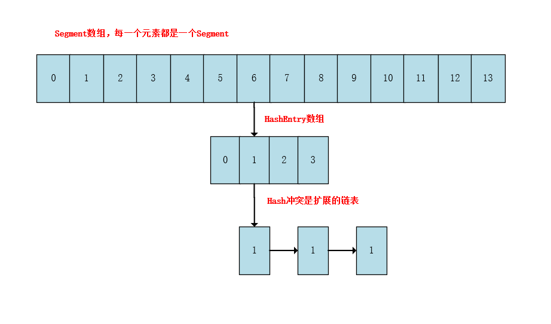

# 并发集合

## CopyOnWriteArrayList

```java
private transient volatile Object[] array;   // 通过volatile保证线程之间可见
```

###  add()

```java
public boolean add(E e) {
  	// 基于J.U.C的可重入锁，加锁
    final ReentrantLock lock = this.lock;
    lock.lock();
    try {
        Object[] elements = getArray();
        int len = elements.length;
        // 拷贝新数组，在新数组的基础上添加元素
        Object[] newElements = Arrays.copyOf(elements, len + 1);
        newElements[len] = e;
        // 在将旧数组指向新数组
        setArray(newElements);
        return true;
    } finally {
        lock.unlock();
    }
}
```


```java
// 指定位置添加元素
public void add(int index, E element) {
    final ReentrantLock lock = this.lock;
    lock.lock();
    try {
        Object[] elements = getArray();
        int len = elements.length;
        if (index > len || index < 0)
            throw new IndexOutOfBoundsException("Index: "+index+
                                                ", Size: "+len);
        Object[] newElements;
        int numMoved = len - index;
        if (numMoved == 0)
            newElements = Arrays.copyOf(elements, len + 1);
        else {
            // 拷贝新数组，把index位置的空下来
            newElements = new Object[len + 1];
            System.arraycopy(elements, 0, newElements, 0, index);
            System.arraycopy(elements, index, newElements, index + 1,
                             numMoved);
        }
        newElements[index] = element;
        setArray(newElements);
    } finally {
        lock.unlock();
    }
}
```


### remove()

```java
// 还是依赖ReentrantLock和数组拷贝完成
public boolean remove(Object o) {
    // 获取当前数组的快照和索引
    Object[] snapshot = getArray();
    int index = indexOf(o, snapshot, 0, snapshot.length);
    return (index < 0) ? false : remove(o, snapshot, index);
}

private boolean remove(Object o, Object[] snapshot, int index) {
    final ReentrantLock lock = this.lock;
    lock.lock();
    try {
        Object[] current = getArray();
        int len = current.length;
        // 再次确认最新的数组和我们的快照是一个数组，没有被改变
        if (snapshot != current) findIndex: {
            int prefix = Math.min(index, len);
            for (int i = 0; i < prefix; i++) {
                if (current[i] != snapshot[i] && eq(o, current[i])) {
                    index = i;
                    break findIndex;
                }
            }
            if (index >= len)
                return false;
            if (current[index] == o)
                break findIndex;
            index = indexOf(o, current, index, len);
            if (index < 0)
                return false;
        }
        // 通过数组拷贝的方式覆盖掉index位置的元素
        Object[] newElements = new Object[len - 1];
        System.arraycopy(current, 0, newElements, 0, index);
        System.arraycopy(current, index + 1,
                         newElements, index,
                         len - index - 1);
        setArray(newElements);
        return true;
    } finally {
        lock.unlock();
    }
}
```


### removeAll(Collection<?> c)

```java
public boolean removeAll(Collection<?> c) {
    if (c == null) throw new NullPointerException();
    final ReentrantLock lock = this.lock;
    lock.lock();
    try {
        Object[] elements = getArray();
        int len = elements.length;
        if (len != 0) {
            // temp array holds those elements we know we want to keep
            int newlen = 0;
            Object[] temp = new Object[len];
            // 遍历我们的原始数组，看每一个元素是不是在要删除的集合中，
            // 不在的话说明不删除，就把这个元素拷贝到一个临时数组，这就是删除后的结果了
            for (int i = 0; i < len; ++i) {
                Object element = elements[i];
                if (!c.contains(element))
                    temp[newlen++] = element;
            }
            if (newlen != len) {
                setArray(Arrays.copyOf(temp, newlen));
                return true;
            }
        }
        return false;
    } finally {
        lock.unlock();
    }
}
```

`CopyOnWriteArrayList`利用`J.U.C`的`ReentrantLock`+`数组拷贝`+`volatile`实现线程安全。那么他和`Vector`、`Collections.synchronizedList(list)`相比有什么优缺点呢？我们知道`Vector`和`Collections.synchronizedList(list)`实现线程安全的原理是在每一个方法都加了`synchronized`。所以总结一下这几个的优缺点吧：

1. `CopyOnWriteArrayList`实现的时候读的场景没加锁，写的场景利用`ReentrantLock`加锁。有助于提升读的效率使用`读多写少`的场景

2. 通过拷贝数组的方式实现同步，无疑是对空间是一种浪费。

3. `CopyOnWriteArrayList`有可能读到旧的数据，不能保证实时性。

4. `Collections.synchronizedList`可以包装各种List，扩展性好

5. `CopyOnWriteArrayList`的写性能很差，因为写的操作需要大量拷贝数组


## CopyOnWriteArraySet

我们知道`HashSet`是通过包装`HashMap`实现的，但是`CopyOnWriteArraySet`是在`CopyOnWriteArrayList`的基础上包装实现的，但是我们知道`CopyOnWriteArrayList`是可以重复的，但是`CopyOnWriteArraySet`应该具有`Set`的属性，不能重复的，那么怎么做到呢？我们看源码：

```java
// CopyOnWriteArraySet.java
public boolean add(E e) {
    return al.addIfAbsent(e);
}

// CopyOnWriteArrayList.java
public boolean addIfAbsent(E e) {
    Object[] snapshot = getArray();
    // 先判断该元素是否存在，不存在才去添加，存在就不添加了
    return indexOf(e, snapshot, 0, snapshot.length) >= 0 ? false :
    addIfAbsent(e, snapshot);
}
```

她和`CopyOnWriteArrayList`具有相同的优缺点，例如读写分离啊，线程安全啊


##  ConcurrentHashMap

JDK1.7中采用`Segment分段锁`的方式实现，底层是一个`Segment`数组，`Segment`是继承自`ReentrantLock`的，所以它具有加锁的功能，每个`Segment`中包括了`HashEntry`这样一个数组，这里就和`HashMap`一样了。由于使用了分段锁的技术，所以他支持高并发，假设当一个线程进来访问Segment0时，那么也不会影响其他线程访问Segment1。



JDK1.8中放弃了`Segement`技术，采用了`CAS`+`synchronized`来实现线程安全，他的`put()`方法大概分为以下几步：

1.  取得key的hash值
2.  看是不是还没初始化，没有初始化的话，得先去初始化
3.  如果初始化了的话，就通过hash / table.length的方法算出插入位置index，如果这个索引为空，说明可以插入，就利用CAS算法插入数据，失败的话去自旋
4.  上面条件都没走，看是不是的扩容，
5.  然后如果发生hash冲突，通过`synchronized`在往链表或者红黑树中插入

```java
final V putVal(K key, V value, boolean onlyIfAbsent) {
    if (key == null || value == null) throw new NullPointerException();
    // 1. 取得key的hash值
    int hash = spread(key.hashCode());
    int binCount = 0;
    for (Node<K,V>[] tab = table;;) {
        Node<K,V> f; int n, i, fh;
        if (tab == null || (n = tab.length) == 0)
            // 2. 初始化
            tab = initTable();
        else if ((f = tabAt(tab, i = (n - 1) & hash)) == null) {
            // 3. cas算法往i位置插入元素，线程安全
            if (casTabAt(tab, i, null,
                         new Node<K,V>(hash, key, value, null)))
                break;                   // no lock when adding to empty bin
        }
        else if ((fh = f.hash) == MOVED)
            // 4. 扩容
            tab = helpTransfer(tab, f);
        else {
            V oldVal = null;
            // 5. 加锁
            synchronized (f) {
                if (tabAt(tab, i) == f) {
                    if (fh >= 0) {
                        binCount = 1;
                        for (Node<K,V> e = f;; ++binCount) {
                            K ek;
                            if (e.hash == hash &&
                                ((ek = e.key) == key ||
                                 (ek != null && key.equals(ek)))) {
                                oldVal = e.val;
                                if (!onlyIfAbsent)
                                    e.val = value;
                                break;
                            }
                            // 6. 链表的插入
                            Node<K,V> pred = e;
                            if ((e = e.next) == null) {
                                pred.next = new Node<K,V>(hash, key,
                                                          value, null);
                                break;
                            }
                        }
                    }
                    // 7. 红黑树的插入
                    else if (f instanceof TreeBin) {
                        Node<K,V> p;
                        binCount = 2;
                        if ((p = ((TreeBin<K,V>)f).putTreeVal(hash, key,
                                                              value)) != null) {
                            oldVal = p.val;
                            if (!onlyIfAbsent)
                                p.val = value;
                        }
                    }
                }
            }
            if (binCount != 0) 
                // 判断红黑树和链表的转化
                if (binCount >= TREEIFY_THRESHOLD)
                    treeifyBin(tab, i);
                if (oldVal != null)
                    return oldVal;
                break;
            }
        }
    }
    addCount(1L, binCount);
    return null;
}
```

而`get()`方法和HashMap是类似的，无非分为以下几步：

1.  根据hashCode在数组寻址，
2.  如果是红黑树按照红黑树查
3.  否则按照链表查找

HashMap其他的线程安全的替代工具还有`HashTable`、`Collections.synchronizedMap()`包装的map。但是这两者效率都不是很高，他们都在每个方法上加了锁。


## 快速失败与安全失败

快速失败和安全失败是 java 集合的两种错误机制。单线程情况下，遍历集合时去执行增删等改变集合结构的操作或者多线程情况下，一个线程遍历集合，另一个线程执行增删等改变集合结构的操作，都会引起异常，这时候就有两种策略：

- 快速失败：失败时立即报错，抛出 ConcurrentModificationException 异常，java.util 包下面的集合类使用这种机制；
- 安全失败：失败时直接忽略，java.util.concurrent包下面的集合类使用这种机制。