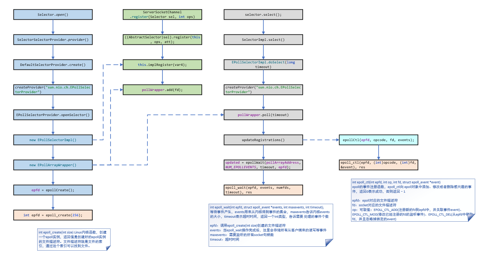

# BIO、基于Epoll的NIO和Reactor线程模型

## 几个基本概念

IO就是Input Output，我们从网络接受数据，放到内存，然后处理后输出到其他介质，这就是一个IO的过程。要理解Java的IO模型，我们需要先理解一下几个概念。

- 同步：客户端发起调用，服务端在处理完之前，是不会通知客户端的，只有处理完成后，才会通知客户端，给客户端想要的结果
- 异步：客户端发起调用，服务端先告诉客户端我收到了你的请求，你先忙其他事情吧，我处理好了告诉你
- 阻塞：客户端发起调用，一直等待服务端的结果，被阻塞住，无法做其他的事情
- 非阻塞：客户端发起调用，但是客户端在等服务端的结果的时候，可以做其他事情，不是阻塞的

因此说，同步和异步主要是针对服务端的通知方式而言的，而阻塞非阻塞是针对客户端而言的。然后我们结合一个例子再来深入理解下这几个概念。以前我等班车的时候，只能干等着，班车不会通知我，我也不敢走开，这就叫同步阻塞。后来，车站附近开了彩票店，我会在等车的时候去彩票店刮彩票，但是怕错过车，所以隔几分钟就跑出来看一下，这叫同步非阻塞。后来有了车来了的App，我可以设置到站提醒，他会在车到站后提醒我，但是我还是傻傻的在车站等着，这就叫异步阻塞。那如果我开了到站提醒，然后去旁边的彩票店刮彩票，等车来了App提醒我车到了，我在跑去车站，就叫异步非阻塞。Java中给我们提供了**BIO(同步阻塞IO)**、**NIO(同步非阻塞IO)**、**AIO(异步非阻塞IO)**。

## BIO(Blocking IO)

BIO是一种同步阻塞的IO模型，数据的读取和写入会阻塞在一个线程上。BIO程序可以有两种基本模型

1. 服务端只有一个线程处理，这样的话，会导致大量的请求被阻塞，类似客人去饭店吃饭，这种相当于去很多客人，但是只有一个服务员，招待完一个，在招待下一个。这样的弊端是大量的请求被阻塞，服务器的并发度上不去，也就是大量的客人站在门口排队，你想想会不会很生气。
2. 服务端为每一个socket创建一个线程去处理，接着上面的例子，类似来一个客人，安排一个服务员，期间一个服务员只负责招待一个客人。这样的话，有两个弊端：
   1. 每次有一个客户端连接都创建一个线程去处理，并且是阻塞的，那么如果有的客户端只是连接而不发送数据，则是一种资源浪费。比如有些客人只是来看看菜单，一看半天，我们还安排一个服务员一直伺候他，这合理吗？
   2. 如果基于上述情况，并且同时有大量客户端连接，则会造成服务器创建大量线程，负载过大。比如一时间来100个客人，你也安排100个服务员，酒楼还好，如果你是个早餐店，不得撑爆了。


代码示例：

```java
public static void main(String[] args) throws IOException {
    ServerSocket serverSocket = new ServerSocket(8080);
    while (true) {
        log.info("wait client connect...");
        // 这个方法会阻塞直到有客户端连接
        final Socket clientSocket = serverSocket.accept();
        log.info("client connected...");

        // 每次有一个socket连接，都分配一个线程去负责处理，这个处理也是阻塞的
        new Thread(() -> {
            try {
                handler(clientSocket);
            } catch (IOException e) {
                e.printStackTrace();
            }
        }).start();
    }
}

private static void handler(Socket clientSocket) throws IOException {
    byte[] bytes = new byte[1024];
    log.info("wait read...");
    // 这一行方法会阻塞，直到客户端收到数据
    int read = clientSocket.getInputStream().read(bytes);
    log.info("read form client success...");
    if (read != -1) {
        log.info("accept data form client：" + new String(bytes, 0, read));
    }
    clientSocket.getOutputStream().write("HelloClient".getBytes());
    clientSocket.getOutputStream().flush();
}
```

## NIO模型(Non Blocking IO)

### 基础版本

上述BIO模型最大的问题就是阻塞，多线程资源浪费，因此为了解决上面问题，我们先实现一个基于NIO的简单版本

```java
static List<SocketChannel> channelList = new ArrayList<>();

public static void main(String[] args) throws IOException {
    ServerSocketChannel serverSocket = ServerSocketChannel.open();
    serverSocket.socket().bind(new InetSocketAddress(8080));
    serverSocket.configureBlocking(false);
    log.info("服务启动成功");

    while (true) {
        SocketChannel socketChannel = serverSocket.accept();
        if (null != socketChannel) {
            log.info("连接成功");
            // 设置非阻塞，将每一个socketChannel先放到一个全局的list
            socketChannel.configureBlocking(false);
            channelList.add(socketChannel);
        }

        // 遍历连接进行数据读取
        Iterator<SocketChannel> iterator = channelList.iterator();
        while (iterator.hasNext()) {
            SocketChannel channel = iterator.next();
            ByteBuffer byteBuffer = ByteBuffer.allocate(128);
            int read = channel.read(byteBuffer);
            if (read > 0) {
                log.info("接收到消息：" + new String(byteBuffer.array()));
            } else if (read == -1) { // 如果客户端断开，把socket从集合中去掉
                iterator.remove();
                log.info("客户端断开连接");
            }
        }
    }
}
```

上述代码中，如果有客户端连接我们不会阻塞，而是先放到一个全局的List中，然后不断的循环遍历整个List，如果发现这个List有数据读写，我们就接受数据进行处理。这个如果以饭店的例子作比较，就相当于现在如果来了可客人，您先坐着看菜单，喝茶水，我只有一个服务员，过一会我就一个一个来问，客官您要不要点菜啊。这样优化后虽然只用一个线程就解决了多个线程阻塞，导致资源浪费的问题。但是依然有他的缺点：

1. 如果我们有1000个连接在channelList中，那么每次的迭代都需要遍历这1000个连接，但是也许可能这1000个连接中只有一个链接有数据发送到Server，那么这个遍历的过程也是很耗费性能的。

### 多路复用器

那么结合上面的例子，如果你是老板，那么聪明的你，准备如何干啊，那肯定是不能让店小二一个一个问啊，那么我们可以让有需求的顾客看好了在通知店小二，或者如果那个客人看好了菜单，就坐到点菜区，然后小二每次只要去点菜区域一个一个问要点什么菜就OK。我们知道NIO通过Selector多路复用器为我们实现了一种同步非阻塞的IO模型很好的解决了上面的问题，那么我们一起看看是如何解决的。想学习NIO，要知道NIO的三大核心组件。

1. Buffer(缓冲区)

Buffer是一个抽象类，他的子类有`ByteBuffer`、`CharBuffer`、`LongBuffer`等。他的底层是一个数组，可以通过`allocate(int capacity)`方法创建一个指定容量的Buffer。


1. Channel(通道)

Channel表示IO源和目标打开的链接，类似于传统意义的流，Channel本身不能读写数据，每一个Channel会和Buffer对应起来。常见的Channel有`FileChannel(读取、写入、映射和操作文件的通道)`、`SocketChannel(读写网络中的数据)`、`ServerSocketChannel(监听连接，对每一个连接都会创建一个SocketChannel)`

1. Selector(多路复用器)

Selector是NIO的核心，可以通过`Selector.open()`方法传建一个Selector。然后还用到了到了`Selector`的相关三个重要Api：`open()`、`serverSocket.register(selector, SelectionKey.OP_ACCEPT);`和`selector.select();`。所以我们要理解`Selector`的原理，必须要知道这三个api是干啥的。这里给出了一段基本代码以及总结了一张图，供参考。

代码示例：

```java
public static void main(String[] args) throws IOException {
    ServerSocketChannel serverSocket  = ServerSocketChannel.open();
    serverSocket.socket().bind(new InetSocketAddress(9000));
    serverSocket.configureBlocking(false);
    // 1. 创建一个Selector
    Selector selector = Selector.open();
    // 2. 将socket注册到Selector上
    SelectionKey selectionKey = serverSocket.register(selector, SelectionKey.OP_ACCEPT);
    log.info("服务启动成功");

    while (true) {
        // 3. 阻塞方法，如果我们注册的事件有发生，就会结束阻塞，往下走，就像上面我们注册了接受客户端连接的事件，那么这种事件发生后就会结束阻塞往下走
        selector.select();

        // 获取所有的SelectionKey，每一个SelectionKey和每一个socket是绑定的，通过他可以获取到对应的socket
        // 这里获取的只是我们注册过，关心的就绪事件列表，解决了上面说的需要循环遍历所有socket的弊端
        Set<SelectionKey> selectionKeys = selector.selectedKeys();
        Iterator<SelectionKey> iterator = selectionKeys.iterator();

        while (iterator.hasNext()) {
            SelectionKey key = iterator.next();
            if (key.isAcceptable()) {
                // 通过SelectionKey拿到这个socket的事件类型，如果是accept，那么表示客户端连接成功，我们给对应的socket注册读事件
                ServerSocketChannel server = (ServerSocketChannel)key.channel();
                SocketChannel socketChannel = server.accept();
                socketChannel.configureBlocking(false);
                socketChannel.register(selector, SelectionKey.OP_READ);
                log.info("客户端连接成功");
            } else if (key.isReadable()) {
                SocketChannel socketChannel = (SocketChannel)key.channel();
                ByteBuffer byteBuffer = ByteBuffer.allocate(128);
                int read = socketChannel.read(byteBuffer);
                if (read > 0) {
                    log.info("接收到消息：" + new String(byteBuffer.array()));
                } else if (read == -1) { // 如果客户端断开连接，关闭Socket
                    log.info("客户端断开连接");
                    socketChannel.close();
                }
            }
            iterator.remove();
        }
    }
}
```



结合图以及上述代码，可以看出开发NIO程序主要可以分为以下三步：

1. 通过`Selector.open();`方法创建一个**Selector多路复用器**。其实底层是调用了Linux的内核函数`int epoll_create(int size)`创建了一个Epoll对象。
2. 通过`serverSocket.register(selector, SelectionKey.OP_ACCEPT);`将相关socket注册到Selector。其实是将这个socket通过`pollWrapper.add(fd);`添加到`EPollArrayWrapper`中。这里第二个参数`SelectionKey`一共有四种值，表示四种事件

```java
// 连接事件
public static final int OP_CONNECT = 1 << 3;
// 接收事件
public static final int OP_ACCEPT = 1 << 4;
// 读事件
public static final int OP_READ = 1 << 0;
// 写事件
public static final int OP_WRITE = 1 << 2;
```

3. 调用`selector()`，这是一个阻塞方法，他会阻塞等到有socket准备就绪，返回的是一个int类型，表示有多少个socket准备OK。底层调用了两个方法Linux的内核方法，一个是`int epoll_ctl(int epfd, int op, int fd, struct epoll_event *event)`，将我们感兴趣的socket添加到epoll对象中，另一个方法是`int epoll_wait(int epfd, struct epoll_event *events, int maxevents, int timeout);`，等到我们感兴趣的事件产生。这几个函数图中有较为详细的解释。

从上面的分析可以看出NIO的多路复用器在Linux中就是通过**Epoll**实现的。结合上面的例子，我们这里在通过一张图简单总结一下**Epoll**。

1. 通过`epoll_create`创建一个epoll对象，其中有两个重要的属性：**rbr**和**rdlist**
2. 通过`epoll_ctl`将socket和我们关注的事件注册到第一步创建的epoll对象的rbr上，这里通过红黑树进行维护
3. 内核系统监听到对应的事件发生后，将这个节点从红黑树上移到**rdlist**上。**rdlist**是一个双向链表维护的就绪列表
4. 程序调用`epoll_wait`拿到就绪列表的长度，遍历就绪列表。解析对应的事件进行处理。


## Redis中的Epoll模型

Redis中也是用Epoll模型去做的，他的源代码在ae_epoll.c中。

```c
/*
 * 创建一个新的 epoll 实例，并将它赋值给 eventLoop
 */
static int aeApiCreate(aeEventLoop *eventLoop) {

    aeApiState *state = zmalloc(sizeof(aeApiState));

    if (!state) return -1;
    
    state->events = zmalloc(sizeof(struct epoll_event)*eventLoop->setsize);
    if (!state->events) {
        zfree(state);
        return -1;
    }

    // 创建 epoll 实例
    state->epfd = epoll_create(1024); /* 1024 is just a hint for the kernel */
    if (state->epfd == -1) {
        zfree(state->events);
        zfree(state);
        return -1;
    }

    // 赋值给 eventLoop
    eventLoop->apidata = state;
    return 0;
}

/*
 * 关联给定事件到 fd
 */
static int aeApiAddEvent(aeEventLoop *eventLoop, int fd, int mask) {
    aeApiState *state = eventLoop->apidata;
    struct epoll_event ee;

    /* If the fd was already monitored for some event, we need a MOD
     * operation. Otherwise we need an ADD operation. 
     *
     * 如果 fd 没有关联任何事件，那么这是一个 ADD 操作。
     * 如果已经关联了某个/某些事件，那么这是一个 MOD 操作。
     */
    int op = eventLoop->events[fd].mask == AE_NONE ?
            EPOLL_CTL_ADD : EPOLL_CTL_MOD;

    ee.events = 0;
    mask |= eventLoop->events[fd].mask; /* Merge old events */
    if (mask & AE_READABLE) ee.events |= EPOLLIN;
    if (mask & AE_WRITABLE) ee.events |= EPOLLOUT;
    ee.data.u64 = 0; /* avoid valgrind warning */
    ee.data.fd = fd;

    // 注册事件到 epoll
    if (epoll_ctl(state->epfd,op,fd,&ee) == -1) return -1;

    return 0;
}

/*
 * 从 fd 中删除给定事件
 */
static void aeApiDelEvent(aeEventLoop *eventLoop, int fd, int delmask) {
    aeApiState *state = eventLoop->apidata;
    struct epoll_event ee;

    int mask = eventLoop->events[fd].mask & (~delmask);

    ee.events = 0;
    if (mask & AE_READABLE) ee.events |= EPOLLIN;
    if (mask & AE_WRITABLE) ee.events |= EPOLLOUT;
    ee.data.u64 = 0; /* avoid valgrind warning */
    ee.data.fd = fd;
    if (mask != AE_NONE) {
        epoll_ctl(state->epfd,EPOLL_CTL_MOD,fd,&ee);
    } else {
        /* Note, Kernel < 2.6.9 requires a non null event pointer even for
         * EPOLL_CTL_DEL. */
        epoll_ctl(state->epfd,EPOLL_CTL_DEL,fd,&ee);
    }
}

/*
 * 获取可执行事件
 */
static int aeApiPoll(aeEventLoop *eventLoop, struct timeval *tvp) {
    aeApiState *state = eventLoop->apidata;
    int retval, numevents = 0;

    // 等待时间
    retval = epoll_wait(state->epfd,state->events,eventLoop->setsize,
            tvp ? (tvp->tv_sec*1000 + tvp->tv_usec/1000) : -1);

    // 有至少一个事件就绪？
    if (retval > 0) {
        int j;

        // 为已就绪事件设置相应的模式
        // 并加入到 eventLoop 的 fired 数组中
        numevents = retval;
        for (j = 0; j < numevents; j++) {
            int mask = 0;
            struct epoll_event *e = state->events+j;

            if (e->events & EPOLLIN) mask |= AE_READABLE;
            if (e->events & EPOLLOUT) mask |= AE_WRITABLE;
            if (e->events & EPOLLERR) mask |= AE_WRITABLE;
            if (e->events & EPOLLHUP) mask |= AE_WRITABLE;

            eventLoop->fired[j].fd = e->data.fd;
            eventLoop->fired[j].mask = mask;
        }
    }
    
    // 返回已就绪事件个数
    return numevents;
}
```

## 从NIO到Reactor模型

理解了NIO，我们可以进一步理解一个概念，Netty底层是基于NIO开发的，而Netty的线程模型就是Reactor模型，这是整个Netty框架的核心。什么是Reactor模型呢，这个概念是著名的并发编程大师**Doug Lea**提出的。我们这里从最基础的线程模型一步步看看Reactor的发展过程。

### 经典的线程模型

经典线程模型和我们上面说的BIO模型是一样的，每次有一个客户端连接后，我们从线程池分配一个线程去处理（读数据、解码、处理、编码、发送到客户端）。那这种模式的弊端我们前面也讲过了，这里在赘述一遍

1. 如果客户端连接太多，会导致线程太多，服务器压力过大
2. 大部分客户端只连接不发送数据，导致大量线程阻塞住，造成资源大量浪费


### 基于事件响应的模型

明显一个专门的线程负责一个客户端有点浪费，所以我们有了基于事件的响应模型，类似于AWT开发的规则，每一个按钮可能有很多事件，比如单击事件、双击事件，每一个事件我们绑定一个监听器，等如果发生了单击事件，我们通知这个监听器，监听器里面写业务逻辑，最终异步的给客户端响应。


### Reactor单线程模型设计

有了以上基于事件的模型的参考，为了更好的解决经典模型的设计，所以有了Reactor单线程模型的出现。这种模型呢，所有的操作由一个线程完成，内部有一个dispatcher负责事件的派发，如果有客户端连接是Accept事件，那么派发给Acceptor处理，如果是读写等事件呢，派发给我们定义的Handler去处理，这样避免了创建大量线程的为，将一个线程压榨到了极致。

到了这里已经和我们前面说的NIO很像了，事实上，可以理解NIO的Selector多路复用器就是这种模式的一个实现。大量的客户端连接到服务端后，我们通过将socket和相关的事件注册到Selector。然后用**一个线程轮询**，如果是连接事件，我们进行相关的处理，如果是读写事件，我们进行另外的处理。并且对事件的处理都是**非阻塞**的。代码实现可以参考我们NIO部分的实例代码。


### Reactor多线程模型设计

上述单线程模型版本依然是有缺陷的，业务连接事件并不很耗时，一个线程处理可以，但是读写等逻辑处理往往是比较耗时的，如果同时有上百万连接有读写时间发生，那么一个线程是处理不过来的，所以有了多线程版本，我们创建一个线程池，每次有读写事件来，我们交给线程池去处理。就很大程度提高了并发度。


实例代码改写自NIO多路复用器部分的代码：

```java
while (true) {
    selector.select();

    Set<SelectionKey> selectionKeys = selector.selectedKeys();
    Iterator<SelectionKey> iterator = selectionKeys.iterator();

    while (iterator.hasNext()) {
        SelectionKey key = iterator.next();
        if (key.isAcceptable()) {
            ServerSocketChannel server = (ServerSocketChannel)key.channel();
            SocketChannel socketChannel = server.accept();
            socketChannel.configureBlocking(false);
            socketChannel.register(selector, SelectionKey.OP_READ);
            System.out.println("客户端连接成功");
        } else if (key.isReadable()) {
            // 这部分交给线程池去处理
            threadPool.execute(() -> {
                try {
                    SocketChannel socketChannel = (SocketChannel)key.channel();
                    ByteBuffer byteBuffer = ByteBuffer.allocate(128);
                    int read = socketChannel.read(byteBuffer);
                    if (read > 0) {
                        System.out.println("接收到消息：" + new String(byteBuffer.array()));
                    } else if (read == -1) { // 如果客户端断开连接，关闭Socket
                        System.out.println("客户端断开连接");
                        socketChannel.close();
                    }
                } catch (Exception e) {
                    e.printStackTrace();
                }
            });
        }
        iterator.remove();
    }
}
```

### Reactor主从模型

当然上述的多线程模型固然能提高并发度，但是依然有很多问题，假设如果连接的客户端数量在加一个量级，那应该怎么办呢。所以就有了下面的**主从Reactor模型**，相当于有NIO有两个**Selector**，主Reactor只负责客户端的接受事件，从Reactor只负责处理客户端的读写事件。下图是一主一从，如果一主一从不够的话，我们也可以设计多主多从。Netty的线程模型用的就是这种Reactor主从模型。


我们看一段Netty代码如何体现Reactor主从模型的。

```java
public static void main(String[] args) throws InterruptedException {

    // 创建两个线程组bossGroup和workerGroup, 含有的子线程NioEventLoop的个数默认为cpu核数的两倍
    // bossGroup只是处理连接请求 ,真正的和客户端业务处理，会交给workerGroup完成
    // 这里就相当于设置主Reactor和从Reactor，根据需要可以指定线程数
    EventLoopGroup bossGroup = new NioEventLoopGroup(1);
    EventLoopGroup workerGroup = new NioEventLoopGroup();

    try {
        ServerBootstrap bootstrap = new ServerBootstrap();
     	// 设置启动器
        bootstrap.group(bossGroup, workerGroup)
            .channel(NioServerSocketChannel.class)
            .option(ChannelOption.SO_BACKLOG, 1024)
            .childHandler(new ChannelInitializer<SocketChannel>() {
                @Override
                protected void initChannel(SocketChannel ch) {
                    //对workerGroup的SocketChannel设置处理器
                    ch.pipeline().addLast(new NettyServerHandler());
                }
            });
        System.out.println("netty server start...");
        // 绑定一个端口并且同步启动服务器
        ChannelFuture cf = bootstrap.bind(9000).sync();
        cf.channel().closeFuture().sync();
    } finally {
        bossGroup.shutdownGracefully();
        workerGroup.shutdownGracefully();
    }

}
```

