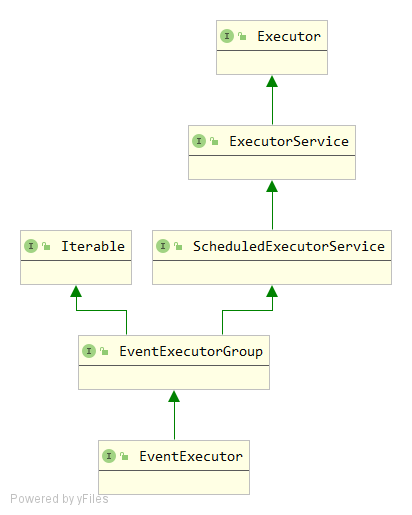

# Netty的心跳检测以及其在Dubbo2.7.x版本中的应用

## 何为心跳检测

我们常常听到TCP连接有长连接和短链接。那么什么是长连接，什么又是短连接呢？

**短连接**

短连接一般经过这么几个步骤：

1. 客户端向服务端发送请求，服务端收到请求，建立连接
2. 客户端发送数据，服务端收到数据并回应客户端
3. 连接断开

**长连接**

长连接一般经过这么几个步骤：

1. 客户端向服务端发送请求，服务端收到请求，建立连接
2. 客户端发送数据，服务端收到数据并回应客户端
3. **连接保持，不断开**
4. 客户端有数据继续发送，服务端正常处理

那么这里就发现了长连接的一个问题，我们都知道网络是不稳定的，那么如果在一个长连接的过程中，客户端因为网络故障挂了，而这时服务端还一直保存这对应的通道连接，那如果这种情况多了，岂不是一种对资源的浪费吗？，又或者一个客户端和服务端建立长连接后，只发送了一次数据，然后长时间都没有数据发送，那么我们仍然保存这他这个连接，是不是也不是很合理，这不是占着茅坑不拉屎吗？所以这个时候就需要一种机制来检测客户端和服务端之间的连接是否正常或者检测你客户端在一定时间内还没有没有数据发给我，我服务端要不要把你的连接关掉，把资源腾出来，让给其他需要的客户端。这个时候就出现了我们今天的主角：**心跳检测**。心跳检测的原理呢就是说客户端和服务端定时发送一种特殊的数据包 **（心跳包）** ，来确保这个TCP长连接是有效的。如果超过一段时间我没有收到你的心跳，那对不起，我就要把你断开了。

## 如何使用Netty的心跳检测

Netty作为一个优秀的网络通信开发框架，也给我们提供了心跳检测的机制。那么首先我们看看Netty的心跳检测如何使用，在来研究他是如何设计的？我们直接通过一个demo来看吧。

首先我们创建一个Netty的服务端，大部分都是模板代码，核心的一行是17行和19行。17行我们向pipeline中加入了一个`IdleStateHandler`。这是心跳检测的核心类。他的构造器有四个参数：

1. ` long readerIdleTime` : 读超时，在该参数给定的时间间隔内，如果没有从Channel中读取到数据，就会触发一个**READER_IDLE**的事件
2. `long writerIdleTime` : 写超时，在该参数给定的时间间隔内，如果没有数据写入到Channel中，就会触发一个**WRITER_IDLE**的事件
3. `long allIdleTime` : 读/写超时，在该参数给定的时间间隔内，如果没有读或写操作时, 会触发一个 **ALL_IDLE** 的事件
4. `TimeUnit unit` : 时间单位，就是上面三个参数的单位，如果不指定，默认是秒

```java
public class HeartBeatServer {
    public static void main(String[] args) {
        EventLoopGroup boss = new NioEventLoopGroup();
        EventLoopGroup worker = new NioEventLoopGroup();

        ServerBootstrap bootstrap = new ServerBootstrap();
        bootstrap.group(boss, worker)
                .channel(NioServerSocketChannel.class)
                .childHandler(new ChannelInitializer<SocketChannel>() {
                    @Override
                    protected void initChannel(SocketChannel ch) throws Exception {
                        ChannelPipeline pipeline = ch.pipeline();
                        // 编解码器
                        pipeline.addLast(new StringDecoder());
                        pipeline.addLast(new StringEncoder());
                        // 心跳机制的关键handler
                        pipeline.addLast(new IdleStateHandler(3, 0, 0, TimeUnit.SECONDS));
                        // 自定义收到心跳包如何处理的handler
                        pipeline.addLast(new HeartBeatServerHandler());
                    }
                });

        System.out.println("netty server start...");
        ChannelFuture future;
        try {
            future = bootstrap.bind(8080).sync();
            future.channel().closeFuture().sync();
        } catch (InterruptedException e) {
            e.printStackTrace();
        } finally {
            boss.shutdownGracefully();
            worker.shutdownGracefully();
        }
    }
}
```

除了17行的代码，19行依然重要，这里我们加了一个自定义的handler，用来处理收到心跳包的逻辑。代码如下：

```java
public class HeartBeatServerHandler extends SimpleChannelInboundHandler<String> {

    private static final int IDLE_NUM = 3;

    private int readIdleTimes = 0;

    // 打印收到的客户端发送来的心跳包，我们发送的是字符串
    @Override
    protected void channelRead0(ChannelHandlerContext ctx, String msg) throws Exception {
        System.out.println(" ======> [server] received message: " + msg);
    }

    // 上面说会触发三种事件：READER_IDLE、WRITER_IDLE、ALL_IDLE，那么触发后如何感知到呢，就需要复写这个方法，在方法里就能处理这三种事件。
    // 我们在服务端定义的是READER_IDLE事件, 所以这里关注如果是读超时事件，就给readIdleTimes++, 当readIdleTimes大于3的时候，我们断开连接
    // 并且给客户端发送一个消息
    @Override
    public void userEventTriggered(ChannelHandlerContext ctx, Object evt) throws Exception {
        if (evt instanceof IdleStateEvent) {
            IdleStateEvent event = (IdleStateEvent) evt;
            if (event.state() == IdleState.READER_IDLE) {
                readIdleTimes++;
            }
        }

        if (readIdleTimes > IDLE_NUM) {
            System.out.println("idle num more than three times, channel closed...");
            ctx.channel().writeAndFlush("channel close");
            ctx.channel().close();
        }
    }

    @Override
    public void channelActive(ChannelHandlerContext ctx) throws Exception {
        System.err.println("=== " + ctx.channel().remoteAddress() + " is active ===");
    }
}
```

上述是服务端的代码，我们在看客户端的代码

```java
public class HeartBeatClient {
    public static void main(String[] args) {
        EventLoopGroup group = new NioEventLoopGroup();
        Bootstrap bootstrap = new Bootstrap();
        bootstrap.group(group).channel(NioSocketChannel.class)
                .handler(new ChannelInitializer<SocketChannel>() {
                    @Override
                    protected void initChannel(SocketChannel ch) throws Exception {
                        ChannelPipeline pipeline = ch.pipeline();
                        pipeline.addLast(new StringEncoder());
                        pipeline.addLast(new StringDecoder());
                        // 同样这里我们也定义了一个客户端处理心跳的逻辑
                        pipeline.addLast(new HeartBeatClientHandler());
                    }
                });
        System.out.println("netty client start...");

        try {
            Channel channel = bootstrap.connect("127.0.0.1", 8080).sync().channel();
            String text = "Heartbeat Packet";
            Random random = new Random();
            // 随机休息几秒，模拟网络不稳定，间断给服务端发送心跳的情况。
            while (channel.isActive()) {
                int num = random.nextInt(8);
                Thread.sleep(num * 1000);
                channel.writeAndFlush(text);
            }
        } catch (InterruptedException e) {
            e.printStackTrace();
        } finally {
            group.shutdownGracefully();
        }
    }
}
```

```java
public class HeartBeatClientHandler extends SimpleChannelInboundHandler<String> {

    // 客户端收到服务端的消息，也断开连接
    @Override
    protected void channelRead0(ChannelHandlerContext ctx, String msg) throws Exception {
        System.out.println("client received :" + msg);
        if ("channel close".equals(msg)) {
            System.out.println("client channel close...");
            ctx.channel().closeFuture();
        }
    }
}
```

这就是如何使用Dubbo心跳检测的一个简单实例代码，参考自图灵学院的网课。

## Netty如何实现心跳检测的源码

知道了如何用，当然我们也应该知道为什么可以这么用。首先我们看他的构造方法里做了什么

```java
private final long readerIdleTimeNanos;
private final long writerIdleTimeNanos;
private final long allIdleTimeNanos;

public IdleStateHandler(
    	long readerIdleTime, long writerIdleTime, long allIdleTime,
    	TimeUnit unit) {
    this(false, readerIdleTime, writerIdleTime, allIdleTime, unit);
}

// 构造方法真正调用的逻辑，给readerIdleTimeNanos  writerIdleTimeNanos  allIdleTimeNanos三个成员变量就行了赋值
public IdleStateHandler(boolean observeOutput,
            long readerIdleTime, long writerIdleTime, long allIdleTime,
            TimeUnit unit) {
    ObjectUtil.checkNotNull(unit, "unit");

    this.observeOutput = observeOutput;

    if (readerIdleTime <= 0) {
        readerIdleTimeNanos = 0;
    } else {
        readerIdleTimeNanos = Math.max(unit.toNanos(readerIdleTime), MIN_TIMEOUT_NANOS);
    }
    if (writerIdleTime <= 0) {
        writerIdleTimeNanos = 0;
    } else {
        writerIdleTimeNanos = Math.max(unit.toNanos(writerIdleTime), MIN_TIMEOUT_NANOS);
    }
    if (allIdleTime <= 0) {
        allIdleTimeNanos = 0;
    } else {
        allIdleTimeNanos = Math.max(unit.toNanos(allIdleTime), MIN_TIMEOUT_NANOS);
    }
}
```

然后他的核心逻辑在`channelActive`这个方法，这个方法是通道一被激活就会触发的方法。

```java
public void channelActive(ChannelHandlerContext ctx) throws Exception {
    // This method will be invoked only if this handler was added
    // before channelActive() event is fired.  If a user adds this handler
    // after the channelActive() event, initialize() will be called by beforeAdd().
    initialize(ctx);
    super.channelActive(ctx);
}

private void initialize(ChannelHandlerContext ctx) {
    // Avoid the case where destroy() is called before scheduling timeouts.
    // See: https://github.com/netty/netty/issues/143
    switch (state) {
        case 1:
        case 2:
            return;
    }

    state = 1;
    initOutputChanged(ctx);

    lastReadTime = lastWriteTime = ticksInNanos();
    // 核心的逻辑就在下面这三个if条件
    if (readerIdleTimeNanos > 0) {
        // 检测读超时的定时任务
        readerIdleTimeout = schedule(ctx, new ReaderIdleTimeoutTask(ctx),
                                     readerIdleTimeNanos, TimeUnit.NANOSECONDS);
    }
    if (writerIdleTimeNanos > 0) {
        // 检测读超时的定时任务
        writerIdleTimeout = schedule(ctx, new WriterIdleTimeoutTask(ctx),
                                     writerIdleTimeNanos, TimeUnit.NANOSECONDS);
    }
    if (allIdleTimeNanos > 0) {
        // 检测读写超时的定时任务
        allIdleTimeout = schedule(ctx, new AllIdleTimeoutTask(ctx),
                                  allIdleTimeNanos, TimeUnit.NANOSECONDS);
    }
}

// 接着往下看schedule方法的实现，这里我们发现第二个参数其实是一个Runnable任务，第三个参数就是我们传过来的超时时间
ScheduledFuture<?> schedule(ChannelHandlerContext ctx, Runnable task, long delay, TimeUnit unit) {
    // ctx.executor()得到一个EventExecutor，是一个定时任务线程池，下面看代码结构，
    // 因此上核心逻辑应该在task的run()方法里定义的，再去一探究竟，以ReaderIdleTimeoutTask为例
    return ctx.executor().schedule(task, delay, unit);
}

private final class ReaderIdleTimeoutTask extends AbstractIdleTask {

    ReaderIdleTimeoutTask(ChannelHandlerContext ctx) {
        super(ctx);
    }

    @Override
    protected void run(ChannelHandlerContext ctx) {
        // 我们设置的时间，假定为3秒
        long nextDelay = readerIdleTimeNanos;
        if (!reading) {
            // nextDelay = nextDelay - (ticksInNanos() - lastReadTime)
            // ticksInNanos() - lastReadTime当前时间减去最后一次调用channelRead方法的时间，假设4秒，说明上次调用已经是4秒之前的事情了
            // nextDelay = nextDelay - (ticksInNanos() - lastReadTime) => 3 - 4 = -1
            // 这一步<0，说明超时了，否则说明还没超时，算出来的差就是还有几秒超时。然后赋值给nextDelay
            nextDelay -= ticksInNanos() - lastReadTime;
        }

        // 超时的逻辑
        if (nextDelay <= 0) {
            // 假设超时了，那么3秒后（我们设置的时间）在调用定时任务
            readerIdleTimeout = schedule(ctx, this, readerIdleTimeNanos, TimeUnit.NANOSECONDS);

            boolean first = firstReaderIdleEvent;
            firstReaderIdleEvent = false;

            try {
                IdleStateEvent event = newIdleStateEvent(IdleState.READER_IDLE, first);
                // 超时的核心逻辑，代码走到：标记1，触发下一个handler的userEventTriggered(evt)方法，
                // 发送读超时的事件，就到了我们前面自定义的那个handler
                channelIdle(ctx, event);
            } catch (Throwable t) {
                ctx.fireExceptionCaught(t);
            }
        } else {
            // 没超时，假设62行算出来是1，那么1秒后执行定时任务
            readerIdleTimeout = schedule(ctx, this, nextDelay, TimeUnit.NANOSECONDS);
        }
    }
}

// 标记1
protected void channelIdle(ChannelHandlerContext ctx, IdleStateEvent evt) throws Exception {
    ctx.fireUserEventTriggered(evt);
}
```



## Dubbo2.7.x版本的心跳检测如何通过Netty实现

Dubbo2.7.x之后（这里取得是2.7.8）的版本的心跳检测就是通过Netty实现的。我们一起看看他的代码是怎么写的：

代码路径：`org.apache.dubbo.remoting.transport.netty4`

**服务端代码**

```java
@Override
protected void doOpen() throws Throwable {
    bootstrap = new ServerBootstrap();

    bossGroup = NettyEventLoopFactory.eventLoopGroup(1, "NettyServerBoss");
    workerGroup = NettyEventLoopFactory.eventLoopGroup(
        getUrl().getPositiveParameter(IO_THREADS_KEY, Constants.DEFAULT_IO_THREADS),
        "NettyServerWorker");

    final NettyServerHandler nettyServerHandler = new NettyServerHandler(getUrl(), this);
    channels = nettyServerHandler.getChannels();

    bootstrap.group(bossGroup, workerGroup)
        .channel(NettyEventLoopFactory.serverSocketChannelClass())
        .option(ChannelOption.SO_REUSEADDR, Boolean.TRUE)
        .childOption(ChannelOption.TCP_NODELAY, Boolean.TRUE)
        .childOption(ChannelOption.ALLOCATOR, PooledByteBufAllocator.DEFAULT)
        .childHandler(new ChannelInitializer<SocketChannel>() {
            @Override
            protected void initChannel(SocketChannel ch) throws Exception {
                // FIXME: should we use getTimeout()?
                int idleTimeout = UrlUtils.getIdleTimeout(getUrl());
                NettyCodecAdapter adapter = new NettyCodecAdapter(getCodec(), getUrl(), NettyServer.this);
                if (getUrl().getParameter(SSL_ENABLED_KEY, false)) {
                    ch.pipeline().addLast("negotiation",
                                          SslHandlerInitializer.sslServerHandler(getUrl(), nettyServerHandler));
                }
                ch.pipeline()
                    .addLast("decoder", adapter.getDecoder())
                    .addLast("encoder", adapter.getEncoder())
                    // 定义IdleStateHandler
                    .addLast("server-idle-handler", new IdleStateHandler(0, 0, idleTimeout, MILLISECONDS))
                    .addLast("handler", nettyServerHandler);
            }
        });
    // bind
    ChannelFuture channelFuture = bootstrap.bind(getBindAddress());
    channelFuture.syncUninterruptibly();
    channel = channelFuture.channel();

}
```

```java
@Override
public void userEventTriggered(ChannelHandlerContext ctx, Object evt) throws Exception {
    // 原文注释：server will close channel when server don't receive any heartbeat from client util timeout.
    if (evt instanceof IdleStateEvent) {
        NettyChannel channel = NettyChannel.getOrAddChannel(ctx.channel(), url, handler);
        try {
            logger.info("IdleStateEvent triggered, close channel " + channel);
            channel.close();
        } finally {
            NettyChannel.removeChannelIfDisconnected(ctx.channel());
        }
    }
    super.userEventTriggered(ctx, evt);
}
```

**客户端代码：**

```java
@Override
protected void doOpen() throws Throwable {
    final NettyClientHandler nettyClientHandler = new NettyClientHandler(getUrl(), this);
    bootstrap = new Bootstrap();
    bootstrap.group(NIO_EVENT_LOOP_GROUP)
        .option(ChannelOption.SO_KEEPALIVE, true)
        .option(ChannelOption.TCP_NODELAY, true)
        .option(ChannelOption.ALLOCATOR, PooledByteBufAllocator.DEFAULT)
        //.option(ChannelOption.CONNECT_TIMEOUT_MILLIS, getTimeout())
        .channel(socketChannelClass());

    bootstrap.option(ChannelOption.CONNECT_TIMEOUT_MILLIS, Math.max(3000, getConnectTimeout()));
    bootstrap.handler(new ChannelInitializer<SocketChannel>() {

        @Override
        protected void initChannel(SocketChannel ch) throws Exception {
            int heartbeatInterval = UrlUtils.getHeartbeat(getUrl());

            if (getUrl().getParameter(SSL_ENABLED_KEY, false)) {
                ch.pipeline().addLast("negotiation", SslHandlerInitializer.sslClientHandler(getUrl(), nettyClientHandler));
            }

            NettyCodecAdapter adapter = new NettyCodecAdapter(getCodec(), getUrl(), NettyClient.this);
            ch.pipeline()//.addLast("logging",new LoggingHandler(LogLevel.INFO))//for debug
                .addLast("decoder", adapter.getDecoder())
                .addLast("encoder", adapter.getEncoder())
				// 设置IdleStateHandler
                .addLast("client-idle-handler", new IdleStateHandler(heartbeatInterval, 0, 0, MILLISECONDS))
                .addLast("handler", nettyClientHandler);

            String socksProxyHost = ConfigUtils.getProperty(SOCKS_PROXY_HOST);
            if(socksProxyHost != null) {
                int socksProxyPort = Integer.parseInt(ConfigUtils.getProperty(SOCKS_PROXY_PORT, DEFAULT_SOCKS_PROXY_PORT));
                Socks5ProxyHandler socks5ProxyHandler = new Socks5ProxyHandler(new InetSocketAddress(socksProxyHost, socksProxyPort));
                ch.pipeline().addFirst(socks5ProxyHandler);
            }
        }
    });
}
```

```java
@Override
public void userEventTriggered(ChannelHandlerContext ctx, Object evt) throws Exception {
    // send heartbeat when read idle.
    if (evt instanceof IdleStateEvent) {
        try {
            NettyChannel channel = NettyChannel.getOrAddChannel(ctx.channel(), url, handler);
            if (logger.isDebugEnabled()) {
                logger.debug("IdleStateEvent triggered, send heartbeat to channel " + channel);
            }
            Request req = new Request();
            req.setVersion(Version.getProtocolVersion());
            req.setTwoWay(true);
            req.setEvent(HEARTBEAT_EVENT);
            channel.send(req);
        } finally {
            NettyChannel.removeChannelIfDisconnected(ctx.channel());
        }
    } else {
        super.userEventTriggered(ctx, evt);
    }
}
```

看完是不是发现都是一样的套路。。

