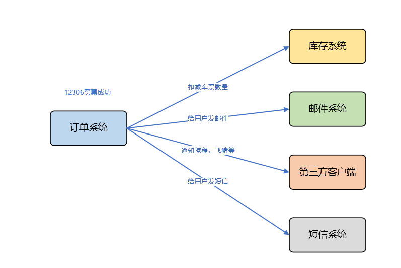
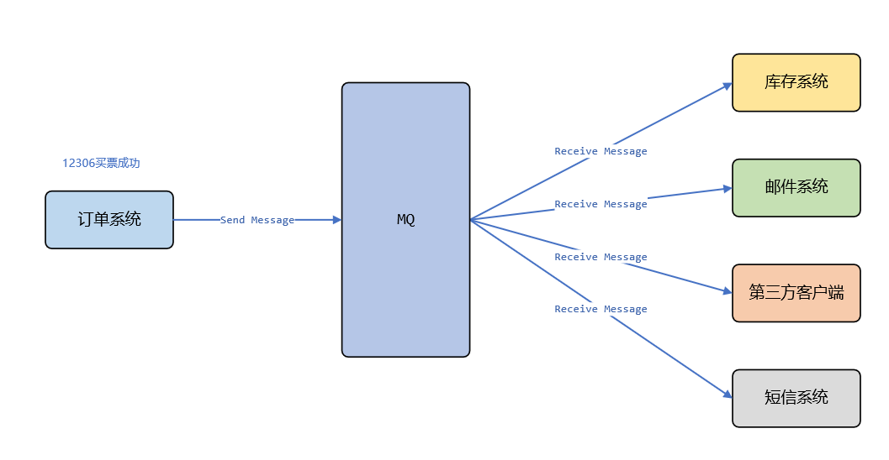
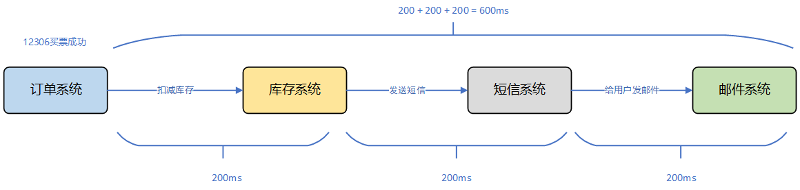
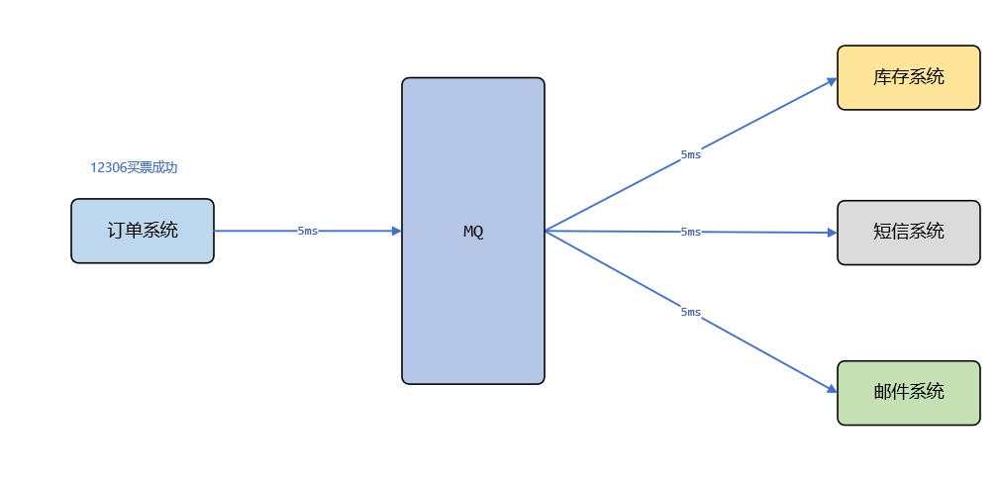
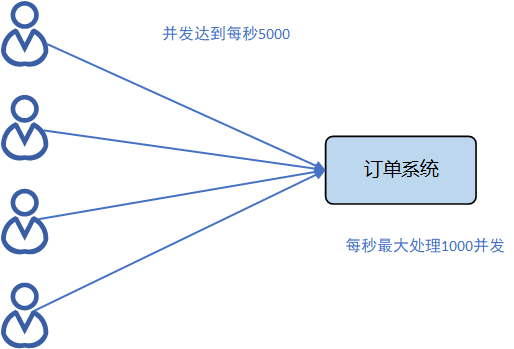
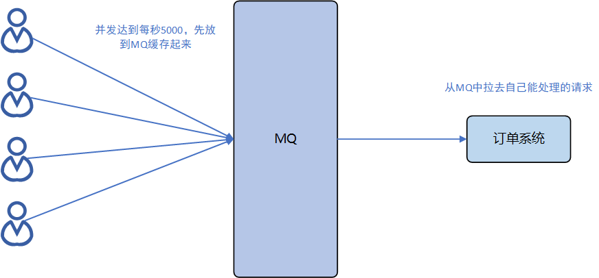

# 初探MQ

## 什么是MQ

关于MQ的概念，想必都不会模式，MQ是**Message Queue（消息队列）**的缩写，所以他首先是一个队列，有先进先出的特性，其次是一个存放消息的队列。常用在分布式系统中进行通信。

## 为什么用MQ

每引入一个中间件，都会提高系统的开发和维护成本，当然为了保证其高可用购买服务器，也会提升成本。那么我们为什么要用MQ呢，他到底有什么好处呢，网上很多总结，大致有三点：**应用解耦**、**异步提速**、**削峰填谷**。

### 应用解耦

假设12306系统是这样的，我们买票成功后，需要做以下几件事：调用库存系统扣减车票库存，调用短信系统给用户发送短信，调用邮件系统给用户发邮件，调用第三方客户端通知买票成功。那么如果这几个服务一直能正常服务，产品经理不在有新的需求变更，那也可称得上现世安稳，岁月静好。可是万一有一天出现这么两种情况可怎么办呢？

1. 产品经理提需求，好多人关注了我们12306微信客户端，我们需要买票成功后在通知微信小程序。那么我们又需要修改订单系统的代码。一次还好，如果隔一段时间发生一件这样的事，那谁能忍受？
2. 某一天，短信系统挂了，然后客户成功买到一张票，然后呢是短信也没收到，邮件也没收到，库存也没扣，这还得了。你短信系统坏了，我邮件系统好好的，凭什么影响我，让客户收不到邮件，这就不合理。

所以呢，还是各个系统之间的耦合太高了，我们应该解耦。不是有人说互联网的任何问题都可以通过一个中间件来解决吗，那么我们看MQ如何帮我们解决这件棘手的事情。

那么我们发现其实短信系统、邮件系统等都只依赖订单系统产生的一条数据那就是订单，因此我们在订单系统产生数据后，将订单这条数据发送给MQ，就返回成功，然后让短信、邮件等系统都订阅MQ，一旦发现MQ有消息，他们主动拉去消息，然后解析，进行业务处理。这样一来，就算你短信系统挂了，丝毫不会影响其他系统，而且如果后来想加一个新的系统，你也不用改订单系统的代码了，你只要订阅我们的MQ提供的消息就行了。

### 异步提速

还以上面12306为例，假设我们不用MQ，那么我们的代码必然耦合在一起，下单成功后，依次要通过RPC远程调用这几个系统，然后同步等到他们的响应才能返回给用户是否成功的结果。假设每个系统耗时200ms，那么就得花费600ms。

但是其实有时候我们发现，下单是个核心业务，可能压力本来就大，客户也着急知道下单是否成功，但是短信邮件等通知，可能大多数人根本不急或者压根不关心，那么我们为什么要让这些细枝末节的业务影响核心业务的效率呢，是不是有点舍本逐末。所以这个逻辑我们可以设计成异步的。我们可以当下单成功后，只需要将订单消息发给MQ，然后立即将结果返回通知客户。这才是正确的打开姿势。这样一来，我订单系统只需要告诉你MQ，我下单成功了，其他模块收到消息后，该发短信的发短信，发邮件的发邮件。因为本来MQ的性能就很好，所以这个效率一下就提升了。

### 削峰填谷

还是用12306为例，假设平时可能买票的人不多，所以订单系统的QPS也不是很高，每秒也就处理1000个请求，但是一到节假日、春运期间可能抢票的人就非常多，并发量远远大于平时，这个时候，订单系统明显扛不住了。怎么办呢，当然我们可以设计弹性伸缩的集群，进行机器扩容，保证高可用。但是我们依然可以采用MQ来解决这个问题。

MQ的吞吐能力还是还强大的，所以我们可以设计高可用的MQ，让所有的请求都打到MQ，缓存起来。这样一来高峰期的流量和数据都将积压在MQ中，流量高峰就被**削弱**了（**削峰**），然后我们的订单系统就避免了高并发的请求，它可以慢慢的从MQ中拉取自己能力范围内的消息就行处理。这样一来，高峰期积压的消息也终将被消费完，可以叫做**填谷**。

### 总结

综上所述，MQ有他的优势，主要体现在三个方面

1. 应用解耦：提高系统容错性和可维护性
2. 异步提速：提升响应速度，优化用户体验
3. 削峰填谷：高并发的时候，可以有效保证系统的稳定性

当然他也有弊端

1. 复杂度提高，我们需要解决消息丢失、积压、幂等等各种情况
2. 一旦MQ宕机，对业务有影响

## 常见MQ性能对比

这里从网上找的一张性能对比图，可以大概对比一下几大主流MQ的优缺点。ActiveMQ因为吞吐量低，也没有什么突出的优势，用的人也少了。RabbitMQ主要特点是消息延迟低，并发能力强，而且安全可靠，所以并发量不是很大的金融行业据说用的多，互联网公司可能用的少，因为他的开发语言是Erlang，可能懂得人不多，出问题不好定位。而RocketMQ是阿里开源的MQ，并发高，功能多，用的好像挺多。Kafka主要用在大数据领域。这些话呢，也主要是网上看的，并没有实际调研过，有确切的数据，不过理论上是可信的。

