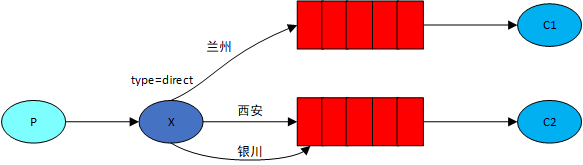
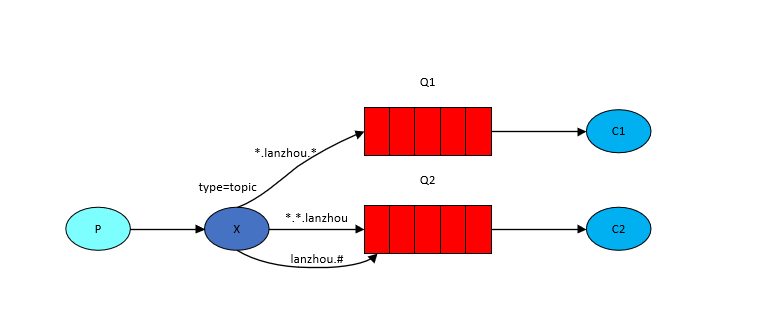

# RabbitMQ的介绍和他的几种基本工作模式

## RabbitMQ的基本介绍

什么是RabbitMQ呢，这里摘取官网文档的一段话，引入我们的正题：

RabbitMQ is a message broker: it accepts and forwards messages. You can think about it as a post office: when you put the mail that you want posting in a post box, you can be sure that Mr. or Ms. Mailperson will eventually deliver the mail to your recipient. In this analogy, RabbitMQ is a post box, a post office and a postman.

The major difference between RabbitMQ and the post office is that it doesn't deal with paper, instead it accepts, stores and forwards binary blobs of data ‒ *messages*.

大概意思呢就是说RabbitMQ呢就是一个消息的代理人，他负责什么工作呢？接受和转发消息。我们可以认为他是一个邮局，当我们将需要发送的邮件投递到信箱中后，我们可以相信邮递员会最终将邮件发送到我们写的收件人。唯一的区别呢是邮局处理的是信件，而RabbitMQ处理的是二进制的数据信息。

## RabbitMQ的几种基本工作模式

### 简单模式

[官网介绍](https://www.rabbitmq.com/tutorials/tutorial-one-java.html)

简单模式就是最基本的生产者消费者模式，生产者生产一条消息，将他放到一个队列中，然后消费者就可以从队列中消费这条消息。这没有什么好说的。


这里呢用java代码进行了演示，生产者发送了一条消息：Hello World，然后客户端收到消息后打印并签收。所谓签收呢就是告诉发信人我收到了。

生产者

```java
public static void main(String[] args) throws Exception {
    // 1. 创建通道
    Connection connection = ConnectionUtil.getConnection();
    Channel channel = connection.createChannel();

    // 2. 创建队列
    channel.queueDeclare(QUEUE_HELLO, false, false, false, null);

    // 3. 发布消息
    String message = "Hello World";
    channel.basicPublish("", QUEUE_HELLO, null, message.getBytes(StandardCharsets.UTF_8));
    System.out.println("send message : " + message);

    channel.close();
    connection.close();
}

// 执行结果
send message : Hello World
```

消费者

```java
public static void main(String[] args) throws IOException {
    Connection connection = ConnectionUtil.getConnection();
    Channel channel = connection.createChannel();

    // param1: 队列名
    // param2: 是否持久化，如果为false则MQ停止后数据会丢失
    // param3: 队列是否私有化，false表示都可以访问，true表示只有第一次消费他的消费者才能一直使用，其他消费者不能访问
    // param4: 是否自动删除该队列
    // param5: 额外的配置参数
    channel.queueDeclare(QUEUE_HELLO, false, false, false, null);

    // 收到消息后打印签收消息
    DeliverCallback deliverCallback = (consumerTag, delivery) -> {
        String message = new String(delivery.getBody(), StandardCharsets.UTF_8);
        System.out.println("recv message : " + message);
        channel.basicAck(delivery.getEnvelope().getDeliveryTag(), false);
    };

    // param1: 队列名
    // param1: 是否自动确认收到消息，false代表手动编程来确认消息，推荐false
    // param3: deliverCallback
    channel.basicConsume(QUEUE_HELLO, false, deliverCallback, consumerTag -> {} );
}

// 执行结果
recv message : Hello World
```

### 工作队列模式（Work queues）

[官网介绍](https://www.rabbitmq.com/tutorials/tutorial-two-java.html)

上面这种模式是基本模式，一个生产者一个消费者。那么我们在实际开发中，可能会遇到这样的情况，比如订单系统将很多订单消息发送到了RabbitMQ，而物流系统要收到消息，根据订单去发快递，那么如果物流系统只有一个节点，可能效率低下，处理不过来，这个时候我们往往会进行集群部署，将物流系统部署在多个节点，那么这个时候就会存在多个物流系统合作同时处理这一批订单消息。这个时候就有了第二中工作模式，工作队列模式：


同样用java代码进行演示：

生产者：发送100条消息到MQ的队列中

```java
public static void main(String[] args) throws Exception {
    Connection connection = ConnectionUtil.getConnection();
    Channel channel = connection.createChannel();

    channel.queueDeclare(TASK_QUEUE_NAME, true, false, false, null);

    for (int i = 0; i < 100; i++) {
        String message = "Order - " + i;
        channel.basicPublish("", TASK_QUEUE_NAME, null, message.getBytes(StandardCharsets.UTF_8));
        System.out.println("请处理订单 : " + message);
    }

    channel.close();
    connection.close();
}
```

消费者：同时启动两个消费者，都绑定到上面的队列，进行消息的消费

```java
public static void main(String[] args) throws IOException {
    Connection connection = ConnectionUtil.getConnection();
    Channel channel = connection.createChannel();

    channel.queueDeclare(TASK_QUEUE_NAME, true, false, false, null);
    // channel.basicQos(PRE_FETCH_COUNT);

    DeliverCallback deliverCallback = (consumerTag, delivery) -> {
        try {
            String message = new String(delivery.getBody(), StandardCharsets.UTF_8);
            System.out.println("Order: " + message + " 已经被处理");
			// 模拟处理一条消息需要10ms，启动第二个消费者模拟需要20ms
            Thread.sleep(10);
        } catch (InterruptedException e) {
            e.printStackTrace();
        } finally {
            channel.basicAck(delivery.getEnvelope().getDeliveryTag(), false);
        }
    };
    channel.basicConsume(TASK_QUEUE_NAME, false, deliverCallback, consumerTag -> {});
}
```

执行上述代码，消费者当然会将消息发送到指定的队列，两个消费者也会通过轮询的方式消费消息，也就是两个消费者每个都会消费50条消息。但这并不是我们希望的，为什么呢，我们可以看消费者代码的11行，消费者2处理一条消息需要20ms，而消费者1只需要10ms，明显两个的处理速度不一样，这可能是因为两台机器的配置导致性能不一样。因此正常的应该是能力强的多处理一些消息，能力弱的少处理一些消息，能者多劳嘛。就像Nginx转发请求，有一种轮询的方案，会平均的分配请求到后面的机器，但是也有第二种方案就是对不同配置的机器加一个权重，配置高的机器权重高，Nginx就会根据这个参数将请求进行合理的分配，最终形成能者多劳的效果。那么RabbitMQ也有类似的方案，就是消费者代码的6行，这里PRE_FETCH_COUNT是一个常量1，表示不要给我一下发那么多消息，你等我处理完一个消息，在给我发好吗？这样一来就形成你能处理多少给你发多少的结果。

### 发布订阅模式（Publish/Subscribe）

[官网介绍](https://www.rabbitmq.com/tutorials/tutorial-three-java.html)

除过上述场景外，可能生活中还会有这种场景，比如两个同学都是B站UP主陈翔六点半的忠实粉丝，他俩都关注了陈翔六点半，那如果这个UP主发了一条视频，他们两个是应该都要收到的，这个时候如果用工作队列模式，会导致UP主发的一条动态，第一个同学查看后就没了，第二个同学就不知道了。这显然是不合理的，因此需要解决这个问题呢，可以用RabbitMQ提供的发布订阅模式，就是说两个粉丝各自都有一个专属的信箱（队列），并且都关注**（订阅）**了陈翔六点半，陈翔六点半做好一个新的视频，会给两个同学的信箱都发信**（发布）**，然后他们就可以都收到这条最新的动态了。这个过程是不是很像小时候学校的大喇叭放的广播，广播一响，所有人都能收到最新的通知，所以这中模式叫**广播模式**。那么这里还有一个问题就是UP创作了新的作品，他如何知道有些谁关注了他呢，他要把视频投递给哪些人呢。当然我们可以告诉他你的粉丝有哪些，但这样的问题是，UP主本来搞创作就很累了，他不应该在为这些事操心，专业的人只应该做专业的事，才能有更好的效果不是吗？因此RabbitMQ提供了**交换机**这个概念去解决这个问题。UP主创作好视频后，只需要将作品投递给交换机，其他不管，至于要发给哪些人，那是交换机的事情。


交换机一般有四种类型，`direct`、`topic`、`headers `和`fanout`。前三种暂时不关注，第四种表示广播模式，就是说交换机会将消息发给所有他知道的队列。发布订阅模式就需要用这种。我们还是通过java代码操作一下。

生产者：模式UP主将最新的创作发布出去给关注他的粉丝

```java
public static void main(String[] args) throws Exception {
    Connection connection = ConnectionUtil.getConnection();
    Channel channel = connection.createChannel();

    String message = "陈翔六点半：好多喜欢，藏在欲言又止里";
    channel.basicPublish(EXCHANGE_UP, "", null, message.getBytes(StandardCharsets.UTF_8));

    channel.close();
    connection.close();
}
```

消费者：这里只写了一份代码，实际因该有两个粉丝都关注上面的UP主，只不过他们都对应各自的队列，运行程序后每个粉丝都会收到UP主发的消息。

```java
public static void main(String[] args) throws IOException {
    Connection connection = ConnectionUtil.getConnection();
    Channel channel = connection.createChannel();

    channel.queueDeclare(QUEUE_FANS1, true, false, false, null);
    // 将队列和交换机进行绑定
    // param1: 队列名
    // param2: 交换机，需要提前创建好
    // param3: 路由key
    channel.queueBind(QUEUE_FANS1, EXCHANGE_UP, "");
    channel.basicQos(PRE_FETCH_COUNT);

    DeliverCallback deliverCallback = (consumerTag, delivery) -> {
        String message = new String(delivery.getBody(), StandardCharsets.UTF_8);
        System.out.println(message);
        channel.basicAck(delivery.getEnvelope().getDeliveryTag(), false);
    };
    channel.basicConsume(QUEUE_FANS1, false, deliverCallback, consumerTag -> {});
}
```

### 路由模式（Routing）

这里我们在换一个场景来看路由模式。假设我手机上的天气预报，关注了两个城市，我的城市西安和女朋友的城市银川，我每天想收到这两个城市的天气预报。我有一个朋友他在兰州，只想收到兰州的天气预报。那么如果采用上面的发布订阅模式，是无法实现这个功能的，因为发布订阅模式下交换机只会无脑的将气象局的天气情况广播给所有人。而不知道如何过滤。那怎么去解决呢，首先交换机不能在是广播的了，要换一换，RabbitMQ给我们提供了**direct**这种模式区别于**fanout**。其次消费者绑定的队列也要有能力过滤消息，RabbitMQ通过给队列绑定一个**routingKey**来做过滤，最后就需要交换机发出的每一条消息也要加上这个**routingKey**，那么队列在收到消息才能有的根据去判断这条消息是否他想要的。是则留下，否则就会被丢弃。

[官网介绍](https://www.rabbitmq.com/tutorials/tutorial-four-java.html)



这里同样通过代码演示：

服务端：模拟发送三个城市的天气预报

```java
public static void main(String[] args) throws IOException {
    Map<String, String> map = new HashMap<>(8);
    map.put("gansu.lanzhou.20210322", "兰州：晴天");
    map.put("ningxia.yinchuan.20210322", "银川：阴雨天");
    map.put("shanxi.xian.20210322", "长安：微风");

    Connection connection = ConnectionUtil.getConnection();
    Channel channel = connection.createChannel();

    map.forEach((key, value) -> {
        try {
            // param1：交换机
            // param2: 路由key
            channel.basicPublish(EXCHANGE_WEATHER, key, null, value.getBytes(StandardCharsets.UTF_8));
        } catch (IOException e) {
            e.printStackTrace();
        }
    });

}
```

消费端，模拟两个消费者，一个接受兰州的天气信息，一个接受西安和银川的天气信息

```java
public static void main(String[] args) throws IOException {
    Connection connection = ConnectionUtil.getConnection();
    Channel channel = connection.createChannel();

    // 声明队列
    channel.queueDeclare(MY_WATCH, true, false, false, null);
	
    // 为队列绑定交换机和routingKey
    channel.queueBind(MY_WATCH, EXCHANGE_WEATHER, "ningxia.yinchuan.20210322");
    channel.queueBind(MY_WATCH, EXCHANGE_WEATHER, "shanxi.xian.20210322");
    channel.basicQos(PRE_FETCH_COUNT);

    DeliverCallback deliverCallback = (consumerTag, delivery) -> {
        String message = new String(delivery.getBody(), StandardCharsets.UTF_8);
        System.out.println(message);
        channel.basicAck(delivery.getEnvelope().getDeliveryTag(), false);
    };
    channel.basicConsume(MY_WATCH, false, deliverCallback, consumerTag -> {});
}

// 运行结果
银川：阴雨天
长安：微风
```

```java
public static void main(String[] args) throws IOException {
    Connection connection = ConnectionUtil.getConnection();
    Channel channel = connection.createChannel();

    channel.queueDeclare(FRIEND_WATCH, true, false, false, null);

    channel.queueBind(FRIEND_WATCH, EXCHANGE_WEATHER, "gansu.lanzhou.20210322");
    channel.basicQos(PRE_FETCH_COUNT);

    DeliverCallback deliverCallback = (consumerTag, delivery) -> {
        String message = new String(delivery.getBody(), StandardCharsets.UTF_8);
        System.out.println(message);
        channel.basicAck(delivery.getEnvelope().getDeliveryTag(), false);
    };
    channel.basicConsume(FRIEND_WATCH, false, deliverCallback, consumerTag -> {});
}

// 运行结果
兰州：晴天
```

### 通配符模式（Topics）

[官网介绍](https://www.rabbitmq.com/tutorials/tutorial-five-java.html)

那有时候可能还会有这样的情况，比如最近天气不好，我下周想去兰州吃牛肉面，我想关注未来几天兰州的天气，那我的routingKey需要把每天都配置上吗？这肯定不太灵活嘛，那RabbitMQ还给我们提供了**Topic模式**解决这个问题，就是**通配符模式**，类似于正则表达式，我们的routingKey可以按照官方提供的规则进行配置，只要符合规则都可以收到消息。图中给出了常见的几种配置

1. `*`只能匹配一个单词，所以 `*.lanzhou.*`可以匹配到`gansu.lanzhou.anning`这种routingKey
2. `#`可以匹配零到多个单词，所以`lanzhou.#`可以匹配到`lanzhou.anning`或者`gansu.lanzhou`或者`lanzhou.anning.gsau`



这里给出一个例子：

生产者：发送兰州三天的天气以及银川和西安一天的天气

```java
public static void main(String[] args) throws IOException {
    Map<String, String> map = new HashMap<>(8);
    map.put("gansu.lanzhou.20210322", "兰州0322：晴天");
    map.put("gansu.lanzhou.20210323", "兰州0323：雨雪天");
    map.put("gansu.lanzhou.20210324", "兰州0324：微风");
    map.put("ningxia.yinchuan.20210322", "银川：阴雨天");
    map.put("shanxi.xian.20210322", "长安：微风");

    Connection connection = ConnectionUtil.getConnection();
    Channel channel = connection.createChannel();

    map.forEach((key, value) -> {
        try {
            // param1：交换机
            // param2: 路由key
            channel.basicPublish(EXCHANGE_WEATHER_TOPIC, key, null, value.getBytes(StandardCharsets.UTF_8));
        } catch (IOException e) {
            e.printStackTrace();
        }
    });

}
```

消费者：配置`gansu.lanzhou.*`的routingKey，会收到哪几天的消息呢？

```java
public static void main(String[] args) throws IOException {
    Connection connection = ConnectionUtil.getConnection();
    Channel channel = connection.createChannel();

    channel.queueDeclare(FRIEND_WATCH, true, false, false, null);

    channel.queueBind(FRIEND_WATCH, EXCHANGE_WEATHER_TOPIC, "gansu.lanzhou.*");
    channel.basicQos(PRE_FETCH_COUNT);

    DeliverCallback deliverCallback = (consumerTag, delivery) -> {
        String message = new String(delivery.getBody(), StandardCharsets.UTF_8);
        System.out.println(message);
        channel.basicAck(delivery.getEnvelope().getDeliveryTag(), false);
    };
    channel.basicConsume(FRIEND_WATCH, false, deliverCallback, consumerTag -> {});
}

// 执行结果

兰州0323：雨雪天
兰州0324：微风
兰州0322：晴天
```
