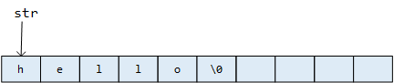
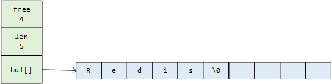
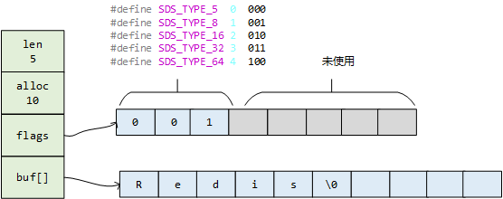
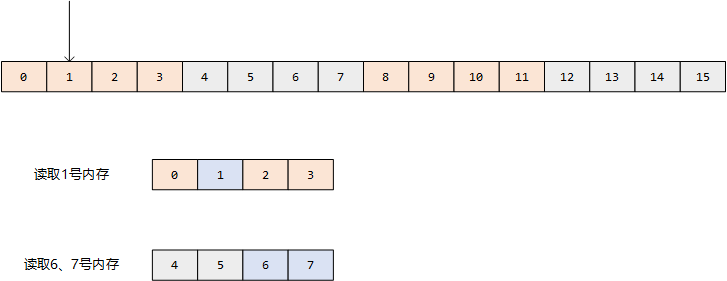
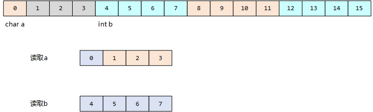
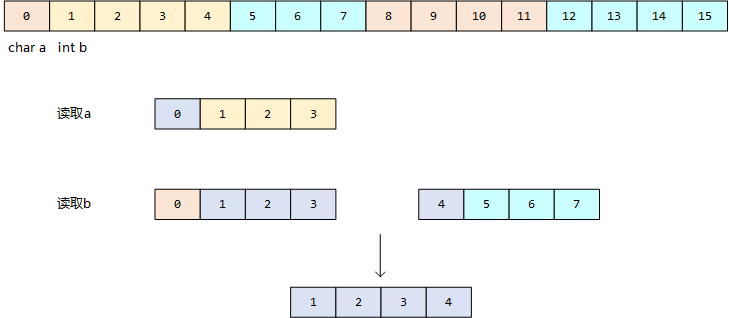
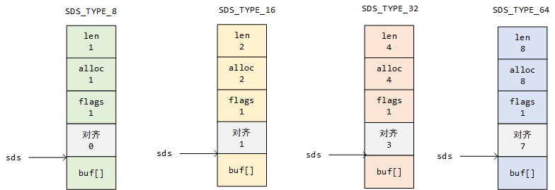

## 动态字符串

### C语言中的字符串

在C语言中，没有字符串这种类型，也没有字符串变量，字符串都是用字符数组来表示的。例如可以用`char str[10] = {'h','e','l','l','o'}`来表示**hello**，那么在示例中的字符数组我们声明了长度为10，其实只用了5个字符，那么C语言是如何知道字符串什么时候结束了，长度是多少呢？答案是在C语言中有一个字符串结束标志**\0**。只要遇到`\0`，就表示一个字符串结束了。如果要求这一个字符串的长度，则需要遍历这个字符数组进行计数，直到遇到`\0`，结束计数求得字符串长度。下图为示例中str在内存中的结构。str是字符类型数组的数组名，在C语言中也代表str这个数组的0号元素的地址。



基于这个结构设计的字符串在平时的编码过程中可能完全足够，但是在redis数据库中，可能会频繁对一个字符串做修改，那么就会出现一些问题：

1. redis中有一个命令`STRLEN  key`用来计算key对应的value的长度，前面我们说C中对字符串求长度，需要遍历整个字符数组，因此时间复杂度就是O(N)
2. redis中有一个命令`SET key value`用来对key对应的value做更新，以上面的例子来看，如果第二次修改str的值为`hello C`，那么是没有问题的，但是如果第二次修改str的值为`hello redis!`，因为新的字符串长度超过了10，则会发生溢出，这个问题我们叫做**缓冲区溢出**。
3. 假如我们要存的数据就是`hello\0redis`，那么按照C的规则，则解析出来的字符串就是`hello`，后面的`\0redis`是取不到的，这个问题我们叫做**二进制不安全**。

基于上面的问题，那么我们有没有好的方案来解决呢？如果我们在增加一个属性**len**来表示字符数组中有效字符的长度，那么第一个问题就可以得到解决，需要获取字符串长度我们只需要访问`len`这个属性即可，时间复杂度就变成了O(1)级别，并且第三个问题也可以解决，在解析字符串的时候我们不在以`\0`结尾，而是通过`len`这个属性去控制。但第二个问题还是有一点麻烦，如果要避免溢出，我们则必须在更新之前判断是否新字符串的长度超出了原来字符数组的长度，但是目前`len`这个属性只记录了有效字符的长度，因此还必须有一个属性记录未使用的长度，我们暂且记作**free**，那么就可以通过`free+len`得知一开始我们申请的字符数组的长度，然后计算是否会发生溢出，如果发生溢出，我们可以先做一次扩容。

最终基于这个方案，redis的作者设计出了**动态字符串（SDS: simple dynamic string）**这样的数据结构。

### SDS定义

### 3.2版本之前

在redis数据库中，包含字符串的键值对在底层都是由sds实现的。例如：`set msg "hello world"`那么redis将在数据库中创建一个新的键值对。其中，键是一个字符串对象，底层实现是一个保存着“msg”的SDS。值也是一个字符串对象，底层实现是一个保存着“hello world”的SDS。当然SDS还用做缓冲区的实现。

redis3.2版本之前，SDS是这样定义的

```c
struct sdshdr {
    // 所保存字符串的长度
    int len;
    // buf数组中未使用字节的数量
    int free;
    // 字节数组，保存字符串
    char buf[];
};
```





`len`值为5，表示该`buf[]`中有效字符为5
`free`值为4，表示该`buf[]`中还有4个字符空间是空闲的
`buf[]`是一个char类型的数组，前面6个空间保存了`redis\0`这6个字符，`\0`不计算在len属性。

### 3.2版本更新

#### 新版本改动点

后来在redis新版本中，对sds做了一些改动。

1. 引入了`alloc`记录分配给buf数组的总长度，那么原先的free可以通过`alloc - len`获得。
2. `len`属性原来是int类型，int在内存中是占4个字节，32位，一共可以表示2<sup>32</sup> - 1的这么大的范围，其实往往我们字符串的长度不会有这么大，所以后续版本做了优化，引入了`uint8_t (1字节)`、`uint16_t (2字节)`、 `uint32_t (4字节)`、 `uint64_t (8字节)`这几种类型，有效节省了空间。
3. 然后加了一个unsigned char（无符号字符型0~255）类型的属性`flags`，一共占8个字节，其中前3位表示类型，后5位闲置。
4. 取消了内存对齐，默认c语言中是内存对齐的，这里结构体上加`__attribute__ ((__packed__))`表示取消内存对齐

```c
// sds.h

// 类型别名，用于指向 sdshdr 的 buf 属性
typedef char *sds;

/* Note: sdshdr5 is never used, we just access the flags byte directly.
 * However is here to document the layout of type 5 SDS strings. */
//  __attribute__ ((__packed__)) 表示取消内存对齐
struct __attribute__ ((__packed__)) sdshdr5 {
    unsigned char flags; /* 3 lsb of type, and 5 msb of string length */
    char buf[];
};
struct __attribute__ ((__packed__)) sdshdr8 {
    uint8_t len; /* used */
    uint8_t alloc; /* excluding the header and null terminator */
    unsigned char flags; /* 3 lsb of type, 5 unused bits */
    char buf[];
};
struct __attribute__ ((__packed__)) sdshdr16 {
    uint16_t len; /* used */
    uint16_t alloc; /* excluding the header and null terminator */
    unsigned char flags; /* 3 lsb of type, 5 unused bits */
    char buf[];
};
struct __attribute__ ((__packed__)) sdshdr32 {
    uint32_t len; /* used */
    uint32_t alloc; /* excluding the header and null terminator */
    unsigned char flags; /* 3 lsb of type, 5 unused bits */
    char buf[];
};
struct __attribute__ ((__packed__)) sdshdr64 {
    uint64_t len; /* used */
    uint64_t alloc; /* excluding the header and null terminator */
    unsigned char flags; /* 3 lsb of type, 5 unused bits */
    char buf[];
};
```



#### 关于内存对齐

前面说redis取消了内存对齐，如果不了解这个概念，自然会有这样的问题？什么是内存对齐，C语言为什么要内存对齐，redis为什么又要取消内存对齐呢？

##### 什么是内存对齐

下面这段代码，定义了一个结构体，里面有一个char类型的字段a和int类型字段b。我们知道char类型占一个字节，int类型占4个字节，那么test这个结构体应该占5个字节。但是我们运行结果看实际占用了8个字节。这是因为C语言在为a字段分配内存的时候会按照b字段的内存对齐，也为a申请4个内存空间。这种现象就叫**内存对齐**。

```c
struct test {
    char a;
    int b;
};

int main() {
    printf("%d\n", sizeof(struct test));
    return 0;

}

// 输出结果8
```

##### 为什么要内存对齐

按照上面的代码，本来5个字节搞定的事情，为什么要用8个字节呢？这是不是对内存空间的浪费。是对内存的浪费，但是是有必要的浪费，CPU在读取内存时，是将内存单元N个分为一组，一次读一组。例如下图，要读取1号内存，会先读到0-3这段内存空间，然后从中读取0号内存。如果要读取6、7号内存，会先读到4-7这段内存空间，然后从中读到6、7号内存。



基于上面读取内存的方式结合前面实例的内存对齐代码，我们可以将test的内存结构大概画成下图这样，a占用0-3号内存，实际只有0号内存是有用的，1-3号内存是浪费的，所以标了灰色。b占用4-7号内存。读取a的时候，首先加载0-3号内存，然后取出0号内存。读取b的时候首先加载4-7号内存，然后取出4-7号内存。整个过程中，一共读取内存**两次**。



如果取消内存对齐，那么test的内存结构大概可以画成这样，a占用0号内存，b占用1-4号内存。读取a的时候，还是首先加载0-3号内存，然后取出0号内存。读取b的时候就会首先取出0-3号内存，从这段内存空间取出1-3号内存，然后取出4-7号内存空间，从这段内存空间取出4号内存空间，最后将1-3号内存和4号内存拼起来读取到b。那么这个过程中访问内存的次数就变成了**三次**。因为CPU的速度是很快的，访问内存是比较耗时的，因此多一次读内存的访问就是对CPU的浪费，是对时间成本的浪费。**所以内存对齐就是通过空间换时间的一种减少CPU访问内存次数的手段**。



##### redis为什么要取消内存对齐

既然说内存对齐有助于减少对内存的访问，可以提高效率，那么redis取消内存对齐，会不会对性能有影响？答案是不影响的，因为redis中虽然定义了`sdshdr8`、`sdshdr16`、`sdshdr32`、`sdshdr64`这几种结构，但是对他们的访问不是通过这个结构体去访问的，而是还维护了一个sds指针，直接指向了`buf[]`这个数组，后续对sds的操作都是通过直接访问sds指针实现的，和前面对不对其内存并没有关系，而且我们前面说过C语言中的字符串就是一个字符数组，那么sds指向了一个字符数组，也就是一个字符串，完美的兼容了C语言的字符串，能够方便的用C语言标准库提供的很多字符串处理函数。

那么既然对外暴露的都是sds这个指针，那么这个结构体中定义的`len`、`falgs`这些属性如何访问呢？可以通过`((unsigned char*)s)-1`这样的方式将指针向前移动一个位置即可访问到`flags`的属性，其他属性同理。当然这是在内存不对齐的条件下可以这样做，那么如果内存对齐就不行了，像下面这样，就没有办法通过将sds向前移动一个位置访问到`flags`，还要考虑对齐的内存。



### SDS核心代码

#### 创建SDS

```c
// sds.c

// 创建并返回一个只保存了空字符串 "" 的 sds
sds sdsempty(void) {
    return sdsnewlen("",0);
}

// 根据给定字符串 init ，创建一个包含同样字符串的 sds
sds sdsnew(const char *init) {
    size_t initlen = (init == NULL) ? 0 : strlen(init);
    return sdsnewlen(init, initlen);
}

sds sdsnewlen(const void *init, size_t initlen) {
    void *sh;
    sds s;
    
    // 1. 计算需要使用的sds的类型
    char type = sdsReqType(initlen);
    if (type == SDS_TYPE_5 && initlen == 0) type = SDS_TYPE_8;
    
    // 2. 计算对应类型的sds的结构体的大小
    int hdrlen = sdsHdrSize(type);
    unsigned char *fp; /* flags pointer. */

    assert(initlen + hdrlen + 1 > initlen); /* Catch size_t overflow */
    
    // 3. 申请内存空间，s_malloc对应zmalloc，zmalloc是对C内置申请内存的函数malloc的扩展
    // 申请成功后，sh指向申请到内存的首地址，指向sdshdr这个结构体
    sh = s_malloc(hdrlen+initlen+1);
    if (sh == NULL) return NULL;
    if (init==SDS_NOINIT)
        init = NULL;
    else if (!init)
        // c提供的函数，复制字符0到参数sh指向前n个字符，初始化
        memset(sh, 0, hdrlen+initlen+1);
    
    // sh移动hdrlen个位置，指向buf[]的地址
    s = (char*)sh+hdrlen;
    // buf[]移动一个位置得到flag的地址
    fp = ((unsigned char*)s)-1;
    
    switch(type) {
        case SDS_TYPE_5: {
            *fp = type | (initlen << SDS_TYPE_BITS);
            break;
        }
        case SDS_TYPE_8: {
            // c语言中的宏，定义在头文件中
            SDS_HDR_VAR(8,s);
            sh->len = initlen;
            sh->alloc = initlen;
            *fp = type;
            break;
        }
        case SDS_TYPE_16: {
            SDS_HDR_VAR(16,s);
            sh->len = initlen;
            sh->alloc = initlen;
            *fp = type;
            break;
        }
        case SDS_TYPE_32: {
            SDS_HDR_VAR(32,s);
            sh->len = initlen;
            sh->alloc = initlen;
            *fp = type;
            break;
        }
        case SDS_TYPE_64: {
            SDS_HDR_VAR(64,s);
            sh->len = initlen;
            sh->alloc = initlen;
            *fp = type;
            break;
        }
    }
    if (initlen && init)
        // 内存拷贝函数，从init指针指向的内存地址中复制initlen个字节的内容到s指向的内存地址
        memcpy(s, init, initlen);
    s[initlen] = '\0';
    return s;
}
```

#### 计算sds已使用的字节数（len）和未使用的字节数（alloc-len）

```c
// sds.h

#define SDS_HDR_VAR(T,s) struct sdshdr##T *sh = (void*)((s)-(sizeof(struct sdshdr##T)));
#define SDS_HDR(T,s) ((struct sdshdr##T *)((s)-(sizeof(struct sdshdr##T))))

static inline size_t sdslen(const sds s) {
    unsigned char flags = s[-1];
    switch(flags&SDS_TYPE_MASK) {
        case SDS_TYPE_5:
            return SDS_TYPE_5_LEN(flags);
        case SDS_TYPE_8:
            // 宏定义，实际编译后会对用我们传的参数替换宏里面的占位符：(s)-(sizeof(struct sdshdr8))，s指向buf[]，移动到结构体头部
            return SDS_HDR(8,s)->len;
        case SDS_TYPE_16:
            return SDS_HDR(16,s)->len;
        case SDS_TYPE_32:
            return SDS_HDR(32,s)->len;
        case SDS_TYPE_64:
            return SDS_HDR(64,s)->len;
    }
    return 0;
}

static inline size_t sdsavail(const sds s) {
    unsigned char flags = s[-1];
    switch(flags&SDS_TYPE_MASK) {
        case SDS_TYPE_5: {
            return 0;
        }
        case SDS_TYPE_8: {
            SDS_HDR_VAR(8,s);
            return sh->alloc - sh->len;
        }
        case SDS_TYPE_16: {
            SDS_HDR_VAR(16,s);
            return sh->alloc - sh->len;
        }
        case SDS_TYPE_32: {
            SDS_HDR_VAR(32,s);
            return sh->alloc - sh->len;
        }
        case SDS_TYPE_64: {
            SDS_HDR_VAR(64,s);
            return sh->alloc - sh->len;
        }
    }
    return 0;
}
```

> inline：内联，C语言函数调用的时候需要将函数压到函数栈，如果一个函数频繁调用，会消耗大量的栈空间，如果用inline关键字修饰一个函数，并且将他和结构体的定义放在一起，那么这个函数就会被展开复制到每一个调用出，减少对栈空间的消耗。

#### sds扩容

```c
// sds.c

sds sdsMakeRoomFor(sds s, size_t addlen) {
    void *sh, *newsh;
    size_t avail = sdsavail(s);
    size_t len, newlen, reqlen;
    char type, oldtype = s[-1] & SDS_TYPE_MASK;
    int hdrlen;

    if (avail >= addlen) return s;

    len = sdslen(s);
    // s本来指向buf数组的，移动指针指向sdshdr这个结构体
    sh = (char*)s-sdsHdrSize(oldtype);
    reqlen = newlen = (len+addlen);
    assert(newlen > len);
    // SDS_MAX_PREALLOC 1024 * 1024 = 1MB
    if (newlen < SDS_MAX_PREALLOC)
        // 2倍扩容
        newlen *= 2;
    else
        newlen += SDS_MAX_PREALLOC;
	
    // 根据新的len计算新的sds的flags
    type = sdsReqType(newlen);

    if (type == SDS_TYPE_5) type = SDS_TYPE_8;

    hdrlen = sdsHdrSize(type);
    assert(hdrlen + newlen + 1 > reqlen);
    if (oldtype==type) {
        // s_realloc对应realloc函数，是C语言提供的重新调整之前已经分配的内存大小的函数，第一个参数指向要调整的内存地址，第二个表示要调整到多大
        newsh = s_realloc(sh, hdrlen+newlen+1);
        if (newsh == NULL) return NULL;
        s = (char*)newsh+hdrlen;
    } else {
        // 如果类型发生了改变，之前的内存空间就不能用了，需要重新开辟内存空间
        newsh = s_malloc(hdrlen+newlen+1);
        if (newsh == NULL) return NULL;
        memcpy((char*)newsh+hdrlen, s, len+1);
        // 对应free函数，释放之前的内存，C语言和java等语言不一样有GC机制，需要手动回收内存，分配内存
        s_free(sh);
        s = (char*)newsh+hdrlen;
        s[-1] = type;
        sdssetlen(s, len);
    }
    sdssetalloc(s, newlen);
    return s;
}
```

### SDS与C字符串的区别及优势

关于SDS的优势，前面的分析中我们已经说明了三点，这里在总结一下

1. SDS获取字符串长度的时间复杂度为O(1)，C语言字符串为O(N)
2. 可以通过检查free加上自动扩容防止缓冲区溢出
3. 可以保证二进制安全

除过以上几点，SDS还可以减少修改字符串是带来的内存重新分配次数，这里补充一下：

#### 减少内存重分配次数

我们说了C语言的字符串其实是一个字符数组，所以每次对一个字符串做拼接或者截断的操作，都要考虑内存的重分配。比如原来存的是`redis`，那么要拼接一个`hello`，就需要重新分配内存空间，扩展底层数组的大小，否则会导致**溢出**。如果不是拼接，而是将原来的字符截断一部分，那么也要重新分配内存来**释放**那部分不在使用的空间，否则会导致**内存泄漏**。

在平时的编码中，可能频繁修改字符串的场景不多见，每次修改重新分配内存可以接受，但是redis作为一个高性能的数据库，数据修改频繁，如果每次都重新分配内存就会对性能造成严重的影响，SDS通过free和alloc两个字段就实现了**空间的预分配**和**惰性空间释放**两种优化策略。

#### 空间预分配
空间预分配用于优化SDS的字符串增长操作，当需要对一个SDS进行修改，并需要对SDS进行空间扩展的时候，程序不仅会为SDS分配修改所必须的空间，还会分配额外的空间，就是free，free的数量分两种情况决定：

1. 修改后len < 1MB，len = len + free + 1 = 2len+1，额外的一个字符保存空字符。
   例如，修改后，len将变为13，那么free = 13，buf的实际长度为27
2. 修改后len > 1MB，len = len + 1MB + 1byte
   例如，修改后，len将变为30MB，那么free = 1MB，buf的实际长度为31MB + 1byte
通过空间预分配，可以减少连续执行字符串增长操作所需的内存分配次数，将SDS连续增长N次所需的内存分配次数从必定N次降低为最多N次。

#### 惰性空间释放
惰性空间释放用于优化字符串的缩短操作，当缩短SDS时，程序不需要回收缩短后多出来的子节，防止内存泄漏，而是利用free将这些多处来的字节记录下来，等待将来使用。这样下次执行SDS的增长操作，就可能不需要重新分配内存。
