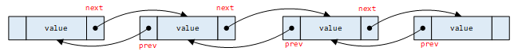

## 链表

### 链表简介

链表的结构不用多说，在Java语言中，我们有LinkedList是基于链表实现的，但是在C语言中没有这样的内置数据结构，所以redis构建了一个**双向链表**，主要用在**List**这种数据结构的底层实现，在发布与订阅、慢查询、监视器等功能也有用到。



下面是redis中对双向链表的定义

```c
// adlist.h

#ifndef __ADLIST_H__
#define __ADLIST_H__

/*
 * 双端链表节点
 */
typedef struct listNode {
	// 前驱节点
	struct listNode* prev;
	// 后继节点
	struct listNode* next;
	// 节点的值
	void* value;
} listNode;

/*
 * 双端链表迭代器
 */
typedef struct listIter {
	// 当前迭代节点
	listNode* next;
	// 迭代方向
	int direction;
} listIter;

typedef struct list {
	listNode* head;
	listNode* tail;
	unsigned long len;
} list;

 // 从表头向表尾进行迭代
#define AL_START_HEAD 0
// 从表尾到表头进行迭代
#define AL_START_TAIL 1

#endif
```

### 核心代码

#### 创建链表

```c
// adlist.c

/*
 * 创建一个新的链表
 *
 * 创建成功返回链表，失败返回 NULL 。
 *
 * T = O(1)
 */
list* listCreate() {
	struct list* list;
	list = malloc(sizeof(struct list));
	if (list == NULL) return NULL;

	list->head = list->tail = NULL;
	list->len = 0;
	list->dup = NULL;
	list->free = NULL;
	list->match = NULL;
	return list;
}
```

#### 链表中插入节点

```c
// adlist.c

/*
 * 向链表头插入节点
 *
 * T = O(1)
 */
list* listAddNodeHead(list* list, void* value) {
    listNode* node;
    node = malloc(sizeof(struct listNode));
    if (node == NULL) return NULL;

    node->value = value;
    if (list->len == 0) {
        list->head = node;
        list->tail = node;
        node->prev = NULL;
        node->next = NULL;
    } else {
        node->prev = NULL;
        node->next = list->head;
        list->head->prev = node;
        list->head = node;
    }
    list->len++;
    return list;
}

/*
 * 向链表尾插入节点
 * 
 * T = O(1)
 */
list* listAddNodeTail(list* list, void* value) {
    listNode* node;
    node = malloc(sizeof(struct listNode));
    if (node == NULL) return NULL;

    node->value = value;
    if (list->len == 0) {
        list->head = node;
        list->tail = node;
        node->prev = NULL;
        node->next = NULL;
    } else {
        node->prev = list->tail;
        node->next = NULL;
        list->tail->next = node;
        list->tail = node;
    }
    list->len++;
    return list;
}

/*
 * 插入到 old_node 的之前或之后
 *
 * 如果 after 为 0 ，将新节点插入到 old_node 之前。
 * 如果 after 为 1 ，将新节点插入到 old_node 之后。
 *
 * T = O(1)
 */
list* listInsertNode(list *list, listNode *old_node, void *value, int after) {
    listNode* node;
    node = malloc(sizeof(struct listNode));
    if (node == NULL) return NULL;

    node->value = value;
    if (after) {
        node->prev = old_node;
        node->next = old_node->next;
        old_node->next = node;
        if (list->tail == old_node) {
            list->tail = node;
        }
    } else {
        node->next = old_node;
        node->prev = old_node->prev;
        if (list->head == old_node) {
            list->head = node;
        }
    }

    // 将old_node的prev指向node
    if (node->prev != NULL) {
        node->prev->next = node;
    }

    // 将old_node的next指向node
    if (node->next !=NULL) {
        node->next->prev = node;
    }

    list->len++;
    return list;    
}
```

#### 从链表中删除节点

```c

/*
 * 从链表 list 中删除给定节点 node 
 * 
 * 对节点私有值(private value of the node)的释放工作由调用者进行。
 *
 * T = O(1)
 */
void listDelNode(list *list, listNode *node) {

    if (node->prev != NULL) {
        node->prev->next = node->next;
    } else {
        list->head = node->next;
    }
    
    if (node->next != NULL) {
        node->next->prev = node->prev;
    } else {
        list->tail = node->prev;
    }

    free(node);
    list->len--;
}
```

#### 链表的迭代

```c
/*
 * 为给定链表创建一个迭代器
 *
 * T = O(1)
 */
listIter *listGetIterator(list *list, int direction) {
    listIter* iter;
    iter = malloc(sizeof(struct listIter));
    if (iter == NULL) return NULL;

    if (direction == AL_START_HEAD) {
        iter->next = list->head;
    } else {
        iter->next = list->tail;
    }

    iter->direction = direction;
    return iter;
}

/*
 * 将迭代器的方向设置为 AL_START_HEAD ，
 * 并将迭代指针重新指向表头节点。
 *
 * T = O(1)
 */
void listRewind(list *list, listIter *li) {
    li->next = list->head;
    li->direction = AL_START_HEAD;
}

/*
 * 将迭代器的方向设置为 AL_START_TAIL ，
 * 并将迭代指针重新指向表头节点。
 *
 * T = O(1)
 */
void listRewindTail(list *list, listIter *li) {
    li->next = list->tail;
    li->direction = AL_START_TAIL;
}

/**
 * 释放迭代器
 */
void listReleaseIter(listIter *li) {
    free(li);
}

/**
 * 返回迭代器当前所指向的节点。
 */
listNode* listNext(listIter *iter) {
    listNode* current = iter->next;
    if (current != NULL) {
        if (AL_START_HEAD == iter->direction) {
            iter->next = current->next;
        } else {
            iter->next = current->prev;
        }
    }
    return current;
}
```
