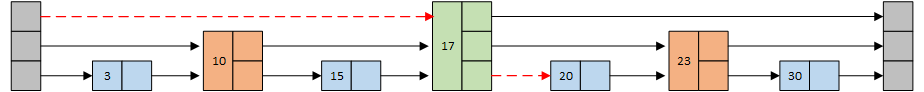
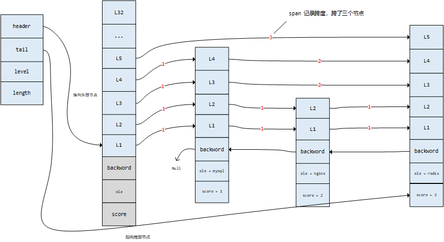

## 跳跃表

### 跳跃表简介

链表虽然插入时间复杂度是O(1)级别的，但是查询时间复杂度是O(N)级别的。为了将查询性能优化到O(logN)级别，我们可以使用平衡二叉树、红黑树等数据结构，其实除此之外，还有**跳跃表**也能实现平均O(logN)，最坏O(N)级别的查询时间复杂度，而且他的实现更加简单，因此redis中选择用跳跃表作为**Zset**的一种底层数据结构。

前面我们提到的链表每一个节点都有一个指针，指向下一个节点，那么如果我们将他稍作修改，首先给他**排个序**，然后给每相邻两个节点在加一个指针，让他指向下下一个节点，这样新添加的指针就又形成了一个新的链表，而这个新的链表上的节点只有原来的一半，那么当我们执行查询操作的时候就可以首先在这个新的链表上进行查找，如果没查到在返回原来的链表上查找。所遍历的节点数量也相应的少了。如下图所示：


假如查找20这个节点，如果在第一个链表中，需要遍历5次（红色虚线标识查找路径）如果在第二个优化后的链表中呢，首先在新的链表上查找，发现20比10和17都大，向后查找发现比23小，在回到下面的链表，顺利找到20，跳过了遍历3和15。只需要遍历3次。

通过这种方式，我们查找一个节点不在需要和链表中的每一个节点进行比较了，将遍历次数从5降低到了3，那么有没有可能继续降低遍历次数呢？如果继续在加一层新的链表。变成下面这样：



那么查找20就更简单了，首先遍历第三层链表访问17，发现比17大，第三层遍历结束，这样一下就跳过了3、10、15几个节点，再到第二层发现比23小，第二层遍历结束，回到第一层，顺利找到20，遍历次数从3降到了2。那么可以想象，当链表足够长的时候，这种方式能让我们少走很多弯路，极大的提高查找效率。如果一个链表，能将它拆分成理想的logN层，那么他的时间复杂度就可以达到和红黑树一样的O(logN)。我们将这种数据结构形象的叫做**跳跃表（SkipLsit）**。

在上面我们模拟的几个跳跃表中，每一层节点个数都是下一层节点个数的一半，但是在实际的插入节点的过程中，这个特性很容易破坏，如果我们要维护他，就会导致要递归的维护后面很多节点的特性，这样会让时间复杂度又退回到O(N)级别。那在实际的编码中，这个层数往往都是随机选择的。下面这张图模拟了一个构建跳跃表的过程：


从这个过程我们总结出跳跃表的构建过程分为三步：

1. 找到插入位置
2. 随机选择一个层数
3. 修改前后指针

这个过程中只有找插入位置是耗时的，O(logN)，修改指针和选择层数都可以忽略，而上面说的AVL树除了查找过程还需要不断的自旋来调节平衡，这就导致跳跃表的插入性能其实比平衡树要好一点。

### Redis中的跳跃表

了解了跳跃表的结构之后，我们一起在看下在redis中是如何设计和实现跳跃表的。下面代码是redis中对跳跃表的定义

```c
// server.h  旧版本在redis.h中

// 跳跃表中的节点
typedef struct zskiplistNode {
	// 记录真正的数据，之前的版本是robj *obj
    sds ele;
    
    // 每个节点的分值，用来排序
    double score;
    
    // 后退指针，指向上一个节点
    struct zskiplistNode *backward;
    
    // 层
    struct zskiplistLevel {
		// 前进指针，记录下一个指向的节点
        struct zskiplistNode *forward;

        // 跨度，记录距离
        unsigned long span;
    } level[];
} zskiplistNode;

// 跳跃表的结构
typedef struct zskiplist {
    // 头结点和尾结点
    struct zskiplistNode *header, *tail;

    // 节点的数量
    unsigned long length;
    
    // 最大层数
    int level;
} zskiplist;
```

下面在对上述代码中几个概念做一个梳理：

1. `level[]`：每一个跳跃表节点可以有多层，所以这里用一个数组表示。
   1. `*forward`：前进指针指向下一个节点，用来从表头向表尾方向访问节点。
   2. `span`：跨度用来记录两个节点之间的距离。 两个节点之间的跨度越大，说明距离越远。这个属性可用来计算排位（rank），`ZRANK key member`命令就是通过计算span实现的。例如下图中查找分值为3.0的节点时，只经过了一层，跨度为3，排位也为3。而查找分值为2.0的节点时，经过了两个跨度为1的节点，因此他的排位为2。
2. `*backward`：后退指针用来从表尾向表头方向访问节点，后退指针每次只能退至前一个节点，不像前进指针可以跨越好几个节点。
3. `score`：分值是一个double类型的浮点数，跳跃表中所有节点都按照分值从小到大排序，如果多个节点分值一样，那么按照ele的字典顺序进行排序。
4. `ele`：成员对象，指向一个sds的指针，记录真正的数据



### 核心代码
#### 创建跳跃表

```c
# t_zset.c

zskiplist *zslCreate(void) {
    int j;
    zskiplist *zsl;

    // 分配内存空间并初始化
    zsl = zmalloc(sizeof(*zsl));
    zsl->level = 1;
    zsl->length = 0;
    
    // 初始化表头节点
    zsl->header = zslCreateNode(ZSKIPLIST_MAXLEVEL,0,NULL);
    for (j = 0; j < ZSKIPLIST_MAXLEVEL; j++) {
        zsl->header->level[j].forward = NULL;
        zsl->header->level[j].span = 0;
    }
    zsl->header->backward = NULL;
    zsl->tail = NULL;
    return zsl;
}

/*
 * 创建一个层数为 level 的跳跃表节点，分值为score，数据为ele的新节点
 */
zskiplistNode *zslCreateNode(int level, double score, sds ele) {
    zskiplistNode *zn =
        zmalloc(sizeof(*zn)+level*sizeof(struct zskiplistLevel));
    zn->score = score;
    zn->ele = ele;
    return zn;
}
```

#### 计算排位

```c
/*
 * 查找包含给定分值和成员对象的节点在跳跃表中的排位。
 * 如果没有找到就返回 0 ，否则返回排位。
 * 跳跃表的表头也被计算在内，所以返回的排位以 1 为起始值。
 */
unsigned long zslGetRank(zskiplist *zsl, double score, sds ele) {
    zskiplistNode *x;
    unsigned long rank = 0;
    int i;

    // 链表的遍历，从头结点开始，先遍历顶层，然后下降一层，往前遍历，找到所有经过的节点，将span进行累加
    // 从上往下，从左往右
    //  _____
    //       |____
    //            |_____
    x = zsl->header;
    for (i = zsl->level-1; i >= 0; i--) {
        // 前进节点不为空，如果为空，一层的遍历就结束了
        while (x->level[i].forward &&
               // 满足下面的条件，就是x分值小于我们要找的分值或者（相等并且成员变量小于等于我们要找的成员变量），那么这个节点就是经过的节点
            (x->level[i].forward->score < score ||
                (x->level[i].forward->score == score &&
                sdscmp(x->level[i].forward->ele,ele) <= 0))) {
            // 没经过一个节点，将分值累加，然后x往前走，继续遍历
            rank += x->level[i].span;
            x = x->level[i].forward;
        }

        /* x might be equal to zsl->header, so test if obj is non-NULL */
        if (x->ele && sdscmp(x->ele,ele) == 0) {
            return rank;
        }
    }
    return 0;
}
```

#### 插入节点

```c
/* Returns a random level for the new skiplist node we are going to create.
 * The return value of this function is between 1 and ZSKIPLIST_MAXLEVEL
 * (both inclusive), with a powerlaw-alike distribution where higher
 * levels are less likely to be returned. */
int zslRandomLevel(void) {
    int level = 1;
    while ((random()&0xFFFF) < (ZSKIPLIST_P * 0xFFFF))
        level += 1;
    return (level<ZSKIPLIST_MAXLEVEL) ? level : ZSKIPLIST_MAXLEVEL;
}

/*
 * 创建一个成员为 ele ，分值为 score 的新节点，
 * 并将这个新节点插入到跳跃表 zsl 中。
 * 
 * 函数的返回值为新节点。
 */
zskiplistNode *zslInsert(zskiplist *zsl, double score, sds ele) {
    // update数组用来存储搜索路径，x是搜索过程中移动的指针
    zskiplistNode *update[ZSKIPLIST_MAXLEVEL], *x;
    // 存储经过的节点跨度，用来做排名，这两个数字的下标都是层数的索引
    unsigned int rank[ZSKIPLIST_MAXLEVEL];
    int i, level;

    serverAssert(!isnan(score));
    x = zsl->header;
    
    // 从最高层开始降级遍历，找到插入点，记录搜索路径
    for (i = zsl->level-1; i >= 0; i--) {
        // 初始化一下，最高层默认从0开始，不是的话，赋值为上一层的跨度，
        // 因为整个过程是自高往下，从左往右的，索引span只会越来越大，最起码停在原来的节点，那也是上一层的span
        rank[i] = i == (zsl->level-1) ? 0 : rank[i+1];
        
        // for循环控制的往下，while循环控制的往右，按照分值和value值作比较
        while (x->level[i].forward &&
                (x->level[i].forward->score < score ||
                    (x->level[i].forward->score == score &&
                    sdscmp(x->level[i].forward->ele,ele) < 0)))
        {
            // 参考获取排位的代码，如果进来这个循环，说明横向跨过了一个节点，那么rank要累加
            rank[i] += x->level[i].span;
            x = x->level[i].forward;
        }
        // 记录将要和新节点相连接的节点
        update[i] = x;
    }
    
    // 获取一个随机值作为新节点的层数
    level = zslRandomLevel();
    
    // 如果新节点的层数比表中其他节点的层数都要大
    // 那么初始化表头节点中未使用的层，并将它们记录到 update 数组中，将来也指向新节点
    if (level > zsl->level) {
        for (i = zsl->level; i < level; i++) {
            rank[i] = 0;
            update[i] = zsl->header;
            update[i]->level[i].span = zsl->length;
        }
        
        zsl->level = level;
    }
    
    x = zslCreateNode(level,score,ele);
    
    // 将前面记录的指针指向新节点，并做相应的设置
    for (i = 0; i < level; i++) {
        // 下面两行让新节点指向下一个节点，让新节点的前一个节点指向新节点
        x->level[i].forward = update[i]->level[i].forward;
        update[i]->level[i].forward = x;

        /* update span covered by update[i] as x is inserted here */
        // 计算新节点跨越的节点数量
        x->level[i].span = update[i]->level[i].span - (rank[0] - rank[i]);
        // 插入一个新节点，那么新节点的前驱节点向后移动了一个位置
        update[i]->level[i].span = (rank[0] - rank[i]) + 1;
    }

	// 新节点的层数如果不是最高的，那么他经过的那些节点的高层span都要加1
    for (i = level; i < zsl->level; i++) {
        update[i]->level[i].span++;
    }

    // 下面几行让新节点的bw指针和前一个节点关联起来，让新节点的后一个节点的bw指针和前一个节点关联起来
    // 66 67行这几行共同完成了新节点插入到跳跃表中的过程
    x->backward = (update[0] == zsl->header) ? NULL : update[0];
    if (x->level[0].forward)
        x->level[0].forward->backward = x;
    else
        zsl->tail = x;
    
    zsl->length++;
    return x;
}
```


