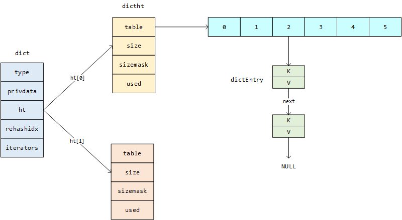

## 字典

在Java语言中有Map，用来表示K-V键值对，每一个K关联一个V，K是唯一的，我们可以快速的根据K查询到V。Java中的map有两种代表的实现方式，基于红黑树的`TreeMap`，基于Hash表的的`HashMap`。在Go语言中也有类似的数据结构Map，也是基于hash表实现的，因此是无序的。在Python中也有类似的数据结构，不过换了一种名字，叫**字典**。但是在C语言中只有数组，没有字典这样的数据结构，Redis是用C语言写的，是一个K-V结构的NoSql数据库，其中有大量的场景需要用到字典，比如Hash这种数据结构的底层实现就是基于字典的。那么我们今天就来一探究竟看看Redis中的字典是如何实现的吧。

### 字典的定义和实现

#### 字典

Redis中对字典的定义在dict.h头文件中，一共有五个属性

- `type`：指向`dictType`的指针变量，`dictType`中定义一组函数指针，也叫**虚函数表**，函数指针什么意思呢？在C语言中，定义的函数编译后会分配一块内存空间去存储，这段内存空间的入口我们叫做函数的入口地址，而函数名就可以代表这个地址，**因此函数名就是函数的指针**。`uint64_t (*hashFunction)(const void *key);`这段代码的意思就是定义了一个指向函数的指针变量`hashFunction`指向一个函数，函数名叫做`hashFunction`，返回值类型是`uint64_t `，参数列表是`const void *key`。为什么redis要定义这个东西呢？因为字典在redis中的使用场景很多，而且key和value的类型可能是SDS、redisObject等不同类型，那么针对不同的类型计算hash值等的实现方式也是不同的，如何让这段代码能动态的根据key的类型去自动选择相关的逻辑，实现一个我们面向对象中的所说的多态呢？答案就在这里了。具体可以参考：[C语言也有封装、继承和多态](https://blog.csdn.net/weixin_40149557/article/details/123625475)。
- `privata`：这个是和上面的属性结合使用的，上面定义了虚函数表，需要的参数将来通过这个属性去传递。
- `dictht`：**dictht**属性是字典的基础数据结构，ht是hashtable的缩写，表示**哈希表**的意思。这里定义成长度为2的数组，表示一个字典中有两个hash表。
- `rehashidx`：当hash表中的K-V对不断增加的时候，需要对hash表进行弹性的扩容，这个过程是通过rehash实现的，而`rehashidx`则表示了rehash的进度，-1的时候表示不需要rehash。
- `iterators`：迭代器

```c
typedef struct dict {
    // 类型特定函数
    dictType *type;
    // 私有数据
    void *privata;
    // hash表数组，表示字典有两个hash表
    dictht ht[2];
    // rehash哈希的进度
    long rehashidx;
    unsigned long iterators; /* number of iterators currently running */
} dict;

typedef struct dictType {
    // 计算hash值的函数
    uint64_t (*hashFunction)(const void *key);
    // 赋值key的函数
    void *(*keyDup)(void *privdata, const void *key);
    // 赋值val的函数
    void *(*valDup)(void *privdata, const void *obj);
    // 比较key的函数
    int (*keyCompare)(void *privdata, const void *key1, const void *key2);
    // 销毁key的函数
    void (*keyDestructor)(void *privdata, void *key);
    // 销毁值的函数
    void (*valDestructor)(void *privdata, void *obj);
} dictType;
```

#### hash表

前面说字典的核心数据结构是hash表，那我们在一起看下hash表的结构是怎么设计的

- `table`：C语言中有一个概念叫指针数组，比如`int *arr[4]`，表示arr这个数组中的每一个元素都是指针变量，存放的是一个地址，arr是数组名，数组名是数组中0号元素的地址，所以arr就是指向0号元素的一个地址，也就是说arr是一个**指向指针的指针**。我们这里的`dictEntry **table`也是一个指向指针的指针，后续可以用它指向一个指针数组。所以这个属性在后面的应用中是一个指针数组，数组中每一个元素都是指向`dictEntry`的一个指针。
- `size`：table数组的容量，这个值在计算的时候总是按照2的次方取，和`HashMap`规则是一样的。
- `sizemask`：hash表容量的掩码，总是等于`size - 1`，用来根据hash值计算在table中的索引，计算方式：`hash & d->ht[table].sizemask`，根据&运算实现求余数，这一点也和`HashMap`是一样的。
- `used`：已经使用的节点的数量。
- `dictEntry`：hash表数组中的一个节点
  - `key`：指向K-V键值对中的K的指针，void类型的指针，表示指向不确定数据类型的指针变量，
  - `v`：K-V中的V，用一个共用体表示，共用体的特点是同一段内存空间可以存储不同类型的数据，但是某一个时刻只能存放其中一种类型的数据。
  - `next`：next是指向下一个K-V键值对的指针，用来解决哈希冲突，这点和`HashMap`的解决方式也是一样的，都是用链地址法解决。

```c
// hash表结构
typedef struct dictht {
    // 一个指针数组，里面每一个元素都是指向dictEntry的一个指针
    dictEntry **table;
    unsigned long size;
    // size - 1, 掩码，用来计算下标
    unsigned long sizemask;
    // 已经使用节点
    unsigned long used;
} dictht;

// hash表节点
typedef struct dictEntry {
    void *key;
    union {
        void *val;
        uint64_t u64;
        int64_t s64;
        double d;
    } v;
    // next指针，执行下个节点，hash冲突的时候用来解决冲突
    struct dictEntry *next;
} dictEntry;
```

基于以上的基本描述，我们可以得出一个基本的字典应该是下图这样的。

### 核心代码

#### 创建字典

```c
dict *dictCreate(dictType *type,
        void *privDataPtr)
{
    dict *d = zmalloc(sizeof(*d));

    _dictInit(d,type,privDataPtr);
    return d;
}

int _dictInit(dict *d, dictType *type,
        void *privDataPtr)
{
    _dictReset(&d->ht[0]);
    _dictReset(&d->ht[1]);
    d->type = type;
    d->privdata = privDataPtr;
    d->rehashidx = -1;
    d->iterators = 0;
    return DICT_OK;
}

static void _dictReset(dictht *ht)
{
    ht->table = NULL;
    ht->size = 0;
    ht->sizemask = 0;
    ht->used = 0;
}
```

#### Hash算法&冲突的解决

Redis中的hash算法在不同场景有不同的实现，这里只介绍如何通过type定义的虚函数表实现多态的方式，调用到不同的hash函数，至于其具体实现，并没有展开分析，感兴趣的同学可自行了解。

```c
// dict.c
// 这个方法暂时只关注12行和19、20行
dictEntry *dictAddRaw(dict *d, void *key, dictEntry **existing)
{
    long index;
    dictEntry *entry;
    dictht *ht;

    if (dictIsRehashing(d)) _dictRehashStep(d);

    // dictHashKey对一个key求hash值，_dictKeyIndex是根据算出来的hash值求其在hash表中的索引
    if ((index = _dictKeyIndex(d, key, dictHashKey(d,key), existing)) == -1)
        return NULL;

    ht = dictIsRehashing(d) ? &d->ht[1] : &d->ht[0];
    entry = zmalloc(sizeof(*entry));
    
    // 单向链表头部插入节点的代码，解决hash冲突
    entry->next = ht->table[index];
    ht->table[index] = entry;
    
    ht->used++;

    /* Set the hash entry fields. */
    dictSetKey(d, entry, key);
    return entry;
}

// dict.h
// 接第12行，这是一个宏定义，定义dictHashKey的逻辑是取到当前字典的type属性，然后取到type函数列表中的hashFunction这个函数的入口地址，通过这个地址去调用对应的函数
#define dictHashKey(d, key) (d)->type->hashFunction(key)

// t_hash.c
// 那么这个type属性是什么时候赋值的呢？是在创建字典的时候指定的，例如t_hash.c中使用了字典，指定type为hashDictType
dict = dictCreate(&hashDictType, NULL);

// server.c中定义了很多中type，其中就有我们上面用到的hashDictType
// 这里定义计算hash值的函数为dictSdsHash函数
dictType hashDictType = {
    dictSdsHash,                /* hash function */
    NULL,                       /* key dup */
    NULL,                       /* val dup */
    dictSdsKeyCompare,          /* key compare */
    dictSdsDestructor,          /* key destructor */
    dictSdsDestructor           /* val destructor */
};

// server.c
uint64_t dictSdsHash(const void *key) {
    return dictGenHashFunction((unsigned char*)key, sdslen((char*)key));
}

// dict.c
uint64_t dictGenHashFunction(const void *key, int len) {
    // 定义在siphash.c中的hash函数，
    // 关于这个函数的详细介绍，感兴趣可以参考： https://www.kernel.org/doc/html/latest/security/siphash.html
    return siphash(key,len,dict_hash_function_seed);
}
```

下面这段代码介绍如何通过hash值计算出某一个key在hash表中的索引。

```c
static long _dictKeyIndex(dict *d, const void *key, uint64_t hash, dictEntry **existing)
{
    unsigned long idx, table;
    dictEntry *he;
    if (existing) *existing = NULL;

    // 扩容函数，暂不关注
    if (_dictExpandIfNeeded(d) == DICT_ERR)
        return -1;
    for (table = 0; table <= 1; table++) {
        // hash表的size总是以2的次方增长的，sizemask总是等于size - 1，因此这里用&运算模拟除以 hash % size,计算在数组中的下标
        // 这点和HashMap是一样的：tab[i = (n - 1) & hash]
        idx = hash & d->ht[table].sizemask;
        
        // 查找计算出来的位置是否已经包含给定的key，如果he变为NULL，则进入循环，比较key值是否相等，如果相等则返回-1
        he = d->ht[table].table[idx];
        while(he) {
            if (key==he->key || dictCompareKeys(d, key, he->key)) {
                if (existing) *existing = he;
                return -1;
            }
            // hash表通过链地址法解决hash冲突，所以如果第一次比对key值不相等，还要遍历链表
            he = he->next;
        }
        if (!dictIsRehashing(d)) break;
    }
    return idx;
}
```

这里解释一下为什么size总是以2的次方增长的，而且要用`hash & d->ht[table].sizemask`的方式计算索引，原因主要有三点

1. 位运算的效率高于其他运算

2. 减少内存碎片，计算机是二进制工作的，很多指标都是以2的倍数为单位的，所以定义成2的次方这种数值有助于充分利用内存

3. 减少哈希冲突

   ```
   假设size = 16, size - 1 = 15 --> 0000 1111和下面两个数进行&操作得到的结果如下
   0000 1111 &
   0000 0001 --- 0000 0001
   0011 0000 --- 0000 0000
   
   假设size = 15, size - 1 = 14 --> 0000 1110和下面两个数进行&操作得到的结果如下
   0000 1110 &
   0000 0001 --- 0000 0000
   0011 0000 --- 0000 0000
   
   明显当size为2的倍数时候， 能大大减少hash冲突的概率 hash & d->ht[table].sizemask 等价于hash % size
   ```

#### Hash表的扩容

```c
#define DICT_HT_INITIAL_SIZE     4
static int dict_can_resize = 1;
static unsigned int dict_force_resize_ratio = 5;


// dict.c
static int _dictExpandIfNeeded(dict *d)
{
    if (dictIsRehashing(d)) return DICT_OK;
    
    // 前面说一个字典有两个hash表，ht[0]和ht[1]，添加K-V键值对的时候先往ht[0]中放，如果ht[0]的size=0，就扩容
    if (d->ht[0].size == 0) return dictExpand(d, DICT_HT_INITIAL_SIZE);

    /* If we reached the 1:1 ratio, and we are allowed to resize the hash
     * table (global setting) or we should avoid it but the ratio between
     * elements/buckets is over the "safe" threshold, we resize doubling
     * the number of buckets. */
    // 满足以下条件，也要进行扩容
    // case1：ht[0]已经使用的hash表节点大于等于ht[0]的size，说明原来的空间已经用完了，那么就要扩容，
    //        这个扩容条件是比较松的，因为他还有一个条件是dict_can_resize为真
    // case2：ht[0]已经使用的hash表节点 / ht[0]的size大于dict_force_resize_ratio，这个值=5，类似于HashMap的负载因子的概念
    // 		  这个条件是强制的，什么情况下used / size会超过5呢？那就说明哈希冲突已经很严重了，因此必须要扩容
    if (d->ht[0].used >= d->ht[0].size &&
        (dict_can_resize ||
         d->ht[0].used/d->ht[0].size > dict_force_resize_ratio))
    {
        return dictExpand(d, d->ht[0].used*2);
    }
    return DICT_OK;
}

int dictExpand(dict *d, unsigned long size)
{
    /* the size is invalid if it is smaller than the number of
     * elements already inside the hash table */
    if (dictIsRehashing(d) || d->ht[0].used > size)
        return DICT_ERR;

    dictht n; /* the new hash table */
    unsigned long realsize = _dictNextPower(size);

    /* Rehashing to the same table size is not useful. */
    if (realsize == d->ht[0].size) return DICT_ERR;

    // 初始化hash表，设置size、sizemask、used等参数
    n.size = realsize;
    n.sizemask = realsize-1;
    // 前面说了hash表结构的table属性是一个二级指针，可以看做一个指针数组，为什么可以这样看，原因在这里
    // 这里开辟了一块连续的内存空间，让table指向了首地址
    n.table = zcalloc(realsize*sizeof(dictEntry*));
    n.used = 0;

    // 让字典的ht[0]指向我们新创建的hash表
    if (d->ht[0].table == NULL) {
        d->ht[0] = n;
        return DICT_OK;
    }

    // 如果 0 号哈希表非空，那么这是一次 rehash，让ht[1]指向我们新创建的hash表
    // 并将字典的 rehash 标识打开，让程序可以开始对字典进行 rehash
    // 什么是rehash，这里暂不关注，后续展开
    d->ht[1] = n;
    d->rehashidx = 0;
    return DICT_OK;
}

// 计算hash表的size，取大于size的第一个2的次方
static unsigned long _dictNextPower(unsigned long size)
{
    unsigned long i = DICT_HT_INITIAL_SIZE;

    if (size >= LONG_MAX) return LONG_MAX + 1LU;
    while(1) {
        if (i >= size)
            return i;
        i *= 2;
    }
}
```

#### 渐进式rehash

扩容的核心一步是：`n.table = zcalloc(realsize*sizeof(dictEntry*));`，也就是申请了一块新的内存空间，那么申请完新的内存空间后，hash表就面临了一个需要立马解决的问题：将原来的旧的hash表中的数据迁移到新的hash表，而且不能把之前的K-V按照原来的位置照搬过来，因为原来的hash表容量有限，可能随着数据越来越多，会导致冲突越来越严重，最终导致hash表中某一个索引下挂的链表越来越长，查询时间复杂度也越来越低。因此要对原来的K-V重新计算hash值，重新计算在新hash表的索引，然后在迁移到新的hash表。但是这个过程不能一次性完成，因为如果原来的hash表中只有4个8个K-V对，那么迁移到新hash表是很快的，但是如果有成千上万个K-V的话，那么一次性将这么多K-V转移到ht[1]会对服务器造成很大的压力，而且redis6.0是前是单线程的，就会导致redis客户端被阻塞。因此分批、缓慢、逐渐的完成这个操作。这个过程就叫**渐进式rehash**。整体的流程如下：

1. 为字典的ht[1]分配空间
2. 字典中有一个`rehashidx`属性，初始化为-1，现在设置为0，表示rehash工作开始
3. rehash期间，字典每次执行增删改查操作时候，除了完成指定的命令，还会将ht[0]在`rehashidx`索引上的所有K-V都rehash到ht[1]，然后`rehashidx + 1`
4. 随着字典的操作不断执行，最终咋某一个时间点上，ht[0]上的所有K-V都已经rehash到了ht[1]，此时将`rehashidx`设置为-1，表示rehash工作结束
5. 当ht[0]包含的所有K-V都迁移到ht[1]之后，ht[0]变为空表，将其释放，将ht[1]设置为ht[0]，原来的ht[0]设置为一个空的hash表，为下一次rehash做准备

```c
static void _dictRehashStep(dict *d) {
    if (d->iterators == 0) dictRehash(d,1);
}

int dictRehash(dict *d, int n) {
    int empty_visits = n*10; /* Max number of empty buckets to visit. */
    if (!dictIsRehashing(d)) return 0;

    while(n-- && d->ht[0].used != 0) {
        dictEntry *de, *nextde;

        /* Note that rehashidx can't overflow as we are sure there are more
         * elements because ht[0].used != 0 */
        assert(d->ht[0].size > (unsigned long)d->rehashidx);
        
        // 跳过hash表中为空的索引，hash表示一个数组，有可能某些索引位置没有元素，直接跳过
        while(d->ht[0].table[d->rehashidx] == NULL) {
            d->rehashidx++;
            if (--empty_visits == 0) return 1;
        }
        de = d->ht[0].table[d->rehashidx];
       	// 将原来的hash表中某一个位置的所有K-V转移到新的hash表
        while(de) {
            uint64_t h;

            nextde = de->next;
            // 计算在新hash表中的hash值和索引
            h = dictHashKey(d, de->key) & d->ht[1].sizemask;
            
            // 插入节点到新哈希表
            de->next = d->ht[1].table[h];
            d->ht[1].table[h] = de;
            
            // 更新used属性，新hash表+1，旧hash表-1
            d->ht[0].used--;
            d->ht[1].used++;

            // 因为有可能原来hash表一个索引位置对应的是一个链表，所以让指针往前移动，遍历链表，处理下一个节点
            de = nextde;
        }
        // 迁移完之后，将其指针置空
        d->ht[0].table[d->rehashidx] = NULL;
		// 更新rehash进度
        d->rehashidx++;
    }

    // 满足这个条件，说明ht[0]上的所有hash表已经都转移到了ht[1]
    if (d->ht[0].used == 0) {
        // 释放ht[0]，对应c语言库函数free()
        zfree(d->ht[0].table);
        // 原来的ht[1]设置为ht[0]
        d->ht[0] = d->ht[1];
        _dictReset(&d->ht[1]);
        // 设置为-1，表示rehash完成
        d->rehashidx = -1;
        return 0;
    }

    /* More to rehash... */
    return 1;
}
```

