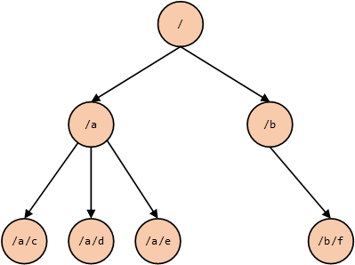
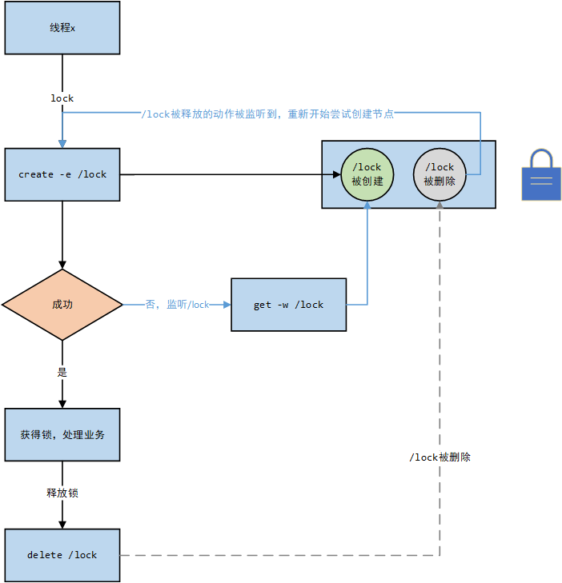
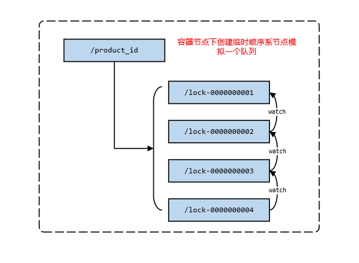
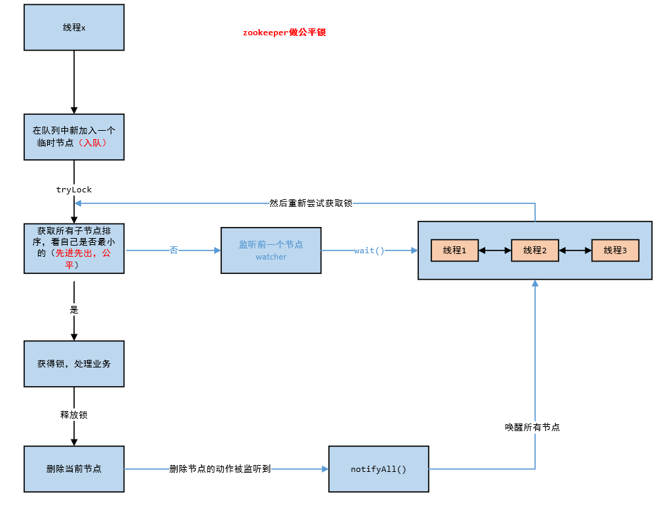

# zk做分布式锁

## 基于进程的锁在分布式场景下失效

### 无锁

首先我们模拟一个简单的扣减库存的场景，来一步步验证一下基于进程的锁是如何在分布式情况下失效的。

1. 首先我们创建一个简单的库存表，并初始化一条数据。

    ```
    mysql> select * from product;
    +----+--------------+-------+
    | id | product_name | stock |
    +----+--------------+-------+
    |  1 | ECS:1C2048M  |     1 |
    +----+--------------+-------+
    ```

2. 搭建一个web工程，模拟一个扣减库存的服务，简单代码如下：

   ```java
   // controller代码
   @GetMapping("/stock/reduce")
   public String reduceStock(Integer id) throws Exception {
       try {
           productService.reduceStock(id);
       } catch (Exception e) {
           log.error("error caused...", e);
       }
       return "OK";
   }
   
   // service代码
   @Transactional
   public void reduceStock(Integer id) throws InterruptedException {
       Product product = productMapper.getProduct(id);
       if (product.getStock() <= 0) {
           log.error("reduce stock failed, out of stock...");
           return;
       }
       int i = productMapper.reduceStock(id);
       if (i == 1) {
           log.info("deduct stock success...");
       } else {
           log.error("deduct stock failed, i = {}", i);
       }
   }
   
   // sql
   @Update("update product set stock = stock - 1 where id = #{id}")
   int reduceStock(@Param("id") Integer id);
   
   @Select("select * from product where id = #{id}")
   Product getProduct(@Param("id") Integer id);
   ```

3. 用JMeter启动五十个线程，循环10次做压测，模拟一个高并发的情况，然后看库存表发现出现了超卖。

   ```
   mysql> select * from product;
   +----+--------------+-------+
   | id | product_name | stock |
   +----+--------------+-------+
   |  1 | ECS:1C2048M  |    -9 |
   +----+--------------+-------+
   1 row in set (0.00 sec)
   ```

### 单机情况加锁解决

单机情况下，我们可以通过synchroized或者Lock进行加锁，防止多线程并发导致的超卖问题，那么我们对上述代码稍作修改

```java
@GetMapping("/stock/reduce")
public String reduceStock(Integer id) throws Exception {
    
    Lock lock = new ReentrantLock();
    try {
        lock.tryLock();
        productService.reduceStock(id);
    } catch (Exception e) {
        log.error("error caused...", e);
    } finally {
        lock.unlock();
    }
    
    return "OK";
}
```

然后在通过JMeter进行压测，查询库存情况发现库存刚好是0，没有出现超卖的情况，这当然是符合我们预期的。

```
+----+--------------+-------+
| id | product_name | stock |
+----+--------------+-------+
|  1 | ECS:1C2048M  |     0 |
+----+--------------+-------+
1 row in set (0.00 sec)
```

### 多节点情况下锁失效的情况

但是如果用户量大，那么一台服务器往往是没有办法承担高并发的业务的，这个时候我们往往会进行分布式集群部署。将一份代码部署在多个节点上，然后通过Nginx做反向代理和负载均衡，实现真正的高可用。这里我们通过在不同的端口启动服务，然后用Nginx配置负载均衡，来模拟一个分布式集群场景：

```
upstream tomcatserver {
	// 将上面扣减库存的服务部署在这两个节点，然后访问nginx，会采用轮询的方式将请求进行转发
    server ip:8888;
    server ip:9999;
}

server {
    // 省略无关代码

    location / {
        root   html;
        index  index.html index.htm;
        proxy_pass http://tomcatserver;
    }

    // 省略无关代码
}
```

这个时候在用JMeter做压测，会发现又出现了超卖的情况。这是因为例如`lock`、`synchronized`这些锁都是基于进程而言的，只能在本机有效，而无法对多个进程之间的共享资源进行加锁。这个时候就需要实现一个分布式锁。那么如何实现呢，只要能保证全局唯一，那么就可以，因此数据库可以实现、redis可以实现、zookeeper也可以实现。

```
mysql> select * from product;
+----+--------------+-------+
| id | product_name | stock |
+----+--------------+-------+
|  1 | ECS:1C2048M  |    -5 |
+----+--------------+-------+
1 row in set (0.00 sec)
```

## zk做分布式锁

### zk节点类型简介

接下来我们重点探讨zookeeper如何实现分布式锁。首先我们要知道zk是什么，其实它可以看作是一个简单的树形文件系统。类似下图：

那每一个目录项都被定义为一个**znode(目录节点)**，他提供了创建、删除、查询**znode**的一些Api。其中，这个znode一共有四种类型：

1. 持久化节点：创建后，如果不主动删除，永远存在
2. 临时节点：客户端和zk断开，该节点就会被主动删除
3. 持久化顺序节点：有持久化节点的特性，并且有序
4. 临时顺序节点：有临时节点的特性，并且有序
5. 容器节点：该节点创建后，后台会有定时任务每隔一分钟检查一次该节点下面有无子节点，如果没有，就会被删除掉
6. TTL节点：可以设置过期时间，到期后被删除，不常用

除以上的基本数据结构外，zk还支持监听机制，我们可以对一个节点注册一个监听器，当该节点发生对应的监听事件，比如删除，那么我们就可以监听，并根据自己的业务做响应的处理。




### 非公平锁

根据以上特性，我们就可以很简单的用zk实现一个非公平锁，实现思路可分为如下几步：

1. 当有线程1、2、3并发请求时，让其都在zk上创建一个名为**/lock**节点
2. 那么同时肯定只能有一个线程创建成功，假设线程1创建成功，那么线程2、3在创建，只会提示该节点已经存在，这样模拟线程1**加锁成功**，让他执行业务
3. 此时让线程2、3加锁失败，就监听**/lock**这个节点，模拟排队**等待锁被释放**
4. 当线程1执行完业务逻辑后，删除**/lock**节点，模拟**释放锁**
5. 当**/lock**被删除后，就会被线程2、3监听到，他们就可以重新尝试创建该节点



### 公平锁

#### 实现思想

上述公平锁固然能解决问题，但是他有一个缺点就是，如果并发量大，那么同一时刻会有很多连接对同一节点进行监听，但检测到删除事件后，zk需要通知所有的连接，所有连接收到监听后，会同一时间在发生高并发竞争，给性能带来严重损耗。所以大多数场景下我们还是应该用公平锁去实现。

那么用zk如何实现公平锁呢，我们可以回过头想想AQS是如何设计一个公平锁的。他的思路无非三步：

1. 尝试获取锁，如果拿到锁则处理业务逻辑
2. 如果获取锁失败，则AQS提供了一个CLH队列，那么没有获得锁的线程就被安排到队列去排队等待
3. 等锁被释放后，从队列中取出一个线程尝试获取锁

这个过程中，因为队列是先进先出的，所以实现了公平的特性。因此我们也可以考虑如何用zk实现这套逻辑。那么其他的好说，这个队列如何模拟呢？结合上面对zk的介绍，我们发现其实可以用容器节点加临时顺序节点来模拟。

1. 假设我们现在对《堂吉诃德》这本书做秒杀，那么以这个产品ID为名称建立一个容器节点，模拟为**空队列**，其下面没有子节点就会自动删除
2. 有多个人来买书，就按顺序在容器节点下建立一个个子节点，因为顺序节点是有序的，模拟了**入队**
3. 然后让每一个节点监听前一个节点，这样当第一个节点被删除后，后一个节点就会感知到，然后去获取锁，模拟了**出队**。这样一来是不是就实现了**先进先出**



到这一步，有了队列，有了加锁的方法，有了释放锁的方法，我们就可以参考AQS实现一个公平锁了，大致思路如下：

1. 有线程来，先入队（在容器节点下加一个临时顺序节点）
2. 为了公平性，先让队列中第一个排队的去获取锁（获取容器节点中所以子节点进行排序，选出最小的）
3. 拿到锁，处理业务逻辑，没有拿到锁，就监听自己的前一个节点，通过调用`wait()`方法让这些线程在等待池中等待
4. 拿到锁的线程处理完业务逻辑后释放锁（删除自己创建的节点），然后通过`notifyAll()`方法唤醒所有在等待池中的线程，让他们尝试获取锁，走到第三步



#### curator如何使用

这一套逻辑呢，zk的**curator-recipes**已经帮我们实现好了，我们不用在重复造轮子了。下面我们看一下如何使用。

```xml
<!-- 引入依赖 -->
<dependency>
    <groupId>org.apache.zookeeper</groupId>
    <artifactId>zookeeper</artifactId>
    <version>3.5.8</version>
</dependency>

<!-- https://mvnrepository.com/artifact/org.apache.curator/curator-recipes -->
<dependency>
    <groupId>org.apache.curator</groupId>
    <artifactId>curator-recipes</artifactId>
    <version>5.0.0</version>
    <exclusions>
        <exclusion>
            <groupId>org.apache.zookeeper</groupId>
            <artifactId>zookeeper</artifactId>
        </exclusion>
    </exclusions>
</dependency>
```

```java
@GetMapping("/stock/reduce")
public String reduceStock(Integer id) throws Exception {
    // 创建锁对象，
    // param1: 客户端   param2: 容器节点路径
    InterProcessMutex interProcessMutex = new InterProcessMutex(curatorFramework, "/product_" + id);

    try {
        // 加锁
        interProcessMutex.acquire();
        productService.reduceStock(id);

    } catch (Exception e) {
        log.error("error caused...", e);
    } finally {
        // 释放锁
        interProcessMutex.release();
    }
    return "OK";
}
```

对代码加了分布锁，我们在用JMeter进行压测，发现问题完美解决，再也没有出现超卖的情况了。

#### InterProcessMutex源码分析

```java
@Override
public void acquire() throws Exception
{
    // 核心方法
    if ( !internalLock(-1, null) )
    {
        throw new IOException("Lost connection while trying to acquire lock: " + basePath);
    }
}

private boolean internalLock(long time, TimeUnit unit) throws Exception
{
    Thread currentThread = Thread.currentThread();

    // threadData-->ConcurrentMap  这里用threadData缓存线程和对应的锁，也是性能的优化
    LockData lockData = threadData.get(currentThread);
    if ( lockData != null )
    {
        // 可重入锁，重入次数+1  
        lockData.lockCount.incrementAndGet();
        return true;
    }

    // 加锁
    String lockPath = internals.attemptLock(time, unit, getLockNodeBytes());
    
    // 加锁成功 保存当前锁信息
    if ( lockPath != null )
    {
        LockData newLockData = new LockData(currentThread, lockPath);
        threadData.put(currentThread, newLockData);
        return true;
    }

    return false;
}

String attemptLock(long time, TimeUnit unit, byte[] lockNodeBytes) throws Exception
{
    
    // 在容器节点下面创建一个临时顺序节点，返回路径
    ourPath = driver.createsTheLock(client, path, localLockNodeBytes);
    // 这才是真正的加锁逻辑，如果成功，返回true，会将ourPath返回，否则返回null
    hasTheLock = internalLockLoop(startMillis, millisToWait, ourPath);
       
}

private boolean internalLockLoop(long startMillis, Long millisToWait, String ourPath) throws Exception
{
    while ( (client.getState() == CuratorFrameworkState.STARTED) && !haveTheLock )
    {
        // 获取容器节点下面所有的子节点并且排序
        List<String>        children = getSortedChildren();
        String              sequenceNodeName = ourPath.substring(basePath.length() + 1); // +1 to include the slash

        PredicateResults    predicateResults = driver.getsTheLock(client, children, sequenceNodeName, maxLeases);
        
        if ( predicateResults.getsTheLock() )
        {
            haveTheLock = true;
        }
        else
        {
            // 走到else说明加锁失败了
            String  previousSequencePath = basePath + "/" + predicateResults.getPathToWatch();

            synchronized(this)
            {
                try
                {
                    // 给前一个节点加一个监听，监听的逻辑可以点进去看就是唤醒所有等待的线程，这个可以参考上图理解
                    client.getData().usingWatcher(watcher).forPath(previousSequencePath);
                    if ( millisToWait != null )
                    {
                        millisToWait -= (System.currentTimeMillis() - startMillis);
                        startMillis = System.currentTimeMillis();
                        if ( millisToWait <= 0 )
                        {
                            doDelete = true;    // timed out - delete our node
                            break;
                        }

                        wait(millisToWait);
                    }
                    else
                    {
                        wait();
                    }
                }
                catch ( KeeperException.NoNodeException e )
                {
                    // it has been deleted (i.e. lock released). Try to acquire again
                }
            }
        }
    }
   
}


public PredicateResults getsTheLock(CuratorFramework client, List<String> children, String sequenceNodeName, int maxLeases) throws Exception
{
    // 当前节点在所有子节点中的索引位置
    int             ourIndex = children.indexOf(sequenceNodeName);
    validateOurIndex(sequenceNodeName, ourIndex);

    //maxLeases传的是1，如果这个返回true，那么说明ourIndex是0，是最小的节点，让他获得锁
    boolean         getsTheLock = ourIndex < maxLeases;
    // 如果他获得锁，那么它不需要监听其他节点，否则他需要监听前一个节点
    String          pathToWatch = getsTheLock ? null : children.get(ourIndex - maxLeases);

    return new PredicateResults(pathToWatch, getsTheLock);
}
```

```java
@Override
public String createsTheLock(CuratorFramework client, String path, byte[] lockNodeBytes) throws Exception
{
    String ourPath;
    if ( lockNodeBytes != null )
    {	
        // 这是创建节点的API，这里我们看到withProtection()这个方法，要着重说明一下是做什么的。
        // 一般情况，当我们发起向zk服务创建节点的请求后，有可能会失败，这个时候客户端会进行重试。
        // 但是有一个极端情况就是客户端发起了创建请求，服务端也创建成功了，但是当服务端想告诉客户端的时候，网络不好或者其他原因，没通知到
        // 这个时候客户端还会进行重试，并且session依然有效，那么前面创建的节点也不会删除，就成了所谓的幽灵节点，怎么解决呢
        // 这里通过给节点加一个UID做前缀，如果发生重试，服务端会找是否有这个UID的节点，有的话就直接返回，没有才创建
        ourPath = client.create().creatingParentContainersIfNeeded().withProtection().withMode(CreateMode.EPHEMERAL_SEQUENTIAL).forPath(path, lockNodeBytes);
    }
    else
    {
        ourPath = client.create().creatingParentContainersIfNeeded().withProtection().withMode(CreateMode.EPHEMERAL_SEQUENTIAL).forPath(path);
    }
    return ourPath;
}
```


