# 图论基础以及深度优先搜索和广度优先搜索
## 树的遍历

树这种数据结构在我们平时的开发工作中，也许很少用到，但是却经常听说，我们知道HashMap在JDK1.8之后用了**数组+链表+红黑树**的数据结构，在TreeMap中也是用到了**红黑树**，在数据库索引中广泛使用了**B+树**等等。由此可见树在我们计算机底层是一种非常重要的数据结构，今天这里我们不重点讨论树的相关性质，只是因为要理解图论，需要有一点树的基础知识。以前文章里有写到过，可参考：[二叉搜索树](https://blog.csdn.net/weixin_40149557/article/details/95931060)，[AVL树](https://blog.csdn.net/weixin_40149557/article/details/100543476)

树的遍历不像链表或者数组等线性数据结构一样简单，相对来说比较复杂。一般情况下，树的遍历方式有四种，**前序遍历**、**中序遍历**、**后续遍历**、**层序遍历**。其中前三种也叫深度优先遍历，层序遍历也叫广度优先遍历。下面我们详细探讨一下这几种遍历方式：

- 前序遍历：先访问根节点，在访问左子树，最后访问右子树
- 中序遍历：先访问左子树，在访问根节点，最后访问右子树
- 后续遍历：先访问右子树，在访问左子树，最后访问根节点
- 层序遍历：也就是一层一层遍历输出

### 前序、中序、后序遍历的递归实现

下图中，我们从根节点5出发 ，一次访问左子树，右子树，那么每个节点都有三次被访问到的机会，我们用不同的颜色表示。前序遍历就是每一个节点当第一次访问就表示被遍历到，所谓中序遍历就是一个节点第二次被访问才表示被遍历到，后序遍历就是一个节点第三次访问才表示被遍历到。以下面这颗二叉搜索树为例，我们按照这个思路给出了各种遍历的一个结果，然后发现中序遍历的结果其实是对这颗二叉搜索树排序后的结果，为什么会这样呢，我们回想一下中序遍历的过程，总是先访问左子树，在访问根节点，最后访问右子树，而二叉搜索数的性质就是左孩子总是小于根节点，右孩子总是大于根节点。

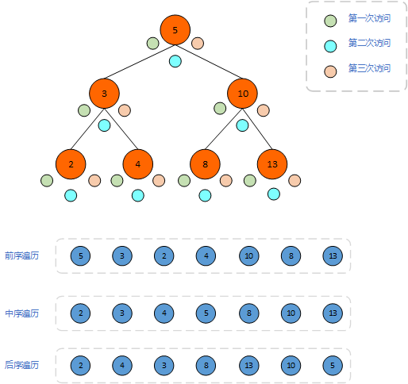

```java
/**
 * 前序遍历
 */
public void preOrder() {
    preOrder(root);
}

/**
 * 前序遍历 先访问根节点，在访问左右子树, 递归算法
 * @param node
 */
private void preOrder(Node node) {
    if (null == node) {
        return;
    }
    System.out.println(node.e);
    preOrder(node.left);
    preOrder(node.right);
}

/**
 * 中序遍历
 */
public void inOrder() {
    inOrder(root);
}

/**
 * 中序遍历 先访问左子树，在访问根节点和右子树, 递归算法
 * @param node
 */
private void inOrder(Node node) {
    if (null == node) {
        return;
    }
    inOrder(node.left);
    //Gson gson = new Gson();
    //String json = gson.toJson(node);
    System.out.println(node.e);
    inOrder(node.right);
}

/**
 * 后序遍历
 */
public void postOrder() {
    postOrder(root);
}

/**
 * 后序遍历 先访问左子树，在访问右子树和根节点, 递归算法
 * @param node
 */
private void postOrder(Node node) {
    if (null == node) {
        return;
    }
    postOrder(node.left);
    postOrder(node.right);
    System.out.println(node.e);
}
```

### 层序遍历

二叉搜索树的层序遍历如何实现呢，我们还是以上面那棵树为例，第一次肯定先访问5这个节点，然后将其输出，那么在到第二层，应该如何将5的左孩子和右孩子一次遍历到呢？这里我们需要借助一个队列来实现，那就是在访问完根节点后，将他的左右孩子放入一个队列，然后借助队列先进先出的方式，就可以实现这样一个效果，代码如下：

```java
/**
 * 层序遍历
 */
public void levelOrder() {
    if (null == root) {
        return;
    }

    Queue<Node> queue = new LinkedList<>();
    queue.add(root);
    while (!queue.isEmpty()) {
        Node cur = queue.remove();
        System.out.print(cur.e + " ");
        if (null != cur.left) {
            queue.add(cur.left);
        }
        if (null != cur.right) {
            queue.add(cur.right);
        }
    }
}
```

## 图论

学习图有什么用？也许在平时的工作中，他确实没用，你感知不到他的存在，但是在实际的应用和计算机领域中，图可谓是相当重要的一种数据结构，比如在西安的地铁交通网，我们就可以把每一个站点抽象成图中的一个**顶点**，两个顶点之间的路线抽象成图中的一条**边**，然后通过图对整个地铁网络进行建模，进而用图中的算法规划处最短路线，探测两点之间是否可达等等。

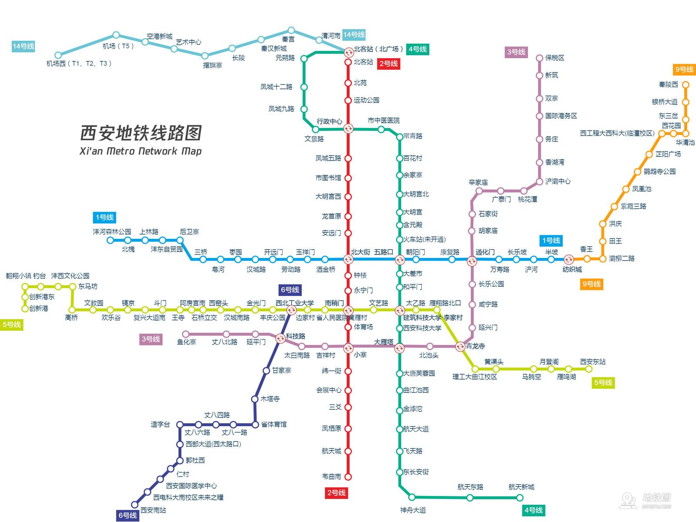

再比如一张网络拓扑图，也可以抽象成一个图，进而用图论中的算法，进行拓扑节点的规划，根据**有权图**的权重计算一个节点到另一个节点的最短路径，规划路由。

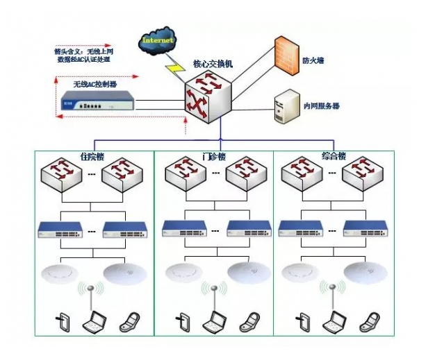

再比如一个社交网络，依然可以抽象成一个图，如果是微信这样的好友功能的社交工具，那我们就可以用**无向图**来建模，如果是微博这样的关注功能的社交工具，我们就可以用**有向图**来建模


### 图论的基础概念

说了这么多，我们提到了什么有向图，无向图、权重、最短路径等等，都是什么意思呢，图到底是一种什么样的数据结构呢？下面首先向大家展示了一张最简单的图：**无向图**。图中每个节点我们叫做**顶点（vertex）**,两个顶点之间的连线叫做**边（dege）**，每个顶点我们可以看多可以和多个顶点相连接，而他具体连接了几个顶点，这个数字我们叫做顶点的**度（degree）**，那么如果把这个图中的一些边去掉，发现它可以形成一个树，所以树也是一种特殊的图。那么下面这个图就可以用来表示一个微信的社交网络，如果A和B之间有边，就可以说A和B是好友，如果A有三条边，就可以说A有三个好友。

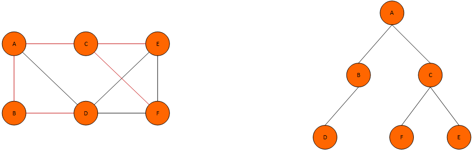

但是如果是微博的社交圈，那么上面这张图就表示不了了，因为A关注了B，但是B不一定关注了A，这个时候需要借助另一种图：**有向图**，有向图就是在无向图这个基础上加了**方向**这个概念，我们可以用A指向B，表示A关注了B，但是B并没有指向A，因此B没有关注A，而C和F是相互指向的，因此C和F是相互关注的。前面我们提到了**度**这个概念，到了这里因为加了方向，就要在进行一点扩展，将其拆分为**出度**和**入度**两个概念。**出度**表示这个顶点出发的边有多少，**入度**表示指向这个顶点的边有多少。那么还是在微博这个例子中，我们就可以用入度来表示粉丝量，出度表示关注量。

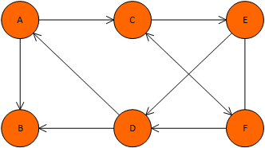

假设我们现在要对一个交通网络用图来进行建模，首先我们肯定会选择**无向图**来表示，因为从A点可以到达B点，那么从B点必然也是可以到达A点的。但是还有一个问题，以前面第一张图为例，假设要从A走到F点，那么可以看出有很多种路线，A->D->F或者A->C->F，在或者A->C->E->F等等。那么这个时候就可能会有疑问了，到底走那条路更快呢？这是个好问题，但是目前的数据结构是解决不了的。就需要另一种升级版：**带权图**，什么意思呢，就是给每个边加上一个权重，在这个地图的例子中，就可以用权重来表示路程，那么权重越高，则路程越远，权重越低，则路程越近，这样我们就可以根据权重来选择一条**最短路径**。

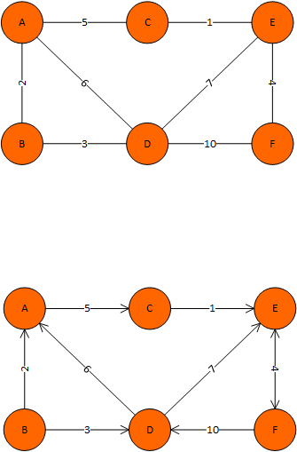

结合上面的讨论，我们看到了如果从是否有权重来分，图可以分为：**有权图**，**无权图**，如果从是否有方向来分，图可以分为：**有向图**，**无向图**，那么如果求一个交集，就有四种图：**带权无向图**，**带权有向图**，**无权无向图**，**无权有向图**。

### 图的存储方式

了解了图的基本概念，就需要进一步了解图应该如何在计算机上进行存储，首先看第一种邻接矩阵的存储方式：

#### 邻接矩阵

关于图的存储方式，我们首先要清楚一点，图要存什么，那些概念可以表示一张图？结合上面的概念，无权无向图的核心就是**边**、**顶点**，有向图在加上**方向**，有权图在加上**权重**，这些信息其实可以依赖一个二维数组来存储，先以一个五项无权图来说，如果`adj[i][j] = 1`则表示i->j有边相连，如果`adj[i][j] = 0`则表示i->j没有边相连。其中i和j为顶点，那么就可以把这个图保存下来了，如果带上权重，那么就把1换成权重的值即可。如果有方向呢，就用`adj[i][j] = 1`表示i->j有一个箭头方向。看前面两个图我们发现，将这个二维数组沿着对角线一折，是完全对称的，因为`adj[i][j] = 1`成立则`adj[j][i] = 1`也是成立的。这样一来就发现这个二位数组里存储的内容有一半都是重复的。

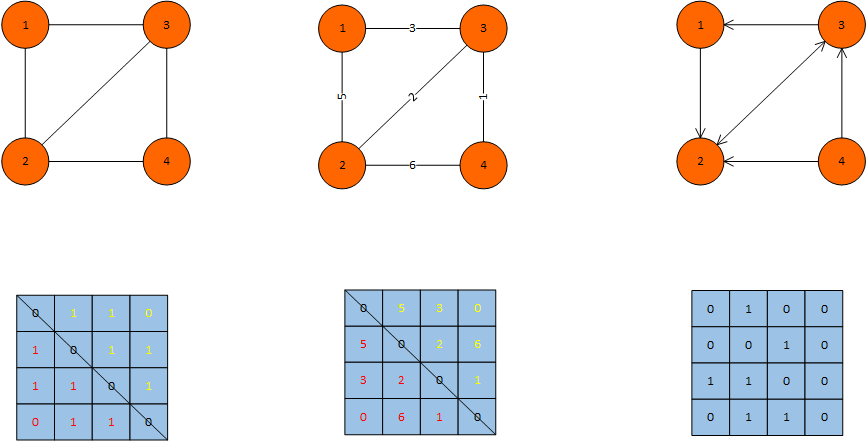

理解了这种方式，我们尝试用代码来实现一下吧（基于无权无向图），这里用一个文件来描述一个图：

```
7 8  # 7:有7个顶点  8:有8条边
------
0 1  # 0->1之间又一条边  1->0之间肯定也有一条边，省去不记录
0 2
1 3
1 4
2 3
2 6
3 5
5 6
```

首先定义一个图的接口，定义相关方法：

```java
public interface Graph {

    /**
     * 通过一个txt文档构建图
     * @param fileName fileName
     */
    void buildGraph(String fileName);

    /**
     * 获取顶点数
     * @return 顶点数
     */
    int getVertex();

    /**
     * 获取边数
     * @return 边数
     */
    int getEdge();

    /**
     * 判断两顶点是否相邻
     * @param vertex1 vertex1
     * @param vertex2 vertex2
     * @return true: 相邻 false: 不相邻
     */
    boolean isAdjacent(int inputVertex1, int inputVertex2);

    /**
     * 获取顶点vertex所有相邻顶点的集合
     * @param vertex vertex
     * @return 顶点vertex所有相邻顶点的集合
     */
    Iterator<Integer> getAdjacentVertex(int inputVertex);

    /**
     * 获取顶点的度
     * @param vertex vertex
     * @return vertex的度
     */
    int degree(int inputVertex1);

    /**
     * 深度优先遍历
     * @return 遍历结果
     */
    Iterator<Integer> dfs();

    /**
     * 广度优先遍历
     * @return 遍历结果
     */
    Iterator<Integer> bfs();
}

```

```java
/**
 * 邻接矩阵表示方法
 *
 * @author : HXY
 * @date : 2021-07-12 21:44
 **/
public class AdjMatrix implements Graph{

    // 顶点数
    private int vertex;
    // 边数
    private int edge;
    // 二维数组表示邻接矩阵
    private int[][] adj;

    public AdjMatrix(String fileName) {
        buildGraph(fileName);
    }

    @Override
    public void buildGraph(String fileName) {
        File file = new File(fileName);
        try (Scanner scanner = new Scanner(file)) {
            vertex = scanner.nextInt();
            edge = scanner.nextInt();
            adj = new int[vertex][vertex];

            for (int i = 0; i < edge; i++) {
                int a = scanner.nextInt();
                int b = scanner.nextInt();
                adj[a][b] = 1;
                adj[b][a] = 1;
            }
        } catch (IOException e) {
            e.printStackTrace();
        }
    }

    @Override
    public int getVertex() {
        return vertex;
    }

    @Override
    public int getEdge() {
        return edge;
    }

    @Override
    public boolean isAdjacent(int inputVertex1, int inputVertex2) {
        return adj[inputVertex1][inputVertex2] == 1;
    }

    @Override
    public Iterator<Integer> getAdjacentVertex(int inputVertex) {
        List<Integer> result = new ArrayList<>();
        for (int i = 0; i < vertex; i++) {
            if (adj[inputVertex][i] == 1) {
                result.add(i);
            }
        }
        return result.iterator();
    }

    @Override
    public int degree(int inputVertex) {
        int degree = 0;
        for (int i = 0; i < vertex; i++) {
            if (adj[inputVertex][i] == 1) {
                degree++;
            }
        }
        return degree;
    }

    @Override
    public Iterator<Integer> dfs() {
        // todo
        return null;
    }

    @Override
    public Iterator<Integer> bfs() {
        // todo
        return null;
    }

    @Override
    public String toString() {
        StringBuilder sb = new StringBuilder();
        sb.append(String.format("v = %d, e = %d %n", vertex, edge));
        for (int i = 0; i < vertex; i++) {
            for (int j = 0; j < vertex; j++) {
                sb.append(String.format("%d ", adj[i][j]));
            }
            sb.append("\n");
        }
        return sb.toString();
    }
}

```

到这里呢，我们需要分析一下这种表示方式的空间复杂度和时间复杂度：

- 空间复杂度：O(V<SUP>2</SUP>)， V个顶点需要V * V个空间
- 时间复杂度：
  - 构建图：O(E)，循环一次边数就可以`for (int i = 0; i < edge; i++)`
  - 查看两点是否相邻：O(1)
  - 获取所有相邻节点：O(V)

从以上的结论可以看出，邻接矩阵这种表示方式的时间复杂度是非常高的，前面我们也提到了，邻接矩阵中存储的内容有一半都是重复的。而且还有一个问题，以微信社交圈为例，假设中国人都注册了一个微信，那么一共有14亿个节点，但是每一个人的好友有几个呢？算上1000，那么也就是说每一个节点有1000个边平均。也就是邻接矩阵中1的个数，而这1000个1才是我们用户真正关注的，那么剩下的1亿减去1000个顶点，是我们要关注的吗？显然不需要，但是邻接矩阵会把这些数据全部存储下来，这就是很大的浪费。

也许这样说还不够清晰，再举个例子吧，如比一个图有3000个顶点，2999条边，那么理想状态要存储这个图，只需要花费3000+2999个空间，但是换成邻接矩阵则需要3000*3000个空间，这个差距是非常大的，本来需要1KB就可以解决的问题，现在非得1GB，因此还需要优化。

#### 邻接表

邻接表看起来像是之前JDK1.7时候的哈希表结构，首先开辟一个数组空间，存储所有的顶点，然后在每个顶点下面挂一个单链表，存储与之相邻的顶点。假设下面这个图是一个微博的社交圈，我们就可以看到1这个节点关注了2，所以在1下面挂一个链表，链表上有2这个节点；2这个用户关注了3、4、5，那么2下面挂了3、4、5这几个节点。有了这个基础，我们想知道1关注了那些人，只需要拿到1对应的链表就可以了，但是啊，如果想知道1被那些人关注了怎么办呢，再来一个**逆邻接表**嘛。

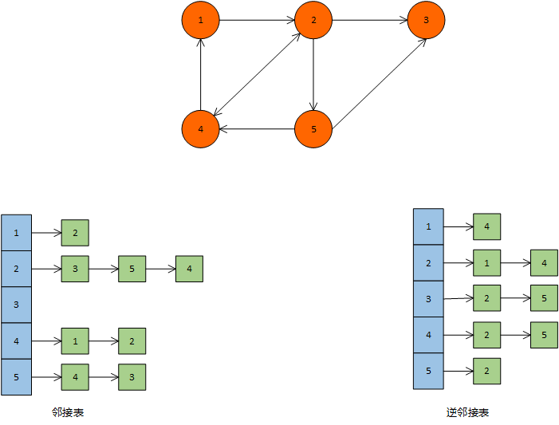

接下来，我们还是尝试用代码实现一下：

```java
/**
 * 图的邻接表表示法
 * 空间复杂度：O(Vertex + Edge)  v个顶点，v个链表的引用，在加上节点的个数
 *
 * @author : HXY
 * @date : 2021-07-12 22:37
 **/
public class AdjList implements Graph{

    // 顶点数
    private int vertex;
    // 边数
    private int edge;
    // 二维数组表示邻接矩阵
    private LinkedList<Integer>[] adj;

    public AdjList(String fileName) {
        buildGraph(fileName);
    }

    @Override
    public void buildGraph(String fileName) {
        File file = new File(fileName);
        try (Scanner scanner = new Scanner(file, "utf-8")) {
            vertex = scanner.nextInt();
            adj = new LinkedList[vertex];
            for (int v = 0; v < vertex; v++) {
                adj[v] = new LinkedList<>();
            }

            edge = scanner.nextInt();
            for (int e = 0; e < edge; e++) {
                int a = scanner.nextInt();
                int b = scanner.nextInt();
                adj[a].add(b);
                adj[b].add(a);
            }
        } catch (IOException e) {
            e.printStackTrace();
        }
    }

    @Override
    public int getVertex() {
        return vertex;
    }

    @Override
    public int getEdge() {
        return edge;
    }

    @Override
    public boolean isAdjacent(int inputVertex1, int inputVertex2) {
        return adj[inputVertex1].contains(inputVertex2);
    }

    @Override
    public Iterator<Integer> getAdjacentVertex(int inputVertex) {
        return adj[inputVertex].iterator();
    }

    @Override
    public int degree(int inputVertex) {
        return adj[inputVertex].size();
    }

    @Override
    public Iterator<Integer> dfs() {
        // todo
        return null;
    }

    @Override
    public Iterator<Integer> bfs() {
        // todo
        return null;
    }

    @Override
    public String toString() {
        StringBuilder sb = new StringBuilder();
        sb.append(String.format("v = %d, e = %d %n", vertex, edge));
        for (int v = 0; v < vertex; v++) {
            sb.append(String.format("%d : ", v));
            for (int w : adj[v]) {
                sb.append(String.format("%d ",w));
            }
            sb.append("\n");
        }
        return sb.toString();
    }
}

```

再来分析一波时间复杂度和空间复杂度：

- 空间复杂度：O(V + E)
- 时间复杂度
  - 构建图：O(E)
  - 查看两点是否相邻：O(degree(V)) 遍历V对应的那个链表 `adj[inputVertex1].contains(inputVertex2);`
  - 获取所有相邻节点：O(degree(V)) 

我们看到，邻接表这种方式在某些查询api上虽然比邻接矩阵的时间复杂度高，但是在空间复杂度上有了一个质的提升，直接从指数级优化到了常数级。但是这个仍然有优化的空间，因为对链表的遍历时间复杂度是O(N)，这个其实是比较耗时的，我们完全可以借鉴HashMap的思想，用红黑树进行优化。

#### 对邻接表的升级（红黑树代替邻接表）

我们也说了，链表的遍历是比较耗时的，而借鉴hashmap的思想，就是用红黑树代替链表，这里我们用TreeSet代替LinkedList来尝试进行优化

```java

/**
 * 邻接表表示方法，用红黑树代替链表实现
 *
 * @author : HXY
 * @date : 2021-07-12 23:29
 **/
public class AdjSet implements Graph{

    // 顶点数
    private int vertex;
    // 边数
    private int edge;
    // 二维数组表示邻接矩阵
    private TreeSet<Integer>[] adj;

    private final boolean[] dfsVisited;

    private final boolean[] bfsVisited;

    private final List<Integer> dfsResult;

    private final List<Integer> bfsResult;

    public AdjSet(String fileName) {
        buildGraph(fileName);
        dfsVisited = new boolean[vertex];
        bfsVisited = new boolean[vertex];
        dfsResult = new ArrayList<>();
        bfsResult = new ArrayList<>();
    }

    @Override
    public void buildGraph(String fileName) {
        File file = new File(fileName);
        try (Scanner scanner = new Scanner(file, "utf-8")) {
            vertex = scanner.nextInt();
            adj = new TreeSet[vertex];
            for (int v = 0; v < vertex; v++) {
                adj[v] = new TreeSet<>();
            }

            edge = scanner.nextInt();
            for (int e = 0; e < edge; e++) {
                int a = scanner.nextInt();
                int b = scanner.nextInt();
                adj[a].add(b);
                adj[b].add(a);
            }
        } catch (IOException e) {
            e.printStackTrace();
        }
    }

    @Override
    public int getVertex() {
        return vertex;
    }

    @Override
    public int getEdge() {
        return edge;
    }

    @Override
    public boolean isAdjacent(int inputVertex1, int inputVertex2) {
        return adj[inputVertex1].contains(inputVertex2);
    }

    @Override
    public Iterator<Integer> getAdjacentVertex(int inputVertex) {
        return adj[inputVertex].iterator();
    }

    @Override
    public int degree(int inputVertex) {
        return adj[inputVertex].size();
    }

    @Override
    public Iterator<Integer> dfs() {
        return dfs(0);
    }

    private Iterator<Integer> dfs(int inputVertex) {
        dfsVisited[inputVertex] = true;
        dfsResult.add(inputVertex);
        for (Iterator<Integer> it = getAdjacentVertex(inputVertex); it.hasNext(); ) {
            int next = it.next();
            if (!dfsVisited[next]) {
                dfs(next);
            }
        }
        return dfsResult.iterator();
    }

    @Override
    public Iterator<Integer> bfs() {
        return bfs(0);
    }

    private Iterator<Integer> bfs(int inputVertex) {
        Queue<Integer> queue = new LinkedList<>();
        queue.add(inputVertex);
        bfsVisited[inputVertex] = true;
        while (!queue.isEmpty()) {
            Integer remove = queue.remove();
            bfsResult.add(remove);
            for (Iterator<Integer> it = getAdjacentVertex(remove); it.hasNext(); ) {
                Integer next = it.next();
                if (!bfsVisited[next]) {
                    queue.add(next);
                    bfsVisited[next] = true;
                }
            }
        }
        return bfsResult.iterator();
    }

    @Override
    public String toString() {
        StringBuilder sb = new StringBuilder();
        sb.append(String.format("v = %d, e = %d %n", vertex, edge));
        for (int v = 0; v < vertex; v++) {
            sb.append(String.format("%d : ", v));
            for (int w : adj[v]) {
                sb.append(String.format("%d ",w));
            }
            sb.append("\n");
        }
        return sb.toString();
    }
}
```

好，继续分析时间复杂度

- 空间复杂度：O(V + E)

- 时间复杂度：

  - 构建图：O(ElogV)
  - 查看两点是否相邻：O(logV) 遍历红黑树
  - 获取所有节点O(logV)

  这里空间复杂度没有变化，其实是要比链表大的，因为红黑树要存储节点信息，但是这个可以忽略。构建图的复杂度由O(E)变成了O(ElogV)，但是查询两点是否相邻和获取所有节点都变成了O(logV)。虽然说O(logN)是介于O(1)和O(N)之间的，但是更倾向于O(1)，比如N=1000000，那么O(1)还是O(1)，O(N)=1000000，而O(logN)=6。

### 图论的遍历方式

#### 深度优先搜索

我们说过树也是图的一种，因此图的深度优先遍历可以结合树的深度优先遍历来看，都是从一个节点出发，然后沿着一个方向深入下去，知道没有路可走，然后回溯到上一步，换个方向继续走，其实和走迷宫类似，不撞南墙不回头。既然道理是类似的，代码是不是改一改就可以呢？答案是肯定的，他们的主体逻辑一样，就越是递归终止条件发生了变化，树的深度优先遍历，递归终止条件是一个节点没有子节点为止，那么图的递归终止条件就是一个顶点在没有相邻的顶点为止，然后呢，因为图是有环的，一个顶点从不同方向走，都可能会被遍历到，所以还要加一个标志位，标识一个顶点是否被访问过，这里我们用一个boolean类型的数组来来记录。

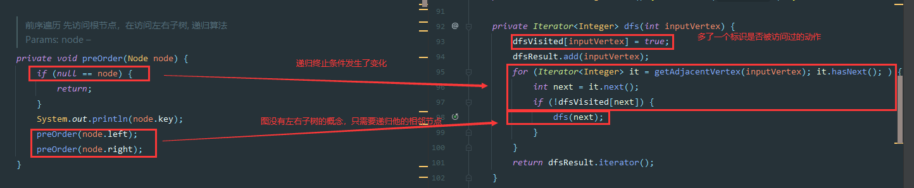

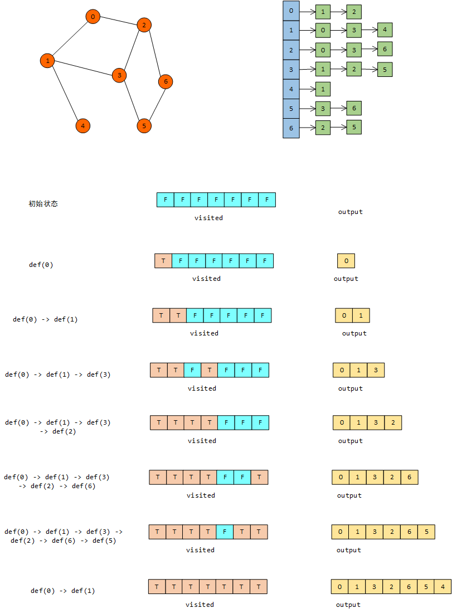

```java
@Override
public Iterator<Integer> dfs() {
    return dfs(0);
}

private Iterator<Integer> dfs(int inputVertex) {
    dfsVisited[inputVertex] = true;
    dfsResult.add(inputVertex);
    for (Iterator<Integer> it = getAdjacentVertex(inputVertex); it.hasNext(); ) {
        int next = it.next();
        if (!dfsVisited[next]) {
            dfs(next);
        }
    }
    return dfsResult.iterator();
}
```

#### 广度优先搜索

按照前面的讨论，那么图的广度优先遍历自然也可用树的广度优先遍历来修改，树的bfs代码是第一步将根节点入队，那么图则需要选择一个顶点入队，我们选择0这个顶点，然后每次出队一个元素，就表示这个节点被访问过，那么树需要将出队节点的左右孩子节点入队，图呢，则需要将出队节点的相邻节点入队，再给每一个访问过的节点加一个标识。

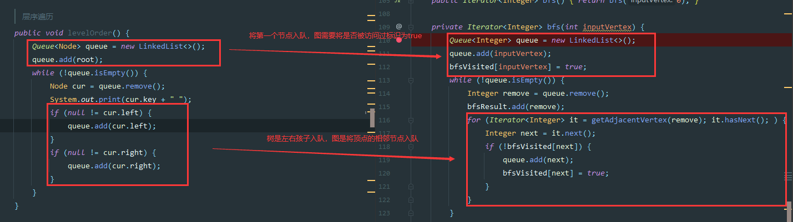

```java
@Override
public Iterator<Integer> bfs() {
    return bfs(0);
}

private Iterator<Integer> bfs(int inputVertex) {
    Queue<Integer> queue = new LinkedList<>();
    queue.add(inputVertex);
    bfsVisited[inputVertex] = true;
    while (!queue.isEmpty()) {
        Integer remove = queue.remove();
        bfsResult.add(remove);
        for (Iterator<Integer> it = getAdjacentVertex(remove); it.hasNext(); ) {
            Integer next = it.next();
            if (!bfsVisited[next]) {
                queue.add(next);
                bfsVisited[next] = true;
            }
        }
    }
    return bfsResult.iterator();
}
```