# B类树应用

## 磁盘的结构

关于磁盘是做什么用的，也许不用多讲，但是磁盘是怎么存数据的，结构是什么样，这里有必要简单和大家唠叨一下。下图是一张磁盘的简单结构图，第一张图片中的四个圆圈是构成磁盘的基本结构，我们叫做**盘片**，每一块盘片有上下两个**盘面**，所有的盘片构成了**盘片组**，他们被安装在一个**主轴**上，在驱动的控制下高速旋转。除了最上面和最下面的盘片的外侧盘面不用以外，其他每个盘片的上下两个盘面都可以存放数据。那么下图中一共有四个盘片，构成了一个盘片组，他们有10个记录数据的盘面。每个盘面有很多**磁道**，他们在记录盘面上形成一个个同心圆，我们把半径相同的磁道合在一起成为一个**柱面**。对于硬盘来说，每个记录盘面还有一个**读写磁头**，所有记录盘面的读写磁头都被安装在一个活动臂上，随活动臂向内或者向外做移动，从一个磁道移动到另一个磁道。任一时刻，所有记录盘面的磁头都停留在半径相同的磁道上，也就说所有的读写磁头都是共进退。运行的时候，盘面在主轴的带动下做高速旋转，然后读写磁头通过移动到特定的磁道上，去读写数据到内存，然后内存进一步和CPU在进行数据的一个交互。

我们在看第二张图片，将一个盘面拿出来做了进一步的描述，我们可以看到在一个盘面上有很多磁道间隙，他们将磁道划分成了很多小的扇形，我们将这些扇形叫做**扇区**，一个扇区就是就是一次读写的最小数据量。磁道间隙上是不存放数据的，磁头通过这些间隙来识别一个扇区是否结束。因此对于磁盘来说，从大到小的存储单位是：盘片组-》柱面-》磁道-》扇区。

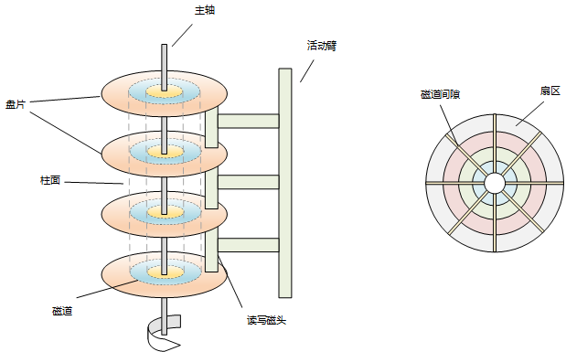

了解了磁盘的结构我们再看看，对磁盘进行一次读写操作，需要花费多少时间以及这些时间花在哪里？从磁盘读取数据，一般来说可以分以下几步走：

1. 当有多个盘片组时候，要选定盘片组，这一步通过电子线路实现，速度很快

2. 选定盘片组后，要选定柱面，并且把活动臂移动到这个柱面上，这一步是机械动作，比较慢，耗费的时间也和设备有关系，一般在几毫秒到十几毫秒。这个过程我们称之为**寻查（seek）**

3. 选定柱面后，要进一步确定磁道，这个实际就是确定应该由哪一个读写磁头读写，这一步速度也是较快的

4. 确定磁道后，进一步需要确定数据在磁道上的哪一个扇区，这实际就是等待要读写的扇区转到读写磁头下面，这一步是机械动作，速度较慢，最 好的情况是要读写的扇区刚好转到读写磁头下面，就可以立即进行读写，不需要等待，最差的情况是要读写的扇区刚好从读写磁头下面转过去，这个时候就需要等他在转一圈才能进行读写，平均需要等待半圈的时间，这段时间一般称之为旋转延迟（rotational delay）或者旋转等待（rotational latency）时间。

5. 我们假设一个扇区能存放512Bytes的数据，且他的结构是类似一个数组的格式，通过一个偏移量offset来表示每一个字节的位置，那么这一步的要做的就是找到这个偏移量offset

   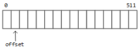

6. 真正的进行数据的读写，将数据通过电子线路传送给内存。

通过上面的分析，我们可以发现，在磁盘上进行一次IO操作主要时间为：tio = tseek + tlatency + trw，其中最耗费时间的点就发生在 tseek + tlatency 这两步，这两步其实就做了一件事，那就是**寻址**。所以要想能快速的在磁盘上查询到一条记录，那么最核心的点就是要减少磁盘IO，降低寻址次数，接下来我们通过一个例子来探讨下如何能做好这件事情。

## 如何通过索引优化从磁盘查询数据的效率

假设现在有一张数据库表，其中存储了100条数据，每一条数据有128Bytes。而我们磁盘上的一个扇区有512Bytes，那么一个扇区则可以存储我们数据库表中的四条数据，100条数据需要25个扇区来进行存储。如果有一天我们要找其中任何一条数据，那么需要多少次磁盘IO呢，答案当然是25。这个算是一个比较慢的操作了。有没有办法来进行优化呢，答案就是索引。

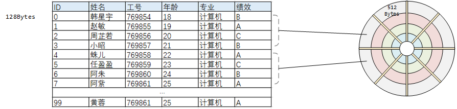

### 稠密索引

我们将数据表中每一条记录的主键取出来，保存在一个索引表中，这个表只有两个字段，ID和这条ID代表的数据的地址。假设索引表中每一条数据的大小是16Bytes，那么100条数据就是1600Bytes，1600Bytes / 512 ≈ 3.1，也就是4。因此存储这张索引表需要的扇区个数为4。这样下次我们假设要查找数据表中任意一条记录，我们先去索引表中查找它对应的地址，那么这个IO次数最多为4次，当找到这条记录后，获取到他的地址，就可以快速定位到它对应的磁盘的准确位置，这个IO次数只要一次。总的下来需要的磁盘IO次数为5次，相比前面的25次，大大的减少了磁盘IO，提升了检索效率。

在这中索引方式中，我们为数据表中的每一条记录都建立了一条索引，这种索引方式我们叫做**稠密索引**。

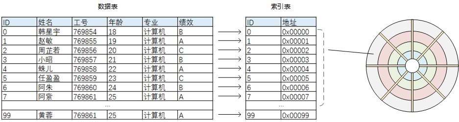

### 稀疏索引

上述方案中通过添加索引，已经很大程度提高了检索效率。但是现在假如数据表里存的不仅是100数据，而是1000条数据，那么这1000条数据本身大小为128000Bytes，需要128000 / 256 = 500个扇区来存储。他们的索引大约是16000Bytes，需要16000 / 256 = 63个扇区来存储。这种情况下假如需要查找一条数据，需要的磁盘IO应该是64次左右。

这个检索效率也是很低的，有没有办法来解决呢，方案就是为索引在加索引。例如下图中，我们为数据表加了一层索引，然后为索引表又加了二级索引。二级索引表中，每一个索引项是为一批记录进行索引。例如二级索引表中第一行，ID为31的一条记录就索引了索引表中0-31行的共计32条数据。这里解释一下我们数据库中ID是自增长的，我们是在这个基础上进行的分析。同理二级索引表中第二行，ID为63的一条记录就索引了索引表中32-63行的共计32条数据。那么我们如何通过二级索引表去找到某一条记录呢？首先我们解释一下，二级索引表中存的内容是什么，ID存的是他负责索引的那一批记录中的最大ID，地址记录的是他负责索引的那一批记录的起始地址。明白了这一点后，我们假设现在要找ID为94的一条数据，首先我们来到二级索引表中，发现94大于63小于95，因此他在95负责的这批索引中，然后通过95拿到对应的地址，找到一级索引表，顺藤摸瓜，找到94这条数据具体的磁盘地址，最后让磁头移动到对应的磁道上，读取数据。

那么在这个过程中，因为二级索引的存在，又减少一部分磁盘IO，但是却牺牲了一部分空间，而现在磁盘并不十分昂贵，所以这个牺牲是值得的。那么我们发现，这个二级索引表和一级索引表有什么区别呢？一级索引表为数据表中每一条记录都建立了索引，而二级索引表只为一部分数据建立了索引，显得没有一级索引表那么稠密，因此形象的叫做**稀疏索引**。

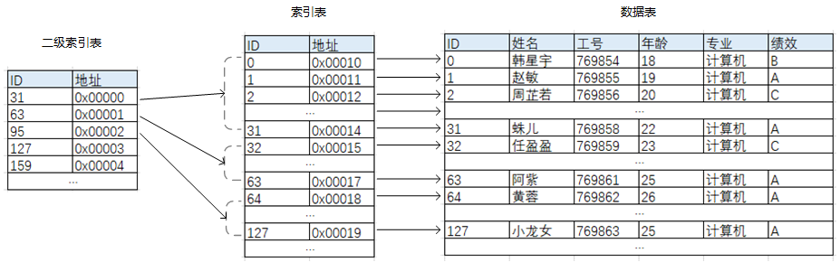

如果数据量特别大，那么我们还可以继续建立三级索引、四级索引、五级索引。。。

如果我们把上面的图逆时针转90度，在稍微修改一下，那么他就会变成下面这样。不知道这个时候大家有没有感觉，是不是以前已经联系到了数据库索引图，那么其实B树的雏形已经有了。

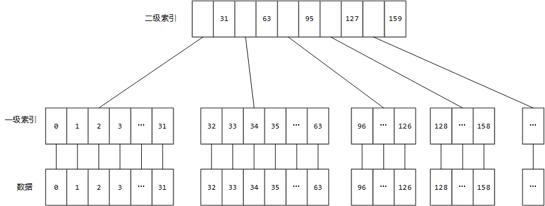

## M路搜索树

前面在树结构的演变中，我们提到过二叉搜索树，想必大家还记得，他是一种特殊的二叉树。特殊在：每一个节点，左边的孩子节点总是小于该节点，右边的孩子节点总是大于该节点，然后通过这种特性我们可以实现log级别的二分搜索的查询时间复杂度。

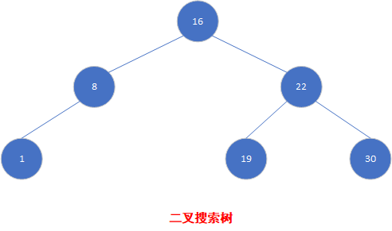

就像生活中见到的树一样，有的树可能只有根，有的树可能只有一个枝杈，有的树可能有两个枝杈，那么有的树也有可能有三个枝杈，四个枝杈甚至更多枝杈。因此数据结构中的树也有可能不止是二叉的，也可以是多叉的，我们把这种树叫做**多路树**或者多叉树，二叉树中一个节点只能有一个关键字，可以有两个孩子节点，也就是有两颗子树，那么类比到多路树呢，比如说一个三路树，他的每一个节点就可以最多有两个关键字，三个孩子节点，也就是三颗子树。同时如果这棵多路树，也像二叉搜索树一样，有这样的特性（以三路树为例，假设有其中一个节点有K1，K2两个关键字）：K1左边的孩子节点总是小于K1，K1和K2中间的孩子节点总是介于K1和K2之间，K2右边的孩子节点总是大于K2。那么这棵树我们就可以叫做**M路搜索树**。因为通过他也可以实现快速检索的特性。下图就是一颗4路搜索树。他的每一个节点最多可以有三个关键字，四棵子树。

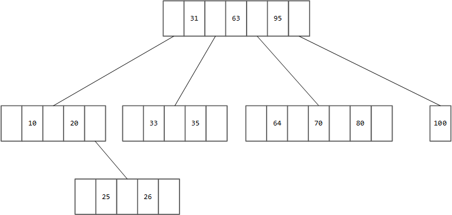

那么在之前的分享中我们谈论过，构建二叉搜索树的过程中，如果是按照递增或者递减的顺序去插入新节点来实现，那么这课二叉搜索树就会退化成链表。为了解决这个问题，我们提出了平衡二叉树，以及后续的红黑树等优化结构。那么在M路搜索树中，会不会也有这个问题呢，应该怎么解决呢？答案是肯定的，因为M路搜索树的构建思路和二叉搜索树是基本一样的，因此他也有可能会退化成链表。解决方案就得靠B树了。

## B树

B树的B是什么意思，我认为是平衡（balanceed）这个单词的缩写，他主要通过附加以下三点约束来防止了M路搜索树退化成链表，以及使它达能到一个平衡的状态：

1. 根节点至少有两个子女
2. 根节点以外的所有节点至少有**m/2向上取整**个子女
3. 所有的叶子节点都位于同一层

下面这棵树就是一个3阶B树，那么发现其实他也是一棵之前我们说到的2-3树，因此2-3树实际是一颗3阶B树，而2-3-4树实际是一颗4阶B树。

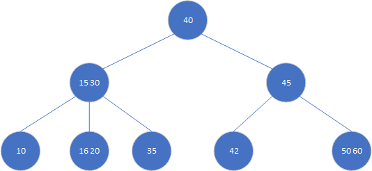

### B树的搜索

在B树中搜索关键字很简单，主要是在一个节点内进行搜索或者沿着某一条路径一直向下搜索。例如在上面的树中检索42的过程为：首先找到根节点40，发现42大于40，沿着40的右侧指针找到45，发现42小于45，在沿着45的左侧指针找到42，发现42就是我们要找的关键字，因此将42返回给用户。

在B树中搜索一个关键字，如果这个关键在存在于这棵树中，那么他的搜索时间是和关键字的层数相关的，如果不存在，那么他的搜索时间是和树的高度相关的。因此我们往往要降低树的高度，增加树的阶数，以此来减少磁盘IO，但是这个阶数也不是越大越好，如果特别大的话，内存空间不能承载还是要去读盘。

### B树的插入

我们说2-3树是一颗3阶的B树，那么B树的插入就按照我们之前分享的2-3树的插入为例来看，B树的构建是**自下而上**来构建的，目的是为了保证特性3，如果一个节点溢出，那么就进行分裂，将分裂出来的节点往上一层提。

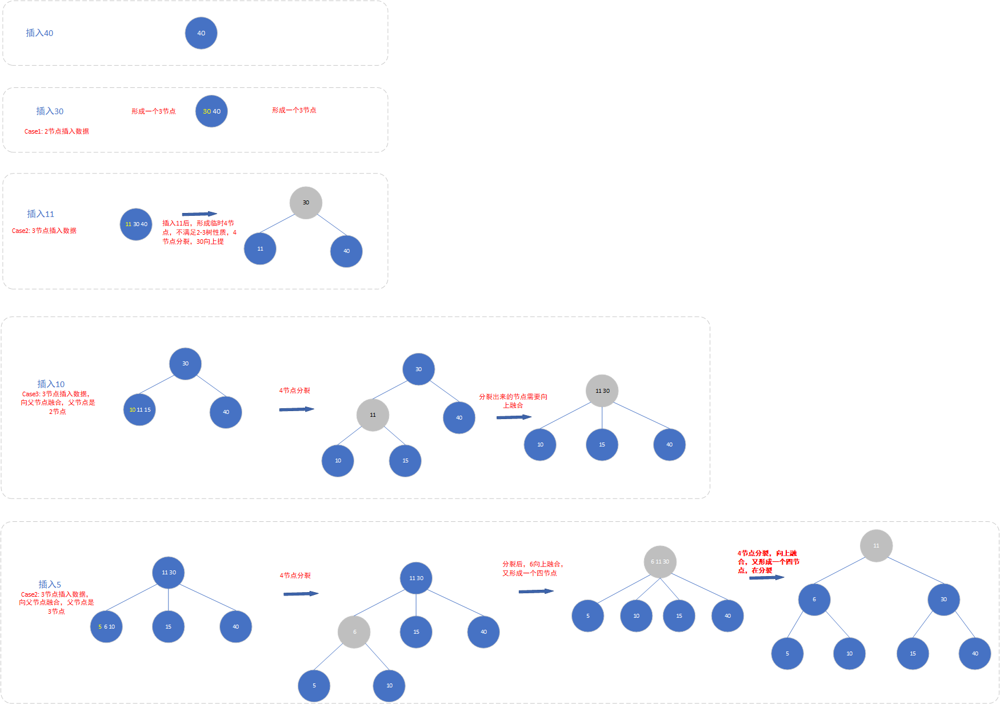

## B+树

我们在将上面那棵B树拿出来看看，假如在这棵树中我们找到了35这个元素，然后接着就要找16、20或者42这几个元素，应该怎么做？在这棵树中没有更好的办法，只能将35找个地方记录下来，然后从根节点开始重新遍历这棵树。但实际上我们可以直观的看出16、20和42就是35附近的元素啊。这种可望不可即，你在我身边，我却无法触碰到你的感觉真的很让人沮丧。

所以我们要想想办法？那就是如果我们能把最底层的这几个节点连接起来，让他形成一个双向链表，是不是就很棒了？是不是就可以实现通过35这个节点的前驱后继指针快速的访问到16、20和42这些元素了呢？当然还有一个问题那就是其实在35和42之间，我们能看到还有40这个元素，我们是无法访问到的，那么如果有一天我们要查找介于35和42之间的元素，只通过刚才构成的这个链表可就把40给漏掉了啊。所以这里我们想了第二种办法：那就是把40在最底层叶节点中拷贝一份，上面的40只是个导航标识。这样这棵树中所有的元素都被连接了起来。查询效率则会更进一步的得到提升。

其实看到这里，我们的B+树也就呼之欲出了。B+树是1974年由Wedekind基于B树提出的一个改进版本，他主要包括了下面两个特性：

1. 所有的关键字都存放在叶节点中，上层的非叶子节点存储的关键字是其子树中最小或者最大的关键字的一个复写
2. 叶节点中包含了全部的关键字以及指向相应数据记录存放地址的指针，并且叶子节点按照顺序连接起来形成一个链表

下面这张图就是一个合格的B+树。

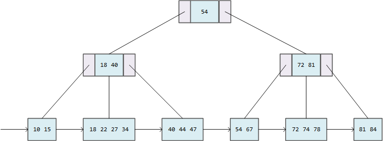

当然我们也可以对上面的B+树在做一些优化，那就是将叶子节点的单向链表变成一个双向循环链表。

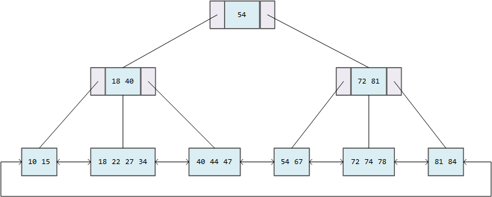

### B+树的搜索

在一颗B+树中，通常会维护两个成员变量，一个是指向根节点的指针，一个是指向关键字最小的那个叶子节点，所以呢，在B+树中我们可以进行两种查询。

1. 一种是沿着根节点自顶向下的查找，这种查找方式大概和B树类似，但是因为B+树除过叶子节点之外，上层节点存放的只是对子树中一个关键字的复写，真正的关键字都在叶子节点，因此比如在上面的树中查找72这个关键字，我们从54出发，找到右侧孩子节点，找到72以后，不能停下，还要再往下一层到叶子节点中找到72才算完成。
2. 另一种是从指向叶子节点的指针开始遍历这个链表。这个不必多说，可以参考链表的遍历方式。

### B+树的插入

B+树的插入也是**自下而上**，**不断分裂**的一个过程。假设我们构建一个4阶B+树（B+树叶子节点可能包含父节点的关键字，所以4阶的B+树叶子节点可以有4个关键字，而不是3个），第一次插入24,72,1,39之后，他们会顺序排列，然后在插入53之后，一个节点就会有五个关键字，溢出了，因此需要分裂成左右两个节点，左边节点我们按照`(m+1)/2`向上取整来分配关键字个数，右边节点按照`(m+1)/2`向下取整来分配关键字个数。分裂后将这两个节点连接，同时创建一个父节点，父节点中包括这两个子节点中最大的关键字以及指向左右孩子的指针，将他们联系起来。

下图模拟了构建一颗4阶B+树的过程。

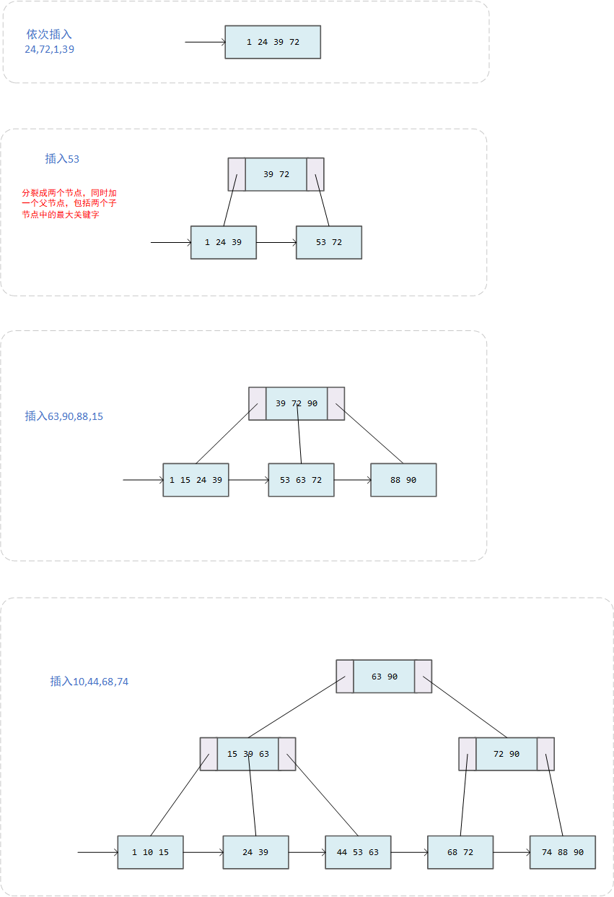