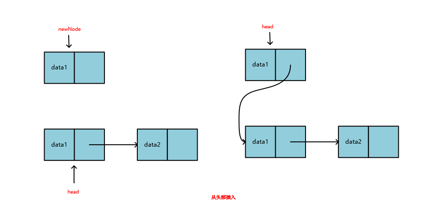
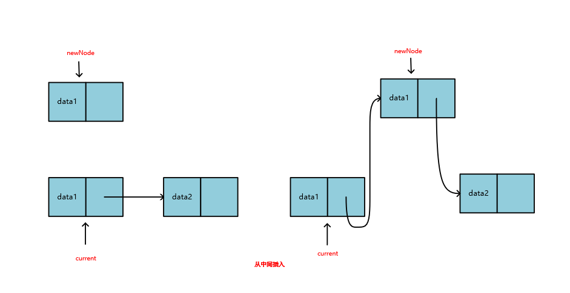
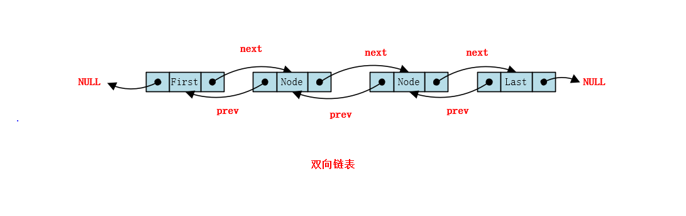

# 通过树结构的演变以及实现来辩证的看数据结构

数据结构和算法作为计算机专业的一门专业课，有这举足轻重的地位，也许在我们平时的工作中，并不能深刻的感受到数据结构的意义，那是因为现在的语言和框架都做了高度的封装，只给我们暴露了最简单的API，让我们不懂数据结构和算法也可以写出好的代码。但是这不意味这我们就可以抛弃数据结构。因为在我的认识里，只有掌握了基础，才有可能创新，所以今天想以链表开始，给大家分享一下几种常见的数据结构。

## 链表

链表我们都很熟悉，我们知道LinkedList是基于链表实现的，HashMap解决哈希冲突使用到的链地址法也用到了链表，JUC包下面的很多队列也是通过链表来实现的。这里呢还是和大家在回顾一下链表的结构。

### 单向链表

单链表是一种最基础的链表结构，它由一个个链表节点构成，每个链表的节点分为两个部分**data**和**link**。如图所示


其中**data**保存着用户数据，而**link**保存这一个指针，用来指向下一个链表的节点。一个线性表如果用链表来存储的话，结构大概是这样的。


#### 链表的插入操作

了解了链表的基本模型，我们看如何通过插入节点来构造一个链表，链表的插入可以分为三种情况讨论，从**头部插入**，从**尾部插入**，从**中间插入**。

1. 从头部插入

   

2. 从尾部插入

   

3. 从中间插入

   
   

结合以上的图例可以看出单链表插入操作的时间复杂度是与插入位置有关的。

1. 如果是头插法，那么时间复杂度是O(1)
2. 如果是尾插法，那么时间复杂度也是O(1)
3. 如果想插入到指定位置，那么就需要遍历链表先找到插入点，整个时间复杂度就是O(N)了

#### 链表的查询操作

链表的查询操作普遍情况是比较耗时的，他的时间复杂度是一般是O(N)级别的，N代表链表的长度。最好的情况下就是找链表的头结点和尾结点，那么这种只需要一次查找就可以，时间复杂度是O(1)级别的。

### 双向链表

如上所示，可以看出在单向链表中可以很方便的找到它的下一个节点，但是要是我们想找前一个节点可就麻烦了。于是为了解决这个问题就有了**双向链表**这个概念。双向链表中每个节点不仅有数据、有指向下一个节点的指针，还维护了一个指向前一个节点的指针，这样就可以很方便的**访问一个节点的前驱节点和后继节点**。



### 循环链表

除了双向链表，还有一种循环链表，他的尾结点不是指向NULL，而是一个指向头结点的指针，将整个链表形成一个环，他为我们解决**通过链表中任何一个节点都可以找到链表中其他的任一节点**这样一个问题。


## 二叉搜索树

上面提到了链表，以及链表的两种变形结构，虽然双向链表和循环链表都解决了单向链表的一部分问题，但是查询的时间复杂度仍然是O(N)级别的。比如在一个长度为100万的链表中，如果要找到第10万个数据，那么就要遍历这个链表10万次，最坏有可能是100万次，这是比较糟糕的。那么我们有没有可能把他的查询时间复杂度优化成O(logN)呢。

也许这个我们可以参考二分查找的思想，所谓二分查找就是将一个排序的数组分成两部分，要查找一个元素，首先和中间元素比较，如果小就去左边查找，如果大就去右边查找，这样下来，总是会省去一半的无用功，时间复杂度变成了O(logN)。而这个也就是二叉搜索树的模型解决的问题。

树的概念来自我们生活中常见的树，生活中的树有根，所以数据结构中的树有根节点，生活中的树会从根上长出来很多枝杈，枝杈上长满了叶子或继续长枝杈，我们数据结构中的树也是一样，他也会从根节点长出很多枝杈，我们把他抽象出来，如果一个树上每个节点都只有两个枝杈，那就叫二叉树，如果有多个枝杈，那就叫多叉树。

二叉树是树论中最简单的一种数据结构，一颗二叉树可以什么都没有，甚至可以没有根节点，这叫空二叉树，也可以只有一个根节点，像下图的第一种情况，也可以从根节点只长出一个左孩子节点，当然也可以从根节点只长出一个右孩子节点，那完整的是既有左孩子节点，也有右孩子节点，例如下图前四种情况，就对应刚才说的二叉树的几种基本节点。

二叉树还有两种特殊的结构，一种叫做**满二叉树**，一种叫做**完全二叉树**，什么叫满二叉树呢，就是说这棵树的每一个节点（除去最底层的叶子节点）都有两个孩子节点，这种就叫做满二叉树，那完全二叉树又是怎么回事呢，他是满二叉树没有放满的情况下，**从右向左**失去了一部分节点的情况，这两种可以参考下图最后两种情况。


上面说的都是二叉树的概念，他显然是不满足我们说的能通过二分搜索来实现提高查询效率的，因此需要把他在做一点小的改变，那就是每次插入一个新的节点，都把他和根节点比较，如果小于根节点，就把他插入到根节点的左边，如果大于根节点就把他插入到根节点的右边，维护一个这样的特性。那么就构成了下面这样一颗特殊的二叉树：


以这颗树为例，我们来查找1这个节点，那么第一次遍历到16，我们知道1是小于16的，那么就会来到16的左孩子8这个节点，然后在和8比较，发现是小于8的，于是来到8的左孩子，顺利的找到1这个节点。这样我们在一个有6个节点的树中，查找1这个元素，就只用了3次。大大的提高了检索效率。

## AVL树（平衡二叉树）

通过上面的讨论我们知道二叉搜索树的查询时间复杂度是O(logN)，但是这是理想情况，他有一种极端情况，假设我们按照1、2、3、4、5这样的顺序来构建一颗二叉搜索树，那么第一次插入1，第二次插入2，发现比1大，于是插入到1的右边，接着插入3发现大于2，于是插入到2的右边，到最后就形成了下面这样的结果，这个时候，我们预想的二叉搜索树又退化成了链表这种结构，时间复杂度又变成了O(N)。那么我们接下来就需要想办法避免上述情况，让他在插入的时候尽量达到一个平衡的状态。


这就是AVL树解决的问题。AVL树本质上还是一颗二叉搜索树，但是他多了一个特性，那就是：**左子树和右子树的高度差不能超过1**，类似下图就是一颗AVL树。


但是这个时候如果插入一个新的节点10，那么就会放到20的左边，但这样就打破了AVL树的特性，怎么处理呢。下面给大家总结了四种情况：

1. 左旋转

   

2. 右旋转

   

3. 右旋转-左旋转

   

4. 左旋转-右旋转

   

   

因此，AVL树就是通过这样的方式最终实现了一个趋于平衡的特性，防止了二叉搜索树退化成链表。理论上保证了O(lonN)的查询时间复杂度，但是在插入和删除的过程中，为了维护这个AVL树的平衡，往往要做很多次的旋转，添加了很多维护成本。这也是一个很大的性能消耗，因此又出现了红黑树这种数据结构。

## 红黑树

什么是红黑树呢，很多算法书是这样定义他的特性的，为什么要这样定义，我们这里先不关注，且往下看：

1. 根节点是黑色
2. 二叉搜索树的基本性质
3. 每一个节点要么是黑色，要么是红色
4. 如果一个节点是红色的，那么他的子节点一定是黑色
5. 黑平衡：从根节点到任何一个叶子节点经过的黑节点数量是相等的

### 2-3树

要理解红黑树，那需要首先理解一种数据结构，2-3树。他是一种二叉树的扩展结构，二叉树一个节点只能放一个元素，但是2-3树一个节点可以放最多两个元素**L（左）**和**R（右）**，并且两个元素可以有三个分支，L的左边可以挂载一颗树，这棵树上节点的数据都是小于L的，L和R中间还可以挂一颗树，这棵树上数据的值都是介于L和R之间的，R的右边可以挂一颗树，这棵树上节点的数据都是大于R的。如图所示：


那这样一颗2-3树是如何构建出来的呢，下图展示了一颗2-3树的构建过程：


### 2-3-4树

2-3-4树和2-3树是类似的，他的特性可以结合2-3树去理解，结构如图所示


### 2-3-4树和红黑树的等价性

红黑树和2-3-4树是完全等价的，他就是通过2-3-4树演变过来的，具体演变过程如下：


### 红黑树的自平衡手段

红黑树平衡手段，相比来说没有AVL树那么复杂，据统计，每次插入一个新的节点到红黑树中，最多经过三次旋转就可以达到平衡。红黑树的自平衡策略：

1. 着色

   假设每次新插入一个节点我们都把他染成红色，那么下面这种情况，就会破坏**性质4：如果一个节点是红色的，那么他的子节点一定是黑色**。那维持平衡的手段就是将红节点染成黑色：

   

2. 左旋转

   红黑树的左旋发生在下面这种场景，首先需要左旋转来达到二叉搜索树的性质，在通过着色来满足特性4和特性5

   

3. 右旋转

   红黑树的左旋发生在下面这种场景，首先需要右旋转来达到二叉搜索树的性质，在通过着色来满足特性4和特性5

   

## 跳跃表

为了将链表的查询性能优化到O(logN)级别，我们到目前为止说了二叉搜索树、AVL树、红黑树这几种结构，他们都是基于树结构的一种优化，那么有没有其他的思路呢。当然是有的。前面我们提到的链表每一个节点都有一个指针，指向下一个节点，那么如果我们将他改一改，首先给他**排个序**，在给每相邻两个节点在加一个指针，让他指向下下一个节点，这样新添加的指针就又形成了一个新的链表，而这个新的链表上的节点只有原来的一半，那么当我们执行查询操作的时候就可以首先在这个新的链表上进行查找，如果没查到在返回原来的链表上查找。所遍历的节点数量也响应的少了。如下图所示：

假如查找20这个节点，如果在第一个链表中，需要遍历5次（红色虚线标识查找路径）

如果在第二个优化后的链表中呢，首先在新的链表上查找，发现20比10和17都大，向后查找发现比23小，在回到下面的链表，顺利找到20，跳过了遍历3和15。


通过这种方式，我们查找一个节点不在需要和链表中的每一个节点进行比较了，但是还是有点多，因此我们还可以如法炮制，继续加一层新的链表。变成下面这样：

那么查找20就更简单了，首先遍历第三层链表访问17，发现比17大，第三层遍历结束，这样一下就跳过了3、10、15几个节点，再到第二层发现比23小，第二层遍历结束，回到第一层，顺利找到20。那么可以想象，当链表足够长的时候，这种方式能让我们少走很多弯路，极大的提高了查找效率。如果一个链表，能将它拆分成理想的logN层，那么他的时间复杂度就可以达到和红黑树一样的O(logN)。我们将这种数据结构形象的叫做**跳跃表（SkipLsit）**。


在上面我们模拟的几个跳跃表中，每一层节点个数都是下一层节点个数的一半，但是在实际的插入节点的过程中，这个特性很容易破坏，如果我们要维护他，就会导致要递归的维护后面很多节点的特性，这样会让时间复杂度又退回到O(N)级别。那在实际的编码中，这个层数往往都是随机选择的。下面这张图模拟了一个构建跳跃表的过程：

从这个过程我们知道跳跃表的插入过程分为三步：

1. 找到插入位置
2. 随机选择一个层数
3. 修改前后指针

这个过程中只有找插入位置是耗时的，O(logN)，修改指针和选择层数都可以忽略，而上面说的AVL树除了查找过程还需要不断的自旋来调节平衡，这就导致跳跃表的插入性能其实比平衡树要好一点。

跳跃表虽然听起来陌生，但是在实际中有很多的应用，比如JDK就有两个集合类：`ConcurrentSkipListMap`和`ConcurrentSkipListSet`是基于跳跃表实现的，而且在Redis的`Zset`中也是基于跳跃表实现的。在Lucene中好像也用到了跳跃表。


## Trie树

走到这里，相信大家对几种基本的树结构也有了一定的认识，而且红黑树和跳跃表的查询性能也很高了，那么现在试想一个这样的场景：我们都见过在淘宝或者百度搜索一个关键字，当你输入第一个字，下面就会联系出来一堆与这个字相关的的条目，如果这个功能要用红黑树来实现，不知道大家有没有思路呢？可能比较复杂对吧，但是如果我们用了**Trie（前缀树）**这种数据结构，就会很容易实现。而且Trie树还有一个特别大的优势，就是在Trie树中查找任何一个单词，只和这个单词的长度有关，与整个数据量关系不大。比如在一个存了100多万单词的红黑树中查找一个`java`这个单词，那么按照他的时间复杂度可能需要大约是20次遍历，但是在Trie中就只需要4次，当然这个只有在海量数据下才能凸显出他的优势。好了，说了这么多，我们一起看看Trie长什么样子吧：

图中的java代码简单定义了Trie树的一个节点，其中`isWord`表示到这个节点是否可以构成一个单词，图中用红颜色标识，其中`Node[]`用来存储下挂子节点，那如果我们确定只有英文大小写字母的话，这个数组就的长度就可以定义成52。在这个结构里我们查找**code**这个单词就能很精确的只遍历`c`,`o`,`d`,`e`这几个单词就行了。而且也可以很方面的查询到以某个前缀开头的单词集合或者判断某个前缀的单词是否在这棵树中存在。


但是呢，这棵树依然还是有缺点的，那就是，占用空间很大，我们每一个`Node[]`数组都定义成52的长度，但是就上面的图例中来看，其实根本用不了很多，所以这个时候就需要在进行优化，也就有了**压缩Trie树**：

压缩Trie树其实理解起来很简单，就是将相同的前缀进行压缩，这样虽然空间复杂度低了，但是相应的维护成本也就高了。


## 堆（优先队列）

前面也聊了很多，我们试想一个这样的场景在，比如我们平常的队列都是先进先出，每次取的都是最先入队的，但是有时候也需要取出的不是最先入队的，而是优先级最高的，在比如有时候我们要统计一批数据中，出现频率最高或者前几的，那么通过上面的数据结构可以解决吗，肯定是有办法的，但是总归要费事一些，其实这里就还有一种也是基于二叉树演变来的数据结构：**堆**，就很好的解决了这个问题。什么是堆呢，他有这样两个重要的性质：

1. 他首先是一颗完全二叉树
2. 树中每一个节点的值总是小于父节点的值（**最大堆**），也可以大于父节点的值，叫做**最小堆**

基于这两个性质，这里给出一个最简单的最大堆的模型：


二叉堆，我们一般可以用一个数组表示，我们将堆中的元素按顺序依次放入数组中，这样我们发现每一个节点他的父子关系与他在数组中的索引是有一定关系的：

   节点本身的索引：**index**
   节点的左孩子索引：**2 * index**
   节点的右孩子索引：**2 * index + 1**
   节点的父亲节点的索引：**index / 2**


那么理解了堆的结构，我们再看如何构建一个最大堆呢？

构建堆的过程也就是向堆中插入元素的过程，我们向下列堆中插入一个80，发现破坏了最大堆的性质，因此需要将80和父元素交换位置，交换后，80和父元素71相比，需要继续交换位置，直到满足最大堆的性质。这个过程叫元素的**上浮**


在构建完一个堆之后，也就构建了一个**优先队列**，因为按照堆的定义，第一个元素永远是最大的，也就是优先级最高的，那么我们每次从堆中取元素，也是按照优先级取得，我们遍历一个堆，取出来的数据也是按照优先级排过序的，因此堆也可以用来**排序**。那么这里还需要思考另一个问题，就是从堆中取出元素后，有可能会破坏堆的性质，我们该如何维护呢？下面通过一张图来总结：


首先删除堆顶元素，然后将最后一个元素挪到堆顶，这个时候破坏了堆的性质，就开始执行**下沉**操作，让堆顶元素和孩子比较，将较大的孩子上移，堆顶元素下沉，直到符合堆的条件为止。

通过二叉树的性质可以知道N个节点的完全二叉树深度为h = log(N+1)，插入和删除堆顶元素的时候循环的次数最多为h - 1, 所以插入和删除的时间复杂度为：**O(logN)**。

## 总结

其实通过上面的讨论，我们发现链表虽然比较慢，但是他简单，他不用像AVL树和红黑树一样要维持平衡，要存储左右节点颜色等信息，不像跳跃表一样要分成好几层，因此他也节省空间，所以我们到处可以看到对链表的应用，比如LinkedList以及各种队列的实现。而红黑树、跳跃表等虽然他占用内存，维护成本高，但是查询性能高，而且必要的情况下我们可以牺牲空间来换取时间，因此TreeMap使用了红黑树，Zset使用了跳跃表。而且每一种数据结构也有各自的优缺点和善于解决的问题，像Trie树就很好的解决了前缀查询，单词匹配等问题，堆就很好的实现了优先队列，解决了优先级的问题，而且可以用来排序。还有一个问题就是我们说的时间复杂度也只是一个理论上的值，而在具体的测试中，又不一定准确，比如虽然Trie树查询单词的时间复杂度比红黑树高，但是这个是要在一定量的数据下才能体现出来的优势，如果数据小，也不一定。而且虽然红黑树查询性能高，那么为什么HahsMap解决哈希冲突的时候是先用了链表在转红黑树呢？这个阈值是从哪里来的，就是因为经过大量的实验和数学分析证明在数量小于8的时候，可能红黑树的优势并不能体现，而是有些大材小用，反而不如链表表现的优秀。因此在计算机的世界里，也很难有两全其美，鱼和熊掌兼得的好事情，我们总要学会选择，那也只有我们熟悉了各种数据结构和算法的优缺点，才能做好这个选择。

## 代码总结

### 链表

#### 单链表

```java
package com.list;

import java.util.NoSuchElementException;

/**
 * 链表
 *
 * @author HXY
 * @since 2020-1-27
 */
public class LinkedList<E> implements List<E>{

    private static class Node<E> {
        E e;
        Node<E> next;

        Node(E e, Node<E> next) {
            this.e = e;
            this.next = next;
        }
    }

    private Node<E> head;
    private Node<E> tail;
    private int size = 0;

    public LinkedList() {
    }

    public int size() {
        return size;
    }

    public boolean isEmpty() {
        return size == 0;
    }

    /**
     * 向链表中添加元素，默认向尾部添加
     *
     * @param e e
     */
    @Override
    public void add(E e) {
        linkLast(e);
    }

    private void linkLast(E e) {
        final Node<E> currNode = tail;
        final Node<E> newNode = new Node<>(e, null);
        tail = newNode;
        if (null == head) {
            head = newNode;
        } else {
            currNode.next = newNode;
        }
        size++;
    }

    /**
     * 向链表头部添加元素
     *
     * @param e e
     */
    @Override
    public void addFirst(E e) {
        linkFirst(e);
    }

    private void linkFirst(E e) {
        final Node<E> newNode = new Node<>(e, head);
        head = newNode;
        if (null == tail) {
            tail = newNode;
        }
        size++;
    }

    /**
     * 向指定位置添加元素
     *
     * @param index index
     * @param e e
     */
    @Override
    public void add(int index, E e) {
        checkIndex(index);
        if (index == 0) {
            linkFirst(e);
        } else if (index == size) {
            linkLast(e);
        } else {
            linkAfter(index, e);
        }
        size++;
    }

    private void linkAfter(int index, E e) {
        Node<E> helpNode = head;
        for (int i = 0; i < index - 1; i++) {
            helpNode = helpNode.next;
        }
        helpNode.next = new Node(e, helpNode.next);
    }

    /**
     * 查找元素
     *
     * @param index index
     * @return E e
     */
    @Override
    public E get(int index) {
        checkIndex(index);
        Node<E> currNode = head;
        for (int i = 0; i < index; i++) {
            currNode = currNode.next;
        }
        return currNode.e;
    }

    /**
     * 获取第一个元素
     *
     * @return E e
     */
    @Override
    public E getFirst() {
        return null == head ? null : head.e;
    }

    /**
     * 获取最后一个元素
     *
     * @return E e
     */
    @Override
    public E getLast() {
        return null == tail ? null : tail.e;
    }

    /**
     * 判断链表是否包含指定元素
     *
     * @param e
     * @return
     */
    @Override
    public boolean contains(E e) {
        for (Node<E> x = head; x != null; x = x.next) {
            if (x.e == e) {
                return true;
            }
        }
        return false;
    }

    /**
     * 删除第一个元素
     *
     * @return
     */
    @Override
    public E removeFirst() {
        if (null == head) {
            throw new NoSuchElementException("List is empty");
        }
        return unlinkFirst();
    }

    private E unlinkFirst() {
        final Node<E> helpNode = head;
        E e = helpNode.e;
        head = helpNode.next;
        if (null == head) {
            tail = null;
        }
        helpNode.next = null;
        helpNode.e = null;
        size--;
        return e;
    }

    /**
     * 删除最后一个元素
     *
     * @return
     */
    @Override
    public E removeLast() {
        return unlink(size - 2);
    }

    /**
     * 删除指定位置的元素
     *
     * @param index
     * @return
     */
    @Override
    public E remove(int index) {
        return unlink(index - 2);
    }

    private E unlink(int index) {
        checkIndex(index);

        Node<E> node = head;
        for (int i = 0; i < index; i++) {
            node = node.next;
        }
        Node<E> deleteNode = node.next;
        E deleteElement = deleteNode.e;
        node.next = deleteNode.next;

        deleteNode.next = null;
        deleteNode.e = null;
        size--;
        return deleteElement;
    }

    /**
     * 删除指定元素
     *
     * @param e
     * @return
     */
    @Override
    public boolean remove(E e) {
        return removeElement(e);
    }

    private boolean removeElement(E e) {
        if (head != null && head.e == e) {
            removeFirst();
            return true;
        } else {
            Node<E> helpNode = head;
            while (helpNode != null && helpNode.next != null) {
                if (e.equals(helpNode.next.e)) {
                    break;
                }
                helpNode = helpNode.next;
            }
            if (null != helpNode && null != helpNode.next) {
                Node<E> deleteNode = helpNode.next;
                if (deleteNode.e == tail.e) {
                    tail = helpNode;
                }
                helpNode.next = deleteNode.next;
                deleteNode.next = null;
                deleteNode.e = null;
                size--;
                return true;
            }
            return false;
        }
    }

    private void checkIndex(int index) {
        if (index < 0 || index > size) {
            throw new IllegalArgumentException("index is invalid");
        }
    }
}

```

#### 循环链表解决约瑟夫问题

约瑟夫问题大概是样的，是说有一天约瑟夫他们这个国家被敌人攻陷了，他们一群人，总数设为N，被迫逃到了一个山洞。他们的领导者决议宁死不降，所以想了一个自杀的游戏，就是大家坐成一圈，从第一个报数，每次数到M的人就要自杀，那么约瑟夫做到第几个位置不会死呢？假设N=6，M=4。那么我们看依次挂掉的是谁：

初始位置：1 2 3 4 5 6

第一次出局：4，剩余：1 2 3 5 6，从5开始报数

第二次出局：2，剩余：1 3 5 6，从3开始报数

第三次出局：1，剩余：3 5 6，从3开始报数

第四次出局：3，剩余：5 6。从5开始报数

第五次出局：6，5活了下来

这就是约瑟夫问题的整个过程，那么这个问题，如果用循环链表解决的一个经典问题。下面给出代码

```java
public class JosephProblem {
    private static class Node {
        int item;
        Node next;
        public Node(int item) {
            this.item = item;
        }
    }

    private Node head;
    private Node tail;
    private int size;

    public int size() {
        return size;
    }

    public void add(int item) {
        Node newNode = new Node(item);
        if (head == null) {
            head = newNode;
        } else {
            tail.next = newNode;
        }
        tail = newNode;
        tail.next = head;
        size++;
    }

    public int remove(int M) {
        Node currNode = head;
        for (int i = 1; i < M - 1; i++) {
            currNode = currNode.next;
        }
        Node deleteNode = currNode.next;
        currNode.next = deleteNode.next;
        head = deleteNode.next;
        size--;
        return deleteNode.item;
    }

    public int get() {
        return head.item;
    }
}
```

#### LeetCode 146

**题目**

运用你所掌握的数据结构，设计和实现一个  LRU (最近最少使用) 缓存机制。它应该支持以下操作： 获取数据 get 和 写入数据 put 。

- 获取数据 `get(key) `- 如果关键字 (key) 存在于缓存中，则获取关键字的值（总是正数），否则返回 -1。
- 写入数据 `put(key, value)` - 如果关键字已经存在，则变更其数据值；如果关键字不存在，则插入该组「关键字/值」。当缓存容量达到上限时，它应该在写入新数据之前删除最久未使用的数据值，从而为新的数据值留出空间。

**进阶:**

你是否可以在 O(1) 时间复杂度内完成这两种操作？

**需求分析：**

这个算法主要核心几点需求是：

1. get方法，支持O(1)时间复杂度

   1. 没有找到数据，返回-1
   2. 找到数据，将原来的节点删除，放到链表头部

2. put方法，时间复杂度O(1)

   1. 如果已经存在，那么需要更新数据，将原来的节点删除，并将更新后的节点放到链表头
   2. 如果不存在，创建一个新节点，这时要考虑添加一个新节点后容量是否会超出
      1. 容量溢出：需要删除最后一个节点
      2. 容量没有溢出：将链表尾部节点删除，腾出一个空间，将新节点插入到链表头

这样我们就保证了最终将长久以来最少使用的那些数据放到了链表尾部

**算法设计**

这里问题难在选择什么数据结构，那么如果要查询时间复杂度可以达到O(1)，那么肯定是哈希表了。但是哈希表又做不到插入时间复杂度为O(1)，那么我们就想到是不是可以用链表啊，那么是用单链表呢还是双向链表呢，因为这个题目中有一点是：如果找到了元素，还要把该元素从原来的位置删除。可是单链表只能在删除头和尾部这种特殊节点的时候才可以做到O(1)的时间复杂度啊，因此必须得用双向链表了。用了双链表，如果我们把链表的每一个节点都保存到哈希表里，是不是当需要从链表中删除的时候，只要通过哈希表拿到这个节点，就可以很方便的进一步拿到他的前驱后继节点，然后进行删除，这个整个时间复杂度就是O(1)。

**代码实现**

```java
public class LRUCache {
    private static class Node {
        int key;
        int value;
        Node prev;
        Node next;

        public Node() {}

        public Node(int key, int value) {
            this.key = key;
            this.value = value;
        }
    }

    private int size;
    private int capacity;
    private Node head;
    private Node tail;
    private HashMap<Integer, Node> map;

    public LRUCache(int capacity) {
        this.capacity = capacity;
        this.map = new HashMap<>(capacity);
        this.head = new Node();
        this.tail = new Node();
        head.next = tail;
        tail.prev = head;
    }

    /**
     * 是否存在
     *      否：值返回-1
     *      是：将原来的节点删除，然后放到链表头，返回数据
     *
     * @param key
     * @return
     */
    public int get(int key) {
        if (map.containsKey(key)) {
            Node node = map.get(key);
            remove(node);
            addFirst(node);
            return node.value;
        } else {
            return -1;
        }
    }

    /**
     * 是否存在：
     *     否：创建新节点，并且判断是否超过容量
     *         否：景新节点加到链表头
     *         是：删除队尾节点，插入到链表头
     *     是：更新数据，然后从原来的位置移除，放到头结点
     *
     * @param key
     * @param value
     */
    public void put(int key, int value) {
        Node node = map.get(key);
        if (null == node) {
            Node newNode = new Node(key, value);
            map.put(key, newNode);
            addFirst(newNode);
            size++;
            if (capacity < size) {
                map.remove(tail.prev.key);
                removeLast();
                size--;
            }
        } else {
            node.value = value;
            remove(node);
            addFirst(node);
        }
    }

    private void remove(Node node) {
        node.prev.next = node.next;
        node.next.prev = node.prev;
    }

    private void addFirst(Node node) {
        node.next = head.next;
        head.next.prev = node;
        node.prev = head;
        head.next = node;
    }

    private void removeLast() {
        Node lastNode = tail.prev;
        tail.prev = lastNode.prev;
        lastNode.prev.next =tail;
    }
}
```

### 二叉搜索树

```java
package com.tree.bst;

import java.util.LinkedList;
import java.util.Queue;

public class BST<K extends Comparable<K>, V extends Comparable<V>> {

    private class Node {
        K key;
        V value;
        Node right;
        Node left;

        public Node(K key, V value) {
            this.key = key;
            this.value = value;
            this.right = null;
            this.left = null;
        }

    }

    private Node root;
    private int size;

    public BST() {
        this.root = null;
        this.size = 0;
    }

    public int size() {
        return size;
    }

    public boolean isEmpty() {
        return size == 0;
    }

    /**
     * 添加元素
     * @param key
     * @param value
     */
    public void add(K key, V value) {
        root = add(root, key, value);
    }

    /**
     * 递归添加元素
     * @param node
     * @param key
     * @param value
     * @return 返回插入新节后二叉搜索树的根
     */
    private Node add(Node node, K key, V value) {
        if (null == node) {
            size ++;
            return new Node(key, value);
        }

        if (key.compareTo(node.key) < 0) {
            // 添加返回值将new出来的节点挂载到树上
            node.left = add(node.left, key, value);
        } else if (key.compareTo(node.key) > 0) {
            node.right = add(node.right, key, value);
        } else {
            node.value = value;
        }

        return node;
    }

    public V get(K key) {
        Node node = getNode(root, key);
        return null == node ? null : node.value;
    }

    public void set(K key, V newValue) {
        Node node = getNode(root, key);
        if (null == node) {
            throw new IllegalArgumentException(key + "does not exists");
        }

        node.value = newValue;
    }

    /**
     * 是否包含元素e
     * @param key
     * @return
     */
    public boolean contains(K key) {
        return contains(root, key);
    }

    /**
     * 以node为根的二叉搜索树是否包含元素e
     * @param node
     * @param key
     * @return
     */
    private boolean contains(Node node, K key) {
        if (null == node) {
            return false;
        }

        if (key.compareTo(node.key) == 0) {
            return true;
        } else if (key.compareTo(node.key) < 0) {
            return contains(node.left, key);
        } else  {
            return contains(node.right, key);
        }
    }

    /**
     * 返回key所在的节点
     * @param node
     * @param key
     * @return
     */
    private Node getNode(Node node, K key) {
        if (null == node) {
            return null;
        }

        if (key.compareTo(node.key) > 0) {
            return getNode(node.right, key);
        } else if (key.compareTo(node.key) < 0) {
            return getNode(node.left, key);
        } else {
            return node;
        }
    }

    /**
     * 前序遍历
     */
    public void preOrder() {
        preOrder(root);
    }

    /**
     * 前序遍历 先访问根节点，在访问左右子树, 递归算法
     * @param node
     */
    private void preOrder(Node node) {
        if (null == node) {
            return;
        }
        System.out.println(node.key);
        preOrder(node.left);
        preOrder(node.right);
    }

    /**
     * 中序遍历
     */
    public void inOrder() {
        inOrder(root);
    }

    /**
     * 中序遍历 先访问左子树，在访问根节点和右子树, 递归算法
     * @param node
     */
    private void inOrder(Node node) {
        if (null == node) {
            return;
        }
        inOrder(node.left);
        System.out.println(node.key);
        inOrder(node.right);
    }

    /**
     * 后序遍历
     */
    public void postOrder() {
        postOrder(root);
    }

    /**
     * 后序遍历 先访问左子树，在访问右子树和根节点, 递归算法
     * @param node
     */
    private void postOrder(Node node) {
        if (null == node) {
            return;
        }
        postOrder(node.left);
        postOrder(node.right);
        System.out.println(node.key);
    }

    /**
     * 层序遍历
     */
    public void levelOrder() {
        Queue<Node> queue = new LinkedList<>();
        queue.add(root);
        while (!queue.isEmpty()) {
            Node cur = queue.remove();
            System.out.print(cur.key + " ");
            if (null != cur.left) {
                queue.add(cur.left);
            }
            if (null != cur.right) {
                queue.add(cur.right);
            }
        }
    }

    /**
     * 获取二叉搜索树的最大节点
     */
    public V maxNum() {
        if (size == 0) {
            throw new IllegalArgumentException("BSI is empty");
        }

        return maxNum(root).value;
    }

    /**
     * 递归获取最大元素，从树的右边遍历
     * @param node
     * @return
     */
    private Node maxNum(Node node) {
        if (null == node.right) {
            return node;
        }

        return maxNum(node.right);
    }

    /**
     * 获取二叉搜索树的最小节点
     */
    public V minNum() {
        if (size == 0) {
            throw new IllegalArgumentException("BSI is empty");
        }

        return minNum(root).value;
    }

    /**
     * 递归获取最小元素，从树的左边遍历
     * @param node 根节点
     * @return 以node为根的最小节点
     */
    private Node minNum(Node node) {
        if (null == node.left) {
            return node;
        }

        return minNum(node.left);
    }

    /**
     * 移除最大元素
     * @return 最大元素值
     */
    public V removeMax() {
        V value = maxNum();
        removeMax(root);
        return value;
    }

    /**
     * 移除最大元素
     * @param node 根节点
     * @return 移除后根节点
     */
    private Node removeMax(Node node) {
        // 如果右子树为空，则根节点为最大节点，删除根节点
        if (null == node.right) {
            Node leftNode = node.left;
            node.left = null;
            size --;
            return leftNode;
        }

        node.right = removeMax(node.right);
        return node;
    }

    /**
     * 删除最小元素
     * @return 最小元素的值
     */
    public V removeMin() {
        V value = minNum();
        removeMin(root);
        return value;
    }

    /**
     * 删除最小元素
     * @param node
     * @return 删除最小节点后的新的二叉搜索树
     */
    private Node removeMin(Node node) {
        // 如果左子树为空，则根节点为最小节点，删除根节点
        if (null == node.left) {
            Node rightNode = node.right;
            node.right = null;
            size --;
            return rightNode;
        }

        node.left = removeMin(node.left);
        return node;
    }

    /**
     * 删除指定元素
     * @param key
     */
    public void remove(K key) {
        root = remove(root, key);
    }

    /**
     * 删除指定元素
     * @param node 节点
     * @param key 待删除的key
     * @return 删除后的根节点
     */
    private Node remove(Node node, K key) {
        if (null == node) {
            return null;
        }

        if (key.compareTo(node.key) < 0) {
            node.left = remove(node.left, key);
            return node;
        } else if (key.compareTo(node.key) > 0) {
            node.right = remove(node.right, key);
            return node;
        } else {

            // 左子树为空
            if (null == node.left) {
                Node rightNode = node.right;
                node.right = null;
                size --;
                return rightNode;
            }

            // 右子树为空
            if (null == node.right) {
                Node leftNode = node.left;
                node.left = null;
                size --;
                return leftNode;
            }

            // 待删除节点左右子树都不为空
            // 找到待删除元素的右子树的最小节点，替换待删除元素
            Node successor = minNum(node.right);
            // successor现在替换了node的位置，就要将successor从原来的位置删除
            successor.right = removeMin(node.right);
            successor.left = node.left;
            node.left = null;
            node.right = null;
            return successor;
        }
    }

    /**
     * 查找key的floor值
     * @param key
     * @return
     */
    public V floor(K key) {
        V value = get(key);
        if (value.compareTo(minNum()) < 0) {
            return null;
        }

        return floor(root, key);
    }

    /**
     * 查找key的floor值
     * @param node
     * @param key
     * @return
     */
    private V floor(Node node, K key) {
        if (null == node) {
            return null;
        }

        // 如果key和当前node的key值相等，node就是key对应的floor节点
        if (key.compareTo(node.key) == 0) {
            return node.value;
        }

        // 如果key比当前node的key值小，那么对应的floor节点肯定在node的左子树
        if (key.compareTo(node.key) < 0) {
            return floor(node.left, key);
        }

        // 如果key比当前node的key值大，node有可能是key对应的floor节点，也有可能不是
        V floor = floor(node.right, key);
        if (floor != null) {
            return floor;
        }

        return node.value;
    }

    /**
     * 查找key的ceil值
     * @param key
     * @return
     */
    public V ceil(K key) {
        V value = get(key);
        if (value.compareTo(maxNum()) > 0) {
            return null;
        }

        return ceil(root, key);
    }

    /**
     * 查找key的ceil值
     * @param node
     * @param key
     * @return
     */
    private V ceil(Node node, K key) {
        if (null == node) {
            return null;
        }

        // 如果key和node值相等，node就是key对应的ceil节点
        if (key.compareTo(node.key) == 0) {
            return node.value;
        }

        // 如果key比node的值大，那么对应的ceil节点肯定在node的右子树
        if (key.compareTo(node.key) > 0) {
            return ceil(node.right, key);
        }

        // 如果key比node的值小，node有可能是key对应的ceil节点，也有可能不是
        V ceil = ceil(node.left, key);
        if (ceil != null) {
            return ceil;
        }

        return node.value;
    }

    /**
     * 求树的深度
     * @return 树的深度
     */
    public int depth() {
        return depth(root);
    }

    /**
     * 求树的深度
     * @return node为节点的书的树的深度
     */
    private int depth(Node node){
        if (null == node) {
            return 0;
        }
        int leftDepth = depth(node.left);
        int rightDepth = depth(node.right);
        return Math.max(leftDepth, rightDepth) + 1;
    }

}
```

### AVL树

```java
package com.tree.avltree;


public class AVLTree<K extends Comparable<K>, V> {

    private class Node {
        K key;
        V value;
        Node left;
        Node right;
        int height;

        public Node(K key, V value) {
            this.key = key;
            this.value = value;
            this.left = null;
            this.right = null;
            this.height = 1;
        }
    }

    private Node root;
    private int size;

    public AVLTree() {
        this.root = null;
        this.size = 0;
    }

    public int size() {
        return size;
    }

    public boolean isEmpty() {
        return size == 0;
    }

    private int getHeight(Node node) {
        if (null == node) {
            return 0;
        }

        return node.height;
    }

    /**
     * 计算节点的平衡因子
     * @param node
     * @return
     */
    public int getBalanceFactor(Node node) {
        if (null == node) {
            return 0;
        }

        return getHeight(node.left) - getHeight(node.right);
    }

    /**
     * 判断是否平衡二叉树
     * @return
     */
    public boolean isBalanced() {
        return isBalanced(root);
    }

    /**
     * 递归算法判断是否平衡二叉树
     * @param node
     * @return
     */
    private boolean isBalanced(Node node) {
        if (null == node) {
            return true;
        }

        int balanceFactor = getBalanceFactor(node);
        if (Math.abs(balanceFactor) > 1) {
            return false;
        }

        return isBalanced(node.left) && isBalanced(node.right);
    }

    // 对节点y进行向左旋转操作，返回旋转后新的根节点x
    //    y                             x
    //  /  \                          /   \
    // T1   x      向左旋转 (y)       y     z
    //     / \   - - - - - - - ->   / \   / \
    //   T2  z                     T1 T2 T3 T4
    //      / \
    //     T3 T4
    /**
     * 左旋转
     * @param y
     * @return
     */
    private Node leftRotate(Node y) {
        // 使x和T2脱离
        Node x = y.right;
        Node T2 = x.left;

        // 左旋转过程
        x.left = y;
        y.right = T2;

        // 更新高度
        y.height = Math.max(getHeight(y.left), getHeight(y.right)) + 1;
        x.height = Math.max(getHeight(x.left), getHeight(x.right)) + 1;

        return x;
    }

    // 对节点y进行向右旋转操作，返回旋转后新的根节点x
    //        y                              x
    //       / \                           /   \
    //      x   T4     向右旋转 (y)        z     y
    //     / \       - - - - - - - ->    / \   / \
    //    z   T3                       T1  T2 T3 T4
    //   / \
    // T1   T2
    /**
     * 右旋转
     * @param y
     * @return
     */
    private Node rightRotate(Node y) {
        Node x = y.left;
        Node T3 = x.right;

        // 旋转过程
        x.right = y;
        y.left = T3;

        // 更新高度
        y.height = Math.max(getHeight(y.left), getHeight(y.right)) + 1;
        x.height = Math.max(getHeight(x.left), getHeight(x.right)) + 1;

        return x;
    }

    /**
     * 添加元素
     * @param key
     * @param value
     */
    public void add(K key, V value) {
        root = add(root, key, value);
    }

    /**
     * 向以node为根的树中添加元素
     * @param node
     * @param key
     * @param value
     * @return 插入元素后新的树结构
     */
    private Node add(Node node, K key, V value) {
        if (null == node) {
            size ++;
            return new Node(key, value);
        }

        if (key.compareTo(node.key) < 0) {
            node.left = add(node.left, key, value);
        } else if (key.compareTo(node.key) > 0) {
            node.right = add(node.right, key, value);
        } else {
            node.value = value;
        }

        // 维护每一个节点的height
        node.height = 1 + Math.max(getHeight(node.left), getHeight(node.right));

        // 计算平衡因子
        int balanceFactor = getBalanceFactor(node);

        // 平衡维护
        // LL
        if (balanceFactor > 1 && getBalanceFactor(node.left) >= 0) {
            return rightRotate(node);
        }

        // RR
        if (balanceFactor < -1 && getBalanceFactor(node.right) <= 0) {
            return leftRotate(node);
        }

        // LR
        if (balanceFactor > 1 && getBalanceFactor(node.left) < 0) {
            node.left = leftRotate(node.left);
            return rightRotate(node);
        }

        // RL
        if (balanceFactor < -1 && getBalanceFactor(node.right) > 0) {
            node.right = rightRotate(node.right);
            return leftRotate(node);
        }
        return node;
    }

    /**
     * 返回以node为跟的书中key所在的节点
     * @param key
     * @return
     */
    private Node getNode(Node node, K key) {
        if (null == node) {
            return null;
        }

        if (key.equals(node.key)) {
            return node;
        } else if (key.compareTo(node.key) < 0) {
            return getNode(node.left, key);
        } else {
            return getNode(node.right, key);
        }
    }

    /**
     * 判断树种是否包含某元素
     * @param key
     * @return
     */
    public boolean contains(K key) {
        return getNode(root, key) != null;
    }

    public V get(K key) {
        Node node = getNode(root, key);
        return null == node ? null : node.value;
    }

    public void set(K key, V value) {
        Node node = getNode(root, key);
        if (null == node) {
            throw new IllegalArgumentException(key + "does not exists");
        }

        node.value = value;
    }

    /**
     * 移除key对应的节点
     * @param key
     * @return
     */
    public V remove(K key) {
        Node node = getNode(root, key);
        if (null != node) {
            root = remove(root, key);
            return node.value;
        }

        return null;
    }

    private Node remove(Node node, K key){

        if(null == node) {
            return null;
        }

        Node retNode;
        if( key.compareTo(node.key) < 0 ) {
            node.left = remove(node.left , key);
            retNode = node;
        } else if(key.compareTo(node.key) > 0 ) {
            node.right = remove(node.right, key);
            retNode = node;
        } else {   // key.compareTo(node.key) == 0

            // 待删除节点左子树为空的情况
            if(null == node.left) {
                Node rightNode = node.right;
                node.right = null;
                size --;
                retNode = rightNode;
            // 待删除节点右子树为空的情况
            } else if(null ==  node.right) {
                Node leftNode = node.left;
                node.left = null;
                size --;
                retNode = leftNode;
            // 待删除节点左右子树为空的情况
            } else {
                // 找到比待删除节点大的最小节点, 即待删除节点右子树的最小节点
                // 用这个节点顶替待删除节点的位置
                Node successor = minimum(node.right);
                successor.right = remove(node.right, successor.key);
                successor.left = node.left;
                node.left = node.right = null;
                retNode = successor;
            }
        }

        if(null != retNode) {

            // 更新height
            retNode.height = 1 + Math.max(getHeight(retNode.left), getHeight(retNode.right));

            // 计算平衡因子
            int balanceFactor = getBalanceFactor(retNode);

            // 平衡维护
            // LL
            if (balanceFactor > 1 && getBalanceFactor(retNode.left) >= 0) {
                return rightRotate(retNode);
            }

            // RR
            if (balanceFactor < -1 && getBalanceFactor(retNode.right) <= 0) {
                return leftRotate(retNode);
            }

            // LR
            if (balanceFactor > 1 && getBalanceFactor(retNode.left) < 0) {
                retNode.left = leftRotate(retNode.left);
                return rightRotate(retNode);
            }

            // RL
            if (balanceFactor < -1 && getBalanceFactor(retNode.right) > 0) {
                retNode.right = rightRotate(retNode.right);
                return leftRotate(retNode);
            }
        }
        return retNode;
    }

    // 返回以node为根的二分搜索树的最小值所在的节点
    private Node minimum(Node node){
        if(node.left == null)
            return node;
        return minimum(node.left);
    }

}
```


### 红黑树（基于2-3树实现的）

```java
package com.tree.rbtree;

/**
 * 红黑树
 * @param <K>
 * @param <V>
 */
public class BRTree<K extends Comparable<K>, V> {

    private static final boolean RED = true;
    private static final boolean BLACK = false;

    private Node root;
    private int size;

    private class Node {
        public K key;
        public V value;
        public Node left, right;
        public boolean color;

        public Node(K key, V value) {
            this.key = key;
            this.value = value;
            this.left = null;
            this.right = null;
            this.color = RED;
        }
    }

    public BRTree() {
        root = null;
        size = 0;
    }

    public boolean isEmpty() {
        return size == 0;
    }

    /**
     * 判断节点是否红色
     * @param node
     * @return
     */
    private boolean isRed(Node node) {
        if (null == node) {
            return BLACK;
        }

        return node.color;
    }

    //   node                       rotateNode
    //   /  \           左旋转         /   \
    // T1 rotateNode  --------->    node   T3
    //     / \                      /  \
    //    T2 T3                    T1   T2
    /**
     * 左旋转
     * @param node 需要旋转的节点
     * @return 旋转后的节点
     */
    private Node leftRotate(Node node) {
        Node rotateNode = node.right;
        node.right = rotateNode.left;
        rotateNode.left = node;
        rotateNode.color = BLACK;
        node.color = RED;
        return rotateNode;
    }

    //          node                  rotateNode
    //         /   \        右旋转       /  \
    // rotateNode    T2   ------->      y   node
    //     / \                        /  \
    //     y  T1                     T1  T2

    /**
     * 右旋转
     * @param node 需要旋转的节点
     * @return 旋转后的节点
     */
    private Node rightRotate(Node node) {
        Node rotateNode = node.left;
        node.left = rotateNode.right;
        rotateNode.right = node;
        rotateNode.color = node.color;
        // 等价的2-3树中，该节点会向上融合，颜色设置为红色
        node.color = RED;
        return rotateNode;
    }

    //     42       插入66        42
    //     /      ---------->    / \
    //    37                    37 66
    //
    /**
     * 颜色翻转  当向一个类似于2-3树中的三节点插入元素的时候，
     * 根节点要向上融合，所以要进行颜色的转换
     * @param node
     */
    private void flipColors(Node node) {
        node.color = RED;
        node.left.color = BLACK;
        node.right.color = BLACK;
    }

    /**
     * 添加元素
     * @param key
     * @param value
     */
    public void add(K key, V value) {
        root = add(root, key, value);
        root.color = BLACK;
    }

    /**
     * 采用递归算法向以node为根的红黑树中插入元素
     * @param node 根节点
     * @param key
     * @param value
     * @return 插入新节点后的红黑树的根节点
     */
    private Node add(Node node, K key, V value) {
        // 根节点为空
        if (null == node) {
            size++;
            return new Node(key, value);
        }

        if (key.compareTo(node.key) < 0) {
            node.left = add(node.left, key, value);
        } else if (key.compareTo(node.key) > 0) {
            node.right = add(node.right, key, value);
        } else {
            node.value = value;
        }

        // 是否需要左旋转
        if (isRed(node.left) && !isRed(node.right)) {
            leftRotate(node);
        }

        // 是否需要右旋转
        if (isRed(node.left) && isRed(node.left.left)) {
            rightRotate(node);
        }

        // 是否需要颜色翻转
        if (isRed(node.left) && isRed(node.right)) {
            flipColors(node);
        }

        return node;
    }

    /**
     * get
     * @param key key
     * @return value
     */
    public V get(K key) {
        Node node = getNode(root, key);
        return node == null ? null : node.value;
    }

    /**
     * 递归查找key对应的节点
     * @param node
     * @param key
     * @return
     */
    private Node getNode(Node node, K key) {
        if (null == node) {
            return null;
        }

        if (key.equals(node.key)) {
            return node;
        } else if (key.compareTo(node.key) < 0) {
            return getNode(node.left, key);
        } else {
            return getNode(node.right, key);
        }
    }

    /**
     * set
     * @param key key
     */
    public void set(K key, V newValue) {
        Node node = getNode(root, key);
        if (null == node) {
            throw new IllegalArgumentException(key + "does't exist.");
        }

        node.value = newValue;
    }

}
```

### 跳跃表（Redis中的实现）

```c
// 跳跃表中的节点
typedef struct zskiplistNode {

    // 成员对象，真正的数据
    robj *obj;

    // 分值，用来排序
    double score;

    // 后退指针，指向上一个节点
    struct zskiplistNode *backward;

    // 层
    struct zskiplistLevel {

        // 前进指针， 记录下一个指向的节点
        struct zskiplistNode *forward;

        // 跨度， 记录距离
        unsigned int span;

    } level[];

} zskiplistNode;
```

```c
/*
 * 创建并返回一个新的跳跃表
 */
zskiplist *zslCreate(void) {
    int j;
    zskiplist *zsl;

    // 分配空间
    zsl = zmalloc(sizeof(*zsl));

    // 初始化高度和起始层数
    zsl->level = 1;
    zsl->length = 0;

    // 初始化表头节点
    // ZSKIPLIST_MAXLEVEL = 32
    zsl->header = zslCreateNode(ZSKIPLIST_MAXLEVEL,0,NULL);
    for (j = 0; j < ZSKIPLIST_MAXLEVEL; j++) {
        zsl->header->level[j].forward = NULL;
        zsl->header->level[j].span = 0;
    }
    zsl->header->backward = NULL;

    // 初始化尾结点
    zsl->tail = NULL;

    return zsl;
}

/*
 * 创建一个层数为 level 的跳跃表节点，
 * 并将节点的成员对象设置为 obj ，分值设置为 score 。
 *
 * 返回值为新创建的跳跃表节点
 */
zskiplistNode *zslCreateNode(int level, double score, robj *obj) {
    
    // 分配空间
    zskiplistNode *zn = zmalloc(sizeof(*zn)+level*sizeof(struct zskiplistLevel));

    // 设置属性
    zn->score = score;
    zn->obj = obj;

    return zn;
}
```

```c
/*
 * 创建一个成员为 obj ，分值为 score 的新节点，
 * 并将这个新节点插入到跳跃表 zsl 中。
 * 
 * 函数的返回值为新节点。
 */
zskiplistNode *zslInsert(zskiplist *zsl, double score, robj *obj) {
    zskiplistNode *update[ZSKIPLIST_MAXLEVEL], *x;
    unsigned int rank[ZSKIPLIST_MAXLEVEL];
    int i, level;

    redisAssert(!isnan(score));

    // 在各个层查找节点的插入位置
    // T_wrost = O(N^2), T_avg = O(N log N)
    x = zsl->header;
    for (i = zsl->level-1; i >= 0; i--) {

        /* store rank that is crossed to reach the insert position */
        // 如果 i 不是 zsl->level-1 层
        // 那么 i 层的起始 rank 值为 i+1 层的 rank 值
        // 各个层的 rank 值一层层累积
        // 最终 rank[0] 的值加一就是新节点的前置节点的排位
        // rank[0] 会在后面成为计算 span 值和 rank 值的基础
        rank[i] = i == (zsl->level-1) ? 0 : rank[i+1];

        // 沿着前进指针遍历跳跃表
        // T_wrost = O(N^2), T_avg = O(N log N)
        while (x->level[i].forward &&
            (x->level[i].forward->score < score ||
                // 比对分值
                (x->level[i].forward->score == score &&
                // 比对成员， T = O(N)
                compareStringObjects(x->level[i].forward->obj,obj) < 0))) {

            // 记录沿途跨越了多少个节点
            rank[i] += x->level[i].span;

            // 移动至下一指针
            x = x->level[i].forward;
        }
        // 记录将要和新节点相连接的节点
        update[i] = x;
    }

    /* we assume the key is not already inside, since we allow duplicated
     * scores, and the re-insertion of score and redis object should never
     * happen since the caller of zslInsert() should test in the hash table
     * if the element is already inside or not. 
     *
     * zslInsert() 的调用者会确保同分值且同成员的元素不会出现，
     * 所以这里不需要进一步进行检查，可以直接创建新元素。
     */

    // 获取一个随机值作为新节点的层数
    // T = O(N)
    level = zslRandomLevel();

    // 如果新节点的层数比表中其他节点的层数都要大
    // 那么初始化表头节点中未使用的层，并将它们记录到 update 数组中
    // 将来也指向新节点
    if (level > zsl->level) {

        // 初始化未使用层
        // T = O(1)
        for (i = zsl->level; i < level; i++) {
            rank[i] = 0;
            update[i] = zsl->header;
            update[i]->level[i].span = zsl->length;
        }

        // 更新表中节点最大层数
        zsl->level = level;
    }

    // 创建新节点
    x = zslCreateNode(level,score,obj);

    // 将前面记录的指针指向新节点，并做相应的设置
    // T = O(1)
    for (i = 0; i < level; i++) {
        
        // 设置新节点的 forward 指针
        x->level[i].forward = update[i]->level[i].forward;
        
        // 将沿途记录的各个节点的 forward 指针指向新节点
        update[i]->level[i].forward = x;

        /* update span covered by update[i] as x is inserted here */
        // 计算新节点跨越的节点数量
        x->level[i].span = update[i]->level[i].span - (rank[0] - rank[i]);

        // 更新新节点插入之后，沿途节点的 span 值
        // 其中的 +1 计算的是新节点
        update[i]->level[i].span = (rank[0] - rank[i]) + 1;
    }

    /* increment span for untouched levels */
    // 未接触的节点的 span 值也需要增一，这些节点直接从表头指向新节点
    // T = O(1)
    for (i = level; i < zsl->level; i++) {
        update[i]->level[i].span++;
    }

    // 设置新节点的后退指针
    x->backward = (update[0] == zsl->header) ? NULL : update[0];
    if (x->level[0].forward)
        x->level[0].forward->backward = x;
    else
        zsl->tail = x;

    // 跳跃表的节点计数增一
    zsl->length++;

    return x;
}
```

### Trie树

```java
package com.tree.trie;

import org.w3c.dom.Node;

import java.util.*;

/**
 * @author : HXY
 * @date : 2021-10-16 11:48
 **/
public class Trie {

    private class Node {
        boolean isWord;

        Node[] next;

        public Node(boolean isWord) {
            this.isWord = isWord;
            this.next = new Node[52];
        }

        public Node() {
            this(false);
        }
    }

    private Node root;

    private int size;

    public Trie() {
        root = new Node();
        size = 0;
    }

    public int size() {
        return size;
    }

    public void add(String word) {
        Node cur = root;
        for (int i = 0; i < word.length(); i++) {
            char c = word.charAt(i);
            int index = c - 'a';
            if (cur.next[index] == null) {
                cur.next[index] = new Node();
            }
            cur = cur.next[index];
        }
        if (!cur.isWord) {
            cur.isWord = true;
            size++;
        }
    }

    public boolean contains(String word) {
        Node cur = root;
        for (int i = 0; i < word.length(); i++) {
            char c = word.charAt(i);
            int index = c - 'a';
            if (cur.next[index] == null) {
                return false;
            }
            cur = cur.next[index];
        }
        return cur.isWord;
    }

    public boolean isPrefix(String prefix) {
        Node cur = root;
        for (int i = 0; i < prefix.length(); i++) {
            char c = prefix.charAt(i);
            int index = c - 'a';
            if (cur.next[index] == null) {
                return false;
            }
            cur = cur.next[index];
        }
        return true;
    }

    public static void main(String[] args) {
        List<String> words = new ArrayList<>();
        words.add("graph");
        words.add("green");
        words.add("error");
        words.add("occurred");
        words.add("grand");

        Trie trie = new Trie();
        for (String word : words) {
            trie.add(word);
        }

        boolean graph = trie.isPrefix("fa");
        System.out.println(graph);
    }
}
```

### 堆

#### 最小堆

```java
package com.heap;

import java.util.ArrayList;
import java.util.Arrays;
import java.util.List;

/**
 * 最小堆
 *
 * @author HXY
 * @param <E>
 */
public class MinHeap<E extends Comparable<E>> {
    private static final int DEFAULT_CAPACITY = 10;
    private static final int MAX_INDEX = 1;
    private int size;
    private E[] array;

    /**
     * 构造函数，构造指定容量的最小堆
     */
    public MinHeap(int capacity) {
        array = (E[]) new Comparable[capacity];
        size = 0;
    }

    /**
     * 构造函数，构造容量为10的最小堆
     */
    public MinHeap() {
        this(DEFAULT_CAPACITY);
    }

    /**
     * 构造函数，将一个数组转化为最小堆
     *
     * @param items 数组
     */
    public MinHeap(E[] items) {
        this(items.length);
        for (int i = 1; i <= items.length; i++) {
            array[i] = items[i];
        }
        buildHeap();
        size = items.length;
    }

    private void buildHeap() {
        for (int i = size / 2; i > 0; i--) {
            siftDown(i);
        }
    }

    /**
     * 是否为空
     * @return
     */
    public boolean isEmpty() {
        return size == 0;
    }

    /**
     * 查找最大元素
     *
     * @return 堆顶元素
     */
    public E findMax() {
        if (isEmpty()) {
            throw new IllegalArgumentException("Can not find max because the heap is empty.");
        }

        return array[0];
    }

    private void resize(int newCapacity) {
        E[] newData = (E[]) new Comparable[newCapacity];
        System.arraycopy(array, 0, newData, 0, array.length);
        array = newData;
    }

    /**
     * 添加元素
     *
     * @param e e
     */
    public void insert(E e) {

        if (array.length - 1 == size) {
            resize(2 * array.length + 1);
        }

        // 如果使用交换的方法，需要三次赋值，一个元素上浮d层，就需要3d次赋值，我们这个方法优化可以只用d+1次赋值
        int hole = ++size;
        for (array[0] = e; e.compareTo(array[hole / 2]) > 0; hole /= 2) {
            array[hole] = array[hole / 2];
        }
        array[hole] = e;
    }

    /**
     * 删除堆顶元素
     *
     * @return 堆顶元素
     */
    public E deleteMax() {
        E minItem = findMax();
        array[1] = array[size];
        array[size--] = null;
        siftDown(MAX_INDEX);

        // 当元素个数变成总容量的1/4的时候，释放内存到
        if (size == array.length / 4 && array.length / 2 != 0) {
            resize(array.length / 2);
        }
        return minItem;
    }

    /**
     * 下沉操作
     *
     * @param hole 开始下沉的位置
     */
    private void siftDown(int hole) {
        int child = 0;
        E tmp = array[hole];
        for (; hole * 2 <= size; hole = child) {
            child = hole * 2;
            if (child != size && array[child + 1].compareTo(array[child]) > 0) {
                child++;
            }
            if (array[child].compareTo(tmp) > 0) {
                array[hole] = array[child];
            } else {
                break;
            }
        }
        array[hole] = tmp;
    }

}
```

#### leetcode 347题

**题目：**给定一个非空的整数数组，返回其中出现频率前 k高的元素。

```
输入: nums = [1,1,1,2,2,3], k = 2
输出: [1,2]
```

**Java实现：**

```java
package com.leetcode;

import java.util.*;

/**
 * leetcode347 https://leetcode-cn.com/problems/top-k-frequent-elements/
 */
public class Solution347 {

    public static List<Integer> topKFrequent(int[] nums, int k) {
        // 第一步，建立一个key：元素值----value：出现频率的哈希表
        HashMap<Integer, Integer> map = new HashMap<>();
        for (int num : nums) {
            if (map.containsKey(num)) {
                map.put(num, map.get(num) + 1);
            } else {
                map.put(num, 1);
            }
        }

        PriorityQueue<Integer> queue = new PriorityQueue<>(
                (a, b) -> map.get(a) - map.get(b)
        );

        // 维护一个大小为k的最小堆，每次新加元素和堆顶元素进行比较，如果新元素的频率大于堆顶元素，则将堆顶元素
        // 替换为新加入的元素，
        for (int key: map.keySet()) {
            if (queue.size() < k) {
                queue.add(key);
            } else if (map.get(key) > map.get(queue.peek())) {
                queue.remove();
                queue.add(key);
            }
        }

        // 输出堆
        LinkedList<Integer> result = new LinkedList<>();
        while (!queue.isEmpty()) {
            result.add(queue.remove());
        }
        return result;
    }

}
```

