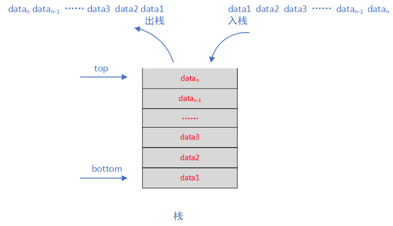
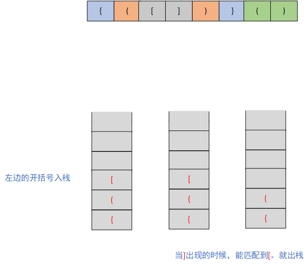

# 栈

## 栈的定义

教科书上栈的定义是这样的：只允许在表的末端进行插入和删除的线性表。允许插入和删除的一端叫做栈顶（top），另一端叫做栈底（bottom）。栈中没有元素的时候是一个空栈。那我们看图为例：




这就是一个栈的结构，他只允许从top端插入删除，bottom端是封闭的。有一组数据data1，data2，data3入栈的时候是顺序的，那么出栈的时候就刚好倒过来，最后一个入栈的先出栈，最早一个入栈的最后出栈。我们把这个规则叫**后进先出（LIFO）**。


## 栈的代码实现

栈作为一种顺序表，可以通过数组和链表这两种方法去存储。用数组存储的叫顺序栈，用链表存储的叫链式栈。那么我们首先设计出栈的接口，再给出两种实现类。

```java
/**
 * 栈的接口设计
 *
 * @author HXY
 * @date 2020-07-25
 * @param <E>
 */
public interface Stack<E> {

    /**
     * 获取栈中元素的个数
     *
     * @return e
     */
    int getSize();

    /**
     * 栈空间是否已满
     *
     * @return
     */
    boolean isFull();

    /**
     * 是否空栈
     *
     * @return e
     */
    boolean isEmpty();

    /**
     * 入栈操作
     *
     * @param e e
     */
    void push(E e);

    /**
     * 出栈
     *
     * @return e
     */
    E pop();

    /**
     * 读取栈顶元素。不出栈
     *
     * @return e
     */
    E peek();
}
```

### 顺序栈

```java
public class ArrayStack<E> implements Stack<E> {
	
    // 这里我们可以用java提供的Arraylist实现，但是选择了自己实现一个动态数组
    // 这些代码是来自慕课网玩转数据结构的课程
    Array<E> array;

    public ArrayStack(int capacity) {
        array = new Array<>(capacity);
    }

    public ArrayStack() {
        array = new Array<>();
    }

    @Override
    public int getSize() {
        return array.getSize();
    }

    @Override
    public boolean isEmpty() {
        return array.isEmpty();
    }

    @Override
    public void push(E e) {
        array.addLast(e);
    }

    @Override
    public E pop() {
        return array.removeLast();
    }

    @Override
    public E peek() {
        return array.getLast();
    }
}

```

### 链式栈

```java
/**
 * 链式栈的实现
 *
 * @author HXY
 * @date 2020-07-25
 * @param <E>
 */
public class LinkedListStack<E> implements Stack<E> {

    // 这里用了自己实现的一个单链表，当然我们可以用LinkedList
    private LinkedList<E> list;

    public LinkedListStack() {
        list = new LinkedList<>();
    }

    @Override
    public int getSize() {
        return list.size();
    }

    @Override
    public boolean isEmpty() {
        return list.isEmpty();
    }

    @Override
    public void push(E e) {
        list.addFirst(e);
    }

    @Override
    public E pop() {
        return list.removeFirst();
    }

    @Override
    public E peek() {
        return list.getFirst();
    }

    @Override
    public String toString(){
        StringBuilder res = new StringBuilder();
        res.append("Stack: [");
        for (int i = getSize() - 1; i >= 0; i--) {
            res.append(list.get(i));
            res.append(i != 0 ? ", " : "");
        }
        res.append("] top");
        return res.toString();
    }
}
```

## 栈的应用场景

### 括号的匹配（leetcode20）

**题目**

给定一个只包括 `'('`，`')'`，`'{'`，`'}'`，`'['`，`']'` 的字符串，判断字符串是否有效。有效字符串需满足：

1. 左括号必须用相同类型的右括号闭合。
2. 左括号必须以正确的顺序闭合。

**示例** 

```
输入: "()"
输出: true

输入: "()[]{}"
输出: true

输入: "(]"
输出: false
```

**题解**

下面这个图中是一个有效的表达式，我们把一组能匹配到的括号用同一颜色标记了，可以发现一个有效的表达式，他的子表达式是不是也是有效的。我们如果用栈来做这个题，左边的开括号的让他入栈，然后右边的闭括号来的时候让他对应的开括号出栈，如果最后栈空是不是就是说每一个右边的括号都能匹配到自己对应的另一半啊。如果最后栈里面还有元素是不是就说匹配不上，那这个表达式就是无效的。比如下面这如，前面三个让他入栈，接着`]`来了，那么他和`[`匹配到，所以`[`出栈，按照这个思路一步一步走，最后是不是所有的元素都出栈了，就说明这个表达式有效。那假设`[`来，遇到的是`{`，是不是就出栈不了，匹配不到，直接就结束了。这个不会做动画，说起来有点枯燥，那debug一遍就深刻理解了。



**代码实现**

```java
public static boolean isValid(String s) {
    Stack<Character> stack = new Stack<>();
    
    for (int i = 0; i < s.length(); i++) {
        char c = s.charAt(i);
        if ('(' == c || '[' == c || '{' == c) {
            stack.push(c);
        } else {
            if (stack.isEmpty()) {
                return false;
            }

            Character pop = stack.pop();
            if ('(' == pop && ')' != c) {
                return false;
            } else if ('[' == pop && ']' != c) {
                return false;
            } else if ('{' == pop && '}' != c) {
                return false;
            }
        }
    }
    return stack.isEmpty();
}
```

### 中缀表达式转换成后缀表达式（leetcode150 224）

详情参见另一篇博客：[利用栈实现中缀转化成后缀表达式并求值](https://blog.csdn.net/weixin_40149557/article/details/82719721)