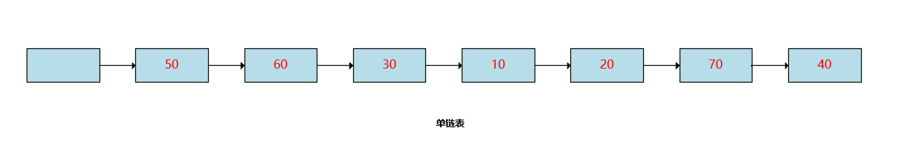
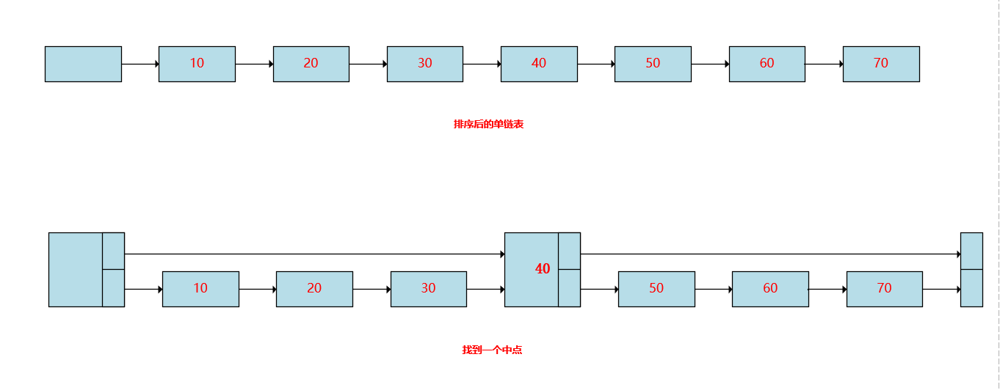
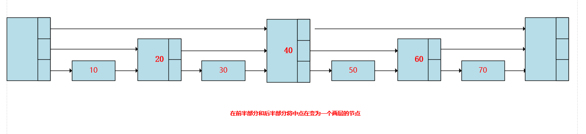
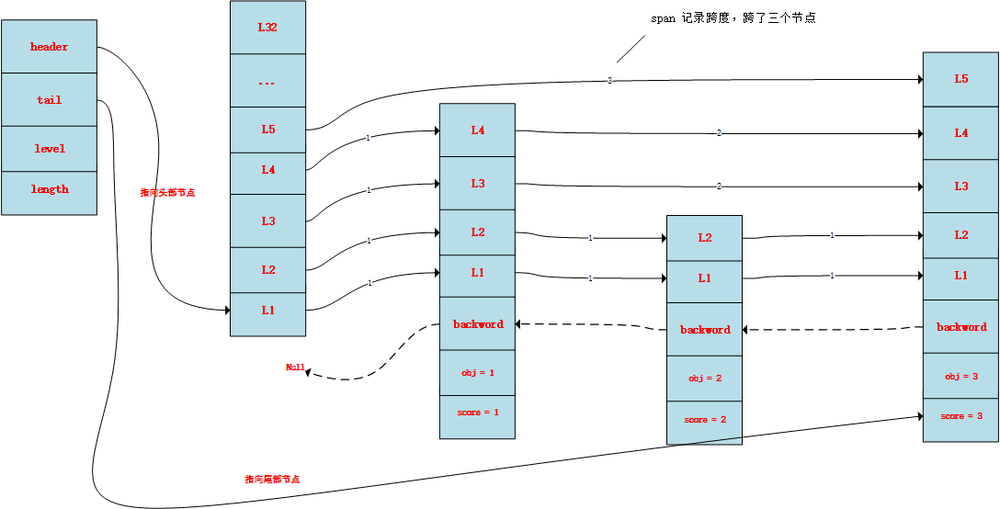

# 跳跃表
## 跳跃表简介

了解了链表以后，我们都知道链表的查询效率是比较低的，例如下面这个链表，要想找到70这个元素，你必须要从头遍历整个链表，直到找到70这个节点，所以链表的时间复杂度是O(N)级别的。但是链表作为一种基础的数据结构，它有着O(1)的插入时间复杂度，在我们的各种场景中有这很广泛的应用，那么有没有办法优化他的查找时间复杂度呢。这个时候呢，我们可以结合二分查找的思想来进行优化，二分查找呢，假设按照一个数组来说，如果这个数组是有序的，例如`[10,20,30,40,50,60,70]`这种情况，如果我们要查找70，其实我们是没有必要遍历整个数组的，我们可以从这个数组的中点开始查找，比如找到40，发现70大于40，我们就可以从40后去找，然后继续这种想法，在从`[40,50,60,70]`中查找，先从中点50开始，那么发现70还是大于50，在往后查找，最后查到70，这样下来我们整个查找的过程中就避开了一大半元素。从而提升了查找效率。


由此推到链表，如果我们将上面这个链表进行排序，变成下面这样，然后在设置一个中点，那么查找的过程就可以避开一半的元素，例如要找70，我们直接从40开始往后找，要找20，就从40开始往前找。



上面这张图已经提升了效率，但是像查找30，我们依然要访问40,10,20,30这四个节点，那如果我们在上面这张图的前半部分和后半部分中在找一个中间节点，是不是就可以进一步提升查询效率呢？就像下面这张图，我们将20变为一个两层的节点，让他维护一个指向30的指针，在维护一个指向40的指针，将60也变为一个两层的节点，让他维护一个指向70和尾节点的指针。将头结点和40变成一个三层的节点，让他们分别维护了三个指针，例如40，第一个指针指向50，第二个指针指向60，第三个指针指向尾节点。



那么在上面这种结构中，我们要访问20这个节点，首先访问40，发现20比40小，那么退回来，就可以找到20。所走的路径是 **-> 40 -> 20**。要访问40，只要一次就可以找到，所有的路径是 **-> 40**，要访问50，也只要访问 **-> 40 -> 60 -> 50**。由此我们可以发现上面这个链表中，访问任何一个元素，最多只要访问比较三次就可以实现。其实到这里我们也可以发现，如果一个链表，将他拆分成理想的层级**logN**，就可以实现和红黑树或者平衡二叉树一样的查询效率**O(logN)**。这也就是我们今天说的跳跃表。

## Redis中的跳跃表

### 跳跃表结构的定义

```c
// 跳跃表的结构
typedef struct zskiplist {

    // 表头节点和表尾节点
    struct zskiplistNode *header, *tail;

    // 节点的数量
    unsigned long length;

    // 最大层数
    int level;

} zskiplist;
```

- `header`，`tail`两个指针，为别指向跳跃表的头节点和尾节点
- `level`保存最大层数，表头不算
- `length`保存节点数量，表头不算

### 跳跃表节点的定义

```c
// 跳跃表中的节点
typedef struct zskiplistNode {

    // 成员对象，真正的数据
    robj *obj;

    // 分值，用来排序
    double score;

    // 后退指针，指向上一个节点
    struct zskiplistNode *backward;

    // 层
    struct zskiplistLevel {

        // 前进指针， 记录下一个指向的节点
        struct zskiplistNode *forward;

        // 跨度， 记录距离
        unsigned int span;

    } level[];

} zskiplistNode;
```

在看跳跃表中每个节点的属性

- `*obj`这个指针表示`用户数据`在计算机中存储的地址，
- double类型的分值`score`，用来排序
- `*backword`指针用来指向上一个节点，用在比如当我们要找2，那第一次在第5层找，没有找到，就得根据`*backword`定位到前一个节点。
- `level[]`层级信息，是一个数组，数组的成员是一个`zskiplistLevel`结构体，这个结构体有两个属性，`span`记录跨度、 `*forward`是一个指针，指向下一个节点的内存地址。




**span有什么用**

我们知道Redis中的Zset有这样一个命令`zrank`可以用来查看某个key的排位值

```shell
127.0.0.1:6379> zrange language 0 -1 withscores
 1) "JavaScript"
 2) "0"
 3) "Java"
 4) "1"
 5) "Python"
 6) "2"
 7) "C"
 8) "3"
 9) "Go"
10) "4"
127.0.0.1:6379> zrank language Python
(integer) 2
127.0.0.1:6379> zrank language JavaScript
(integer) 0
```

这个命令的实现就是通过span这个属性来实现的。

```c
unsigned long zslGetRank(zskiplist *zsl, double score, robj *o) {
    zskiplistNode *x;
    unsigned long rank = 0;
    int i;

    // 从头结点开始准备遍历整个跳跃表
    x = zsl->header;
    // 从顶层开始
    for (i = zsl->level-1; i >= 0; i--) {

        // 遍历每一层的节点
        while (x->level[i].forward &&
                // case1: 分值小
                (x->level[i].forward->score < score ||
                // case2: 分值一样，在比较数据
                (x->level[i].forward->score == score &&
                compareStringObjects(x->level[i].forward->obj,o) <= 0))) {

            // 能走到这一步，说明经过了这个节点，加上这个节点的span
            rank += x->level[i].span;

            // 沿着前进指针遍历跳跃表
            x = x->level[i].forward;
        }

        // 必须确保不仅分值相等，而且成员对象也要相等
        // T = O(N)
        if (x->obj && equalStringObjects(x->obj,o)) {
            return rank;
        }
    }

    // 没找到
    return 0;
}
```

### 创建跳跃表

```c
/*
 * 创建并返回一个新的跳跃表
 */
zskiplist *zslCreate(void) {
    int j;
    zskiplist *zsl;

    // 分配空间
    zsl = zmalloc(sizeof(*zsl));

    // 初始化高度和起始层数
    zsl->level = 1;
    zsl->length = 0;

    // 初始化表头节点
    // ZSKIPLIST_MAXLEVEL = 32
    zsl->header = zslCreateNode(ZSKIPLIST_MAXLEVEL,0,NULL);
    for (j = 0; j < ZSKIPLIST_MAXLEVEL; j++) {
        zsl->header->level[j].forward = NULL;
        zsl->header->level[j].span = 0;
    }
    zsl->header->backward = NULL;

    // 初始化尾结点
    zsl->tail = NULL;

    return zsl;
}

/*
 * 创建一个层数为 level 的跳跃表节点，
 * 并将节点的成员对象设置为 obj ，分值设置为 score 。
 *
 * 返回值为新创建的跳跃表节点
 */
zskiplistNode *zslCreateNode(int level, double score, robj *obj) {
    
    // 分配空间
    zskiplistNode *zn = zmalloc(sizeof(*zn)+level*sizeof(struct zskiplistLevel));

    // 设置属性
    zn->score = score;
    zn->obj = obj;

    return zn;
}
```

### 插入节点

```c
/*
 * 创建一个成员为 obj ，分值为 score 的新节点，
 * 并将这个新节点插入到跳跃表 zsl 中。
 * 
 * 函数的返回值为新节点。
 */
zskiplistNode *zslInsert(zskiplist *zsl, double score, robj *obj) {
    zskiplistNode *update[ZSKIPLIST_MAXLEVEL], *x;
    unsigned int rank[ZSKIPLIST_MAXLEVEL];
    int i, level;

    redisAssert(!isnan(score));

    // 在各个层查找节点的插入位置
    // T_wrost = O(N^2), T_avg = O(N log N)
    x = zsl->header;
    for (i = zsl->level-1; i >= 0; i--) {

        /* store rank that is crossed to reach the insert position */
        // 如果 i 不是 zsl->level-1 层
        // 那么 i 层的起始 rank 值为 i+1 层的 rank 值
        // 各个层的 rank 值一层层累积
        // 最终 rank[0] 的值加一就是新节点的前置节点的排位
        // rank[0] 会在后面成为计算 span 值和 rank 值的基础
        rank[i] = i == (zsl->level-1) ? 0 : rank[i+1];

        // 沿着前进指针遍历跳跃表
        // T_wrost = O(N^2), T_avg = O(N log N)
        while (x->level[i].forward &&
            (x->level[i].forward->score < score ||
                // 比对分值
                (x->level[i].forward->score == score &&
                // 比对成员， T = O(N)
                compareStringObjects(x->level[i].forward->obj,obj) < 0))) {

            // 记录沿途跨越了多少个节点
            rank[i] += x->level[i].span;

            // 移动至下一指针
            x = x->level[i].forward;
        }
        // 记录将要和新节点相连接的节点
        update[i] = x;
    }

    /* we assume the key is not already inside, since we allow duplicated
     * scores, and the re-insertion of score and redis object should never
     * happen since the caller of zslInsert() should test in the hash table
     * if the element is already inside or not. 
     *
     * zslInsert() 的调用者会确保同分值且同成员的元素不会出现，
     * 所以这里不需要进一步进行检查，可以直接创建新元素。
     */

    // 获取一个随机值作为新节点的层数
    // T = O(N)
    level = zslRandomLevel();

    // 如果新节点的层数比表中其他节点的层数都要大
    // 那么初始化表头节点中未使用的层，并将它们记录到 update 数组中
    // 将来也指向新节点
    if (level > zsl->level) {

        // 初始化未使用层
        // T = O(1)
        for (i = zsl->level; i < level; i++) {
            rank[i] = 0;
            update[i] = zsl->header;
            update[i]->level[i].span = zsl->length;
        }

        // 更新表中节点最大层数
        zsl->level = level;
    }

    // 创建新节点
    x = zslCreateNode(level,score,obj);

    // 将前面记录的指针指向新节点，并做相应的设置
    // T = O(1)
    for (i = 0; i < level; i++) {
        
        // 设置新节点的 forward 指针
        x->level[i].forward = update[i]->level[i].forward;
        
        // 将沿途记录的各个节点的 forward 指针指向新节点
        update[i]->level[i].forward = x;

        /* update span covered by update[i] as x is inserted here */
        // 计算新节点跨越的节点数量
        x->level[i].span = update[i]->level[i].span - (rank[0] - rank[i]);

        // 更新新节点插入之后，沿途节点的 span 值
        // 其中的 +1 计算的是新节点
        update[i]->level[i].span = (rank[0] - rank[i]) + 1;
    }

    /* increment span for untouched levels */
    // 未接触的节点的 span 值也需要增一，这些节点直接从表头指向新节点
    // T = O(1)
    for (i = level; i < zsl->level; i++) {
        update[i]->level[i].span++;
    }

    // 设置新节点的后退指针
    x->backward = (update[0] == zsl->header) ? NULL : update[0];
    if (x->level[0].forward)
        x->level[0].forward->backward = x;
    else
        zsl->tail = x;

    // 跳跃表的节点计数增一
    zsl->length++;

    return x;
}
```

